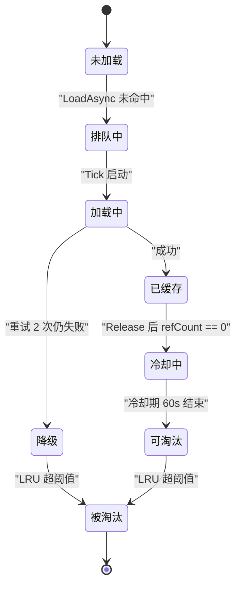

# 数据层

只读内容提供者，被逻辑层与表现层**直连查询**，不走 `EventBus`；进程级常驻，`GameRoot.Awake` 装配、`GameRoot.OnDestroy` 释放。`Assets/Scripts/Data/`，命名空间 `DeepseaOil.Data`。

| 目录 | 微块 | 性质 |
| :-- | :-- | :-- |
| `Data/Config/` | **① ConfigModule** —— 数值配置查询（同步） | 服务提供者 |
| `Data/Asset/` | **② AssetModule** —— 资源查询与生命周期（异步 + 同步窄路） | 服务提供者 |
| `Data/Metrics/` | **③ DataMetrics** —— 可观测性表面（拉模型） | 观测表面 |
| `Data/Settings/` | `BaseConfig` / `CharacterConfig` / `PlayerConfig` | SO 数值类型（**不经 ConfigModule**） |

**三条硬边界**：① 不继承 `Singleton<T>`，用 `static class` + 显式 `Init`——顺序必须确定（Config 先于 Asset）；② 不订阅、不发布 `EventBus` 事件——查询式接口无事件语义，完成经 `AsyncHandle` 传递；③ 唯一主动行为是 `AssetModule.Tick`，由 `GameRoot` 驱动且只处理内部状态（队列/冷却期/LRU 要每帧推进）。

## 1. 微块 ① ConfigModule

| 负责 | 不负责 |
| :-- | :-- |
| 持有 Luban 生成的 `cfg.Tables` 实例 | 不解析 Excel（Luban 的事） |
| 提供类型化查询入口 | 不做数值计算（逻辑层的事） |
| 启动时确认数据可用 | 不缓存查询结果（`Tables` 本身是内存结构） |
| 暴露表级访问（逃生舱） | 不感知资源（表里存的是字符串 Key） |

```csharp
public static class ConfigModule
{
    public static bool IsReady { get; }
    public static void Init(string jsonRoot);        // 指定 JSON 目录
    public static void InitFromStreamingAssets();    // 默认 StreamingAssets/Luban

    public static cfg.demo.Weapon GetWeapon(int id);
    public static cfg.demo.Item   GetItem(int id);
    public static cfg.demo.Fish   GetFish(int id);
    public static IReadOnlyList<cfg.demo.Weapon> GetAllWeapons();

    public static cfg.Tables Tables { get; }         // 逃生舱
}
```

查询直接转发 `Tables.TbWeapon.Get(id)`；`Tables` 是逃生舱，**不得跨帧持有**。**重复 `Init` 抛 `InvalidOperationException`**——没有 `Shutdown`／`Reset`（O10），二次进入场景只能靠 `IsReady` 守卫（`GameRoot.Awake` 就是这么做的）。**不负责解析 JSON**：加载是 `cfg.Tables` 构造函数的工作，ConfigModule 只负责在正确时机调用它、持有它、暴露它。Luban 的 `ref` / `path` / `range` 校验在**导表阶段**由 `--strict` 执行，运行时**不重复校验**。

### 与 Luban 的相性（按仓库实际生成目标核对）

| 项 | 实际值 |
| :-- | :-- |
| 生成目标 | `cs-simple-json`（`ConfigWorkspace/luban.conf` 的 target `client`） |
| Loader 签名 | `System.Func<string, JSONNode>` | `Scripts/Generated/Config/Tables.cs` |
| 命名空间 | `cfg`（Tables）/ `cfg.demo`（记录类与表类） | 同上 |
| 表访问器 | `TbWeapon` / `TbItem` / `TbFish`，各有 `DataMap` / `DataList` / `Get` / `GetOrDefault` / `ResolveRef` | `Scripts/Generated/Config/demo/TbWeapon.cs` |
| 外键 | 生成 `Xxx_Ref` 字段，构造时由 `ResolveRef` 解析 | `Scripts/Generated/Config/demo/Weapon.cs` |
| 表数量 | **没有** `TableCount` 之类的属性 | 同上 |

### 启动失败策略

`Init` 把失败统一包成 `ConfigLoadException` 抛出：目录不存在 → `DirectoryNotFoundException`；JSON 文件缺失 / 为空 → `FileNotFoundException` / `InvalidDataException`；JSON 结构不符（字段类型错）→ Luban 生成代码抛 `SerializationException`；抽样表访问失败（`StartupValidator` 返回 false）→ 直接抛 `ConfigLoadException`。
**表清单的显式维护点**：`cfg.Tables` 没有表数量属性，也不允许手改生成物；需要"已加载几张表"时用手写清单 `Data/Config/TablesMeta.cs`（**加表后同步一行**），`DataMetrics.TableCount` 与 `StartupValidator` 的关键表抽样都读它。

```csharp
public static class TablesMeta
{
    public static readonly string[] Names = { "TbWeapon", "TbItem", "TbFish" };
    public static int Count => Names.Length;
}
```

## 2. 微块 ② AssetModule

| 负责 | 不负责 |
| :-- | :-- |
| 异步加载资源 | 不解析配置（Key 从调用方来） |
| 引用计数管理 | 不决定"何时该释放"（冷却期 + LRU 自动决定） |
| 冷却期缓存 | 不管理 GameObject 生命周期（对象池的事） |
| 并发控制 | 不做资源分组（Jam 期单资源为原子单位） |
| LRU 淘汰 | 不感知场景（`SceneService` 通过 `OnSceneSwitch` 通知） |
| 失败重试与降级 | 不弹窗、不阻塞（失败写日志 + 返回占位资源） |

```csharp
public static class AssetModule
{
    public static bool IsInitialized { get; }

    public static void Init();                       // GameRoot.Awake
    public static void Tick(float dt);               // GameRoot.Update 顺序表第 ② 步
    public static void OnSceneSwitch();              // SceneService 切场景前
    public static void Dispose();                    // GameRoot.OnDestroy

    public static AsyncHandle<T> LoadAsync<T>(string key) where T : UnityEngine.Object;
    public static T Load<T>(string key) where T : UnityEngine.Object;   // 同步窄路，见下
    public static bool TryGet<T>(string key, out T asset) where T : UnityEngine.Object;
    public static void Release(string key);
    public static void Preload(string key);
    public static void RegisterFallback<T>(T fallback) where T : UnityEngine.Object;
}
```

**`Load<T>`（同步窄路）**：只为体量确定很小、且必须当场拿到的资源开——`UIMgr` 构造 UI 三件套时要在构造函数里立刻 `Instantiate`，没有 await 的位置。命中缓存 → `Retain` 返回；未命中 → `Resources.Load<T>` → `Put` → `Retain`；失败 → 记失败 + 取降级，**不重试**。面板、场景级资源仍只走 `LoadAsync`。

**`AsyncHandle<T>` 契约**：`sealed class`（**不能是 struct**——跨帧持有，struct 复制会破坏完成语义）；`TrySetResult` 完成、不抛异常；`Complete` **必须**主线程调用（Unity 资源 API 仅主线程）；**不用** `RunContinuationsAsynchronously`——续体会在完成线程上**内联**执行，而完成发生在 `GameRoot.Update → AssetModule.Tick` 内，`UIMgr` 因此用协程轮询 `IsDone`（见 [表现层.md §5.2](表现层.md)）。

**内部微块**：`AssetRegistry` 唯一的路径转换点（§5，`Data/Asset/AssetRegistry.cs:8`）；`CacheStore` 持 `Dictionary<string, CacheEntry>`，**主线程独占无锁**，`AllEntries` 直接暴露内部集合（`LifecycleMgr` 每帧遍历，**遍历中不得增删**）；`RefCounter` 维护 `refCount`；`LoadScheduler` 管并发上限 / 排队 / 失败重试（`Data/Asset/LoadScheduler.cs:12`）；`LifecycleMgr` 管冷却期标记 + LRU 淘汰；`FailureHandler` 管降级资源注册查询 + 失败记录统计。

**CacheEntry 状态机**（由 `LoadAsync` / `Tick` / `Release` 推进；`refCount == 0` **不等于**立即卸载）



`CacheEntry` 六个字段：`asset` / `refCount` / `lastAccessTime` / `isPreloaded` / `cooldownUntil` / `canEvict`。

**三条子机制的数值**：

| 子机制 | 规则 |
| :-- | :-- |
| LoadScheduler | `int _loadingCount` + `Queue<LoadRequest>`；`Tick` 中 `while (queue.Count > 0 && _loadingCount < maxConcurrent)`；`MAX_CONCURRENT_LOAD = 4`；`MAX_RETRY = 2` 且**立即重新入队**（不延时）；完成后由 `IsTypeMatch` 判定，不匹配按失败处理 |
| LifecycleMgr | `COOLDOWN_SECONDS = 60f`；`refCount` 归零时设 `cooldownUntil = now + 60`；`refCount == 0 && !isPreloaded && !canEvict && now >= cooldownUntil` → `canEvict = true`；条目数 > `MAX_CACHE_ENTRIES = 100` 时按 `lastAccessTime` 升序淘汰 `canEvict && !isPreloaded` 的条目；单帧最多淘汰 `MAX_EVICT_PER_TICK = 8` 条；`isPreloaded` 条目永不被淘汰；本轮淘汰数 > 0 时调用一次 `Resources.UnloadUnusedAssets()`（不 `yield` 等它完成） |
| FailureHandler | **不参与重试**（重试在 `LoadScheduler.HandleFailure`）；降级资源由业务代码注册（`RegisterFallback<T>`），Data 层不创建 Unity 资源，未注册时 `GetFallback<T>()` 返回 null；记录 `_failedCount` 累计 + 最近 `MAX_RECENT_RECORDS = 32` 条 `FailureRecord` + `Debug.LogError` |

**生命周期**：装配在 `GameRoot.Awake` 阶段 1（`ConfigModule.IsReady?` 否则 `InitFromStreamingAssets()`；`AssetModule.IsInitialized?` 否则 `Init()` 建缓存表 / 调度器 / 生命周期）；每帧 `GameRoot.Update` 顺序表第 ② 步 `AssetModule.Tick(dt)` → `LoadScheduler.Tick(dt)` 推进队列 + `LifecycleMgr.Tick(dt)` 冷却期标记与 LRU 淘汰；切场景由 `SceneService.Load` 第 ④ 步在 `LoadScene` 之前调 `AssetModule.OnSceneSwitch()`（清空所有非预加载条目的冷却期、保留 `isPreloaded` 条目、不强制释放 `refCount > 0` 的条目、不动挂起请求与合并列表）；进程退出 `GameRoot.OnDestroy` 调 `AssetModule.Dispose()`（清队列、清缓存、清合并列表、重置命中计数，**不**调用 `UnloadUnusedAssets`）。

### 主路径语义

| 场景 | 行为 |
| :-- | :-- |
| `LoadAsync` 命中缓存 | `refCount++` → 返回**已完成**句柄（同步返回，`await` 不挂起） |
| `LoadAsync` 未命中 | 查 pending 合并列表 → 已有则挂回调不重复入队；否则入队并返回未完成句柄 |
| 加载成功 | `Put` 缓存 → `Retain` → **最后** `Complete`（顺序严格：调用方在回调里可能立即 `TryGet`/`Release`） |
| 加载失败（重试耗尽） | `RecordFailure` → 取降级资源（可能 null） → `Complete(fallback)` |
| `TryGet` 命中 | 更新 `lastAccessTime`，**不改**引用计数 |
| `Release` 未知 Key / 多调 | 记 `LogWarning`，不抛异常 |
| 空 Key | `LoadAsync` 返回 `Completed(null)` 并记 error；`Release` / `Preload` 直接忽略 |

**引用计数与预加载**：`refCount` 是**调用方持有数**（只有加载成功会 +1，只有 `Release` 会 −1）；`isPreloaded` 是常驻标记，Retain/Release 对它是 no-op、LRU 永不淘汰它；`OnSceneSwitch` 清冷却期但跳过预加载与仍被持有的条目。同 Key 不同类型（`LoadAsync<Sprite>("icon")` 与 `LoadAsync<Texture2D>("icon")`）会被合并为同一请求——Jam 期假设"同路径即同类型"。

## 3. 微块 ③ DataMetrics

`GetSnapshot()` 返回只读快照，`struct` 值语义（调用方拿到副本改不了内部），未 Init 时返回零值快照。字段只增不删（调试面板可能引用旧字段）。字段：`ConfigReady`（ConfigModule 是否 Init 成功）、`TableCount`（`TablesMeta.Count`）、`CachedAssetCount`（缓存条目总数，含 `refCount == 0` 与 `isPreloaded`）、`LoadingCount` / `QueuedCount`、`CompletedCount` / `FailedCount` / `EvictedCount`、`CacheHits` / `CacheMisses`、`CacheHitRate`（`Hits / (Hits + Misses)`，无访问时为 0，消费方不需要自己做除法）。

## 4. 协作关系
ConfigModule 与 AssetModule **零类型依赖**，不互相调用（衔接由调用方完成）；`AssetModule` 只接收字符串 Key，**不知道 Luban 存在**。DataMetrics 只读两个 Module 的状态，**不被任何 Module 调用**。调用方（Logic / Presentation）直连查询，**没有 EventBus 边**：`ConfigModule.GetWeapon(id)` → 取 `weapon.Icon` → `AssetModule.LoadAsync<Sprite>(key)` → 用完 `AssetModule.Release(key)`。

## 5. 资源 Key 契约

| 语境 | 基准目录 | 扩展名 | 谁来保证 |
| :-- | :-- | :-- | :-- |
| **配置表里写的** | `Assets/` | **有**（`.png` / `.asset`） | Luban `#path=unity` + `pathValidator.rootDir = Assets`，**导表期**校验资源真实存在 |
| **`Resources.LoadAsync` 要的** | `Assets/Resources/` | **无** | 运行时由 `AssetRegistry.ResolvePath` 转换 |

转换：去掉前缀 `Assets/Resources/`（或 `Resources/`）、去掉扩展名——`"Assets/Resources/Icons/sardline.png"` 与 `"Resources\Icons\sardline.png"` 都得到 `"Icons/sardline"`；先统一分隔符再剥前缀，两种写法都接受。

**盲区**：`#path=unity` 只校验「文件在 `Assets/` 下**存在**」，**不校验「在 `Assets/Resources/` 下」**，而 `Resources.LoadAsync` 只能加载 `Assets/Resources/` 里的东西——两者不一致时**导表期通过、运行时失败**。实测（历史表值 `"Settings/Renderer2D.asset"`）：

```text
ResolvePath("Settings/Renderer2D.asset")   →  "Settings/Renderer2D"
Resources.LoadAsync("Settings/Renderer2D") →  null（不是 Resources 资源）
→ 重试 2 次 → 降级为 fallback / null
```

结论：表里的资源路径必须同时满足"存在"与"在 `Assets/Resources/` 下"，第二个条件目前**没有任何自动校验**（当前表值 `Resources\Icons\sardline.png` 合规）；补法是导表期加一条 `Assets/Resources/` 前缀校验（D4）。可加载资源放 `Assets/Resources/` 下，当前有 `ui/{Canvas,EventSystem,UICamera}.prefab`、`ui/Panel/BeginPanel.prefab`、`Icons/sardline.png`；三处生成物目录禁止放手写文件（见 [`目录说明.md`](../目录说明.md)）；切 Addressables 时只改 `AssetRegistry.ResolvePath` 一个方法。

## 6. 常量

| 常量 | 值 | 位置 |
| :-- | :-- | :-- |
| `COOLDOWN_SECONDS` | 60f | `Data/Asset/AssetModule.cs` |
| `MAX_CACHE_ENTRIES` | 100 | 同上 |
| `MAX_CONCURRENT_LOAD` | 4 | 同上 |
| `MAX_EVICT_PER_TICK` | 8 | 同上 |
| `MAX_RETRY` | 2 | `Data/Asset/LoadScheduler.cs` |
| `MAX_RECENT_RECORDS` | 32 | `Data/Asset/FailureHandler.cs` |
| `ResourcesRoot` | `"Assets/Resources/"` | `Data/Asset/AssetRegistry.cs` |

其余开放项（O10～O13）见 [框架蓝图.md §9.1](../框架蓝图.md)。
