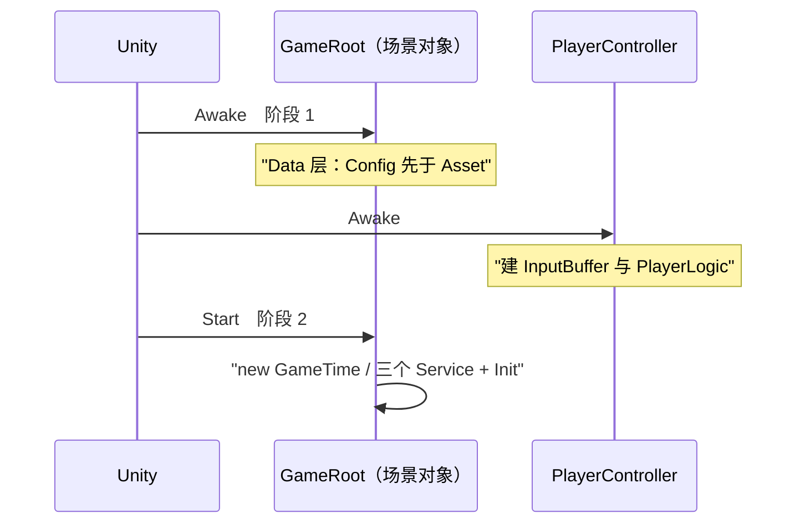

# 表现层

把逻辑层的结论呈现出去，把环境事实喂进逻辑层。跨层通信只走 `EventBus<T>`；只允许两类直连——**组合根/驱动点**（`GameRoot`、`PlayerController`）与**表现层实现逻辑层端口**（`GameTime : IGameTime`、`MovementMotor : IMovementMotor`）（[`框架蓝图.md` §1](../框架蓝图.md)）。`Assets/Scripts/` 下无 asmdef，全部落 `Assembly-CSharp`。

## 1. 目录与类型

| 目录 | 类型 | 命名空间 | 出处 |
| :-- | :-- | :-- | :-- |
| `Presentation/Root/` | `GameRoot`、`PlayerController` | `DeepseaOil.Presentation` | `Assets/Scripts/Presentation/Root/GameRoot.cs:11,13`、`Root/PlayerController.cs:8,17` |
| `Presentation/Adapters/` | `GameTime`、`MovementMotor` | `DeepseaOil.Presentation` | `Presentation/Adapters/GameTime.cs:4,6`、`Adapters/MovementMotor.cs:4,15` |
| `Presentation/Input/` | `InputProvider`、`InputSys.inputactions` | `DeepseaOil.Presentation` | `Presentation/Input/InputProvider.cs:5,12` |
| `Presentation/UI/`（含 `UI/Panel/`） | `UIMgr`、`E_UILayer`、`BeginPanel` 在 `.UI`；`BasePanel`、`MonoMgr` 在 `.Presentation` | `DeepseaOil.Presentation.UI` / `DeepseaOil.Presentation` | `Presentation/UI/UIMgr.cs:10,15,39`、`UI/BasePanel.cs:8,10`、`UI/MonoMgr.cs:4,9`、`UI/Panel/BeginPanel.cs:7,9` |
| `Presentation/Debug/` | `MovementDebugPanel`、`EventBusDebugPanel`、`ConfigLoader` | `DeepseaOil.Presentation` | `Presentation/Debug/MovementDebugPanel.cs:7,18`、`Debug/EventBusDebugPanel.cs:4,16`、`Debug/ConfigLoader.cs:24,26` |
| `Assets/Scripts/Foundation/` | `Singleton<T>`、`BaseManager<T>`、`Pool<T>` ＋ `PoolInClass<T>` / `PoolInMono<T>` | `DeepseaOil.Foundation` | `Assets/Scripts/Foundation/Singleton.cs:10,12`、`Foundation/BaseManager.cs:7,16`、`Foundation/Pool.cs:6,8,69,79` |
| `Assets/Scripts/Generated/Input/` | `InputSys`（生成物，禁手写） | `DeepseaOil.Generated` | `Assets/Scripts/Generated/Input/InputSys.cs:18` |

`Singleton<T>` 服务于 `MonoBehaviour` 单例；`BaseManager<T>` 服务于纯逻辑类单例，反射取**非公开**无参构造，取不到只 `LogError`、`Instance` 永久为 null（`Foundation/BaseManager.cs:38-47`；D20）。

## 2. 每帧三个驱动入口

| # | 入口 | 驱动什么 | 帧 | 出处 |
| :-- | :-- | :-- | :-- | :-- |
| ① | `GameRoot.Update()` | 顺序表两步：`List<IService>` 逐项 `Tick(Time.unscaledDeltaTime)`，再 `AssetModule.Tick(Time.deltaTime)` | 渲染帧 | `Presentation/Root/GameRoot.cs:65-84` |
| ② | `PlayerController.FixedUpdate()` | `ConsumeSnapshot()` → `InputBuffer.Push` → `new WorldInfo` → `Logic.FixedTick(new LogicContext(...))` | 物理帧（默认 50Hz） | `Presentation/Root/PlayerController.cs:79-96` |
| ③ | `InputProvider.Update()` | 采样 `InputSys`：持续量直接读，按下沿用 `\|=` 累积 | 渲染帧（自驱，不在 `GameRoot` 表内） | `Presentation/Input/InputProvider.cs:41-57` |

**③ 是被输入后端强制的例外**：`WasPressedThisFrame()` 只在动态更新里有效，而按下沿必须由物理帧侧的 `ConsumeSnapshot()` 消费（`Input/InputProvider.cs:55-56,63-77`）。渲染帧与物理帧之间没有先后关系：一个渲染帧可能对应 0 或 2 个物理帧。`MonoMgr` 的三个转发是基础设施、不算入口；除此之外**不在非驱动点自写 `Update`/`FixedUpdate`**。

## 3. 启动装配序（两个组合根）



| 时机 | 行为 | 出处 |
| :-- | :-- | :-- |
| `GameRoot.Awake`（阶段 1） | `if (!ConfigModule.IsReady) ConfigModule.InitFromStreamingAssets();` 然后 `if (!AssetModule.IsInitialized) { AssetModule.Init(); _dataLayerOwner = this; }` | `Root/GameRoot.cs:34-44` |
| `PlayerController.Awake` | `config`/`motor`/`inputProvider` 任一为空 → `LogError` ＋ `enabled = false`；否则 `new InputBuffer(max(jumpBufferTime, dashBufferTime), RoundToInt(1 / Time.fixedDeltaTime))`、`new PlayerLogic(motor, config, _buffer)` | `Root/PlayerController.cs:59-77` |
| `GameRoot.Start`（阶段 2） | `UIMgr.Instance.ShowPanel<BeginPanel>()` → `new GameTime()` → `new PauseService/SceneService/SaveService` → 各自 `Init()` → `services.Add` 三次；顺序 `[Pause, Scene, Save]` **既是 `Init` 序也是每帧 `Tick` 序** | `Root/GameRoot.cs:46-63` |
| `GameRoot.Update` | §2 的 ① | `Root/GameRoot.cs:65-84` |
| `GameRoot.OnDestroy` | `if (_dataLayerOwner != this) return;` → `AssetModule.Dispose()` → `_dataLayerOwner = null` | `Root/GameRoot.cs:91-98` |

- **阶段 1 放 `Awake` 不放 `Start`**：Unity 只保证「所有 `Awake` 先于任何 `Start`」；`Start` 之间顺序不确定，放 `Start` 会与别的脚本（例如 `ConfigLoader.Start`）抢顺序（`Root/GameRoot.cs:23-24`）。`GameRoot` 与 `PlayerController` 的 `Awake` 之间无依赖。**`ConfigModule` 必须先于 `AssetModule`**：`AssetModule` 的 Key 来自 Config；加载失败即抛，带病数据不进运行时。
- **两次守卫各防什么**：`IsReady` 守卫防 `ConfigModule.Init` 二次调用（重复调用抛异常且无重置入口，`Data/Config/ConfigModule.cs:21`）；`IsInitialized` 守卫防同一帧出现第二个 `GameRoot`（`AssetModule` 在 `OnDestroy` 里 `Dispose` 过、`_initialized` 已复位，再 `Init` 合法，`Root/GameRoot.cs:31-32`；`Data/Asset/AssetModule.cs:48,108`）。
- **`_dataLayerOwner` 是归属判定**：只有真正装配了 Data 层的实例负责拆，否则叠加场景里第二个 `GameRoot` 被销毁会清掉第一个还在用的缓存（`Root/GameRoot.cs:17-18,88-89`）。`GameRoot` 挂在 `SampleScene`（`Assets/Scenes/SampleScene.unity:948`）。
- **PlayerController 订阅与暂停**：`OnEnable`/`OnDisable` 订阅/退订 `EventBus<GamePaused>`、`EventBus<GameResumed>`（`:35-45`）；`OnGamePaused` / `OnGameResumed` 做 `inputProvider.Clear()` → `SetInputEnabled(false)` → `_buffer.Clear()`，恢复时 `SetInputEnabled(true)`（`:47-57`）；对外只读 `Logic` / `World` / `EngineVelocity`（`:27-33`）。
- 🔴 **同一物理帧内的唯一硬序是 `Push` 先于 `FixedTick`**，由调用顺序保证，**类型系统不保证**；顺序反了松键沿滞后一帧、可变跳高失效（`Root/PlayerController.cs:14-15`）。`FixedUpdate` 读的 `motor.WallSide` 是具体类型成员，**不在** `IMovementMotor` 上；组合根可以这么用，别处不行。本类声明实现 `IFixedTickable`（`:17`），但该接口从不经接口分发，`ActorLogic.FixedTick` 也非虚。

## 4. 端口与适配器（依赖反转的两处实例）

| 端口（Logic 定义） | 表现层实现 | 注入路径 | 出处 |
| :-- | :-- | :-- | :-- |
| `IMovementMotor`（`DeepseaOil.Logic.Movement`） | `MovementMotor`（`MonoBehaviour`，`[RequireComponent(typeof(Rigidbody2D))]`） | `PlayerController` 的 `[SerializeField] MovementMotor motor` → `new PlayerLogic(motor, config, _buffer)` | `Logic/Movement/IMovementMotor.cs:9`、`Adapters/MovementMotor.cs:14-15`、`Root/PlayerController.cs:20,76` |
| `IGameTime`（`DeepseaOil.Logic.Service`） | `GameTime`（纯类，三成员：`UnscaledDeltaTime` / `TimeScale` / `SetTimeScale`） | `GameRoot.Start` 的 `gameTime = new GameTime()` → `new PauseService(gameTime)` / `new SceneService(gameTime, pauseService)` | `Logic/Services/IGameTime.cs:4`、`Adapters/GameTime.cs:6-15`、`Root/GameRoot.cs:49,51-52` |

`MovementMotor` 对外面：`Velocity`（引擎真值回读，滞后一个物理步）、`Facing`（直接读写 `localScale.x` 符号，不另存状态）、`IsGrounded`（脚底向下射线）、`IsTouchingWall` / `WallSide`（朝向侧向射线）、`Move`（`body.velocity = velocity`）；`Awake` 校验 `body`/`groundCheck`/`wallCheck`/`groundMask` 并拒绝会命中自身的遮罩。重力由逻辑层施加，本类永不设 `gravityScale` 与阻尼（`Adapters/MovementMotor.cs:10,24-78`）。

## 5. UI

`E_UILayer { Bottom, Middle, Top, System }`，枚举值 0/1/2/3，`ShowPanel` 的 `layer` 默认 `Middle`（`UI/UIMgr.cs:15-33,141`）。**层不是 `sortingOrder`，是兄弟顺序**：`UIMgr` 构造时 `Instantiate` `Assets/Resources/ui/Canvas.prefab`，再 `transform.Find("Bottom"/"Middle"/"Top"/"System")` 取四个层父对象（`UI/UIMgr.cs:95,102-105`；`Assets/Resources/ui/Canvas.prefab:68-72`）；全工程没有 `sortingOrder` 的代码引用，也没有 `SetSiblingIndex`/`SetAsLastSibling`。`GetLayerFather(layer)` switch 返回四个层父对象、`default` 返回 null，`CoLoadPanel` 里 `?? middleLayer` 兜底（`UI/UIMgr.cs:117-132,221`）。常驻件 `UICamera` / `Canvas` / `EventSystem` 由 `UIMgr` 自己构造并 `DontDestroyOnLoad`，不进这四层。

`UIMgr` 的单例基类是 `BaseManager<UIMgr>`，构造函数私有（`UI/UIMgr.cs:39,87`），靠反射取非公开无参构造（`Foundation/BaseManager.cs:38-45`）。

```csharp
public void ShowPanel<T>(E_UILayer layer = E_UILayer.Middle, UnityAction<T> callBack = null, bool isSync = true) where T : BasePanel
public void HidePanel<T>(bool isDestory = false) where T : BasePanel
public void GetPanel<T>(UnityAction<T> callBack) where T : BasePanel
public Transform GetLayerFather(E_UILayer layer)
public static void AddCustomEventListener(UIBehaviour control, EventTriggerType type, UnityAction<BaseEventData> callBack)
```

| 主题 | 契约 | 出处 |
| :-- | :-- | :-- |
| 构造期装配 | `AssetModule.Load<GameObject>`（**同步**）取三件套 → `Instantiate` → `DontDestroyOnLoad`；`uiCanvas.worldCamera = uiCamera` | `UI/UIMgr.cs:90-109` |
| 面板 Key | 写死 `"ui/Panel/" + typeof(T).Name` → **预设体名必须等于面板类名** | `UI/UIMgr.cs:80,144,190` |
| 已加载再 `Show` / 加载中再 `Show` | 前者若失活先 `SetActive(true)` → `ShowMe()` → 回调（`:160-170`）；后者只累计回调链并清 `isHide`，不重复入队（`:146-159`） | `UI/UIMgr.cs:146-170` |
| 首次 `Show` → 加载完成 | 先 `panelDic.Add` 占位 + `MonoMgr.Instance.StartCoroutine(CoLoadPanel<T>(...))`（`:175-178`）；完成后判占位与隐藏请求，`Instantiate(prefab, father, false)` → `GetComponent<T>()` → `ShowMe()` → 回调 → 存 `panel`（`:196-234`） | `UI/UIMgr.cs:175-234` |
| `HidePanel(isDestory: true)` | `HideMe()` → `Destroy` → 出字典 → `AssetModule.Release`（与 `LoadAsync` 成对） | `UI/UIMgr.cs:259-269` |
| `HidePanel(isDestory: false)` | 仅 `HideMe()` ＋ `SetActive(false)`，**不释放**——面板仍在缓存里复用 | `UI/UIMgr.cs:270-272` |
| 异常路径 | 加载途中被隐藏 / 占位被摘 → 出字典 ＋ `Release`；资源为 null（降级）→ `LogError` ＋ 出字典，不实例化 | `UI/UIMgr.cs:196-218` |

- **面板加载走协程轮询 `handle.IsDone`，不是 `await`**（`UI/UIMgr.cs:193-194`）：`AssetModule` 在 `GameRoot.Update → AssetModule.Tick` 内完成句柄，且 `AsyncHandle` 不传 `RunContinuationsAsynchronously`，`await` 的续体会**内联**在调度器分发循环里执行，等于在分发循环里再进一次 `UIMgr`（[数据层.md §2](数据层.md)）。
- **`isSync` 参数是空壳**：签名默认 `true`，方法体从不读它。照做会让 `GameRoot` 唯一的 `ShowPanel` 走同步路径，异步链路（调度器/并发合并/冷却期）永远跑不到（`UI/UIMgr.cs:140-141`；D7）。
- **引用计数成对**：每次成功加载 Retain 一次；`HidePanel(isDestory: true)` 与"加载途中被隐藏"两条路径各 Release 一次；仅 `SetActive(false)` 的隐藏不释放。

`BasePanel`：`public abstract class BasePanel : MonoBehaviour`，命名空间 `DeepseaOil.Presentation`（`UI/BasePanel.cs:8,10`）。`Awake` 做 `components.Clear()` ＋ `FindComponentsOnChildren()`（`:22-26`）；扫描 `GetComponentsInChildren<UIBehaviour>(true)`，命中 `_ignoreName` **精确名单**则跳过，否则写「名字 → 组件」字典（`:14-20,56-71`）；`Button` 自动挂 `OnButtonClicked(物体名)`，`TMP_Text` 调 `OnTextChange(物体名)` 并把返回值写回 `text`（`:73-85`）；`Graphic` 静默跳过（仍注册进字典，可用 `GetComponent<Image>("名字")` 取），其他类型每个打一条 `LogWarning`（`Toggle`/`Slider`/`Dropdown`/`InputField`/`ScrollRect` 都落这里，`:86-102`）；钩子 `ShowMe()` / `HideMe()`（`public virtual`，默认空）、`OnButtonClicked(string)` / `OnTextChange(string)`（`protected virtual`，后者默认返回 `"Empty"`），`GetComponent<T>(string name)` 查字典、未命中打 `LogWarning` 返回 null（`:28-54,106-118`）。当前唯一面板是 `BeginPanel : BasePanel`（`UI/Panel/BeginPanel.cs:9`），预设体 `Assets/Resources/ui/Panel/BeginPanel.prefab`，按钮名 `StartBtn` / `ContinueBtn` / `ExitBtn`。

`MonoMgr : Singleton<MonoMgr>`（`UI/MonoMgr.cs:4,9`）只作为协程宿主：唯一调用点 `MonoMgr.Instance.StartCoroutine(CoLoadPanel<T>(...))`（`UI/UIMgr.cs:178`）；`AddUpdateListener` / `AddFixedUpdateListener` / `AddLateUpdateListener` ＋ 三个 `Update` 转发**全仓库零调用点**（`UI/MonoMgr.cs:15-55`）；不在任何场景/prefab，由 `Singleton<T>.Instance` 懒创建新 `GameObject` 并 `DontDestroyOnLoad`（`Foundation/Singleton.cs:19-28`）。

## 6. 资源 Key 链

`UIMgr` 与配置表都只交**字符串 Key** 给 Data 层；转换点只有 `AssetRegistry.ResolvePath`。

| # | Key（字面量） | 定义/调用处 | 加载方式 | `ResolvePath` 结果 | 目标资产 |
| :-- | :-- | :-- | :-- | :-- | :-- |
| 1 | `ui/UICamera`、`ui/Canvas`、`ui/EventSystem` | `UI/UIMgr.cs:77,78,79` | `AssetModule.Load<GameObject>`（同步，`:90`、`:95`、`:108`） | 同名 | `Assets/Resources/ui/{UICamera,Canvas,EventSystem}.prefab` |
| 2 | `ui/Panel/` ＋ `typeof(T).Name` | `UI/UIMgr.cs:80,190` | `AssetModule.LoadAsync<GameObject>`（`:191`） | `ui/Panel/BeginPanel` | `Assets/Resources/ui/Panel/BeginPanel.prefab` |
| 3 | `Resources\Icons\sardline.png` | `Assets/StreamingAssets/Luban/demo_tbweapon.json:10`、`demo_tbfish.json:6`（配置表值） | 表值 → `ResolvePath`（消费方见 `Assets/Tests/Runtime/Editor/Data层Tests.cs` 的 A3 第二段） | `Icons/sardline` | `Assets/Resources/Icons/sardline.png` |

**解析规则**（`Assets/Scripts/Data/Asset/AssetRegistry.cs:25-46`，`internal sealed`）：`\` → `/`；去前缀 `Assets/Resources/` 或 `Resources/`（大小写不敏感）；`TrimStart('/')`；去掉最后一个 `.` 起的扩展名。只做前缀与扩展名处理，**不检查资源是否存在**（`AssetRegistry.cs:23`）；类型匹配由 `IsTypeMatch` 判定（`asset == null` 或类型不可赋值即 false，`AssetRegistry.cs:52-58`）。**表值还必须是 `Assets/Resources/` 下的资源才可加载**，这一点没有任何自动校验（D4；[数据层.md §5](数据层.md)）。

## 7. 只读 SO 链

`BaseConfig : ScriptableObject` → `CharacterConfig : BaseConfig` → `PlayerConfig : CharacterConfig`（`[CreateAssetMenu(fileName = "玩家配置", menuName = "角色/玩家")]`），均在 `DeepseaOil.Data`（`Data/Settings/BaseConfig.cs:8`、`CharacterConfig.cs:8`、`PlayerConfig.cs:7-8`）。资产实例 `Assets/ConfigAssets/玩家配置.asset`；由 `PlayerController` 的 `[SerializeField] private PlayerConfig config` 在场景里绑定 → 传进 `new PlayerLogic(...)`（`Root/PlayerController.cs:19,76`、`Assets/Scenes/SampleScene.unity:222`）。**它不经过 `ConfigModule`**：SO 走 Unity 资产系统，Luban 只管 xlsx 数值，两条数值来源并存。

## 8. 调试件与已知缺陷

- `Debug/MovementDebugPanel.cs`：挂 `SampleScene`；`Start` 订阅 `EventBus<MovementStateChanged>`、`OnDestroy` 退订；`OnGUI` 直读 `controller.Logic` / `World` / `EngineVelocity` 显示状态、帧首真值、本帧 Δv、提交后预期与引擎速度（`:18,29-37,46-75`）。
- `Debug/EventBusDebugPanel.cs`：`Start` 订阅 `EventBus<DebugEvent>`、`OnDestroy` 退订；`OnGUI` 显示最近 `maxLogLines` 条；`DebugEvent` 是本类内 `readonly struct`，全仓库无人 `Publish`（D13）（`:16,42-52,68-90,96-104`）。
- `Debug/ConfigLoader.cs`：`Start` 里兜底 `if (!ConfigModule.IsReady) ConfigModule.InitFromStreamingAssets();`，随后打表 / 外键 / `DataMetrics.GetSnapshot()` 自检；**不是配置的唯一入口**，真正入口是 Data 层 `ConfigModule`（`:7-8,28-35,60-62`）。

| ID | 现象 | file:line |
| :-- | :-- | :-- |
| D28 | `UIMgr` 无法控制同层兄弟顺序：`ShowPanel` 对已加载面板只做 `SetActive(true)` ＋ `ShowMe()`，**不调整兄弟顺序**；全 `Assets/Scripts/**` 无 `SetSiblingIndex`/`SetAsLastSibling`/`SetAsFirstSibling` 调用。层内渲染顺序完全由 `Canvas` 子节点兄弟顺序决定，故同一 `E_UILayer` 下谁在上取决于**实例化历史**（当前只有 `BeginPanel`，运行后果未实测） | `UI/UIMgr.cs:160-170` |
| D9 | `SceneService.Load` 无调用点：全仓库只有定义；`GameRoot` 只 `new SceneService(...)` ＋ `Init()`。于是 `EventBus.ClearAll()` 与切场景复位四项从不在运行时执行 | `Root/GameRoot.cs:52,56` |
| D12 | `BeginPanel` 按钮语义反了 ＋ 死协程：`"StartBtn"` 发 `RequestPause`（"开始" = `timeScale = 0`），`"ContinueBtn"` 发 `RequestResume`；`ShowTip()` 是 `IEnumerator` 但**没有任何 `StartCoroutine`** 调用点，`tip` 永远不会被它开关 | `UI/Panel/BeginPanel.cs:25-30,37-42` |
