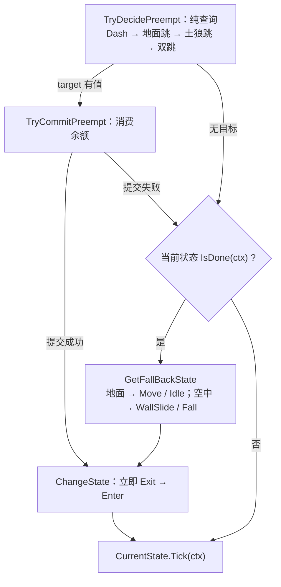

# 逻辑层

| 项 | 内容 |
| :-- | :-- |
| 定位 | 纯 C# 决策层：`Assets/Scripts/Logic/**` 内零 `MonoBehaviour`、零 `Update`/`FixedUpdate`、零 `UnityEngine.Time` 调用 |
| 上游（谁驱动它） | 物理帧：`PlayerController.FixedUpdate` → `PlayerLogic.FixedTick`；渲染帧：`GameRoot.Update` → `List<IService>` |
| 下游（它怎么落地） | 速度只经 `IMovementMotor.Move` 落到 `Rigidbody2D`；跨层事实只经 `EventBus<T>` 广播（`MoveGroup.cs:152-155`） |
| 与 Data 层 | 只读注入的 SO（`CharacterConfig` / `PlayerConfig`）；唯一主动调 Data 层处：`SceneService.Load` → `AssetModule.OnSceneSwitch()`（`Assets/Scripts/Logic/Services/SceneService.cs:41`） |
| 跨层例外 | 只允许组合根直连（`GameRoot`、`PlayerController`）与「表现层实现逻辑层端口后注入」两类（[`框架蓝图.md` §1](../框架蓝图.md) 铁律 1） |

## 1. 目录与命名空间

| 目录 | 命名空间 | 类型 |
| :-- | :-- | :-- |
| `Logic/Actor/` | `DeepseaOil.Logic` | `ActorLogic`、`WorldInfo` |
| `Logic/` | `DeepseaOil.Logic` | `LogicContext`、`TimeContext`、`ITickable`、`IFixedTickable` |
| `Logic/Movement/` | `DeepseaOil.Logic.Movement` | `IState<T>`、`StateBase<T>`、`TimedStateBase<T>`、`StateMachine<T>`、`IMovementMotor`、`MovementStateTag`、`MovementStateChanged` |
| `Logic/Movement/States/` | `DeepseaOil.Logic.Movement.States` | 7 个状态类 |
| `Logic/Player/` | `DeepseaOil.Logic.Player` | `PlayerLogic`、`MoveGroup` |
| `Logic/Input/` | `DeepseaOil.Logic.Input` | `InputBuffer`、`InputType`、`InputSnapshot` |
| `Logic/Event/` | `DeepseaOil.Logic.Events` | `EventBus<T>`、`EventBus`、4 个事件 struct |
| `Logic/Services/` | `DeepseaOil.Logic.Service` | `IService`、`PauseService`、`SceneService`、`SaveService`、`GameData`、`IGameTime`、`IAudioService`、`audioType` |

目录名与命名空间**三处不一致**（以此表为准）：`Actor/` 无 `.Actor` 段；`Event/` 是复数 `Events`；`Services/` 是单数 `Service`。`ITickable` / `IFixedTickable` 带默认接口实现（空 body，`Assets/Scripts/Logic/Tickable.cs:9`、`:17`）：`ITickable` 零实现零调用；`IFixedTickable` 只被 `ActorLogic` 与 `PlayerController` 列在基接口里，**从不经接口分发**（`PlayerController.cs:88` 直接调具体类型 `PlayerLogic.FixedTick`）。

## 2. 帧驱动：被谁驱动、在哪个时间源上

| 通道 | 驱动者 | 被驱动者 | 时间源 |
| :-- | :-- | :-- | :-- |
| 渲染帧 `Update` | `GameRoot`（`Presentation/Root/GameRoot.cs:65`） | `List<IService>` 逐项 `Tick`：`PauseService` / `SceneService` / `SaveService`（`GameRoot.cs:69-72`） | `Time.unscaledDeltaTime`（`GameRoot.cs:71`） |
| 渲染帧 `Update` | `InputProvider`（它自己的 MonoBehaviour，`Presentation/Input/InputProvider.cs:41`） | 采样 `InputSys`，`\|=` 累积按下沿（`InputProvider.cs:55-56`） | 帧（`WasPressedThisFrame`） |
| 物理帧 `FixedUpdate` | `PlayerController`（组合根，`Presentation/Root/PlayerController.cs:79`） | `PlayerLogic.FixedTick` → `MoveGroup.Tick` → 状态 → `MovementMotor.Move` | `Time.fixedTime` / `Time.fixedDeltaTime`（`PlayerController.cs:83`、`:90-91`），受 `timeScale` 影响 |

逻辑层内部**没有分发机制**：`PlayerLogic.OnTick` 直接调 `_moveGroup.Tick(in ctx)`（`Logic/Player/PlayerLogic.cs:105`），`MoveGroup.Tick` 直接调 `_machine.CurrentState.Tick(ctx)`（`Logic/Player/MoveGroup.cs:55`）。渲染帧与物理帧之间**没有**先后关系（一个渲染帧可能对应 0 或 2 个物理帧）；一次物理帧的全部环境事实由组合根组装成 `LogicContext`（`now` / `deltaTime` / `worldInfo` / `inputSnapshot`，`Logic/LogicContext.cs:11-15`）。暂停时 `timeScale == 0`（`Logic/Services/PauseService.cs:59`），`FixedUpdate` 不跑，该帧没有 `Push`（`PlayerController.cs:83`）。

## 3. ActorLogic：速度账本与重力的唯一写者

签名：`ActorLogic : IFixedTickable`，`Vector2 Velocity { get; }`（帧内工作速度 = 帧首真值 + 本帧已提交的全部变更，`ActorLogic.cs:42`）、`Vector2 FrameStartVelocity { get; }`（帧首真值，`:48`）、`Vector2 SubmittedDelta { get; }`（本帧净提交，`:51`）、`void FixedTick(LogicContext ctx)`（帧首读真值 → `OnTick` → 帧末写一次）、`protected abstract void OnTick(in LogicContext ctx)`、`public abstract bool TryConsumeJump(float now, bool airJump)`、`public abstract bool TryWallJump(in LogicContext ctx)`。

- **速度真值只有引擎一份**：`Motor.Velocity`（`ActorLogic.cs:63`、`:47`；`Presentation/Adapters/MovementMotor.cs:11`）帧首被读作本帧基准，读到的是**上一物理步结束时**的值（碰撞解算在 `FixedUpdate` 之后）。`_delta` 是瞬变累进（格/秒，**不**乘 Δt），入口 `AddImpulse` / `SetVelocityX/Y` / `SnapVelocity`（`:89`、`:158-162`、`:204-208`）；`_accel` 是加速度累进（格/秒²），入口 `AddForce`，本帧贡献 = 值 × Δt（`:92`、`:72`）。
- **帧末唯一写出** `Motor.Move(_frameStart + _delta + _accel * Δt)`；**零提交帧不写**，否则会覆盖引擎侧（外力/碰撞）结果（`ActorLogic.cs:70-72`、`:210`）。`_frameStart` / `_delta` / `_accel` 每帧在帧首清零（`:63-65`）；本类**不保存任何"上一帧输入"**，输入边沿统一由 `InputBuffer` 提供（`:14-16`）。
- **重力只由逻辑层施加**，且只有一处 `ApplyGravity`，顺序固定为 **截断 → 重力 → 钳制**（`ActorLogic.cs:184-201`）：截断 = 本帧"按住→松开"且 `Velocity.y > 0` 时 `SetVelocityY(Velocity.y × jumpCutMultiplier)`、只截断一次（`:191-194`）；重力 = `JumpHeld && Velocity.y > 0` ? `riseGravity` : `fallGravity`，写 `_accel.y -= gravity`（`:196-197`）；钳制 = 上升超 `maxRiseSpeed` / 下落超 `maxFallSpeed` 时 `SetVelocityY(±上限)`（`:199-200`）；开关 = `SetGravity(false/true)`，由 `DashState.Enter/Exit` 成对使用，关闭时不写任何垂直账本（`ActorLogic.cs:171`、`:186`；`Logic/Movement/States/DashState.cs:30`、`:36`）。
- `IMovementMotor` 不做重力（`Logic/Movement/IMovementMotor.cs:8`），`MovementMotor` 从不读写 `gravityScale` 与阻尼（`Presentation/Adapters/MovementMotor.cs:10`）。工程侧：全局重力 `(0, -9.81)`（`ProjectSettings/Physics2DSettings.asset:7`），Player 的 `Rigidbody2D` 为 `m_GravityScale: 0`（`Assets/Scenes/SampleScene.unity:285`）。

其余共用操作：`MoveHorizontal`（锁定期内不响应，并按输入更新朝向，`ActorLogic.cs:95`）、`BrakeHorizontal`（`:104`）、`AirMove`（`:112`）、`StopHorizontal`（`:118`）、`ClampFallSpeed`（`:126`）、`ApproachX`（控制律唯一实现点，`:133-147`）、`StartMoveLock` / `IsMoveLocked`（`:174`、`:212`）。**玩家专属账本**在 `PlayerLogic`：`_lastGroundedAt`（土狼窗口，`Logic/Player/PlayerLogic.cs:20`）、`_lastDashAt`（冲刺冷却，`:21`）、`_airJumpsUsed` / `_airDashesUsed`（空中余额，`:22-23`）；落地帧全部复位（`:98-103`）；`TryConsumeJump` 在非空中跳分支把 `_lastGroundedAt` 置 `-∞` 预扣土狼时间，否则一次按下能连跳两次（`:68`）。

## 4. 状态机

接口 `IState<TStateTag> where TStateTag : struct, Enum`（`Logic/Movement/IState.cs:8-24`）：`TStateTag StateTag { get; }`、`void Enter(in LogicContext ctx)`、`void Exit()`、`void Tick(in LogicContext ctx)`、`bool IsDone(in LogicContext ctx)`——方法名是 `Tick`，不是 `OnUpdate`。

**切换语义**：`ChangeState(tag, in ctx)` 做 `CurrentState?.Exit()` → 赋值 → `next.Enter(ctx)`，**立即、同步、同帧生效**，返回 `bool`（`Logic/Movement/StateMachine.cs:30-44`）。存储是 `Dictionary<TStateTag, IState<TStateTag>>`，键为 `state.StateTag`，**重复标签静默覆盖**（`:15`、`:26`）；未注册标签返回 `false`、状态不变、不抛异常（`:32`）；同状态由 `ReferenceEquals` 判定返回 `false`、不重复 `Enter`（`:33`）；首次进入不发事件（那是"进入"不是"变化"），`CurrentState` 初值为 `null`（`:35-42`、`:18`）；状态机只做"叫我切谁就切谁"，"该不该切、按什么顺序"全在 `MoveGroup`（`:10`）。`StateBase<T>` 持 `ActorLogic Logic` + `CharacterConfig Config`，`TimedStateBase<T>` 用 `_enteredAt` + 抽象 `GetDuration(ctx)` 实现 `IsDone`（`IState.cs:29-46`；`Logic/Movement/TimedStateBase.cs:18`、`:21-28`）。标签 `MovementStateTag { Empty = 0, Idle, Move, Jump, DoubleJump, Fall, Dash, WallSlide }`，其中 `Empty` 是 `default` 的具名哨兵、**永不注册**（`Logic/Movement/MovementStateTag.cs:10-20`）。

**7 个状态的 `Enter` / `Tick` / `IsDone`**：`跳跃` / `二段跳` / `冲刺` 由 `TryDecidePreempt` 抢占，任何状态都可被抢。

| 状态 | 类 | `Enter` | `Tick` | `IsDone`（交回仲裁） |
| :-- | :-- | :-- | :-- | :-- |
| `Idle` | `States/IdleState.cs:9` | 空 | `BrakeHorizontal(moveAcceleration)`（:27） | 离地 或 有水平输入（:32） |
| `Move` | `States/MoveState.cs:9` | 空 | `MoveHorizontal(Move.x, moveSpeed, moveAcceleration)`（:27） | 离地 或 输入归零（:32） |
| `Jump` | `States/JumpState.cs:9` | `SetVelocityY(jumpSpeed)`（:19） | `AirMove`（:28） | `Velocity.y <= 0`（:33） |
| `DoubleJump` | `States/DoubleJumpState.cs:10` | `SetVelocityY(doubleJumpSpeed)`（:20） | `AirMove`（:29） | `Velocity.y <= 0`（:34） |
| `Fall` | `States/FallState.cs:9` | 空 | `AirMove`（:27） | 落地 或 贴墙（:32） |
| `Dash` | `States/DashState.cs:10` | `SetGravity(false)` + `SnapVelocity(dashSpeed × direction, 0)`（:30-31） | 空（:39） | 时长 `dashDuration` 到（`GetDuration`，:43-46；`TimedStateBase.cs:28`） |
| `WallSlide` | `States/WallSlideState.cs:13` | `FaceTowards(WallSide)`（:23） | 先 `TryWallJump` 并当帧返回（:33）；否则顺墙加速 / `StopHorizontal`（:36-43）→ `ClampFallSpeed(GrabHeld ? 0 : wallSlideSpeed)`（:45） | 落地 或 离墙（:50） |

转换条件：`站立 ↔ 移动`（有水平输入 / 输入归零）；`站立`、`移动` 与 `跳跃`、`二段跳` 离地或 `Velocity.y <= 0` 后 → `下落`（`Idle`/`Move` 的 `IsDone`，`:32`；两个跳态的 `IsDone`，`:33`/`:34`）；`下落` → `贴墙滑`（贴墙）/ `站立`（落地且 `Move.x == 0`）/ `移动`（落地且 `Move.x != 0`）（`MoveGroup.GetFallBackState`，`MoveGroup.cs:135-143`）；`贴墙滑` → `下落`（离墙）/ `站立`（落地）（`WallSlideState.cs:50`）；`CanDash` 时 `站立` / `移动` / `下落` / `贴墙滑` → `冲刺`。`跳跃` 与 `二段跳` 结构相同、只差初速与标签（`DoubleJumpState.cs:9`）；抓墙不另立状态，只是"把落速钳到 0"的一种模式（`WallSlideState.cs:11`）；状态类本身是通用件（只依赖 `ActorLogic`），`MoveGroup` 因查询玩家资格而属玩家专属（`MoveGroup.cs:14`）。

蹬墙跳**不切状态**：`WallSlideState.Tick` 内 `TryWallJump` 一次给斜向初速 + 上移动锁（`Logic/Player/PlayerLogic.cs:84-91`，上锁在 `:89`），当帧直接 `return`。🔴 **D2**：上升期贴墙按跳无效——空中贴墙跳过整支通用跳，而 `WallSlide` 只能经基础态进入，`Jump`/`DoubleJump` 又只在下降时 `IsDone`（`MoveGroup.cs:92-93`、`MoveGroup.cs:142`、`WallSlideState.cs:33`、`JumpState.cs:33`、`DoubleJumpState.cs:34`）；要改就动 `TryDecidePreempt` 的贴墙分支。

### 4.1 仲裁（`MoveGroup.CheckTransitions` 两段式）

`MoveGroup.Tick(ctx)` = `ChangeState(CheckTransitions(ctx))` 紧接着用（可能已切换的）新状态跑一次 `Tick`（`Logic/Player/MoveGroup.cs:52-56`）。`MoveGroup` 是**唯一仲裁者**，状态注册也只发生在它的构造函数里（7 个状态 + 1 个 `DashState` 字段，后者为的是切换前能 `Configure(direction)`，`MoveGroup.cs:24-39`、`:120`）。



判定与提交分开（`MoveGroup.cs:75-110` 纯查询 → `:113-132` 消费余额），是为了让 `target == 当前状态` 时**不消费**、也不遮掉 `IsDone`——否则定时状态永远退不出去（`:63-66`）。空中贴墙时**整支通用跳被跳过**（`:92-93`），蹬墙跳由 `WallSlideState` 自己处理。`Current` 在尚无当前状态时回报 `Idle`（`MoveGroup.cs:42-49`）。**资格查询全在 `PlayerLogic`**：`CanGroundJump`（`:36`）、`CanDoubleJump`（`:42`）、`HasBufferedJump`（`:45`）、`WouldJumpFromGround`（`:51`）、`CanDash`（`:57`）——它们只回答"有没有资格"，不做转移决策。

## 5. 输入契约

| 契约 | 内容 | 位置 |
| :-- | :-- | :-- |
| 唯一按键沿存储点 | `InputProvider` 是唯一采样点；`InputBuffer` 是唯一按下沿存储点；宿主**不得**自存"上一帧输入" | `Logic/Input/InputBuffer.cs:20-21`；`Presentation/Root/PlayerController.cs:14-15` |
| 调用顺序 | 同一物理帧内 `Push` **必须先于** `PlayerLogic.FixedTick`，否则松键沿滞后一帧、可变跳高失效 | `PlayerController.cs:83` → `:88`；`InputBuffer.cs:121` |
| 窗口是参数不是字段 | `CanConsume(type, now, window)` / `TryConsume(type, now, window)`；数值属于调用方（玩家窗口：`jumpBufferTime` / `dashBufferTime`，均 0.12s） | `InputBuffer.cs:127`、`:134`；`Assets/ConfigAssets/玩家配置.asset:31`、`:34` |
| 时间由调用方传入 | 不读 Unity Time，必须单调不减；窗口是**闭区间** `now - window <= t <= now` | `InputBuffer.cs:18`、`:160-163` |
| NaN 哨兵 | 失效时间为 `float.NaN`；`time <= now && time >= now - window` 对 NaN 恒假，故消费后自然判假 | `InputBuffer.cs:27`、`:138`、`:159-163` |
| 消费语义 | `CanConsume` 纯查询、可重复调用；`TryConsume` 成功一次即作废。按下仅受窗口时长约束 | `InputBuffer.cs:125`、`:134-140`、`:19` |
| 容量与构造 | `Capacity = Max(1, CeilToInt(bufferSeconds × sampleRatePerSecond))`；实际窗口 `EffectiveSeconds = Capacity / SampleRatePerSecond`；`bufferSeconds` 取 `Max(jumpBufferTime, dashBufferTime)`，采样率取 `RoundToInt(1 / Time.fixedDeltaTime)` 且与实际 `Push` 频率一致 | `InputBuffer.cs:87`、`:60`、`:66`；`PlayerController.cs:71-74` |
| 参数校验 | `bufferSeconds` 为 NaN/∞/负、`sampleRatePerSecond <= 0` 一律抛 `ArgumentOutOfRangeException` | `InputBuffer.cs:69-81` |
| 松开沿 | `Push` 内**就地**由相邻两次采样求出（`_prevJumpHeld && !JumpHeld`）；挪到渲染帧求会丢沿 | `InputBuffer.cs:112-115` |
| 清空 | `Clear()` 清快照、写指针、`_prevJumpHeld`、`_jumpReleased` 与全部按下时间 | `InputBuffer.cs:146-157` |
| 🔴 D25 | 采样率在 `PlayerController.Awake` 固定 → 事后改工程 Fixed Timestep 会使实际窗口与 `EffectiveSeconds` 不一致 | `PlayerController.cs:71-74`、`ProjectSettings/TimeManager.asset:6` |

`InputSnapshot` 字段（每个物理帧由 `PlayerController` 组装进 `LogicContext`）：`Move`（移动输入，约定范围 −1..1，`InputProvider` 用 `ClampMagnitude(..., 1)` 保证，`Logic/Input/InputSnapshot.cs:11`）、`JumpPressed` / `DashPressed`（按下沿，仅采样当帧为真，由 `Push` 转存进缓冲，`:14`、`:20`）、`JumpHeld`（按住态，用于可变跳高的松键截断，`:17`）、`GrabHeld`（抓墙键按住态，直接进 `WallSlideState`，`:23`）。缓冲输入类型 `InputType { Jump, Dash, Attack }`：只有 `Jump` / `Dash` 被 `Push` 记录，`Attack` 标着 `// M2` 且无消费者（`InputBuffer.cs:7-12`、`:109-110`）。采样映射：`Move` 连续值；`Jump`/`Grab` 用 `IsPressed()`；`Jump`/`Dash` 用 `WasPressedThisFrame()` 且 `\|=` 累积到被物理帧消费（`InputProvider.cs:51-56`、`:63-77`）。

## 6. 端口（由表现层实现，注入逻辑层）

`IMovementMotor`（`Logic/Movement/IMovementMotor.cs:9`，成员 `Velocity`（读，引擎真值回读口）/ `Facing`（读写）/ `IsGrounded` / `IsTouchingWall` / `Move(Vector2)`）由 `MovementMotor` 实现（`Presentation/Adapters/MovementMotor.cs:15`）；`IGameTime`（`Logic/Services/IGameTime.cs:4`，成员 `SetTimeScale(float)` / `UnscaledDeltaTime` / `TimeScale`）由 `GameTime` 实现（`Presentation/Adapters/GameTime.cs:6`）；`IAudioService`（`Logic/Services/IAudioService.cs:14`，`Play(audioType)`；`audioType { None, Walk }`）**无实现**（零调用点，D14）。

`IMovementMotor` 不做重力、不做缓存：逻辑层只读组合根喂进来的 `WorldInfo`（`IMovementMotor.cs:8`；`MovementMotor.cs:12`）。⚠ `WallSide` **不在**接口上（接口只到 `IsTouchingWall`，`IMovementMotor.cs:21`），但 `PlayerController` 用具体类型直读它——组合根可以这么做，别处不行（`PlayerController.cs:85-86`）。`WorldInfo` 是每物理帧的环境事实快照：`Grounded` / `TouchingWall` / `WallSide`（`Logic/Actor/WorldInfo.cs:9-15`），由 `PlayerController` 从 `MovementMotor` 组装（`PlayerController.cs:85-86`）。

## 7. 事件目录

| 事件 | 声明 | 语义 | 发布者 | 订阅者（时机） |
| :-- | :-- | :-- | :-- | :-- |
| `RequestPause` | `Logic/Event/Events.cs:8` | 意图·祈使式 | `BeginPanel`（`Presentation/UI/Panel/BeginPanel.cs:26`） | `PauseService`（`Init`/`Dispose`，`PauseService.cs:38`、`:90`） |
| `RequestResume` | `Events.cs:10` | 意图 | `BeginPanel.cs:29` | `PauseService`（`PauseService.cs:39`、`:91`） |
| `GamePaused` | `Events.cs:15` | 事实·过去式 | `PauseService.SetPaused`（`PauseService.cs:61`） | `PlayerController`（`OnEnable`/`OnDisable`，`PlayerController.cs:37`、`:43`） |
| `GameResumed` | `Events.cs:17` | 事实 | `PauseService.SetPaused`（`PauseService.cs:67`） | `PlayerController`（`PlayerController.cs:38`、`:44`） |
| `MovementStateChanged` | `Logic/Movement/MovementStateChanged.cs:6`（不在 `Events.cs`） | 事实：`Current` / `Previous` | `MoveGroup`（`MoveGroup.cs:154`，源自 `StateMachine.OnStateChanged`，`StateMachine.cs:42`） | `MovementDebugPanel`（`Start`/`OnDestroy`，`Presentation/Debug/MovementDebugPanel.cs:31`、`:36`） |
| `DebugEvent` | `Presentation/Debug/EventBusDebugPanel.cs:96` | 演示事件 | **无人发布**（D13） | 同面板（`:45`、`:51`） |

双向共用同一条通道，**不搞**"上行直接调用、下行广播"两套规则（[`框架蓝图.md` §8](../框架蓝图.md)「通信」）。订阅时机在工程里是**三种写法并存**（`Init`/`Dispose`、`OnEnable`/`OnDisable`、`Start`/`OnDestroy`），失活（不销毁）会留下静态订阅（D18）。暂停时：`PlayerController.OnGamePaused` 做 `inputProvider.Clear()` + `SetInputEnabled(false)` + `InputBuffer.Clear()`（`PlayerController.cs:47-52`）；`PauseService` 侧只写 `IGameTime.SetTimeScale` 并发布事实（`PauseService.cs:50-69`）。⚠ D16：`PlayerController.cs:49` 调 `inputProvider.Clear()` 后，`:50` 的 `SetInputEnabled(false)` 内部再调一次。总线实现：`EventBus<T>` 静态泛型，`Publish` 先复制快照数组（每次发布一次分配）再逐个 `try/catch` 隔离异常；订阅/退订幂等；`ClearAll()` 经 `EventChannelRegistry` 反射逐个封闭类型调 `Clear()`（`Logic/Event/EventBus.cs:65-86`、`:25-33`、`:195-211`）。

## 8. 三个 Service 的职责

```csharp
public interface IService   // Logic/Services/PauseService.cs:8
{
    void Init();
    void Tick(float unscaledDeltaTime);
    void Dispose();
}
```

三个 Service **不是单例**，由组合根 `GameRoot.Start` 逐个 `new` + `Init()` 并加进 `List<IService>`（`Presentation/Root/GameRoot.cs:51-61`），顺序 `[Pause, Scene, Save]` 既是 `Init` 序也是 `Tick` 序。`PauseService`：持有暂停状态与暂停累计时长；`Init` 复位 `isPaused` / `pausedTime`、`SetTimeScale(1)` 并订阅两个意图事件（`PauseService.cs:31-40`）；`Tick` 仅暂停时累加 `pausedTime`（`:42-48`）；`SetPaused`（:50）、`Reset`（:81）、`Dispose`（:87）。`SceneService`：`Init` / `Tick` 空（`:20-22`、`:24-26`）；`Load(sceneName)`（`:28-46`）依次做 ① `SetTimeScale(1)` ② `PauseService.SetPaused(false)` ③ `EventBus.ClearAll()` ④ `AssetModule.OnSceneSwitch()` ⑤ `SceneManager.LoadScene`。`SaveService`：存档占位，`Init` / `Tick` 空（`:20-22`、`:24-26`）；`Save(GameData)`（`:28-31`）、`Load()`（`:33-36`）；`GameData` 是空 struct（`:7-10`）。

🔴 未修缺陷（逻辑层相关）：**D8** `SaveService.Save` 从不给 `_data` 赋值、`Load` 恒返回 `default`（`SaveService.cs:29-31`、`:33-36`）；**D9** `SceneService.Load` 全仓库零调用点 → `EventBus.ClearAll()` 与四项复位从不执行（`SceneService.cs:28`、`:37`）；**D10** `IService.Dispose` 无人调用 → `PauseService.Init` 注册的两个静态订阅不被摘除，`Reset()` 同样零调用（`PauseService.cs:87`、`:38-39`、`:81`）。
