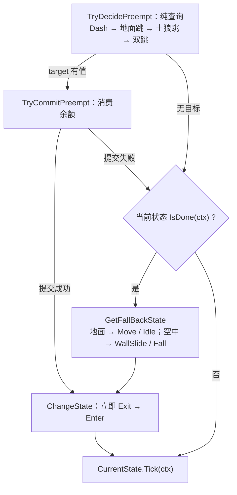

# 逻辑层

纯 C# 决策层：`Assets/Scripts/Logic/**` 内零 `MonoBehaviour`、零 `Update`/`FixedUpdate`、零 `UnityEngine.Time`。只读注入的 SO；唯一主动调 Data 层处是 `SceneService.Load` → `AssetModule.OnSceneSwitch()`。

## 1. 目录与命名空间

| 目录 | 命名空间 | 类型（举要） |
| :-- | :-- | :-- |
| `Logic/Actor/`、`Logic/` | `DeepseaOil.Logic` | `ActorLogic`、`WorldInfo`、`LogicContext`、`ITickable`、`IFixedTickable` |
| `Logic/Movement/`、`…/States/` | `…Movement[.States]` | `IState<T>`、`StateBase<T>`、`TimedStateBase<T>`、`StateMachine<T>`、`IMovementMotor`、`MovementStateTag`、7 个状态类 |
| `Logic/Player/` | `…Player` | `PlayerLogic`、`MoveGroup` |
| `Logic/Input/` | `…Input` | `InputBuffer`、`InputType`、`InputSnapshot` |
| `Logic/Event/` | `…Events` | `EventBus<T>`、`EventBus`、4 个事件 struct |
| `Logic/Services/` | `…Service` | `IService`、`PauseService`、`SceneService`、`SaveService`、`IGameTime`、`IAudioService` |

目录名与命名空间**三处不一致**（以此表为准）：`Actor/` 无段、`Event/` 复数、`Services/` 单数。`ITickable` 零实现零调用，`IFixedTickable` **从不经接口分发**（`Logic/Tickable.cs:9`、`:17`）。

## 2. 帧驱动

| 通道 | 驱动者 | 被驱动者 | 时间源 |
| :-- | :-- | :-- | :-- |
| 渲染帧 `Update` | `GameRoot`（`Root/GameRoot.cs:65`） | `List<IService>` 逐项 `Tick`（`:69-72`） | `Time.unscaledDeltaTime` |
| 渲染帧 `Update` | `InputProvider`（自驱，`Input/InputProvider.cs:41`） | 采样 `InputSys` 并累积按下沿 | 帧（`WasPressedThisFrame`） |
| 物理帧 `FixedUpdate` | `PlayerController`（`Root/PlayerController.cs:79`） | `PlayerLogic.FixedTick` → `MoveGroup.Tick` → 状态 → `MovementMotor.Move` | `fixedTime` / `fixedDeltaTime` |

内部**没有分发机制**：`PlayerLogic.OnTick` 直接调 `_moveGroup.Tick(in ctx)`，`MoveGroup.Tick` 直接调 `_machine.CurrentState.Tick(ctx)`。暂停时 `timeScale == 0`，`FixedUpdate` 不跑。

## 3. ActorLogic：速度账本与重力的唯一写者

`ActorLogic : IFixedTickable`，成员 `Velocity` / `FrameStartVelocity` / `SubmittedDelta` / `FixedTick` / `OnTick` / `TryConsumeJump` / `TryWallJump`。

- **速度真值只有引擎一份**：`Motor.Velocity` 帧首读作本帧基准（读到的是**上一物理步结束时**的值），**帧末唯一写出**；**零提交帧不写**，否则会覆盖引擎侧结果。`_delta` 是瞬变累进（格/秒，**不**乘 Δt），入口 `AddImpulse` / `SetVelocityX/Y` / `SnapVelocity`；`_accel` 是加速度累进（格/秒²），入口 `AddForce`，本帧贡献 = 值 × Δt。
- **重力唯一一处 `ApplyGravity`**，顺序固定 **截断 → 重力 → 钳制**：截断 = 松键且 `Velocity.y > 0` 时乘 `jumpCutMultiplier`、只截断一次；重力 = `JumpHeld && Velocity.y > 0` ? `riseGravity` : `fallGravity`；钳制 = 超 `maxRiseSpeed` / `maxFallSpeed` 时钳回。

共用操作：`MoveHorizontal` / `BrakeHorizontal` / `AirMove` / `ApproachX`（控制律唯一实现点）等。**玩家专属账本**在 `PlayerLogic`：`_lastGroundedAt`（土狼窗口）、`_lastDashAt`（冲刺冷却）、`_airJumpsUsed` / `_airDashesUsed`（空中余额）。全局重力 `(0, -9.81)`，Player 的 `Rigidbody2D` 为 `m_GravityScale: 0`。

## 4. 状态机

接口 `IState<TStateTag> where TStateTag : struct, Enum`（`Movement/IState.cs:8-24`）：`StateTag` / `Enter` / `Exit` / `Tick` / `IsDone`。`ChangeState(tag, in ctx)` 做 `Exit()` → 赋值 → `Enter(ctx)`，**立即、同步、同帧生效**（`Movement/StateMachine.cs:30-44`）；`AddState` 遇到重复标签静默覆盖（`StateMachine.cs:26`）；`ChangeState` 遇到未注册标签**或已是当前状态**都返回 `false`、不抛（`StateMachine.cs:32-33`）。蹬墙跳**不切状态**（`WallSlideState.Tick` 内 `TryWallJump` 给斜向初速 ＋ 上移动锁，当帧 `return`）。

| 状态（`MovementStateTag`，`Empty` **永不注册**） | `Tick` | `IsDone` |
| :-- | :-- | :-- |
| `Idle` / `Move` | `BrakeHorizontal` / `MoveHorizontal(Move.x, moveSpeed, moveAcceleration)` | 离地 / 输入增减 |
| `Jump` / `DoubleJump` | `Enter` 里 `SetVelocityY(jumpSpeed / doubleJumpSpeed)`，随后 `AirMove` | `Velocity.y <= 0` |
| `Fall` | `AirMove` | 落地 / 贴墙 |
| `Dash` | 空；`Enter` 里 `SetGravity(false)` ＋ `SnapVelocity(dashSpeed × direction, 0)` | `dashDuration` 到 |
| `WallSlide` | `TryWallJump` 并当帧返回；否则顺墙加速 → `ClampFallSpeed(GrabHeld ? 0 : wallSlideSpeed)` | 落地 / 离墙 |

`跳跃` / `二段跳` / `冲刺` 由 `TryDecidePreempt` 抢占（优先级即此序）。**仲裁两段式**：`MoveGroup` 是唯一仲裁者，评估（`MoveGroup.cs:75-110`）与消费（`:113-132`）分开，是为了让 `target == 当前状态` 时不消费、也不遮掉 `IsDone`。

## 5. 输入契约

| 契约 | 内容 | 位置 |
| :-- | :-- | :-- |
| 唯一按键沿存储点 | `InputProvider` 唯一采样点，`InputBuffer` 唯一按下沿存储点；宿主**不得**自存"上一帧输入" | `Input/InputBuffer.cs:20-21` |
| 调用顺序 | 同一物理帧内 `Push` **必须先于** `PlayerLogic.FixedTick`，否则松键沿滞后一帧、可变跳高失效 | `PlayerController.cs:83` → `:88` |
| 窗口是参数不是字段 | `CanConsume(type, now, window)` / `TryConsume(type, now, window)`；数值属于调用方（`jumpBufferTime` / `dashBufferTime` 0.12s）；窗口是**闭区间**（`now - window <= t <= now`），失效时间用 `float.NaN` | `InputBuffer.cs:127`、`:134` |
| 消费与容量 | 不读 Unity Time、必须单调不减；`CanConsume` 纯查询可重复调用，`TryConsume` 成功一次即作废；`Capacity = Max(1, CeilToInt(bufferSeconds × sampleRatePerSecond))`，`EffectiveSeconds = Capacity / SampleRatePerSecond` | `InputBuffer.cs:18`、`:60`、`:87`、`:125` |
| 松开沿 / 清空 | 松开沿在 `Push` 内**就地**由相邻两次采样求出；`Clear()` 清快照、写指针与全部按下时间 | `InputBuffer.cs:112-115`、`:146-157` |
| 🔴 D25 | 采样率在 `PlayerController.Awake` 固定 → 事后改 Fixed Timestep 会使实际窗口与 `EffectiveSeconds` 不一致 | `PlayerController.cs:71-74` |

`InputSnapshot` 字段：`Move`（−1..1）、`JumpPressed` / `DashPressed`（按下沿）、`JumpHeld`、`GrabHeld`；`InputType` 的 `Attack` 无消费者。

## 6. 端口、事件与 Service

| 端口（Logic 定义） | 实现 |
| :-- | :-- |
| `IMovementMotor`（`Movement/IMovementMotor.cs:9`）：`Velocity` / `Facing` / `IsGrounded` / `IsTouchingWall` / `Move(Vector2)` | `MovementMotor`（`Adapters/MovementMotor.cs:15`） |
| `IGameTime`（`Services/IGameTime.cs:4`）：`SetTimeScale` / `UnscaledDeltaTime` / `TimeScale` | `GameTime`（`Adapters/GameTime.cs:6`） |
| `IAudioService`（`Services/IAudioService.cs:14`）：`Play(audioType)` | **无实现**（零调用点，D14） |

⚠ `WallSide` **不在**接口上，但 `PlayerController` 用具体类型直读它。跨层事实只经 `EventBus<T>`：`RequestPause` / `RequestResume`（`BeginPanel` → `PauseService`）、`GamePaused` / `GameResumed`（`PauseService.SetPaused` → `PlayerController`）、`MovementStateChanged`（`MoveGroup` → `MovementDebugPanel`）、`DebugEvent`（**无人发布**，D13）。

`IService`：`Init()` / `Tick(float unscaledDeltaTime)` / `Dispose()`；三个 Service **不是单例**，由 `GameRoot.Start` 建，顺序 `[Pause, Scene, Save]` 既是 `Init` 序也是 `Tick` 序。`SceneService.Load` 依次 ① 复位 `timeScale` ② `PauseService.SetPaused(false)` ③ `EventBus.ClearAll()` ④ `AssetModule.OnSceneSwitch()` ⑤ `SceneManager.LoadScene`。

🔴 **D8** `SaveService.Save` 不赋值、`Load` 恒返回 `default`；**D9** `SceneService.Load` 全仓库零调用点 → ③④ 从不执行；**D10** `IService.Dispose` 无人调用 → 静态订阅不摘除；**D16** 暂停时 `inputProvider.Clear()` 与 `SetInputEnabled(false)` 重复清空一次。
