# 架构图集

**图是主体**：16 张图回答「谁依赖谁、一次调用怎么走、某个功能怎么实现」。论述与契约看 [框架蓝图.md](框架蓝图.md)，逐层细节看 [分层设计/](分层设计/)，本文不重复，只画源码里的事实。

## 0 · 图目录与选型

| # | 图名 | 类型 | 回答什么问题 | 节点 / 消息 | Mermaid 最低版本 |
| :-- | :-- | :-- | :-- | :-- | :-- |
| 1 | 分层与程序集依赖总览 | flowchart LR | 三层、生成物、地基之间允许哪些边 | 8 节点 / 11 边 | ≥ 9.1（subgraph 内 `direction`） |
| 2 | 数据层内部结构 | flowchart TD | `AssetModule` 的六个微块各管什么 | 18 节点 / 20 边 | ≥ 9.1 |
| 3 | 逻辑层内部结构 | flowchart TD | 状态机、仲裁者、输入缓冲、服务的分工 | 17 节点 / 19 边 | ≥ 9.1 |
| 4 | 表现层内部结构 | flowchart TD | 两个组合根、两个适配器、UI 三件套 | 18 节点 / 15 边 | ≥ 9.1 |
| 5 | 端口与适配器 | classDiagram | 逻辑层定义的接口由谁实现、怎么注入 | 10 类 / 9 关系 | ≥ 9.0 |
| 6 | 组合根装配出的对象图 | classDiagram | 运行期谁持有谁、谁回指谁 | 13 类 / 18 关系 | ≥ 9.0（泛型用 `~T~`） |
| 7 | 启动装配时序 | sequenceDiagram | 两个组合根的四个时机与两次幂等守卫 | 19 消息 | ≥ 9.0（`autonumber`） |
| 8 | 每帧驱动时序 | sequenceDiagram | 渲染帧与物理帧各自的顺序 | 12 消息 | ≥ 9.0 |
| 9 | 一次物理帧的完整调用链 | flowchart TD | 从 `FixedUpdate` 到 `Rigidbody2D.velocity` | 20 节点 / 21 边 | ≥ 9.1 |
| 10 | 移动仲裁决策 | flowchart TD | 「该不该切状态」的两段式判定 | 14 节点 / 24 边 | ≥ 9.1 |
| 11 | 移动状态机流转 | stateDiagram-v2 | 7 个状态之间所有真实可达的转移 | 9 状态 / 25 转移 | ≥ 9.0 |
| 12 | 事件总线流向与暂停闭环 | flowchart LR | 4 个事件类型的发布方、订阅方与唯一闭环 | 20 节点 / 19 边 | ≥ 9.1 |
| 13 | 资源异步加载全链路 | sequenceDiagram | `LoadAsync` 未命中 → 入队 → 成功/失败两分支 | 23 消息 | ≥ 9.0（`alt`） |
| 14 | 缓存条目状态机 | stateDiagram-v2 | `CacheEntry` 六字段驱动的全部状态 | 9 状态 / 17 转移 | ≥ 9.0 |
| 15 | UI 面板显示链路 | sequenceDiagram | `ShowPanel` 到面板挂在 `Middle` 层 | 13 消息 | ≥ 9.0 |
| 16 | 配置查询链路 | flowchart LR | xlsx → JSON → `ConfigModule` → 调用方 | 17 节点 / 17 边 | ≥ 9.1 |

> 节点 / 边 / 消息数由 `mermaid.render` 实测，非估算。

| 记号 | 含义 |
| :-- | :-- |
| 实线箭头 `-->` / `->>` | 源码里真实存在的调用、持有或数据流 |
| 虚线箭头 `-.->` / `..>` | 端口实现、只读访问，或**零调用点**的契约 |
| `*--` / `..|>` / `--|>` | classDiagram 的组合 / 实现 / 继承 |
| `alt` + `else` | sequenceDiagram 的互斥分支 |
| 图题里的 `【事实】` | 逐行读源码可复核 |
| 图题里的 `【推断】` | 由注释、prefab 数据或常量推出，源码没有直接断言 |

## 1 · 依赖关系

### 图 1 · 分层与程序集依赖总览　【事实】跨层只有三类边：数据层被直连查询、逻辑层与表现层之间只走 `EventBus<T>`、组合根直连是唯一例外

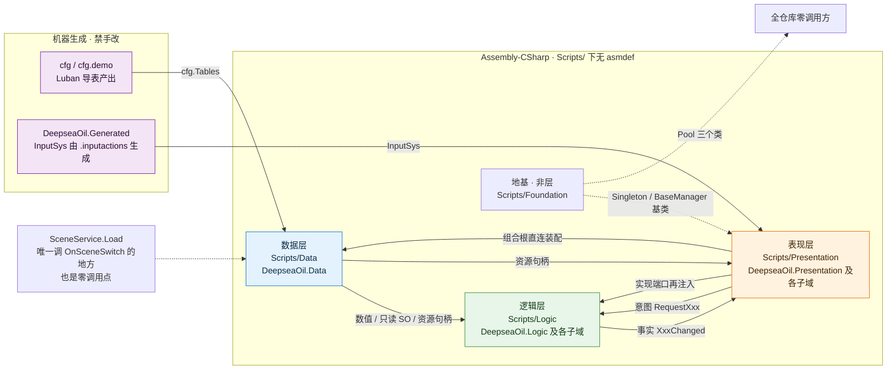

【事实】数据层**刻意不继承** `Singleton<T>`：`ConfigModule` / `AssetModule` / `DataMetrics` 都是 `static class` ＋ 显式 `Init`。

### 图 2 · 数据层内部结构　【事实】`AssetModule` 是唯一对外门面，六个微块全部 `internal sealed`，跨层只能看到它

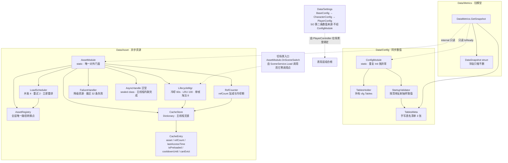

【事实】失败路径**不写缓存**：`onFail` 只 `RecordFailure` ＋ `DispatchPending(fallback)`，没有 `Put`——与 [数据层.md](分层设计/数据层.md) 的状态图有实质分歧，见图 14。

### 图 3 · 逻辑层内部结构　【事实】状态机只管切换、`MoveGroup` 只管「该不该切」、`ActorLogic` 只管速度与重力，三者互不知道对方实现

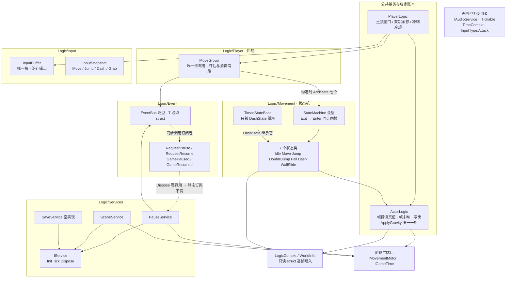

【事实】`IService.Dispose`、`PauseService.Reset`、`SceneService.Load`、`ITickable`、`TimeContext` 全部零调用点。

### 图 4 · 表现层内部结构　【事实】两个组合根是唯一允许跨层直连的地方，其余一律走 `EventBus<T>` 或只读属性

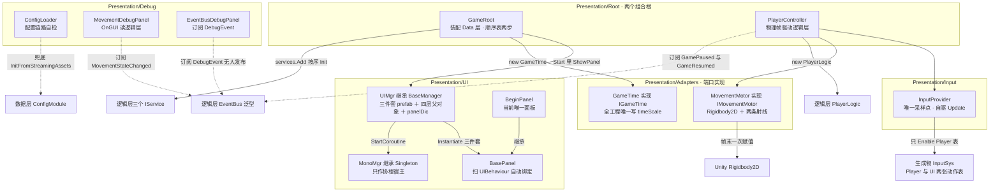

【事实】`MonoMgr` 的三路转发（`AddUpdateListener` 等）零调用；它只被 `UIMgr` 当作 `StartCoroutine` 的宿主。

### 图 5 · 端口与适配器　【事实】逻辑层定义三个端口，表现层实现两个，第三个零实现——依赖方向永远是「端口 ← 实现」

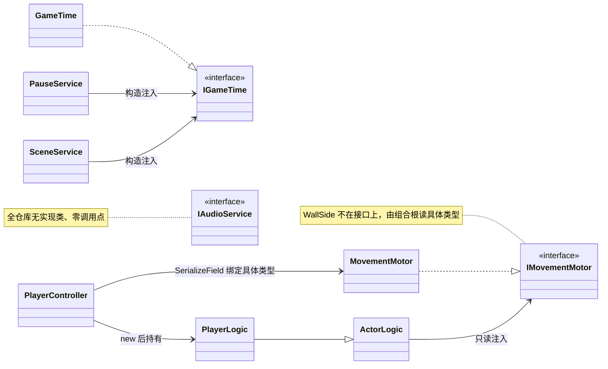

### 图 6 · 组合根装配出的对象图　【事实】`GameRoot.Start` 与 `PlayerController.Awake` 产出的全部长生命周期对象与持有关系

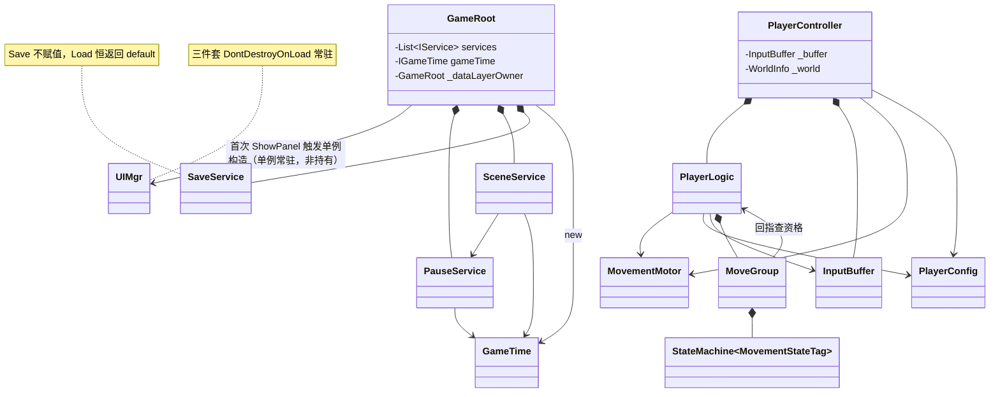

【推断】`GameRoot._dataLayerOwner` 是 `static` 而 `GameRoot` 不是 `DontDestroyOnLoad`；按注释它防的是「同一帧出现第二个 `GameRoot`」，在开启 Domain Reload 的当前配置下只在叠加场景里起作用。

## 2 · 调用链

### 图 7 · 启动装配时序　【事实】Unity 只保证「所有 `Awake` 先于任何 `Start`」，因此 Data 层装配放在阶段 1

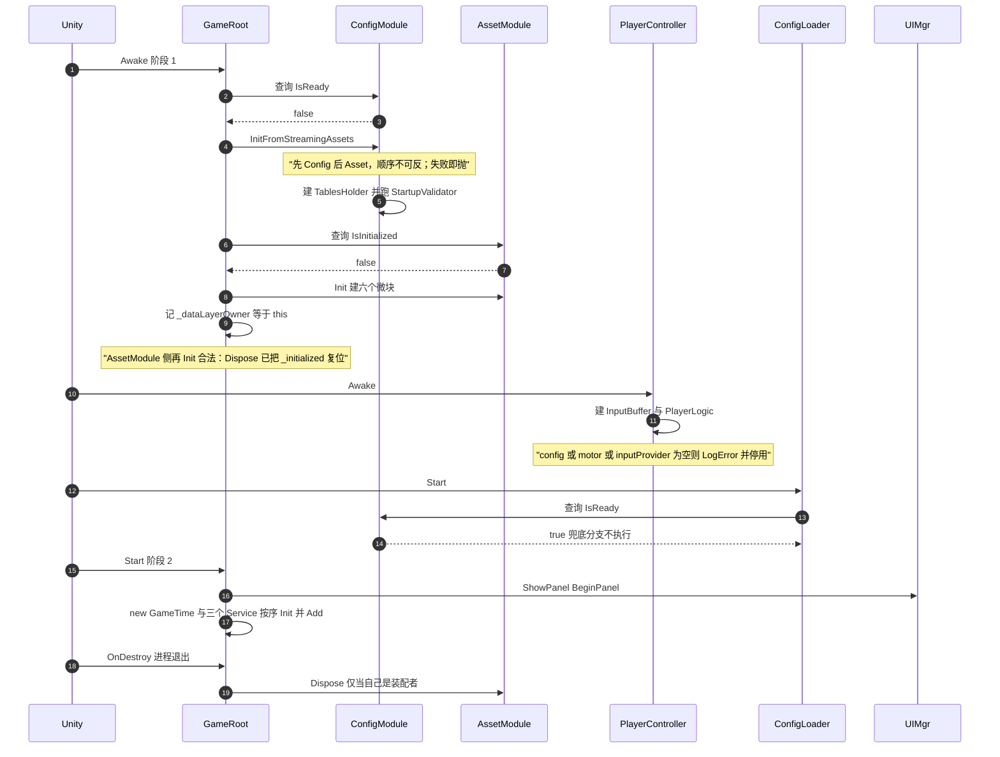

### 图 8 · 每帧驱动时序　【事实】三个驱动入口互不调用：`InputProvider.Update` 自驱，`GameRoot.Update` 走顺序表，`PlayerController.FixedUpdate` 走物理帧

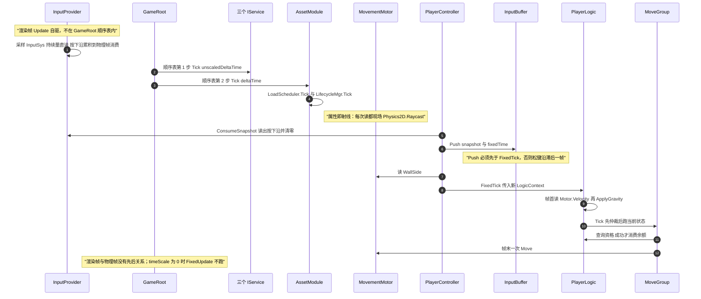

### 图 9 · 一次物理帧的完整调用链　【事实】从 `FixedUpdate` 到 `Rigidbody2D.velocity` 的全部跳转；`HasSubmission` 为假时**不写速度**

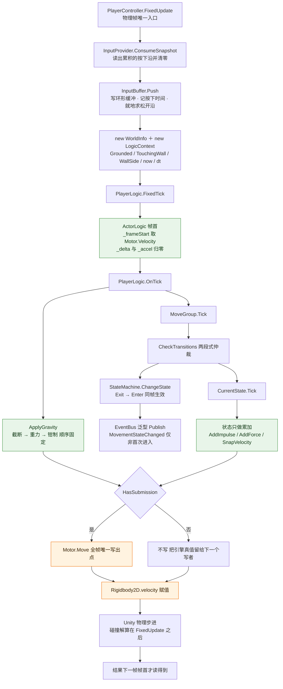

【事实】`_delta` 单位是格/秒（**不**乘 Δt），`_accel` 单位是格/秒²，帧末统一乘一次 `deltaTime`。

## 3 · 功能实现

### 图 10 · 移动仲裁决策　【事实】抢占「先判后消费」：判定是纯查询，目标等于当前状态时既不消费也不遮掉 `IsDone`

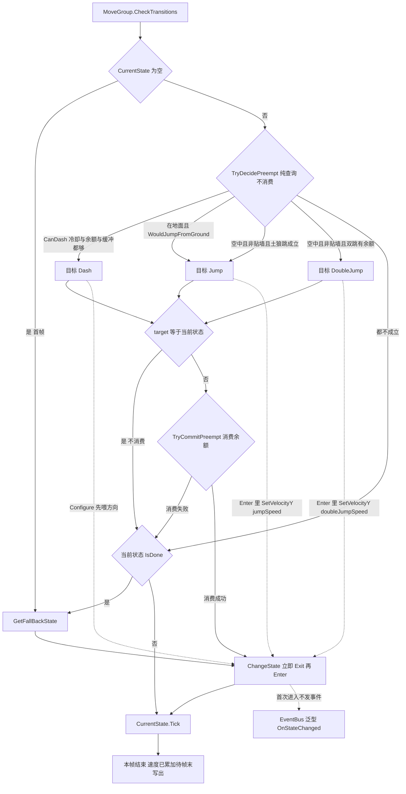

【事实】贴墙时**整支通用跳被跳过**：蹬墙跳由 `WallSlideState.Tick` 自己处理，否则二段跳会先抢走这次按下。

### 图 11 · 移动状态机流转　【事实】7 个状态之间所有真实可达的转移；`ChangeState` 遇到未注册标签或已是当前状态时返回 `false`

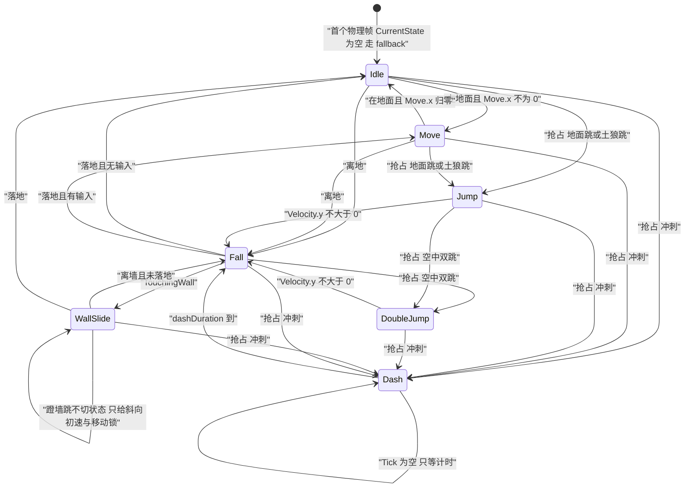

【事实】状态机**首次进入不发** `OnStateChanged`，所以调试面板另用 `PlayerLogic.CurrentState` 补显。
【推断】「抢占」类边（指向 `Dash` 的六条、指向 `Jump` 的两条、指向 `DoubleJump` 的两条）是从 `MoveGroup.TryDecidePreempt` 的三个条件推出的**逻辑可达性**——源码没有显式转移表，也没有覆盖全部组合的实测；「落地 / 离地 / 离墙」类边则来自各状态 `IsDone` 的返回值，属直接事实。

### 图 12 · 事件总线流向与暂停闭环　【事实】4 个事件类型的全部发布方与订阅方，其中只有暂停构成完整闭环

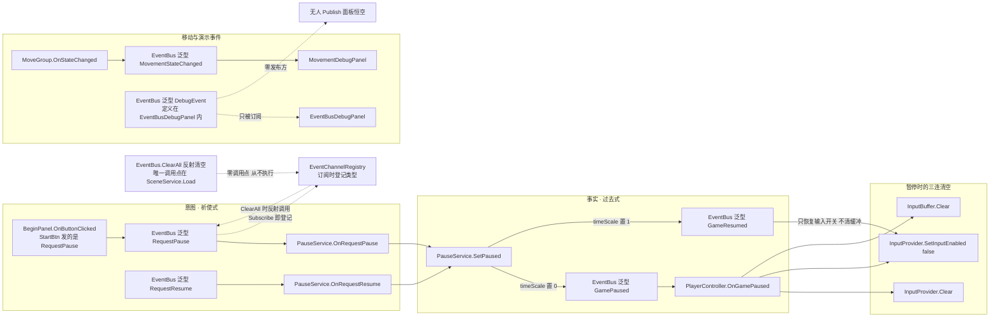

【事实】`GamePaused` 的订阅在 `PlayerController.OnEnable`、退订在 `OnDisable`；`PauseService` 的订阅在 `Init`、退订在 `Dispose`，而后者的 `Dispose` 零调用。

### 图 13 · 资源异步加载全链路　【事实】`AssetModule.LoadAsync` 未命中缓存的完整路径；成功分支的三步顺序严格不可换

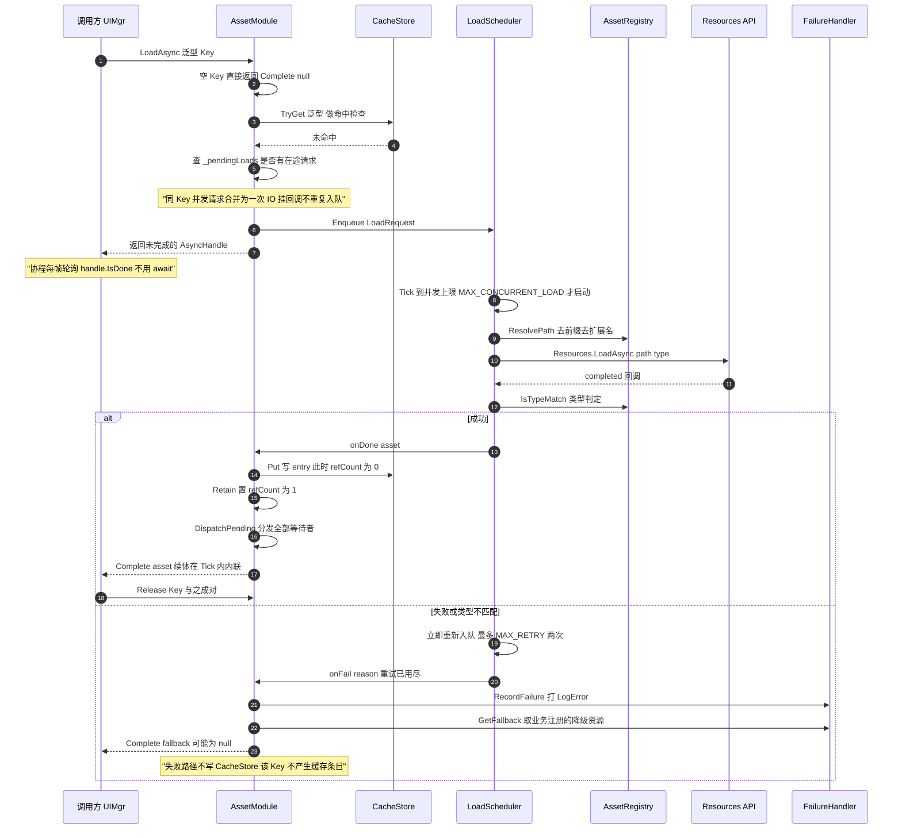

【推断】`LoadScheduler.StartLoad` 的注释把此处标为「切 Addressables 时换成 `Addressables.LoadAssetAsync`」，但 `AssetRegistry.ResolvePath` 才是路径语义的唯一转换点；谁是真正的切换边界，源码没有定论。

### 图 14 · 缓存条目状态机　【事实】`CacheEntry` 六个字段驱动的全部状态；与 [数据层.md](分层设计/数据层.md) 的状态图有一处实质分歧

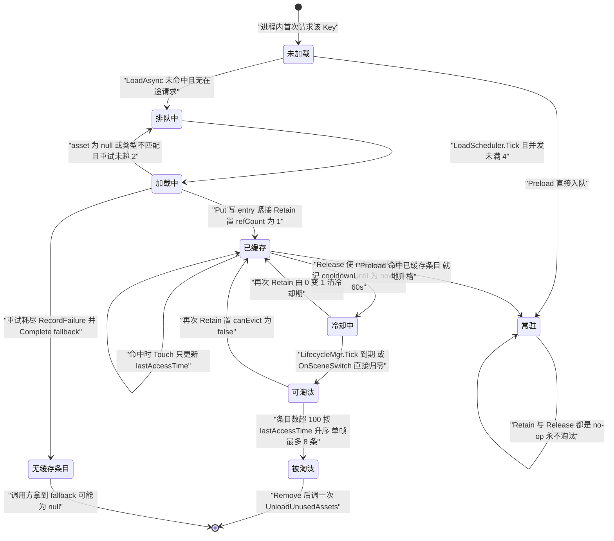

**分歧**：【事实】失败路径没有 `Put`，所以「降级」不是一个缓存状态——[数据层.md](分层设计/数据层.md) 把它画成 `CacheEntry` 的一个状态并给了它一条「LRU 超阈值」出边，源码里这两点都不成立；本图按源码画。

### 图 15 · UI 面板显示链路　【事实】`ShowPanel` 首次调用触发 `UIMgr` 单例构造，三件套走同步窄路，面板本体走异步

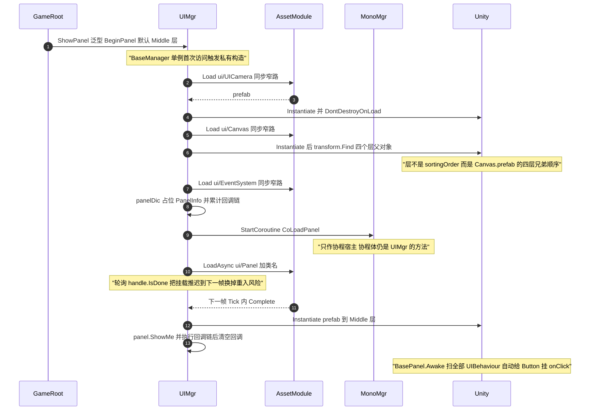

【事实】面板资源 Key 写死为 `ui/Panel/` ＋ `typeof(T).Name`，所以**预制体名必须等于面板类名**；`HidePanel(true)` 才 `Release`，`HidePanel(false)` 只失活不释放。

### 图 16 · 配置查询链路　【事实】xlsx 到调用方的完整链路，以及一条存在契约但没有调用点的跨模块衔接

```mermaid
flowchart LR
  X["ConfigWorkspace/Data<br/>weapon / item / fish 三张 xlsx"] -->|"Luban 导表 成功后才镜像"| J["Assets/StreamingAssets/Luban<br/>demo_tbweapon 等 JSON"]
  X -->|"Luban 导表"| G["Assets/Scripts/Generated/Config<br/>Tables 与 demo/Tb 三个表"]
  V["pathValidator.rootDir 指向 Assets<br/>只校验文件在 Assets 下存在"] -.->|"不校验 Resources 下也有"| X
  GR["GameRoot.Awake"] -->|"InitFromStreamingAssets"| CM["ConfigModule.Init"]
  CM --> TH["TablesHolder<br/>new cfg.Tables 传 Loader"]
  J -->|"File.ReadAllText 仅桌面端"| TH
  G -->|"TbWeapon / TbItem / TbFish"| TH
  TH --> SV["StartupValidator<br/>按 TablesMeta.Names 反射取值"]
  SV -->|"任一表取不到"| EX["抛 ConfigLoadException<br/>带病数据不进运行时"]
  SV -->|"全部可加载"| RD["ConfigModule.IsReady 置 true"]
  RD --> Q["GetWeapon / GetItem / GetFish / GetAllWeapons"]
  RD --> ESC["Tables 逃生舱 只读不跨帧持有"]
  RD --> DM["DataMetrics.TableCount<br/>取自 TablesMeta.Count"]
  Q --> C1["ConfigLoader.Start 打 Console 自检"]
  Q -.->|"契约链路 当前零调用点"| ICON["Weapon.Icon 字符串<br/>Assets 相对路径带扩展名"]
  ICON -.->|"必须先过 ResolvePath"| ARP["AssetRegistry.ResolvePath<br/>换成 Resources 相对路径无扩展名"]
  ARP -.->|"再接 LoadAsync"| AM2["AssetModule<br/>真正的资源加载入口"]
  classDef run fill:#e8f5e9,stroke:#388e3c,color:#123b16
  classDef build fill:#f3e5f5,stroke:#7b1fa2,color:#2a0b33
  classDef gap fill:#ffebee,stroke:#c62828,color:#3e0000
  class CM,TH,SV,RD,Q run
  class X,J,G build
  class ICON,ARP,AM2 gap
```

【事实】「武器表 → `Icon` → `AssetModule.LoadAsync`」这条跨模块链只有文档契约，运行时代码里没有调用点；唯一的真实消费在 EditMode 测试里。

## 4 · 渲染与踩坑说明

校验入口 `node Tools/verify-mermaid.mjs .`（走真实解析 ＋ 渲染管线，实测 mermaid 12.0.0 ＋ Node 24）。**失败数必须为 0**；`CSSStyleSheet is not defined` 与节点数超限是两类已知告警。

| # | 坑 | 触发条件 | 规避写法 |
| :-- | :-- | :-- | :-- |
| 1 | 标签里的裸 `(` `)` `;` | 未加引号的节点标签 | 标签一律加双引号；能改写就改写 |
| 2 | `Note over X:` 里的裸 `;` 与 `()` | sequenceDiagram 注释 | 注释文字整体加引号，或改写成不含这两个字符的句子 |
| 3 | 标签里的 `#` | 被当成颜色或编号 | 不要写 `#`，颜色只放在 `classDef` 的值里 |
| 4 | 标签里的 `<` `>` | 被当成 HTML 起始 | 用 `&lt;` `&gt;`，或改用 `≤` `≥` 与中文 |
| 5 | classDiagram 的泛型尖括号 | `EventBus<T>` 直接写会 parse 失败 | 用 `~T~` 写法，或不写泛型参数 |
| 6 | 单张巨型图 | 节点过多、交叉连线成网 | 本图集按「依赖 / 调用链 / 功能实现」拆成 16 张，单张 ≤ 20 节点、≤ 23 消息 |

**着色与兼容性**：图 1、图 9、图 16 用了 `classDef` ＋ `class` 给节点上色。收益是一眼分出「生成物 / 运行期 / 契约缺口」三类节点；风险是十六进制颜色在极少数旧渲染器与深色主题下对比度不足，且 `linkStyle` 依赖边的**序号**、插一条边就错位，本图集**刻意不用** `linkStyle`。降级方案：删掉每张图末尾的 `classDef` 与 `class` 行即可，语义不依赖颜色。

**平台差异**：GitHub / GitLab / VS Code 预览支持本图集用到的全部语法。`subgraph` 内的 `direction` 需要 mermaid ≥ 9.1，旧渲染器会**静默忽略**它、退化成默认方向——不影响可读性，只是布局不再按图题声明的那样排列。Obsidian 与 Mermaid Live Editor 可直接粘贴。

## 5 · 维护指引

| 改了什么 | 该动哪张图 | 复核方式 |
| :-- | :-- | :-- |
| 加 / 删跨层调用 | 图 1、图 12 | 重跑 `verify-mermaid.mjs` 并核对第 4 节的坑表 |
| 加一个 `AssetModule` 微块 | 图 2、图 13、图 14 | 图 14 的状态必须与 `CacheEntry` 字段一一对应 |
| 加一个移动状态 | 图 3、图 10、图 11 | 图 11 的每条转移都要能在 `IsDone` / `GetFallBackState` 找到出处 |
| 加一个面板 | 图 4、图 15 | 消息数超 50 就要把时序拆成两段 |
| 加一个 `IService` | 图 3、图 6、图 7 | `GameRoot.Start` 的 `services.Add` 顺序变了就同步图 7 |
| 加一个事件类型 | 图 12 | 无发布方的事件保留虚线「零发布方」标注，不要画成实线 |
| 加一个端口 | 图 5、图 6 | 实现类放表现层，箭头方向永远是「端口 ← 实现」 |
| 换资源后端 | 图 13、图 16 | 先确定 `ResolvePath` 是否仍是唯一转换点（图 13 的推断项） |

- 新增图前先看第 4 节坑表；**图题必须带 `【事实】` 或 `【推断】`**，推断项要在脚注写出依据。
- 本图集只覆盖 `Assets/Scripts/` 下的手写代码；`Generated/**` 只出现在图 1、图 4、图 16 的边界上。
- 源码与图不符时先改图；`verify-mermaid.mjs` 只保证语法，**语义靠人复核**。
