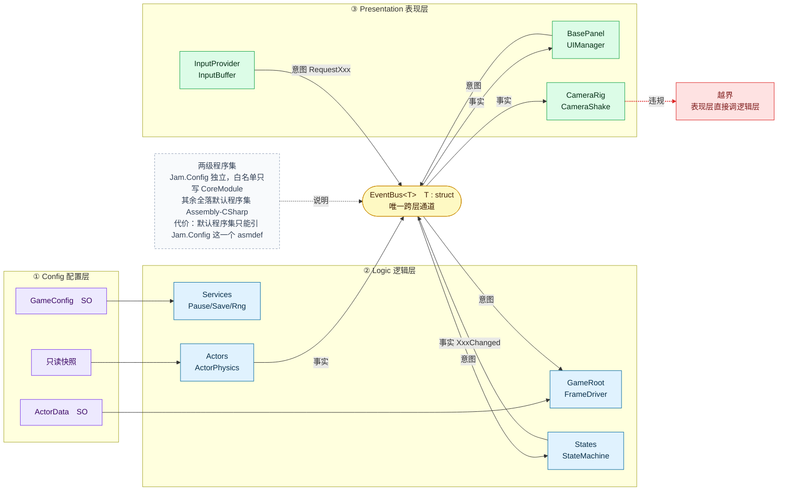
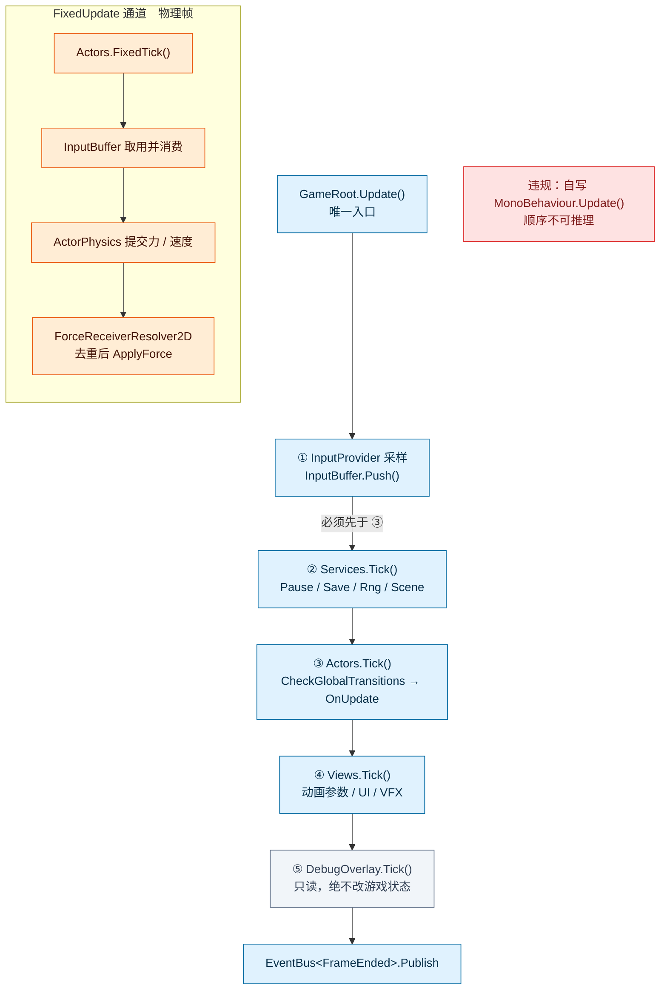
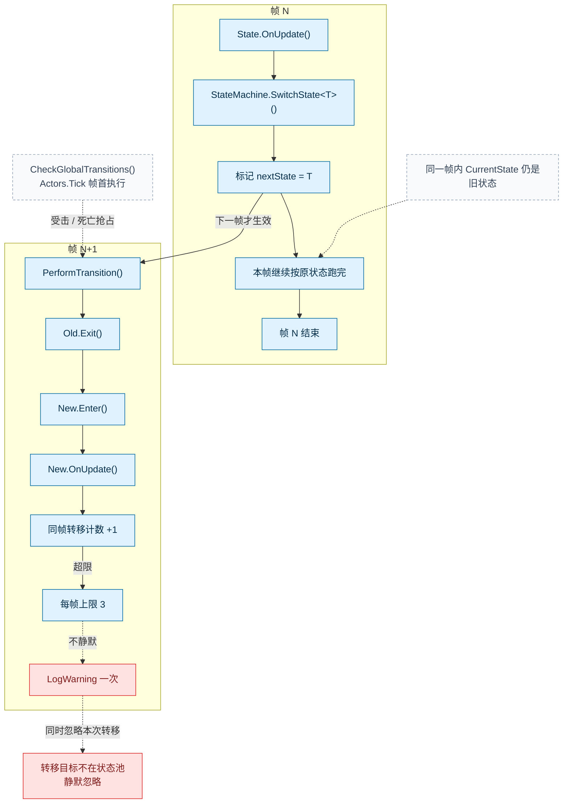
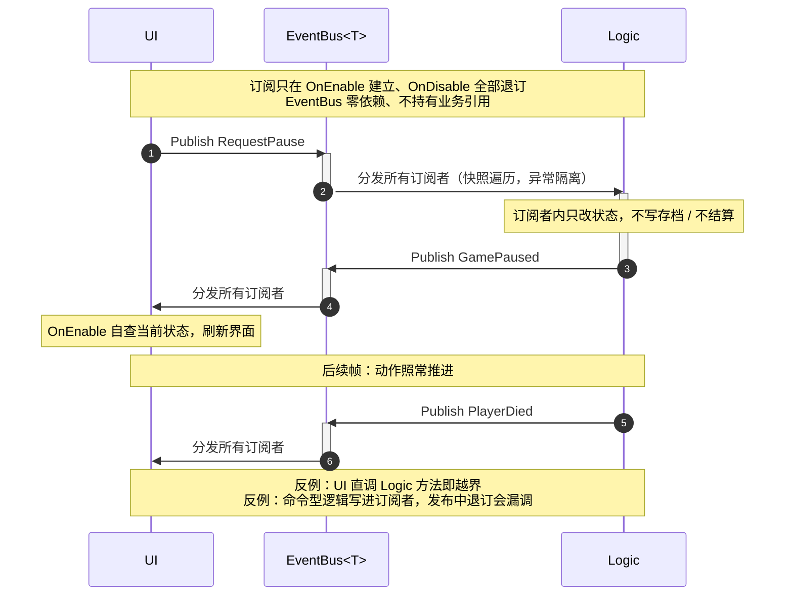
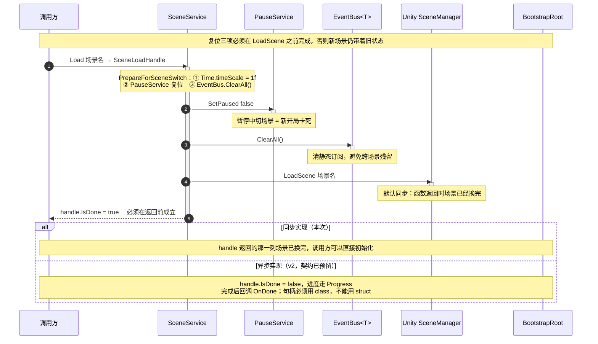
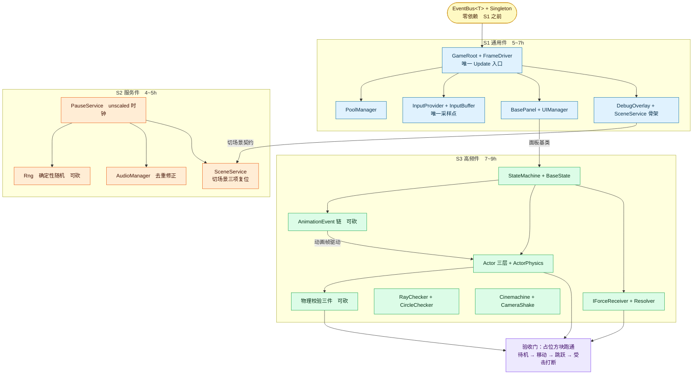

# 框架图

**重要**：**跨层只走 `EventBus<T>`**；**每帧只由 `GameRoot` 统一顺序表驱动**；**程序集只两级**。

---

## 图 1｜分层与通道



- 箭头是**依赖方向，不是调用方向**：逻辑层依赖配置层的数值，配置层不认识逻辑层。
- 表现层与逻辑层**没有直连边**——这是约束，唯一的反例是红框。
- 配置层全部只读：SO 与快照都只被读。
- `EventBus<T>` 用 `struct`：编译期查类型、无装箱、发布订阅方不共享堆引用。

---

## 图 2｜单帧执行



- 五步固定时序：条目顺序 = `tickables[]` 拖入顺序，初始化序与每帧序同源。
- `FixedUpdate` 是**独立通道**：一个渲染帧可能对应 0 或 2 个物理帧。

---

## 图 3｜状态机语义



- 上下两图是**相邻两帧**，不是并列分支；唯一的跨帧边是"标记 → 下帧 `PerformTransition`"。

---

## 图 4｜意图事件流程



- 双向共用同一条通道：不搞"上行直接调用、下行广播"两套规则。
- 意图祈使式（`RequestPause`），事实过去式（`GamePaused` / `PlayerDied`）。
- 写存档、结算、掉落这类命令型逻辑**不进订阅者**。

---

## 图 5｜切换场景



- 复位缺一不可，全部在 `LoadScene` 之前搞定。

---

## 图 6｜开发流程建议



- 箭头是硬依赖
- 攻击判定必须由动画帧事件驱动，不用计时器推断。

---

## 图 7｜每帧的调用链

> 启动一次装配，之后每帧按表驱动：没有第二种时序来源。

```text
Bootstrap
  └─ GameRoot.Awake          按序 Init 全部 IManager
  └─ 同序写入 tickables[]    初始化序 = 每帧序

每帧 Update
  ├─ InputProvider.Update      采样 InputSnapshot，按下沿累积
  ├─ InputBuffer.Push(snap)    唯一硬序：必须先于逻辑 Tick
  ├─ Services.Tick(dt)         Pause / Save / Rng / Scene
  ├─ Actors.Tick(dt)           CheckGlobalTransitions → OnUpdate
  │    └─ SwitchState<T>()     仅写 nextState，下帧 PerformTransition
  │         └─ 按需 Publish RequestXxx                       表达意图
  ├─ BasePanel.OnEnable        自查当前状态，兜住事件早于订阅
  ├─ Views.Tick(dt)            动画参数 / UI / VFX
  └─ EventBus<FrameEnded>.Publish
       └─ 订阅方回调 → Publish XxxChanged                    表达事实

每物理帧 FixedUpdate
  └─ Actors.FixedTick(fixedDt)
       ├─ InputBuffer 取用并消费
       ├─ ActorPhysics 提交力 / 速度
       └─ ForceReceiverResolver2D 去重后 ApplyForce

切场景
  └─ SceneService.Load
       └─ PrepareForSceneSwitch
            ├─ Time.timeScale = 1f
            ├─ PauseService.SetPaused(false)
            └─ EventBus.ClearAll()
       └─ LoadScene 同步装载 → handle.IsDone = true
```

---

## 重要契约

| 主题 | 契约 |
| :-- | :-- |
| 输入 | `InputProvider` 唯一采样点；快照累积进 `InputBuffer` |
| 每帧 | 只由 `GameRoot` 顺序表驱动；禁止自写 `Update()` |
| 通信 | 跨层只走 `EventBus<T>`；意图祈使式、事实过去式 |
| 配置 | 配置层只被读；`Jam.Config` 白名单只写 `CoreModule` |
| 物理字段 | 每个刚体每项只有一个写者：角色由代码从 SO 写，非角色归 Inspector |
| 状态 | `SwitchState` 只标记，同帧读到旧状态，上限 3 次 |
| 切场景 | 复位必须在 `LoadScene` 之前 |
