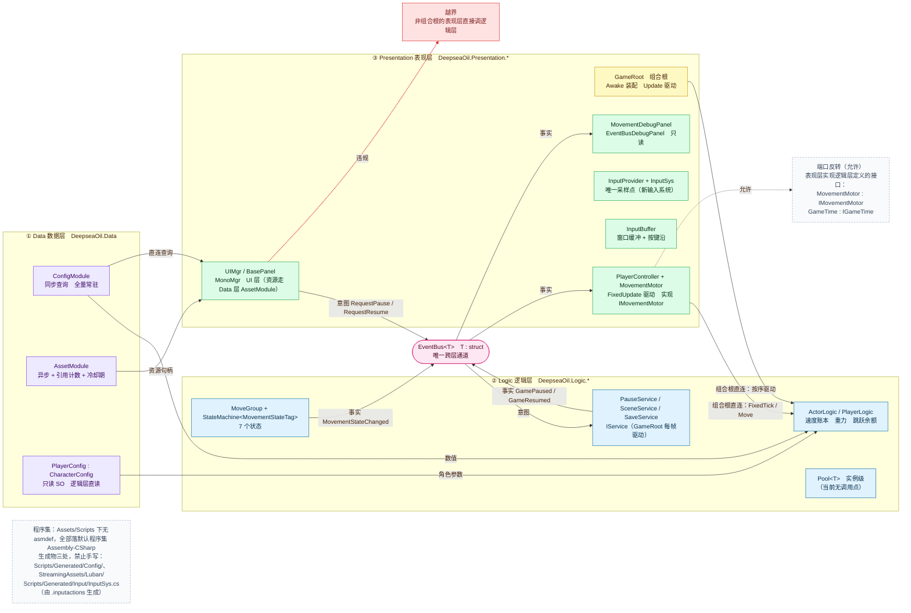
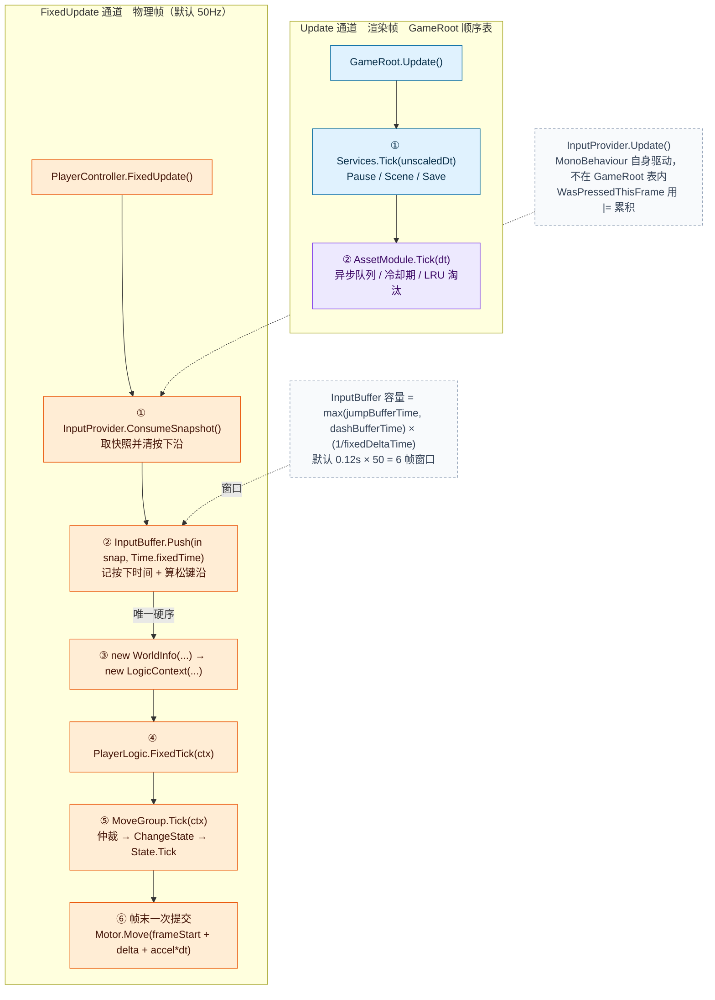

# 框架蓝图

宏观规范性文档：**分层、每帧时序、跨层契约、程序集、已知缺陷**。回答"能不能这么做"。
落到某一层的设计看 [`分层设计/`](分层设计/)；某个文件夹装什么看 [`目录说明.md`](目录说明.md)。

## 三条铁律

1. **跨层只走 `EventBus<T>`**（只服务 Logic ↔ Presentation 之间的意图/事实通知）。
   两条例外：**组合根/驱动点允许直连**（`GameRoot` → 逻辑层、`PlayerController` → `PlayerLogic`）；
   **表现层可以实现逻辑层定义的端口再注入**（`MovementMotor : IMovementMotor`、`GameTime : IGameTime`）。
2. **每帧只有三个驱动入口**：`GameRoot.Update()` 驱动 `List<IService>`（渲染帧，组合根）、
   `PlayerController.FixedUpdate()` 驱动 `PlayerLogic`（物理帧，组合根）、
   `InputProvider.Update()` 采样输入（第三处，被输入后端强制——`WasPressedThisFrame()` 只在动态更新有效）。
   渲染帧与物理帧之间**没有**先后关系：一个渲染帧可能对应 0 或 2 个物理帧。
   除此之外**不在非驱动点自写 `Update()` / `FixedUpdate()`**——顺序会不可推理。
3. **生成物专用位置有三处，禁止放手写文件**：
   `Assets/Scripts/Generated/Config/`（Luban 生成代码）、`Assets/StreamingAssets/Luban/`（Luban 生成 JSON）、
   `Assets/Scripts/Generated/Input/InputSys.cs`（由 `InputSys.inputactions` 生成，手改会被丢弃）。

> 数据（数值与资源）不走 EventBus——它是**直连查询**，不是通知。见 §1.1。

---

## 1. 分层



- 箭头是**依赖方向，不是调用方向**：逻辑层依赖数据层的数值，数据层不认识任何层。
- 表现层与逻辑层之间只有**两条组合根直连边**与一条端口反转边，其余跨层一律走 `EventBus<T>`。
  红框是唯一的越界反例：**非组合根**的表现层直接调逻辑层。
- 数据层全部只读：SO、Luban Tables、资源缓存都只被读。
- `EventBus<T>` 用 `struct`：编译期查类型、无装箱、发布订阅方不共享堆引用。

### 1.1 依赖方向

| 方向 | 允许 | 说明 |
| :-- | :-- | :-- |
| Data ← Logic | ✅ | 逻辑层直连读数值（含只读 SO）与资源句柄 |
| Data ← Presentation | ✅ | 表现层直连读，不需要绕 EventBus |
| Presentation → Logic | ⚠️ **仅组合根/驱动点** | 其它一律走 EventBus。`GameRoot` 驱动 `IService`、`PlayerController` 驱动 `PlayerLogic` 属此列 |
| Presentation ─实现─> Logic 的接口 | ✅ | 依赖反转：`MovementMotor : IMovementMotor`、`GameTime : IGameTime`，实例由组合根注入 |
| Logic → Presentation | ❌ | 唯一例外：通过 EventBus |
| Data → 任何层 | ❌ | Data 层零业务依赖 |

### 1.2 EventBus 能做什么、不能做什么

| 能做 | 不能做 |
| :-- | :-- |
| 承载 Logic ↔ Presentation 的意图（`RequestXxx`）与事实（`XxxChanged`） | 不传对象本体（struct 装不下 `UnityEngine.Object`） |
| 编译期查类型、无装箱、发布订阅方不共享堆引用 | 不承担命令-响应语义（那是**直连查询**的领域） |
| 单向广播，订阅方零依赖 | 不服务 Data 层（Data 层不发布、不订阅） |
| 订阅/退订幂等；发布用快照遍历，订阅者内增删不影响本次 | 发布**每次分配一个快照数组**（`new Action<T>[count]`）——热路径上要留意 |

### 1.3 单例

两条基类都在 `Assets/Scripts/Foundation/`，**Data 层两条都不用**：

| 基类 | 形态 | 用于 | 已知坑 |
| :-- | :-- | :-- | :-- |
| `Singleton<T> : MonoBehaviour` | 找不到就 `new GameObject` + `AddComponent`，并 `DontDestroyOnLoad` | `MonoMgr` | 反射式创建会顺带触发 `Awake`，顺序依赖要多想一步 |
| `BaseManager<T>` | 纯 C# 单例，反射取**非公开**无参构造 | `UIMgr` | 子类若只有公开构造函数，`info == null` → 只记 Error，`Instance` **永久为 null**（见 D20） |

`PauseService` / `SceneService` / `SaveService` **不是单例**：由 `GameRoot.Start()` `new` 出来放进 `List<IService>`。

---

## 2. 单帧



- 两条通道**互不嵌套**，之间没有先后关系（默认 Fixed Timestep 0.02s = 50Hz）。
  暂停时 `Time.timeScale = 0`，`FixedUpdate` 不再触发，所以暂停期间不会有 `Push`。
- **step ② `AssetModule.Tick(dt)`** 由 `GameRoot` 驱动而**不是**由 `Services` 驱动：保持 Data 层独立，
  不形成"Logic 驱动 Data 内部状态"的隐性耦合。它只处理 AssetModule 内部状态，不发布事件、不触达其他层。
  这条例外记在契约表，**不作为通用模式推广**。
- **物理帧的唯一硬序是 `InputBuffer.Push` 必须先于 `PlayerLogic.FixedTick`**——由调用顺序保证，
  **类型系统不保证**（两者之间没有编译期约束）。

### 2.1 四条 Tick 通道（事实）

| 通道 | 驱动者 | 被驱动者 | 时间源 |
| :-- | :-- | :-- | :-- |
| 渲染帧 `Update` | `GameRoot` | `List<IService>`：`PauseService` / `SceneService` / `SaveService` | `Time.unscaledDeltaTime` |
| 渲染帧 `Update` | `InputProvider`（它自己的 MonoBehaviour） | 采样 `InputSys`，用 `\|=` 累积按下沿 | 帧（`WasPressedThisFrame`） |
| 渲染帧 `Update` | `GameRoot` → `AssetModule.Tick` | `LoadScheduler` / `LifecycleMgr` | `Time.deltaTime`；冷却期读 `Time.realtimeSinceStartup` |
| 物理帧 `FixedUpdate` | `PlayerController`（组合根） | `PlayerLogic.FixedTick` → `MoveGroup.Tick` → 具体状态 → `MovementMotor.Move` | `Time.fixedTime` / `Time.fixedDeltaTime`（受 `timeScale` 影响） |

**两套 Tick 抽象并存，且都不是分发机制**：

- `IService.Tick(float unscaledDeltaTime)` —— 真的被 `GameRoot` 遍历调用。
- `ITickable.Tick(LogicContext)` / `IFixedTickable.FixedTick(LogicContext)` —— 带**默认接口实现**（空 body）。
  `ITickable` **零实现、零调用**；`IFixedTickable` 只被 `ActorLogic` 与 `PlayerController` 列在基接口里，
  **从不经接口分发**（`PlayerController` 直接调具体类型 `PlayerLogic.FixedTick`，而 `ActorLogic.FixedTick` 非虚）。

### 2.2 启动装配序（两阶段）

装配分两段，因为两组东西的时序要求不同：

```text
GameRoot.Awake           ← 阶段 1：Data 层。Unity 只保证「所有 Awake 先于任何 Start」
  ├─ ConfigModule.IsReady? 否则 InitFromStreamingAssets()   同步全量加载；失败抛 ConfigLoadException
  └─ AssetModule.IsInitialized? 否则 Init()                 建缓存表 / 调度器 / 引用计数 / 生命周期

GameRoot.Start           ← 阶段 2：表现层与逻辑层
  ├─ UIMgr.Instance.ShowPanel<BeginPanel>()    构造 UICamera / Canvas / EventSystem（DontDestroyOnLoad）
  ├─ new GameTime()                            IGameTime 的表现层实现
  ├─ new PauseService(gameTime)   ┐
  ├─ new SceneService(gameTime, pauseService)  │ 三者都不是单例
  ├─ new SaveService()            ┘
  ├─ pauseService.Init() / sceneService.Init() / saveService.Init()
  └─ services.Add(...)             顺序 = [Pause, Scene, Save] = 每帧 Tick 顺序
```

**关键约束**：

- **ConfigModule 必须先于 AssetModule**——AssetModule 的 Key 来自 Config。
- **Data 层装配放在 `Awake` 而不是 `Start`**：`Start` 的顺序在多个 MonoBehaviour 之间不确定，
  放在 `Start` 会与别的脚本的 `Start`（例如 `ConfigLoader`）抢顺序。放 `Awake` 才有确定性。
- **阶段 2 内部：初始化序 = 每帧序**（`services` 列表既是 Init 序也是 Tick 序），不允许两套顺序。
- **跨阶段不要求"初始化序 = 每帧序"**：`AssetModule` 在阶段 1 装配，却在每帧最后 Tick。这是有意的——它是依赖，不是 tickable。
- **两次守卫都是必须的**：`GameRoot` 是**场景对象**（没有 `DontDestroyOnLoad`），而 Data 层是**进程级常驻**。
  "重开本关""从关卡 A 进关卡 B"会二次进入场景，撞上第一次留下的状态：
  `ConfigModule.Init` 重复调用会抛（无重置入口，见 O10），所以必须先问 `IsReady`；
  `AssetModule` 侧相反——它在 `OnDestroy` 里被 `Dispose` 过，再 `Init` 合法，守卫只为防同一帧出现第二个 `GameRoot`。
  `OnDestroy` 里靠 `_dataLayerOwner` 判断归属，否则叠加场景里第二个 `GameRoot` 被销毁时会清掉第一个还在用的缓存。

---

## 3. 判层依据

**判定层的依据是命名空间，不是目录。** 目录现在按同一套分层组织，所以两者一致（详见 [`目录说明.md`](目录说明.md)）。

| 命名空间 | 目录 | 代表类型 | 层 |
| :-- | :-- | :-- | :-- |
| `DeepseaOil.Data` | `Scripts/Data/` | `ConfigModule`、`AssetModule`、`DataMetrics`、`TablesMeta`、`PlayerConfig` | **Data** |
| `DeepseaOil.Logic` | `Scripts/Logic/` | `ActorLogic`、`WorldInfo`、`LogicContext`、`ITickable` | Logic |
| `DeepseaOil.Logic.Movement[.States]` | `Scripts/Logic/Movement/` | `IMovementMotor`、`MovementStateTag`、7 个状态 | Logic |
| `DeepseaOil.Logic.Player` | `Scripts/Logic/Player/` | `PlayerLogic`、`MoveGroup` | Logic |
| `DeepseaOil.Logic.Movement` | `Scripts/Logic/Movement/` | `StateMachine<T>`、`IState<T>`、`StateBase<T>`、`TimedStateBase<T>` | Logic |
| `DeepseaOil.Logic.Input` | `Scripts/Logic/Input/` | `InputSnapshot`、`InputBuffer` | Logic |
| `DeepseaOil.Logic.Events` | `Scripts/Logic/Event/` | `EventBus<T>`、`RequestPause`、`GamePaused`… | **通道**（不是层） |
| `DeepseaOil.Logic.Service` | `Scripts/Logic/Services/` | `IService`（声明在 `PauseService.cs` 里）、`IGameTime`、`IAudioService`、三个 Service | Logic |
| `DeepseaOil.Presentation[.UI]` | `Scripts/Presentation/` | `GameRoot`、`PlayerController`、`MovementMotor`、`InputProvider`、`GameTime`、`UIMgr`、`BasePanel`、`MonoMgr` | Presentation |
| `DeepseaOil.Foundation` | `Scripts/Foundation/` | `Singleton<T>`、`BaseManager<T>`、`Pool<T>` | ⚠️ **不是层**：与游戏无关的地基 |
| `cfg` / `cfg.demo` / `DeepseaOil.Generated` | `Scripts/Generated/` | Luban 生成物、`InputSys` | ⚠️ **不是层**：机器生成 |
| `DeepseaOil.EditorTools[.Tests]` / `DeepseaOil.Tests` | `Editor/`、`Tests/` | 导表工具与测试 | ⚠️ 独立程序集 |

---

## 4. 重要契约

| 主题 | 契约 |
| :-- | :-- |
| 输入后端 | 新输入系统（`com.unity.inputsystem` 1.14.2，`activeInputHandler: 1`）；动作表是 `InputSys.inputactions`；**不要用 `UnityEngine.Input`**——工程设置已禁用它，调用会抛 |
| 输入 | `InputProvider` 是唯一**采样**点；`InputBuffer` 是唯一**按键沿存储**点；同一物理帧内 `Push` 必须先于 `PlayerLogic.FixedTick` |
| 每帧 | 驱动入口共**三处**：`GameRoot.Update`（`List<IService>` ＋ `AssetModule.Tick`）、`PlayerController.FixedUpdate`（`PlayerLogic`）、`InputProvider.Update`（采样）；`MonoMgr` 的三个转发是基础设施、不算入口 |
| 通信 | Logic ↔ Presentation 只走 `EventBus<T>`；意图祈使式、事实过去式 |
| 跨层直连 | 只允许组合根/驱动点（`GameRoot`、`PlayerController`），以及表现层实现逻辑层端口（`IMovementMotor`/`IGameTime`） |
| EventBus 定位 | 只服务跨层事件通知；不承担命令-响应；不传对象本体；发布每次分配一个快照数组 |
| 单例 | 两条基类都在 `Foundation/`（`Singleton<T>` 给 `MonoMgr`、`BaseManager<T>` 给 `UIMgr`）；三个 Service 不是单例 |
| Data 层 | 被所有层直连；只读；查询式；进程级常驻；不走 EventBus |
| ConfigModule | 同步；全量常驻；无释放；启动时装配；**重复 `Init` 抛异常** |
| AssetModule | 异步 `LoadAsync<T>` ＋ 同步 `Load<T>`；引用计数；冷却期缓存 60s；并发 4；LRU 淘汰上限 100 条；每帧 Tick |
| AssetModule.Tick | `GameRoot.Update` 顺序表第 ② 步；Data 层唯一被允许的主动行为；只处理内部状态 |
| Config ↔ Asset | 零依赖；通过字符串 Key 衔接；调用方是衔接点 |
| 资源 Key | 表里存「相对 `Assets/` 带扩展名」；`Resources.LoadAsync` 用「相对 `Assets/Resources/` 不带扩展名」；转换点只有 `AssetRegistry.ResolvePath`；⚠️ 表值还**必须落在 `Assets/Resources/` 下**才可加载（见 D4） |
| AsyncHandle | 必须是 `class`；`Complete` 只在主线程调用；不传 `RunContinuationsAsynchronously`（续体在 `AssetModule.Tick` 里**内联**执行）；二次完成不抛异常 |
| 配置源 | 两条并存，各自服务不同的东西：数值走 Luban/xlsx（经 `ConfigModule`）；角色参数走 SO（`PlayerConfig`，**不经 `ConfigModule`**） |
| 物理字段 | 每刚体每项唯一写者：角色由代码从 SO 写，非角色归 Inspector |
| 状态 | `ChangeState` **立即** `Exit → Enter`，同帧生效；"该不该切"由 `MoveGroup` 两段仲裁；未注册标签返回 false |
| 切场景 | 复位四项：`Time.timeScale` / `PauseService` / `EventBus.ClearAll` / `AssetModule.OnSceneSwitch`，全部在 `LoadScene` 之前。⚠️ `SceneService.Load` 目前无调用点（D9） |
| 程序集 | Jam 期不给生成物划 asmdef；`Assets/Scripts/**` 全部落 `Assembly-CSharp` |
| 生成物位置 | 三处禁放手写（见铁律 3） |
| 测试程序集 | asmdef **无法**引用 `Assembly-CSharp`；要测 `Assets/Scripts/` 必须放 `Assets/Tests/Runtime/Editor/`（无 asmdef，靠 `Editor` 目录名落 `Assembly-CSharp-Editor`） |
| 平台 | Jam 期只支持桌面端；Android/WebGL 需要异步启动改造 |
| 观测 | 拉模型：`DataMetrics.GetSnapshot()`；不推送事件、不走 EventBus |
| 面板顺序 | 由 `ui/Canvas.prefab` 四个子节点（`Bottom`/`Middle`/`Top`/`System`）的兄弟顺序决定；**没有** `sortingOrder`；`UIMgr.ShowPanel` 默认 `Middle`。⚠️ 同层内的顺序无处表达（D28） |

---

## 5. 程序集与平台

### 5.1 程序集（事实）

| 程序集 | 内容 | 引用 | 平台 |
| :-- | :-- | :-- | :-- |
| `Assembly-CSharp` | `Scripts/` 下全部（含生成物） | 自动引用 `Luban.Runtime` | 默认 |
| `Assembly-CSharp-Editor` | `Assets/Tests/Runtime/Editor/` | 自动引用 `Assembly-CSharp` ＋ NUnit | Editor |
| `Luban.Runtime.asmdef` | `Assets/Luban.Runtime/` | 无；**`allowUnsafeCode: true`**（`ByteBuf` 需要） | 全平台 |
| `DeepseaOil.EditorTools.asmdef` | `Assets/Editor/` | — | Editor |
| `DeepseaOil.EditorTools.Tests.asmdef` | `Assets/Tests/Tools/` | 只引 `DeepseaOil.EditorTools`（**按名字引用**）；`autoReferenced: false`；`UNITY_INCLUDE_TESTS` | Editor |

**决定：Jam 期不给生成物划 asmdef。** 生成的 `cfg` 代码与手写框架代码同处默认程序集，直接互相引用。
划独立程序集的收益是**热更隔离**与**编译增量**，两者在 Jam 期都用不上；代价是多一层引用配置、
且 Luban 输出目录与 asmdef 必须成对维护。

> 🔴 **不要装 Luban 的 UPM 包**：本地拷贝与 UPM 包的 asmdef 都叫 `Luban.Runtime`，撞名会导致
> **整个工程所有程序集都编译不出来**。

### 5.2 平台假设

| 平台 | 状态 | 说明 |
| :-- | :-- | :-- |
| Windows / macOS / Linux | ✅ 支持 | `ConfigModule.Init` 在 `Awake` 同步读 `StreamingAssets` |
| Android / WebGL | ❌ 不支持 | `StreamingAssets` 在包内，`File.ReadAllText` 读不到，必须改 `UnityWebRequest`（异步）——那会让 Init 变异步，**牵动整条启动链** |

---

## 6. 缺陷登记

本节**只登记、不修复**。修与不修是独立决策，需要时按编号单独开工。每条都给了 `file:line` 便于复验。
凡标 ⚠️ 的是"机制已证实、运行后果未实测"。✅ 标记的是已消除项，保留编号以免引用悬空。

### 6.1 会影响运行结果的

| # | 缺陷 | 证据 | 影响 |
| :-- | :-- | :-- | :-- |
| **D1** | ✅ **已修** 重力被施加两次 | `Physics2DSettings.asset` `m_Gravity = (0, -9.81)` × `SampleScene.unity` Player 的 `m_GravityScale`。已把 `gravityScale` 改为 **0**，唯一写者回到逻辑层 | — |
| **D2** | **上升期贴墙按跳无效** | `MoveGroup.cs:92` 空中且贴墙时跳过整支通用跳；唯一蹬墙跳触发点在 `WallSlideState.cs:33`，而 `WallSlide` 只能经 `GetFallBackState`（`MoveGroup.cs:142`）进入；`JumpState.cs:33` / `DoubleJumpState.cs:34` 只在 `Velocity.y <= 0` 时 `IsDone` | 上升期按跳什么都不发生，要等下降进入 `WallSlide`。`jumpBufferTime` 默认 0.12s，而默认参数下上升耗时 0.35s → 缓冲必过期 |
| **D3** | **`Assets/ConfigAssets/玩家配置.asset` 的实测值与代码默认矛盾** | `moveAcceleration: 5`（`CharacterConfig.cs` 默认 60）→ `ActorLogic.ApproachX` 每帧最多变 ±0.1 | 水平加速要约 2 秒才到 `moveSpeed`。像是调试时改过没改回来 |
| **D4** | 表里的资源路径**只校验存在，不校验在 `Resources/` 下** | `#path=unity` 只校验文件在 `Assets/` 下存在。当前表值（`Resources\Icons\sardline.png`）**合规**，但盲区还在 | "让图标不存在在策划改表时暴露"只兑现了一半：**存在但不在 `Resources/` 下**要到运行时才暴露（历史值 `Settings/Renderer2D.asset` 就是这种）。修法：导表期加一条校验 |
| **D28** | **`UIMgr` 无法控制同一层内的面板顺序** | 全 `Assets/Scripts/**` 内**没有任何** `SetSiblingIndex` / `SetAsLastSibling` / `SetAsFirstSibling` 调用；`ShowPanel` 对已加载面板只做 `SetActive(true)` ＋ `ShowMe()`，**不调整兄弟顺序**；而层内渲染顺序完全由 `Canvas` 子节点兄弟顺序决定 | 同一 `E_UILayer` 下两个面板谁在上，取决于**实例化历史**。⚠️ 机制已证实，运行后果需 ≥2 个同层面板才显现——当前只有 `BeginPanel` 一个面板，故**未实测**。修法建议：`ShowPanel` 里补 `panelObj.transform.SetAsLastSibling()`（"最近显示的在上"），代价一行，不需要嵌套 `Canvas` |

### 6.2 死代码与无人调用（不影响当前运行，但会误导）

| # | 缺陷 | 证据 |
| :-- | :-- | :-- |
| **D5** | ✅ **已消除** `ResMgr.LoadAsync<T>` 末尾无条件再启一次协程 | `ResMgr.cs` 已随 UI 迁移到 `AssetModule` 整体删除 |
| **D6** | ✅ **已消除** `ResMgr.UnloadAsset` 对 prefab 用 `Resources.UnloadAsset` | 同上 |
| **D7** | `UIMgr.ShowPanel` 的 `isSync` 参数**仍然**未被使用 | 方法体走异步路径。**刻意不实现**：默认值 `true`，照做会让 `GameRoot` 唯一的 `ShowPanel` 走同步，异步链路就永远跑不到。要么把默认值改成 `false` 再实现，要么删掉这个参数 |
| **D8** | `SaveService` 是空实现 | `SaveService.cs` 的 `Save(GameData)` 从不给 `_data` 赋值，`Load()` 永远返回 `default`；而它仍被 `GameRoot` 当活服务每帧 Tick |
| **D9** | `SceneService.Load` **没有调用点** | 全仓库只有定义。于是 `EventBus.ClearAll()` 与复位四项从不在运行时执行 |
| **D10** | `IService.Dispose` 无人调用 | 全 `Assets` 没有 `.Dispose()` 调用点 → `PauseService.Dispose` 不跑，`Init` 里注册的两个静态订阅不会被摘掉。`PauseService.Reset()` 同样零调用 |
| **D12** | `BeginPanel` 按钮语义反了 ＋ 死协程 | `BeginPanel.cs` 的 `"StartBtn"` 发 `RequestPause`（"开始"= `timeScale = 0`）；`"ContinueBtn"` 发 `RequestResume`。`ShowTip()` 是 `IEnumerator` 但**没有任何 `StartCoroutine`** |
| **D13** | `EventBusDebugPanel` 永久为空 | `DebugEvent` 只有声明 ＋ 订阅/退订，**全仓库无人 `Publish`**；`if (_logLines.Length == 0) return;` 对 `new string[32]` 永远为假；该组件也不在任何场景里 |
| **D14** | 零调用点清单 | `Pool<T>`/`PoolInClass<T>`/`PoolInMono<T>`、`IAudioService` ＋ `audioType`、`TimeContext`、`InputSnapshot.Empty`、`EventBus<T>.HandlerCount`、`InputBuffer.GetMove()`/`Capacity`/`RequestedSeconds`/`SampleRatePerSecond`/`EffectiveSeconds`、`InputType.Attack`、`IGameTime.UnscaledDeltaTime`/`TimeScale`、`InputSys` 的整个 `UI` 映射与 `Dispose()` |
| **D15** | `EventBus` 注册表存了委托却从不调用 | `EventBus.cs` 的 `ClearActions.Add(type, () => ClearByType(type))`，但 `ClearAll` 只遍历 `Keys` 并直接调 `ClearByType` → 那些闭包是纯冗余分配 |
| **D16** | `PlayerController` 暂停时重复 `Clear()` | `PlayerController.cs:49` 调 `inputProvider.Clear()`，`:50` 的 `SetInputEnabled(false)` 内部又调一次 |

### 6.3 结构 / 规范问题

| # | 问题 | 证据 |
| :-- | :-- | :-- |
| **D17** | ✅ **已消除** 全局命名空间类型 | `Singleton<T>`/`BaseManager<T>` → `DeepseaOil.Foundation`；`SceneService` → `DeepseaOil.Logic.Service` |
| **D18** | 订阅/退订时机三种写法并存 | `PauseService` 用 `Init`/`Dispose`；`PlayerController` 用 `OnEnable`/`OnDisable`；`MovementDebugPanel` 用 `Start`/`OnDestroy`——**失活（不销毁）会留下静态订阅** |
| **D19** | ✅ **已消除** 两个文件是 GBK 编码 | `Singleton.cs` / `BaseManager.cs` 已转 UTF-8 with BOM；全仓库 `.cs` 编码统一 |
| **D20** | `BaseManager<T>` 只认**非公开**无参构造 | 用 `BindingFlags.Instance \| BindingFlags.NonPublic`；子类若只有公开构造函数，`info == null` → 只 `LogError`，`Instance` **永久为 null**（不重试、不抛） |
| **D21** | `EventBus.cs` 两处 XML 文档闭合标签写坏 | `订阅事件，幂等m/summary>`、`发布事件，异常隔离/summary>`——缺 `<` |
| **D22** | ✅ **已修** `Dasuus.Presentation` 残留 | 旧命名空间残留已清（`IMovementMotor.cs`、`EventBusDebugPanel.cs`） |
| **D23** | ✅ **已修** 引用不存在的文档 | 旧代码注释引用 `Docs/M1微规划.md`（5 处）、`Docs/架构约束.md`（3 处）、`Docs/速度设计.md`（2 处）；这三份文件**从未在任何提交里存在过**。这些注释里的约束已收进 [`分层设计/逻辑层.md`](分层设计/逻辑层.md)，引用一并改指 |
| **D24** | `Framework/` 下曾几乎每个文件都带未使用的 `using` | 已随目录重组清掉重复 `using`；无害，但会掩盖真正需要的引用 |
| **D25** | `PlayerController` 的 `InputBuffer` 采样率在 `Awake` 固定 | 用当时的 `Time.fixedDeltaTime` 把时间窗换成帧数；之后改工程的 Fixed Timestep（`TimeManager.asset` = 0.02）会让 `EffectiveSeconds` 与实际窗口不一致 |
| **D26** | ✅ **已修** `BasePanel` 的组件白名单用**精确名字**匹配，漏掉 Unity 自动加序号的重名子物体 | 修法：在 `TMP_Text` 之后加 `else if (component is Graphic)` 静默分支——**只改日志，不改 `components` 字典的注册行为**。`Toggle`/`Slider`/`Dropdown`/`InputField`/`ScrollRect` 都不是 `Graphic`，仍会落到 `else` 告警 |
| **D27** | ✅ **已修** 测试没声明「预期错误日志」，被 UTF 判为失败 | Unity Test Framework 默认把测试期间的 `LogType.Error` 判为 `Unhandled log message` 并使**测试**失败（Warning 不触发）。这是**测试**的缺陷，不是产品的 |

### 6.4 开放项（常量与局部实现，改一行可调）

| # | 开放项 | 当前值 | 备注 |
| :-- | :-- | :-- | :-- |
| O1 | `COOLDOWN_SECONDS` | 60s | 实操后调整 |
| O2 | `MAX_CACHE_ENTRIES` | 100 | 条目数，不是内存量 |
| O3 | `MAX_CONCURRENT_LOAD` | 4 | — |
| O4 | `MAX_EVICT_PER_TICK` | 8 | 防卡帧 |
| O5 | 降级资源的具体内容 | 由业务注册 | Data 层不创建资源 |
| O6 | DataMetrics 快照刷新频率 | 每帧拉一次 | 消费方决定 |
| O7 | 延时重试（0.5s） | **未采纳** | 需要时改 `LoadScheduler.HandleFailure` |
| O8 | `AssetKey` 强类型 | 未引入 | 当前用 string |
| O9 | 平台分支（Android/WebGL 异步启动） | 未支持 | 见 §5.2 |
| O10 | `ConfigModule` 的重置入口 | **缺失** | `Init` 重复调用会抛，而它没有 `Shutdown`／`Reset`。测试只能靠 `IsReady` 守卫；"回主菜单重开"也需要它 |
| O11 | `LoadScheduler.Tick(float dt)` 的 `dt` | 未使用 | 将来做超时或延时重试才用得上 |
| O12 | `LifecycleMgr._cooldownSeconds` | 赋值未读 | 冷却期实际读的是 `CacheEntry.cooldownUntil`；该字段冗余 |
| O13 | `Preload` 的类型过滤语义 | 待澄清 | 用 `typeof(UnityEngine.Object)` 加载，`TryGet<Sprite>` 是否命中取决于条目里的真实类型，不取决于请求类型 |

### 6.5 待验证项

| # | 项 | 归属 | 验证方法 |
| :-- | :-- | :-- | :-- |
| 1 | `Resources.LoadAsync(path, typeof(UnityEngine.Object))` 的类型过滤 | `AssetModule.Preload` | EditMode：`Preload` 后 `TryGet<GameObject>` |
| 2 | `AsyncHandle.Completed` 的 GC 开销 | `AssetModule.LoadAsync` | Profiler ▸ GC Alloc，命中/未命中各 1000 次 |
| 3 | `Resources.UnloadUnusedAssets` 的帧尖峰 | `LifecycleMgr.EvictLRU` | Profiler ▸ 缓存 100 条时淘汰一帧的耗时 |
| 4 | URP 下占位 Sprite 的构造方式 | 业务侧 `RegisterFallback` | `Sprite.Create` + `Texture2D` 在 URP 2D 下的显示 |
| 5 | Android / WebGL 的 StreamingAssets 异步读取 | `TablesHolder` | 真机 `UnityWebRequest` 路径 |
| 6 | `Assets/Tests/Runtime/Editor/` 里的测试能否直测 Data 层的 `internal` 类型 | 测试粒度 | 目前只能用 public API 测（`AssetRegistry`/`CacheStore`/`LifecycleMgr`/`RefCounter` 都是 `internal`）。要直测得加 `InternalsVisibleTo` 或改可见性——两条都要先动设计 |
