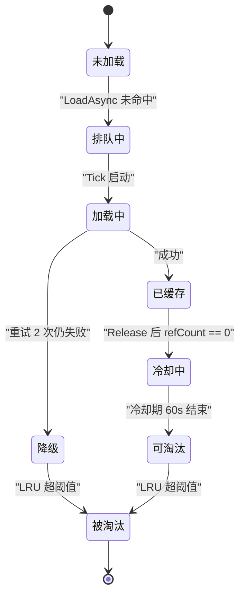

# 数据层

只读内容提供者，被逻辑层与表现层**直连查询**，不走 `EventBus`；进程级常驻，`GameRoot.Awake` 装配、`GameRoot.OnDestroy` 释放。`Assets/Scripts/Data/`，命名空间 `DeepseaOil.Data`。

| 微块 | 目录 | API 入口 |
| :-- | :-- | :-- |
| **① ConfigModule** 数值配置查询（同步） | `Data/Config/` | `ConfigModule.GetWeapon/GetItem/GetFish/GetAllWeapons`；`ConfigModule.Tables`（逃生舱） |
| **①′ SpecCatalog** 表行 → 纯结构体的唯一折算点 | `Data/Config/` | `SpecCatalog.Ball/TileState/Enemy/Player/Wave/TileInitials`（另有 `AllBalls` / `AllTileStates`） |
| **①″ EnemyCharacterFactory** 敌人数值 → `CharacterConfig` | `Data/Config/` | `EnemyCharacterFactory.Build(in EnemySpec)`（按种类缓存） |
| **② AssetModule** 资源查询与生命周期（异步 ＋ 同步窄路） | `Data/Asset/` | `AssetModule.Init/Tick/OnSceneSwitch/Dispose`、`LoadAsync/Load/TryGet/Release/Preload/RegisterFallback` |
| **③ DataMetrics** 可观测性表面（拉模型） | `Data/Metrics/` | `DataMetrics.GetSnapshot` |
| `BaseConfig` / `CharacterConfig` / `PlayerConfig` / `ThrowTuning`：SO 数值类型（**不经 ConfigModule**） | `Data/Settings/` | 玩家配置由 `PlayerController` 的 `[SerializeField] PlayerConfig config` 绑定；`ThrowTuning` 走 `AssetModule.Load`（`tuning/ThrowTuning`） |

**三条硬边界**：① 不继承 `Singleton<T>`，用 `static class` ＋ 显式 `Init`（顺序必须确定，Config 先于 Asset）；② 不订阅、不发布 `EventBus` 事件，完成经 `AsyncHandle` 传递；③ 唯一主动行为是 `AssetModule.Tick`，只处理内部状态（队列 / 冷却期 / LRU）。

## 1. ConfigModule 契约

```csharp
public static bool IsReady { get; }
public static void Init(string jsonRoot);
public static void InitFromStreamingAssets();
public static cfg.demo.Weapon GetWeapon(int id);   // 另有 GetItem / GetFish
public static IReadOnlyList<cfg.demo.Weapon> GetAllWeapons();
public static cfg.Tables Tables { get; }           // 逃生舱，不得跨帧持有
```

只持有并暴露 Luban 生成的 `cfg.Tables`（生成目标 `cs-simple-json`，命名空间 `cfg` / `cfg.demo`，表访问器 `Tb*` 有 `Get` / `DataMap` / `DataList` / `ResolveRef`，外键生成 `Xxx_Ref` 字段）；**不解析 Excel、不做数值计算、不缓存查询结果、不感知资源**。查询直接转发 `Tables.TbWeapon.Get(id)`。

**重复 `Init` 抛 `InvalidOperationException`**，没有 `Shutdown`／`Reset`（O10）。`Init` 把失败统一包成 `ConfigLoadException` 抛出。

表数量没有生成属性：手写清单 `Data/Config/TablesMeta.cs` 的 `Names` 数组（**加表后同步一行**，当前 **9** 条），`DataMetrics.TableCount` 与 `StartupValidator` 都读它。

### 1.1 SpecCatalog：表行 → 纯结构体

`ConfigModule` 暴露的是 Luban 生成类（`cfg.demo.*`，字段名 `PascalCase`、JSON 键 `snake_case`）。让消费者直接读 `Tables.TbXxx` 会让"表里加一列"的影响面 = 所有读它的地方，所以中间加一层：

| 结构体 | 来自表 | 喂给谁 |
| :-- | :-- | :-- |
| `BallSpec`（＋`ThrowSpec`） | `projectile` | `ThrowController`（建球 / 射程）、`LandingResolver`（球效果与落地环）、`GridLogic.OnBallHit`（目标状态） |
| `TileStateSpec` | `tile_state` | `GridLogic`（进入冲击的伤害 / 击退）、`MudTileState`（减速系数 / 时长） |
| `EnemySpec` | `enemy` | `EnemyLogic`（追击 / 禁足）、`EnemyActor`（半径 / 耐久 / 闪烁）、`WaveDirector` |
| `PlayerSpec` | `player` | `PlayerHealth`（血量 / 无敌帧）、`PlayerHealthController`（接触伤害 / 击退 / 接触半径）、`ThrowController`（攻击间隔） |
| `WaveSpec` | `wave` | `WaveLogic` |
| `TileInitialSpec` | `tile_initial` | `GridLogic.LoadInitialStates`（**当前 0 行数据** ⇒ 无初始状态） |

**两条实现约定**：①**不做缓存** —— 表是进程级常驻只读对象，一次查询就是一次字典查找 ＋ 造一个值类型，缓存反而要多维护一份状态；②**不吞行缺失** —— `TbXxx.Get` 在键不存在时抛 `KeyNotFoundException`，这里不 catch：表里少一行属于配置事故，应该在启动时炸出来，而不是让敌人以速度 0 待机。

### 1.2 SO 侧：`ThrowTuning`

程序调参（观感与冲量）走 SO：`Assets/Resources/tuning/ThrowTuning.asset`，15 个 float 字段（出手抬高量 / 相机平面深度 / 球与阴影半径 / 阴影收缩 / 贴地偏移 / 瞄准环半径与压扁 / 环线宽 / 冲量半径与强度 / 质量下限 / 查询余量 / 落地环时长）。

- 经 `AssetModule.Load<ThrowTuning>("tuning/ThrowTuning")`（同步窄路）取；**缺失时不是错误**：`ThrowTuning.LoadOrDefault()` 返回一份字段默认值的实例 ＋ 一条 Warning ⇒"忘了接资产"的表现是"有一份能跑的默认手感"，而不是一堆 0 导致的静默异常。
- 与 `ConfigModule` 的口径差异（"带病数据不进运行时" vs "缺资产用默认值"）是有意的：这份数据不参与判定，只影响观感与手感。
- 颜色与排序层**不在**这里：它们是渲染约定，留在代码（`Presentation/Visual/RenderOrder.cs`、`CombatPalette.cs`），避免"同一个颜色有两个来源"。

## 2. AssetModule 契约

`Load<T>` 同步窄路只为体量小、必须当场拿到的资源开（`UIMgr` 构造 UI 三件套：要在构造函数里立刻 `Instantiate`）；命中缓存 → `Retain`，未命中 → `Resources.Load<T>` → `Put` → `Retain`，失败取降级、**不重试**。面板与场景级资源仍只走 `LoadAsync`。

`AsyncHandle<T>`：`sealed class`（**不能是 struct**——跨帧持有）；`Complete` **必须**主线程调用；**不用** `RunContinuationsAsynchronously`，续体在 `AssetModule.Tick` 内**内联**执行，故 `UIMgr` 用协程轮询 `IsDone`。

**CacheEntry 状态机**——六个字段：`asset` / `refCount` / `lastAccessTime` / `isPreloaded` / `cooldownUntil` / `canEvict`；`refCount == 0` **不等于**立即卸载。



| 子机制 | 规则 |
| :-- | :-- |
| `LoadScheduler` | `_loadingCount` ＋ `Queue<LoadRequest>`，`while (queue.Count > 0 && _loadingCount < maxConcurrent)`；`MAX_CONCURRENT_LOAD = 4`；`MAX_RETRY = 2` 且**立即重新入队**；完成后 `IsTypeMatch` 判定，不匹配按失败处理 |
| `LifecycleMgr` | `COOLDOWN_SECONDS = 60f`；`refCount == 0 && !isPreloaded && !canEvict && now >= cooldownUntil` → `canEvict = true`；条目数 > `MAX_CACHE_ENTRIES = 100` 时按 `lastAccessTime` 升序淘汰 `canEvict && !isPreloaded`；单帧最多 `MAX_EVICT_PER_TICK = 8` 条；`isPreloaded` 永不被淘汰；本轮有淘汰则调一次 `Resources.UnloadUnusedAssets()` |
| `FailureHandler` | **不参与重试**；降级资源由业务注册，Data 层不创建 Unity 资源；记录 `_failedCount` ＋ 最近 `MAX_RECENT_RECORDS = 32` 条 ＋ `Debug.LogError` |
| `CacheStore` / `RefCounter` | `Dictionary<string, CacheEntry>`，**主线程独占无锁**，遍历中不得增删；`refCount` 是**调用方持有数**（只有加载成功 +1、只有 `Release` −1） |

**主路径**：命中缓存 `refCount++` 返回**已完成**句柄；未命中查 pending 合并列表，已有则挂回调不重复入队。加载成功严格按 `Put` → `Retain` → **最后** `Complete`（调用方可能立即 `TryGet`/`Release`）。失败重试耗尽 → `RecordFailure` → `Complete(fallback)`。`TryGet` 只更新 `lastAccessTime`、**不改**引用计数；`Release` 未知 Key / 多调只 `LogWarning`；空 Key 返回 `Completed(null)`。`isPreloaded` 常驻，Retain/Release 对它 no-op。同 Key 不同类型合并为同一请求（Jam 期假设「同路径即同类型」）。

**生命周期**：装配在 `GameRoot.Awake` 阶段 1；每帧 `GameRoot.Update` 第 ② 步 `Tick(dt)` → `LoadScheduler.Tick` ＋ `LifecycleMgr.Tick`；切场景由 `SceneService.Load` 在 `LoadScene` 前调 `OnSceneSwitch()`（清非预加载条目的冷却期、保留 `isPreloaded`、不强制释放 `refCount > 0`）；`GameRoot.OnDestroy` 调 `Dispose()`（清队列 / 缓存 / 合并列表，**不**调 `UnloadUnusedAssets`）。

## 3. DataMetrics 与协作

`GetSnapshot()` 返回只读快照，`struct` 值语义；未 Init 时返回零值。字段只增不删：`ConfigReady`、`TableCount`、`CachedAssetCount`、`LoadingCount` / `QueuedCount`、`CompletedCount` / `FailedCount` / `EvictedCount`、`CacheHits` / `CacheMisses`、`CacheHitRate`（`Hits / (Hits + Misses)`，无访问时为 0）。

ConfigModule 与 AssetModule **零类型依赖**、不互相调用（衔接由调用方完成）；`AssetModule` 只收字符串 Key，**不知道 Luban 存在**。链路：`ConfigModule.GetWeapon(id)` → 取 `weapon.Icon` → `AssetModule.LoadAsync<Sprite>(key)` → `AssetModule.Release(key)`。

## 4. 资源 Key 契约

| 语境 | 基准目录 | 扩展名 |
| :-- | :-- | :-- |
| **配置表里写的** | `Assets/` | **有**（`.png` / `.asset`），Luban `#path=unity` ＋ `pathValidator.rootDir = Assets` 在**导表期**校验存在 |
| **`Resources.LoadAsync` 要的** | `Assets/Resources/` | **无**，运行时由 `AssetRegistry.ResolvePath` 转换 |

转换规则：先统一分隔符，再去掉前缀 `Assets/Resources/`（或 `Resources/`），最后去掉扩展名——`"Assets/Resources/Icons/sardline.png"` 与 `"Resources\Icons\sardline.png"` 都得 `"Icons/sardline"`。

⚠️ **盲区（D4）**：`#path=unity` 只校验「文件在 `Assets/` 下存在」，**不校验在 `Assets/Resources/` 下**——两者不一致时**导表期通过、运行时降级为 fallback / null**。当前表值 `Resources\Icons\sardline.png` 合规；可加载资源当前有 `ui/{Canvas,EventSystem,UICamera}.prefab`、`ui/Panel/{BeginPanel,PausePanel,SettingPanel,ExitConfirmPanel,HudPanel}.prefab`、`effects/{HitSpark,MudSplash}.prefab`、`config/AudioConfig.asset`、`tuning/ThrowTuning.asset`、`Icons/sardline.png`、`demo/Square.png`、`audio/{Jump.wav,bgm…mp3}`。切 Addressables 时只改 `AssetRegistry.ResolvePath` 一个方法。

## 5. 常量

| 常量 | 值 | 位置 |
| :-- | :-- | :-- |
| `COOLDOWN_SECONDS` | 60f | `Data/Asset/AssetModule.cs`（同文件另有 `MAX_CACHE_ENTRIES` = 100、`MAX_CONCURRENT_LOAD` = 4、`MAX_EVICT_PER_TICK` = 8） |
| `MAX_RETRY` | 2 | `Data/Asset/LoadScheduler.cs` |
| `MAX_RECENT_RECORDS` | 32 | `Data/Asset/FailureHandler.cs` |
| `ResourcesRoot` | `"Assets/Resources/"` | `Data/Asset/AssetRegistry.cs` |
