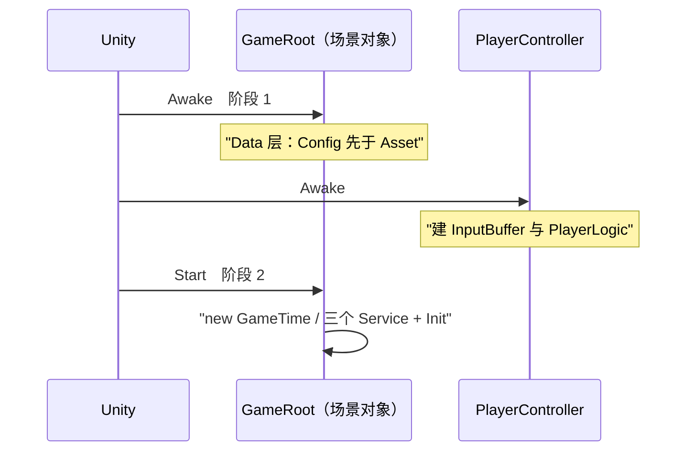

# 表现层

把逻辑层的结论呈现出去，把环境事实喂进逻辑层。跨层只走 `EventBus<T>`；只允许两类直连——**组合根/驱动点**（`GameRoot`、`PlayerController`）与**表现层实现逻辑层端口**（`GameTime : IGameTime`、`MovementMotor : IMovementMotor`）。`Assets/Scripts/` 下无 asmdef，全部落 `Assembly-CSharp`。

## 1. 目录与类型

| 目录 | 类型 | 命名空间 |
| :-- | :-- | :-- |
| `Presentation/Root/` | `GameRoot`、`PlayerController` | `DeepseaOil.Presentation` |
| `Presentation/Adapters/` | `GameTime`、`MovementMotor` | `DeepseaOil.Presentation` |
| `Presentation/Input/` | `InputProvider`、`InputSys.inputactions` | `DeepseaOil.Presentation` |
| `Presentation/UI/`、`UI/Panel/` | `UIMgr`、`E_UILayer`、`BeginPanel` 在 `.UI`；`BasePanel`、`MonoMgr` 在 `.Presentation` | `…Presentation.UI` / `…Presentation` |
| `Presentation/Debug/` | `MovementDebugPanel`、`EventBusDebugPanel`、`ConfigLoader` | `DeepseaOil.Presentation` |
| `Assets/Scripts/Foundation/` | `Singleton<T>`、`BaseManager<T>`、`Pool<T>` ＋ `PoolInClass<T>` / `PoolInMono<T>` | `DeepseaOil.Foundation` |
| `Assets/Scripts/Generated/Input/` | `InputSys`（生成物，禁手写） | `DeepseaOil.Generated` |

`Singleton<T>` 服务于 `MonoBehaviour` 单例；`BaseManager<T>` 服务于纯逻辑类单例，反射取**非公开**无参构造，取不到只 `LogError`、`Instance` 永久为 null（D20）。

## 2. 每帧三个驱动入口

| 入口 | 驱动什么 | 帧 |
| :-- | :-- | :-- |
| `GameRoot.Update()` | 顺序表两步：`List<IService>` 逐项 `Tick(unscaledDeltaTime)`，再 `AssetModule.Tick(deltaTime)` | 渲染帧 |
| `PlayerController.FixedUpdate()` | `ConsumeSnapshot()` → `InputBuffer.Push` → `new WorldInfo` / `new LogicContext` → `PlayerLogic.FixedTick` | 物理帧（默认 50Hz） |
| `InputProvider.Update()` | 采样 `InputSys`：持续量直接读，按下沿用 `\|=` 累积 | 渲染帧（自驱，不在 `GameRoot` 表内） |

③ 被输入后端强制：`WasPressedThisFrame()` 只在动态更新里有效，而按下沿必须由物理帧侧消费。渲染帧与物理帧没有先后关系。`MonoMgr` 的三个转发是基础设施、不算入口。

## 3. 启动装配序（两个组合根）



| 时机 | 行为 |
| :-- | :-- |
| `GameRoot.Awake`（阶段 1） | `if (!ConfigModule.IsReady) ConfigModule.InitFromStreamingAssets();` 然后 `if (!AssetModule.IsInitialized) { AssetModule.Init(); _dataLayerOwner = this; }`（`Root/GameRoot.cs:34-44`） |
| `PlayerController.Awake` | `config`/`motor`/`inputProvider` 任一为空 → `LogError` ＋ `enabled = false`；否则 `new InputBuffer(max(inputBufferTime, dashBufferTime), RoundToInt(1 / Time.fixedDeltaTime))`、`new BoundsArea(boundsArea)`、`new PlayerLogic(motor, config, _buffer)`；`boundsArea` 未接线或尺寸为 0 只 `LogWarning`（不钳位，不报错） |
| `GameRoot.Start`（阶段 2） | `UIMgr.Instance.ShowPanel<BeginPanel>()` → `new GameTime()` → 三个 Service `new` ＋ `Init()` → `services.Add` 三次；顺序 `[Pause, Scene, Save]` **既是 `Init` 序也是每帧 `Tick` 序**（`:46-63`） |
| `GameRoot.OnDestroy` | `if (_dataLayerOwner != this) return;` → `AssetModule.Dispose()`（`:91-98`） |

- 阶段 1 放 `Awake` 是因为 Unity 只保证「所有 `Awake` 先于任何 `Start`」；**`ConfigModule` 必须先于 `AssetModule`**。
- 两次守卫：`IsReady` 防 `ConfigModule.Init` 二次调用（重复抛且无重置入口）；`IsInitialized` 防同一帧出现第二个 `GameRoot`，`_dataLayerOwner` 保证只有真正装配了 Data 层的实例负责拆。

## 4. 端口与适配器

| 端口（Logic 定义） | 表现层实现 | 注入路径 |
| :-- | :-- | :-- |
| `IMovementMotor` | `MovementMotor`（`MonoBehaviour`，`[RequireComponent(typeof(Rigidbody2D))]`） | `PlayerController` 的 `[SerializeField] MovementMotor motor` → `new PlayerLogic(motor, config, _buffer)` |
| `IGameTime` | `GameTime`（纯类，三成员） | `GameRoot.Start` 的 `gameTime = new GameTime()` → `new PauseService(gameTime)` / `new SceneService(gameTime, pauseService)` |

`MovementMotor` 对外面：`Velocity`（引擎真值回读，滞后一个物理步）、`Position` / `SetPosition`（走物理体，不走 `transform`）、`Facing`（读写 `localScale.x` 符号；竖直朝向不改镜像）、`Move`。**没有环境检测**：脚底/侧向射线与 `IsGrounded` / `IsTouchingWall` / `WallSide` 已随平台跳跃品类删除——俯视角的阻挡由刚体碰撞解算。`Initialize()` 是幂等的：`AddComponent` 与 `Awake` 都走它，补引用、把 `gravityScale` 写成 0、冻旋转，只生效一次（因此 EditMode 测试里不依赖 `Awake`）。`PlayerController` 订阅 `GamePaused` / `GameResumed`（`OnEnable`/`OnDisable`），暂停时 `inputProvider.SetInputEnabled(false)`（内部已 `Clear()`）→ `_buffer.Clear()`。🔴 同一物理帧内的唯一硬序是 `Push` 先于 `FixedTick`，由调用顺序保证，**类型系统不保证**。

## 5. 相机与地图接线（俯视角）

| 接线 | 约束 | 错了会怎样 |
| :-- | :-- | :-- |
| `MapBounds` | 挂 `BoxCollider2D`，**必须勾 Is Trigger**，Size = 地图尺寸 | 不勾 → 玩家（出生点在地图中心）被包在实体碰撞体里，物理引擎持续把它往外解算，表现为"玩家自己往下滑"；且它与 `PlayerController` 的边界钳位互为第二个写者 |
| Confiner 2D 的 `Bounding Shape 2D` | **只能** `PolygonCollider2D` / `CompositeCollider2D`（挂在 `MapBounds` 子物体 `BoundsShape` 上） | 拖 `BoxCollider2D` 时 Inspector 报红字、相机其实**不被边界限制** |
| vcam（`CameraRig`） | 必须是**根对象** | 挂在别的物体下时世界 z 被父级叠加（例如 `-10 + 10 = 0`），相机跑到玩家背后，画面全空 |
| `Main Camera` | 挂 `CinemachineBrain`，正交 | 无 Brain → vcam 完全不动 |

两张表里的坑 Unity 一个都不会主动报，所以有校验菜单：**`Tools ▸ 深海石油 ▸ 校验移动与相机接线`**（`Assets/Tests/Runtime/Editor/MovementSetupCheck.cs`）。它走 `SerializedObject` 读**真实组件的真实字段**，逐项检查上面四条并给出人话原因；另外还查两类静默事故：组件的**脚本丢失**（`Missing Mono Script`）与**引用字段为空**（`[SerializeField]` 改名、对象被删之后，场景里的值会静默回落成空）。

### 5.1 相机不跟随时的手工诊断清单

> **这一节是"给人跑的步骤"，不是"给机器判的断言"。** 相机跟随目前**没有自动化断言**——PlayMode 测试在本工程还没有程序集承载（`Assets/Tests/**` 下无 asmdef）。每条都写清了「看到什么 → 说明什么」，请逐步做，不要跳步。

**第 0 步 · 确认前提（不做这步，后面全是白跑）**

```powershell
pwsh Tools/audit.ps1 -Full     # 必须 0 个错误
```

编译不过时 Unity 用的是上一版程序集，现象会骗人。

**第 1 步 · 判断"玩家到底动没动"** —— 4 个候选里成本最低的一个，却最容易被跳过

1. 打开 `TestPhysics`，Play。
2. 看 `DebugPanel` 的 **「引擎速度」/「速率」** 两行，按 W/A/S/D：
   - 速率随按键变成 8 上下 → 玩家在动，**跳到第 2 步**。
   - 速率恒为 `0.00` → **这不是相机的问题**，缺陷在移动侧：
     - 「输入方向」不随按键变化 → `InputProvider` 没采到（确认 `InputSys` 的 Player 表已 Enable、`InputProvider` 物体在场景里）。
     - 「输入方向」变了但「提交后预期」恒为 0 → 状态机没进 `Move`；看「状态」一行是否停在 `Idle`。
3. 「世界边界」显示 `未接线（不钳位）` → 先用上面那条校验菜单接上。它同时会让玩家走出地图，两种症状会互相掩盖。

**第 2 步 · 判断 vcam 有没有被判为 live**

1. Hierarchy 选中 `CameraRig`，确认 **`Follow` 指向 `Player`**。
2. Play 中看 Scene 视图里 `CameraRig` 的图标是否**随玩家移动**：
   - 图标跟着动、但 Game 视图画面不动 → vcam 在跟随，是 **Brain 没驱动相机**（第 4 步）。
   - 图标不动 → 第 3 步。

**第 3 步 · Confiner 是否把相机钳死**

Inspector 里**临时**取消勾选 `CameraRig` 上 `Extensions` 里的 `CinemachineConfiner2D`，回 Game 视图移动玩家：

| 观察 | 结论 |
| :-- | :-- |
| 相机开始跟随 | **问题在 Confiner**：检查 `Bounding Shape 2D` 指向的是不是 `MapBounds/BoundsShape` 的 `PolygonCollider2D`（**不是** `MapBounds` 自己的 `BoxCollider2D`），以及那张多边形的世界范围是否真的覆盖地图 |
| 仍然不跟随 | 问题不在 Confiner。**记得把勾打回去**，继续第 4 步 |

**第 4 步 · Brain 是否在驱动相机**

1. Hierarchy 选中 `Main Camera`：有没有 `CinemachineBrain`？
2. Play 中看它 Inspector 上 Brain 的 **`Live Camera`** 一行：
   - 显示 `CameraRig` → Brain 与 vcam 都正常；此时"画面不动"要往 `Camera` 组件本身查（`orthographic`、`Culling Mask`、`Depth`）。
   - 显示 `(none)` → 没有任何 vcam 被判为 live。常见原因：场景里有**第二个 vcam**（本工程曾出现过）、vcam 的 `Priority` ≤ 0、或它被禁用。
3. 数一下 Hierarchy 里有几个 vcam——**应该只有 `CameraRig` 一个**。

**第 5 步 · 确认不是"看起来没动"**

死区 `0.1`、软区 `0.5 × 0.35`，地图 `40 × 25`，相机正交 size `5`（单位都是世界单位）。所以：

- 玩家在 **0.1 世界单位**内移动时相机**故意不动**——这是需求 C3 要的"极小死区"，不是缺陷。
- 一次移动 3 ~ 5 个世界单位再看，才谈得上"跟不跟"。

> 需求 T2（"极小死区"到底多小）与 T3（地图边长）尚未由策划确认：上面这组是本实现的取值，不是定稿。

**做完之后**：逐步记下"从哪一步开始应该动却没动"，再决定改代码。**不要**在没走完第 1 步之前动相机参数——玩家不动也会表现为"相机不动"，两边一起改会互相掩盖。

## 6. 提交前自检

**顺序不可换**：编译不过时，后面三步全是空跑（测试会拿上一版程序集出结果，看起来像"逻辑错了"，实际是没编译）。

```powershell
pwsh Tools/audit.ps1 -Full
```

这一条命令做三件事，全绿才继续：

| 段 | 查什么 | 依据 |
| :-- | :-- | :-- |
| 静态检查 | `[MenuItem]` 路径与文档引用是否一致 | `Tools/Audit/Program.cs` |
| 语义编译 | 全量 `error CS`，与 Unity Console 完全一致 | **Unity 自己生成的** `Assembly-CSharp.csproj` / `Assembly-CSharp-Editor.csproj` —— 它们带着同一套引用集与 120+ 预定义宏 |
| 文档校验 | 目录树同源、断链、mermaid 可解析 | `Tools/check-*.mjs`、`verify-mermaid.mjs` |

**为什么不自己用 Roslyn 拼引用集**：试过，会缺核心库（`System.Object` 都解析不出来）并把运行时/编辑器/生成物混在一个程序集里编，产出上万条假错误。编译 Unity 生成的 `.csproj` 才既准又快（约 3 秒）。代价是依赖那两个 `.csproj` 存在——它们由 Unity 的 IDE 集成生成且被 `.gitignore` 排除，缺失时脚本会明确说明怎么恢复并跳过该段。

> ⚠️ **本工程已被这条纪律咬过一次**：最后一次改动之后的编译错误没人发现 → `Assembly-CSharp-Editor` 整体不产出 → **30 个测试与 3 个验证菜单一起消失**，而文档仍写着"编译零错误"。改完代码立刻重跑这条命令，不要等交付。

之后接着走：

1. `Tools ▸ 深海石油 ▸ 校验移动与相机接线`（玩家与相机的人工搭建由人完成，见需求 §1 的分工）
2. `Test Runner ▸ EditMode ▸ Run All`（期望 **33 项**：移动 19 ＋ Data 层 4 ＋ 仓库一致性 2 ＋ 导表 8）
3. 打开 `TestPhysics` ▸ Play，按 §5.1 的清单逐条走

## 7. UI

`E_UILayer { Bottom, Middle, Top, System }`（0/1/2/3），`ShowPanel` 的 `layer` 默认 `Middle`。**层不是 `sortingOrder`，是兄弟顺序**：`UIMgr` 构造时 `Instantiate` `Assets/Resources/ui/Canvas.prefab`，再 `transform.Find("Bottom"/"Middle"/"Top"/"System")` 取四个层父对象；全工程没有 `sortingOrder` 的代码引用。

```csharp
public void ShowPanel<T>(E_UILayer layer = E_UILayer.Middle, UnityAction<T> callBack = null, bool isSync = true) where T : BasePanel
public void HidePanel<T>(bool isDestory = false) where T : BasePanel
public void GetPanel<T>(UnityAction<T> callBack) where T : BasePanel
public Transform GetLayerFather(E_UILayer layer)
public static void AddCustomEventListener(UIBehaviour control, EventTriggerType type, UnityAction<BaseEventData> callBack)
```

| 主题 | 契约 |
| :-- | :-- |
| 构造期装配 | `AssetModule.Load<GameObject>`（**同步**）取三件套 → `Instantiate` → `DontDestroyOnLoad`（`UI/UIMgr.cs:90-109`） |
| 面板 Key | 写死 `"ui/Panel/" + typeof(T).Name` → **预制体名必须等于面板类名** |
| 已加载 / 加载中再 `Show` | 前者若失活先 `SetActive(true)` → `ShowMe()` → 回调；后者只累计回调链、不重复入队（`:146-170`） |
| 首次 `Show` | 先 `panelDic.Add` 占位 ＋ `MonoMgr.Instance.StartCoroutine(CoLoadPanel<T>(...))`，完成后 `Instantiate` → `GetComponent<T>()` → `ShowMe()` → 回调（`:175-234`） |
| `HidePanel(true)` | `HideMe()` → `Destroy` → 出字典 → `AssetModule.Release`（与 `LoadAsync` 成对）；`false` 时只 `HideMe()` ＋ `SetActive(false)`、**不释放** |

- **面板加载走协程轮询 `handle.IsDone`，不是 `await`**：`AssetModule` 在 `AssetModule.Tick` 内完成句柄，而 `AsyncHandle` 不传 `RunContinuationsAsynchronously`，`await` 的续体会**内联**在调度器分发循环里执行。
- **`isSync` 是空壳**：签名默认 `true`，方法体从不读它（`UI/UIMgr.cs:140-141`；D7）。
- `BasePanel : MonoBehaviour`：`Awake` 扫描 `GetComponentsInChildren<UIBehaviour>(true)` 建「名字 → 组件」字典，`Button` 自动挂 `OnButtonClicked(物体名)`、`TMP_Text` 调 `OnTextChange(物体名)`，`Graphic` 静默注册，其他类型打 `LogWarning`；钩子 `ShowMe()` / `HideMe()`。当前唯一面板是 `BeginPanel`。`MonoMgr` 只作协程宿主。

## 8. 资源 Key 链

| Key（字面量） | 定义处 | 加载方式 | 目标资产 |
| :-- | :-- | :-- | :-- |
| `ui/UICamera`、`ui/Canvas`、`ui/EventSystem` | `UI/UIMgr.cs:77-79` | `AssetModule.Load<GameObject>`（同步） | `Assets/Resources/ui/{UICamera,Canvas,EventSystem}.prefab` |
| `ui/Panel/` ＋ `typeof(T).Name` | `UI/UIMgr.cs:80` | `AssetModule.LoadAsync<GameObject>` | `Assets/Resources/ui/Panel/BeginPanel.prefab` |
| `Resources\Icons\sardline.png` | 配置表值 | 表值 → `ResolvePath` | `Assets/Resources/Icons/sardline.png` |

解析规则：`\` → `/`；去前缀 `Assets/Resources/` 或 `Resources/`（大小写不敏感）；去掉扩展名。**不检查资源是否存在**（`Data/Asset/AssetRegistry.cs:23-46`）。⚠️ 表值必须落在 `Assets/Resources/` 下，这一点没有任何自动校验（D4）。切 Addressables 时只改 `AssetRegistry.ResolvePath`。

**只读 SO 链**：`BaseConfig : ScriptableObject` → `CharacterConfig` → `PlayerConfig`，资产 `Assets/ConfigAssets/玩家配置.asset` 由 `PlayerController` 的 `[SerializeField] PlayerConfig config` 在场景里绑定。**它不经过 `ConfigModule`**：SO 走 Unity 资产系统，与 Luban 的 xlsx 数值两条来源并存。

## 9. 调试件

`MovementDebugPanel` 在 `SampleScene`（演示场景）与 `TestPhysics`（验收场景）**各挂一个**，`EventBusDebugPanel` 只挂 `SampleScene`。两者各自 `Start` 订阅、`OnDestroy` 退订，`OnGUI` 显示状态 / 日志；`DebugEvent` 无人 `Publish`（D13）。`Debug/ConfigLoader.cs` 在 `Start` 里兜底 `ConfigModule.InitFromStreamingAssets()` 并打自检，**不是配置的唯一入口**（`TestPhysics` 里没有 `GameRoot`，也没有它——验收场景只验移动与相机，不装配 Data 层）。
