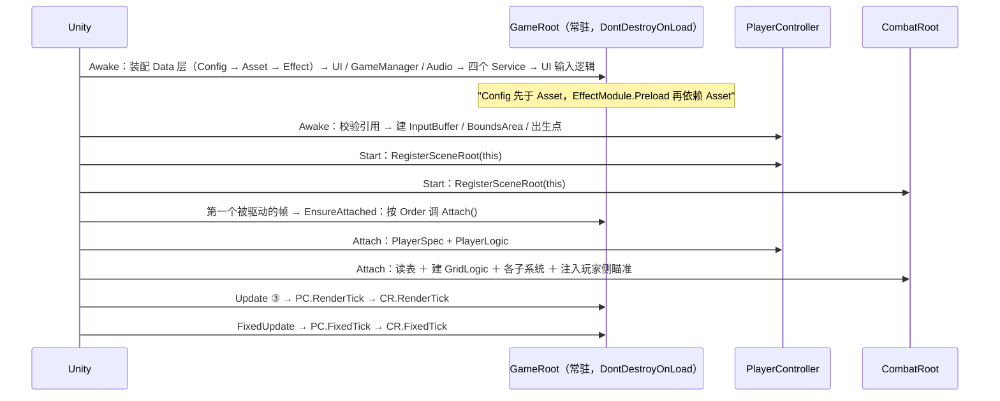

# 表现层

把逻辑层的结论呈现出去，把环境事实喂进逻辑层。跨层只走 `EventBus<T>`；只允许两类直连——**组合根/驱动点**（`GameRoot` 是唯一的驱动者，场景根经 `ISceneRoot` 向它注册）与**表现层实现逻辑层端口**（`GameTime : IGameTime`、`PlayerMotor : IMovementMotor`、`EnemyActor : IDamageable`）。`Assets/Scripts/` 下无 asmdef，全部落 `Assembly-CSharp`。

## 1. 目录与类型

| 目录 | 类型 | 命名空间 |
| :-- | :-- | :-- |
| `Presentation/` | `ISceneRoot` / `IRenderTicked` / `IPhysicsTicked`（注册契约） | `DeepseaOil.Presentation` |
| `Presentation/Root/` | `GameRoot`、`PlayerController`、`CombatRoot`、`GameManager` | `DeepseaOil.Presentation` |
| `Presentation/Adapters/` | `GameTime`、`ActorMotor`（抽象基类）、`PlayerMotor`、`EnemyMotor`、`TilemapAdapter` | `DeepseaOil.Presentation` |
| `Presentation/Input/` | `InputProvider`、`UIInputProvider`、`InputSys.inputactions` | `DeepseaOil.Presentation` |
| `Presentation/Actor/` | `EnemyActor`、`CombatDirector` | `DeepseaOil.Presentation.Actor` |
| `Presentation/Ball/` | `BallDirector`、`BallActor`、`ImpulseExecutor` | `DeepseaOil.Presentation.Ball` |
| `Presentation/Drop/` | `DropDirector`、`DropActor`（抽象）、`WaterBallDrop` | `DeepseaOil.Presentation.Drop` |
| `Presentation/Grid/` | `TileHighlightView` | `DeepseaOil.Presentation.Grid` |
| `Presentation/Projectile/` | `BallView`、`BallShadow`、`BallDriver` | `DeepseaOil.Presentation.Projectile` |
| `Presentation/Visual/` | `RenderOrder`（频带常量 ＋ 两个取档函数） | `DeepseaOil.Presentation` |
| `Presentation/白模用/` | `PrimitiveSprites`、`CombatPalette`：**白模件**，正式件不依赖它们 | `DeepseaOil.Presentation` |
| `Presentation/World/` | `Fountain` | `DeepseaOil.Presentation.World` |
| `Presentation/Effects/`、`Effects/Drivers/` | `EffectModule` / `EffectCatalog` / `EffectId` / `EffectContext` / `EffectHandle`；`ParticleDriver` / `EnemyShatterDriver` / `TileHighlightDriver` | `…Presentation.Effects[.Drivers]` |
| `Presentation/UI/`、`UI/Panel/` | `UIMgr`、`E_UILayer`、`BasePanel`、4 个菜单面板 ＋ `HudPanel`（`MonoMgr` 也在这个目录，命名空间是 `.Presentation`） | `…Presentation.UI` / `…Presentation` |
| `Presentation/Debug/` | `MovementDebugPanel`、`EventBusDebugPanel`、`EffectDebugPanel`、`ConfigLoader` | `DeepseaOil.Presentation` |
| `Presentation/Audio/` | `AudioManager`（`IService` 的第四个实现） | `DeepseaOil.Presentation` |
| `Assets/Scripts/Foundation/` | `Singleton<T>`、`Pool<T>` ＋ `PoolInClass<T>` / `PoolInMono<T>`、`Cooldown`、`Rng`、`YSort`、状态机骨架 | `DeepseaOil.Foundation` |
| `Assets/Scripts/Generated/Input/` | `InputSys`（生成物，禁手写） | `DeepseaOil.Generated` |

`Singleton<T>` 服务于 `MonoBehaviour` 单例（**全仓只剩 `GameRoot` 与 `MonoMgr`**）；`Pool<T>` 服务于池化；`BaseManager<T>` 已随音频收口删除（它当年只服务唯一一个纯逻辑类单例）。`MonoMgr` 是**唯一的 MonoBehaviour 自驱例外**（`Update`/`FixedUpdate`/`LateUpdate` 三个转发），保留原因见《审查》「`MonoMgr` 暂不动」：它只作协程与转发宿主，不参与帧内顺序。

## 2. 每帧两个驱动入口

| 入口 | 驱动什么 | 帧 |
| :-- | :-- | :-- |
| `GameRoot.Update()` | ⓐ `InputProvider.Sample()` 与 UI 输入段（`_uiInputProvider.Sample()` → `ConsumeSnapshot()` → `uiInput.Tick(new UILogicContext(...))`）→ 顺序表：① `List<IService>` 逐项 `Tick(unscaledDeltaTime)` ② `AssetModule.Tick(deltaTime)` ③ 各场景根 `RenderTick(deltaTime)`（按 `Order`）④ `EffectModule.Tick(deltaTime)` | 渲染帧 |
| `GameRoot.FixedUpdate()` | 各场景根 `FixedTick(fixedDeltaTime)`（按 `Order`） | 物理帧（默认 50Hz） |

**"场景根"是注册制，不是 Inspector 直连**：`PlayerController` 与 `CombatRoot` 各自在 `Start` 里 `GameRoot.Instance.RegisterSceneRoot(this)`，销毁时注销；`GameRoot` 在第一个被驱动的帧按 `Order` 升序调它们的 `Attach()` 完成装配（幂等），之后按同一顺序驱动。

| 场景根 | `Order` | 实现的帧接口 | 帧内做什么 |
| :-- | :-- | :-- | :-- |
| `PlayerController` | `-100` | `IRenderTicked` ＋ `IPhysicsTicked` | 渲染帧：Y-Sort 档位 → 瞄准 → 开火意图；物理帧：消费输入快照 → 吸附 8 向 → 推缓冲 → `PlayerLogic.FixedTick` → 边界保险丝 |
| `CombatRoot` | `0` | `IRenderTicked` ＋ `IPhysicsTicked` | 渲染帧：`GridLogic.Tick` → `BallDirector.Tick` → `DropDirector.Tick` → 各 `Fountain.Tick`；物理帧：`ImpulseExecutor.FixedTick` → `CombatDirector.FixedTick` → 玩家接触判定 |

**为什么 `Order` 而不是注册顺序**：注册发生在各自的 `Start`，而多个 `MonoBehaviour` 的 `Start` 先后是 Unity 的自由；靠注册顺序等于把帧内顺序交给引擎抽签。物理帧里"玩家必须早于世界"是硬需求（`CombatRoot` 的接触判定读的是"玩家这一帧提交后的位置"）。

**为什么装配推迟到 `Attach()`**：装配要读三样东西——配表（等 `GameRoot.Awake`）、玩家侧的 `Logic`（等 `PlayerController` 自己装配）、格子几何（等 `TilemapAdapter.Awake`）。Unity 只保证"所有 `Awake` 先于任何 `Start`"，**不保证两个 `Start` 的先后**；交给组合根按 `Order` 逐个调，两个问题一起消失，且 `FixedUpdate` 可能先于第一个 `Update` 跑（`EnsureAttached` 幂等）。

**`CombatRoot` / `PlayerController` 自身都没有 `Update` / `FixedUpdate`**：它们只暴露 `RenderTick(dt)` / `FixedTick(dt)` 给 `GameRoot` 调。这样帧内顺序（格子 → 球 → 掉落物 → 喷泉；冲量 → 敌人 → 玩家受击）是可预测的，而"非驱动点自驱"这条契约不被破坏。

## 3. 启动装配序（两个组合根 ＋ 一个常驻进程根）



| 时机 | 行为 |
| :-- | :-- |
| `GameRoot.Awake`（组装，失败即抛） | `ConfigModule.InitFromStreamingAssets()`（`IsReady` 守卫）→ `AssetModule.Init()`（`IsInitialized` 守卫 ＋ 记 `_assembled`）→ `EffectModule.Init()/Preload()` → `new GameTime()` → `new UIMgr()` ＋ `Init()` → `new GameManager(UI)` → `new AudioManager(transform)` → `new UIInputProvider()` ＋ `Init()` → `new UIInputLogic(UI, Game)` → 四个 Service（`Pause` / `Scene` / `Save` / `Audio`）→ `Game.ChangeState(Menu)` |
| `PlayerController.Awake` | `config` / `motor` / `inputProvider` 任一为空 → `LogError` ＋ `enabled = false`；否则 `new InputBuffer(max(inputBufferTime, dashBufferTime), RoundToInt(1 / Time.fixedDeltaTime))`、`ReadBounds()`、记出生点；`boundsArea` 未接线只 `LogWarning`（不钳位，不报错） |
| `PlayerController.Attach` | `SpecCatalog.Player()` → `new PlayerLogic(motor, config, buffer, in spec)`；`ThrowTuning.LoadOrDefault()`（瞄准平面深度） |
| `CombatRoot.Attach` | `ThrowTuning.LoadOrDefault()` → `SpecCatalog` 读表 → `TilemapAdapter.ReadGeometry()` → `new GridLogic(geometry, tileStates, 工厂, registry, this)` → `TilemapAdapter.Attach()` → `RegisterCells` → `LoadInitialStates` → 建瞄准高亮 / `ImpulseExecutor` / `BallDirector` / `DropDirector` → 喷泉 `Attach(IDropSpawner)` → `player.Logic.ConfigureAim(geometry, 射程, this)` → 需要时建 `CombatDirector`；**任一步不满足即 `LogError` 并停用**（`IsReady = false`，所有 Tick 变 no-op） |
| `GameRoot.OnDestroy` | `EventBus<RequestChangeScene>.Unsubscribe` → 只有 `_assembled == this` 才拆：`EffectModule.Dispose()` → `UI.Dispose()` → 四个 Service 逐个 `Dispose()` → `AssetModule.Dispose()`（**必须最后**：别人要经它归还引用计数） |

- **`GameRoot` 是常驻对象**：进程级件（UI / 音频池 / 游戏状态）由它 `new` 并持有，若它每场景重建就会重新 `new` 一份而旧的还在 `DontDestroyOnLoad` 里活着。所以**场景根改注册制，`GameRoot` 自己常驻**；场景里放不放它都行，放了的那份若不是第一个，`Singleton<T>.Awake` 会销毁它（它连装配都不会做）。
- 两次守卫：`ConfigModule.IsReady` 防二次 `Init`（重复抛且无重置入口）；`AssetModule.IsInitialized` 防同一帧出现第二个装配者，`_assembled` 保证只有真正装配的实例负责拆。
- **在 Unity 里逐字段怎么填**（建场景 / 光照 / 相机 / Cinemachine / 每个 Inspector 字段 / 排错对照）见 [新场景接线.md](../新场景接线.md)。

## 4. 端口与适配器

| 端口（Logic 定义） | 表现层实现 | 注入路径 |
| :-- | :-- | :-- |
| `IMovementMotor` | `PlayerMotor` / `EnemyMotor`（同一个抽象基类 `ActorMotor`：取刚体、`gravityScale = 0`、冻旋转、`Facing` 读写 `localScale.x` 符号） | 玩家：`PlayerController` 的 `[SerializeField] PlayerMotor motor` → `new PlayerLogic(...)`；敌人：`EnemyActor.Initialize` 里 `AddComponent<EnemyMotor>()` → `new EnemyLogic(...)` |
| `IDamageable` | `EnemyActor`：`IsDead` / `Position`（**物理体真值** `_motor.Position`）/ `TakeDamage(in Damage)` | `EnemyActor` 把自己登记进 `EnemyCellRegistry`（`grid` 与 `registry` 由 `CombatDirector` 注入） |
| `ISlowEffectTarget` | `EnemyActor.ApplySlow` → `_logic.Status.ApplySlow` | `CombatRoot.ApplySlow` 按格找到它 |
| `ITileSlowApplier` | `CombatRoot.ApplySlow`（玩家那一格直接判，敌人走归属表） | `new GridLogic(..., slow: this)` |
| `IBallLogicEffectContext` | `BallDirector`：`RequestTileState` → `GridLogic.OnBallHit` | `BallDirector.Attach(...)` 由 `CombatRoot` 调 |
| `IThrowSink` | `CombatRoot.RequestThrow`：落点那一格没有地板就否决 | `player.Logic.ConfigureAim(geometry, 射程, this)` |
| `IDropSpawner` | `DropDirector.TrySpawn` | 喷泉 `Attach(_drops)` |
| `IGameTime` | `GameTime`（三成员） | `GameRoot.Assemble()` 里 `new GameTime()` → 只注入 `new PauseService(gameTime)`；`new SceneService(pauseService)` **不依赖 `IGameTime`** |
| `IUIOperation` / `IUIStateRequest` | `UIMgr` / `GameManager` | `new UIInputLogic(UI, Game)`：逻辑层调表现层只经接口 |

**端口的实现为什么不都在一个文件里**：端口由"谁需要它"定义（`ITileSlowApplier` 在 `Grid/TileContext.cs`、`IThrowSink` 在 `Combat/`），实现由"谁手里有信息"决定（`CombatRoot` 同时认识玩家与归属表）。**"端口 ← 实现"的依赖方向永远不变**：逻辑层只写接口，表现层引用接口。

`ActorMotor` 对外面：`Velocity`（引擎真值回读，滞后一个物理步）、`Position` / `SetPosition`（走物理体，不走 `transform`）、`Facing`、`Move`。**没有环境检测**：脚底/侧向射线与 `IsGrounded` / `IsTouchingWall` / `WallSide` 已随平台跳跃品类删除——俯视角的阻挡由刚体碰撞解算。`EnsureInitialized()` 是幂等的：`AddComponent` 与 `Awake` 都走它，补引用、把 `gravityScale` 写成 0、冻旋转，只生效一次（因此 EditMode 测试里不依赖 `Awake`）。`PlayerController` 订阅 `GamePaused` / `GameResumed`（`OnEnable`/`OnDisable`），暂停时 `inputProvider.SetInputEnabled(false)`（内部已 `Clear()`）→ `_buffer.Clear()`。🔴 同一物理帧内的唯一硬序是 `Push` 先于 `FixedTick`，由调用顺序保证，**类型系统不保证**。

## 5. UI

`E_UILayer { Bottom, Middle, Top, System }`（0/1/2/3）。**层不是 `sortingOrder`，是兄弟顺序**：`UIMgr` `Init()` 时 `Instantiate` `Assets/Resources/ui/Canvas.prefab`，再 `transform.Find("Bottom"/"Middle"/"Top"/"System")` 取四个层父对象；全工程没有 `sortingOrder` 的代码引用。

```csharp
// ⚠️ 修正：签名里**没有** layer 参数（历史上文档写过 `E_UILayer layer = E_UILayer.Middle`，那不存在）。
//    面板落在哪一层由实例自己的 `Layer` 属性决定，见下。
public void ShowPanel<T>(UnityAction<T> callBack = null, bool isSync = true) where T : BasePanel
public void HidePanel<T>(bool isDestory = false) where T : BasePanel
public void GetPanel<T>(UnityAction<T> callBack) where T : BasePanel
public Transform GetLayerFather(E_UILayer layer)
public static void AddCustomEventListener(UIBehaviour control, EventTriggerType type, UnityAction<BaseEventData> callBack)
```

| 主题 | 契约 |
| :-- | :-- |
| 装配时机 | **构造函数不做 IO**：`new UIMgr()` 只建壳，三件套在 `Init()` 里 `AssetModule.Load<GameObject>`（**同步**）→ `Instantiate` → `DontDestroyOnLoad`。这样"`new UIMgr()` 这个动作本身产生资源 IO"就不会再让装配顺序说不清 |
| 面板 Key | 写死 `"ui/Panel/" + typeof(T).Name` → **预制体名必须等于面板类名** |
| 已加载 / 加载中再 `Show` | 前者若失活先 `SetActive(true)` → `ShowMe()` → 回调；后者只累计回调链、不重复入队 |
| 首次 `Show` | 先 `panelDic.Add` 占位 ＋ `MonoMgr.Instance.StartCoroutine(CoLoadPanel<T>(...))`，完成后 `Instantiate` → `GetComponent<T>()` → `ShowMe()` → 回调 |
| `HidePanel(true)` | `HideMe()` → `Destroy` → 出字典 → `AssetModule.Release`（与 `LoadAsync` 成对）；`false` 时只 `HideMe()` ＋ `SetActive(false)`、**不释放** |

- **面板加载走协程轮询 `handle.IsDone`，不是 `await`**：`AssetModule` 在 `AssetModule.Tick` 内完成句柄，而 `AsyncHandle` 不传 `RunContinuationsAsynchronously`，`await` 的续体会**内联**在调度器分发循环里执行。
- **`isSync` 是空壳**：签名默认 `true`，方法体从不读它（D7）。
- `BasePanel : MonoBehaviour`：`Awake` 扫描 `GetComponentsInChildren<UIBehaviour>(true)` 建「名字 → 组件」字典，`Button` 自动挂 `OnButtonClicked(物体名)`、`TMP_Text` 调 `SetInitialTxt(物体名)`，`Graphic` 静默注册，其他类型打 `LogWarning`；钩子 `ShowMe()` / `HideMe()`；取值口 `GetComponent<T>(物体名)`（取不到打 Warning 并返回 null）。**子物体名就是绑定契约**。`MonoMgr` 只作协程宿主。
- **场景里多出来的 `EventSystem` 会被 `UIMgr` 停用**：`UIMgr` 构造时（`DisableSceneEventSystems()`）把场上其它 `EventSystem` 全部 `SetActive(false)`，并打**一条**（只报一次）`LogError` 说明清理方法 —— 否则 Unity 会对"2 个 EventSystem"每帧刷警告（实测一次验收里刷了 38627 条）。项目约定是**场景里不该有 `Canvas` / `EventSystem`**：三件套由 `UIMgr` 从 `Assets/Resources/ui/` 建并 `DontDestroyOnLoad`。

现存面板（`Assets/Resources/ui/Panel/`，**文件名 = 类名**）：

| 面板 | 层 | 备注 |
| :-- | :-- | :-- |
| `BeginPanel` | `Bottom` | `"StartBtn"` → `GameState.Running`；`"ExitBtn"` → `BeforeExit` |
| `PausePanel` | `Middle` | |
| `SettingPanel` / `ExitConfirmPanel` | `Top` | |
| `HudPanel` | `Bottom` | 战斗 HUD：**零轮询**，见 §8。三个 TMP 子物体必须叫 `txtHp` / `txtWater` / `txtWave`；字体必须是中文字体（`SIMSUN SDF`），默认的 `LiberationSans SDF` 没有 CJK 字形 ⇒ 中文会变方块并刷警告 |

**层不是 `sortingOrder`，是兄弟顺序**（`System > Top > Middle > Bottom`）。`UIMgr.TryCloseTopmostPanel` 按 `System → Top → Middle → Bottom` 找**第一个活着且未隐藏**的面板，遇到 `CanBeHideByKey == false` 的**就此停下、不再往下层找** —— 所以 HUD 放 `Bottom` 且不可关闭，永远排在暂停面板之后被检查，不挡 Esc。

## 6. 资源 Key 链

| Key（字面量） | 定义处 | 加载方式 | 目标资产 |
| :-- | :-- | :-- | :-- |
| `ui/UICamera`、`ui/Canvas`、`ui/EventSystem` | `UI/UIMgr.cs` | `AssetModule.Load<GameObject>`（同步） | `Assets/Resources/ui/{UICamera,Canvas,EventSystem}.prefab` |
| `ui/Panel/` ＋ `typeof(T).Name` | `UI/UIMgr.cs` | `AssetModule.LoadAsync<GameObject>` | `Assets/Resources/ui/Panel/*.prefab` |
| `tuning/ThrowTuning`、`tuning/DropTuning` | `Data/Settings/*.cs` 的 `ResourceKey` | `AssetModule.Load<T>`（同步） | `Assets/Resources/tuning/*.asset` |
| `effects/` ＋ `EffectSpec.Key` | `Effects/EffectCatalog.cs` | `AssetModule.Load<GameObject>`（Preload） | `Assets/Resources/effects/{HitSpark,MudSplash}.prefab` |
| `Resources\Icons\sardline.png` | 配置表值 | 表值 → `ResolvePath` | `Assets/Resources/Icons/sardline.png` |

解析规则：`\` → `/`；去前缀 `Assets/Resources/` 或 `Resources/`（大小写不敏感）；去掉扩展名。**不检查资源是否存在**（`Data/Asset/AssetRegistry.cs`）。⚠️ 表值必须落在 `Assets/Resources/` 下，这一点没有任何自动校验（D4）。切 Addressables 时只改 `AssetRegistry.ResolvePath`。

**只读 SO 链**：`BaseConfig : ScriptableObject` → `CharacterConfig` → `PlayerConfig`，资产 `Assets/ConfigAssets/玩家配置.asset` 由 `PlayerController` 的 `[SerializeField] PlayerConfig config` 在场景里绑定。**它不经过 `ConfigModule`**：SO 走 Unity 资产系统，与 Luban 的 xlsx 数值两条来源并存。`EnemyCharacterFactory` 从 `enemy` 表行造一份**不落盘的** `CharacterConfig`（同 `id` 复用一份），于是敌人的运动参数与玩家走同一套字段。

## 7. 调试件

`MovementDebugPanel` 与 `EventBusDebugPanel` 各在演示场景里挂一个。两者各自 `Start` 订阅、`OnDestroy` 退订，`OnGUI` 显示状态 / 日志；`EventBusDebugPanel` 现在订阅的是 `TileStateChanged`（`DebugEvent` 已删除，那条"永远空的面板"随之消失）。`Debug/ConfigLoader.cs` 在 `Start` 里兜底 `ConfigModule.InitFromStreamingAssets()` 并打自检，**不是配置的唯一入口**。`EffectDebugPanel` 是特效系统的验收面板（见《粒子特效系统 · 接入与验收》）。

## 8. 战斗切片：组件职责

| 组件 | 职责 | 关键约束 |
| :-- | :-- | :-- |
| `CombatRoot` | 组合根：注册给 `GameRoot`（`Order = 0`）→ 装配一次（读表 / 建 `GridLogic` / 建各子系统 / 注入玩家侧）→ 被两个帧通道驱动；实现 `IThrowSink` 与 `ITileSlowApplier` | 自身**无** `Update`/`FixedUpdate`；失败 `LogError` ＋ 停用（`IsReady`） |
| `TilemapAdapter` | 与 Tilemap 的桥：给出格子几何、把地板块登记进逻辑层；订阅 `TileStateChanged` 换效果层贴图 | 唯一认识 `Tilemap` 的地方；`Awake` 做接线自检；`Attach()` / `Detach()` 由组合根调（不自己 `OnEnable`） |
| `TileHighlightView` | 瞄准格高亮：订阅 `AimChanged` → **一次 `EffectModule.Play(TileHighlight)`**（可用 / 不可用两种色） | 不做几何计算：格心由 `GridGeometry.CellCenter` 给；可见性由 `EffectHandle.IsValid` 回答 |
| `BallDirector` | 球链路：造 ＋ 持 ＋ 驱 ＋ 落地结算（改格 ＋ 排冲量）＋ 清场 | 非 `MonoBehaviour`；飞行与改格在**渲染帧**，冲量交给 `ImpulseExecutor` 跨到物理帧 |
| `BallActor` | 一颗球的表现侧实体：`BallView` ＋ `BallShadow` ＋ `BallDriver` 的组合件 | 自己决定观感（白模用程序化图元）；**不销毁 GameObject** —— 回收统一由 `BallDirector` 做 |
| `ImpulseExecutor` | 落地冲量的**物理帧执行者**：短队列 ＋ `OverlapCircleNonAlloc` ＋ `ClosestPoint` 精确判定 | 渲染帧只入队；清场时队列一起清（否则上一局的冲量会砸到下一局的箱子） |
| `CombatDirector` | 按波次建敌人、每物理帧逐只驱动、清场 | 波次与存活数的**唯一权威**；发布 `WaveChanged`；逐只驱动（敌人不自驱） |
| `EnemyActor` | 一只敌人的组合根：建刚体与视效、推进 `EnemyLogic`、实现 `IDamageable` ＋ `ISlowEffectTarget`、上报所在格、死亡播碎裂 | 由 `CombatDirector` 逐只驱动；`Position` 取物理体真值；耐久数字用引擎自带 `TextMesh`（取不到就不建，不报错） |
| `Fountain` | 喷泉：玩家在触发区里时按间隔产出一颗掉落物（**产什么 / 怎么产 / 何时产**三问都归它） | 被组合根逐帧驱动；只认识窄口 `IDropSpawner`；**不持有、也不驱动**掉落物实体 |
| `DropDirector` / `DropActor` / `WaterBallDrop` | 掉落物链路：造 ＋ 持 ＋ 驱 ＋ 回收；实体走 `Falling → Waiting → Homing → Done` 四相位 | 被领取时只发事实 `DropCollected`，"给玩家加什么"由 `CombatRoot` 裁决 |
| `HudPanel` | 订阅 `PlayerHealthChanged` / `WaterBallCountChanged` / `WaveChanged` 刷新三行读数 | 零轮询；`ShowMe` 里发 `RequestHudRefresh` 让数据方重播（面板异步加载，晚一帧才存在） |

**Y-Sort（频带约定）**：`RenderOrder` 只有常量与两个取档函数——`YSortBandStart = 500` / `YSortBandEnd = 559` / `YSortLevelsPerUnit = 4f`（0.25 米一档，覆盖 15 个世界单位）、`GroundShadow = 310`、`Aim = 320`、`ActorOverlay = 560`、`ShatterPiece = 1200`。角色与球都按**脚底 y**取档（`ActorOrder(y)` / `BallOrder(groundY)`，算式在 `Foundation/YSort.OrderFor`：取整、夹在频带内、非法参数回退到带首）。贴地件（阴影、瞄准环、格子高亮）**不进频带**：它们的档位是常量，跟着 y 走反而会越过自己的主人。

**指针通道**：`InputProvider` 在 `Sample()` 里除采样 `InputSys` 外，还直读 `Mouse.current` 产出 `AimScreen` / `AttackPressedThisFrame` / `AltAttackPressedThisFrame`（**渲染帧**语义：每帧重采、`SetInputEnabled(false)` 时也要清掉上一帧的按下沿）。为什么不走动作表、以及迁移三步，写在 `InputProvider.SamplePointer` 的注释里（动作表 Player map 里没有攻击与瞄准动作）。
