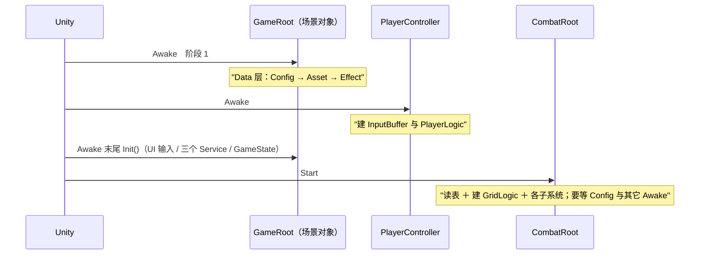

# 表现层

把逻辑层的结论呈现出去，把环境事实喂进逻辑层。跨层只走 `EventBus<T>`；只允许两类直连——**组合根/驱动点**（`GameRoot`、`PlayerController`）与**表现层实现逻辑层端口**（`GameTime : IGameTime`、`MovementMotor : IMovementMotor`）。`Assets/Scripts/` 下无 asmdef，全部落 `Assembly-CSharp`。

## 1. 目录与类型

| 目录 | 类型 | 命名空间 |
| :-- | :-- | :-- |
| `Presentation/Root/` | `GameRoot`、`PlayerController`、`CombatRoot`、`GameManager` | `DeepseaOil.Presentation` |
| `Presentation/Adapters/` | `GameTime`、`MovementMotor`、`EnemyMotor` | `DeepseaOil.Presentation` |
| `Presentation/Input/` | `InputProvider`、`InputSys.inputactions` | `DeepseaOil.Presentation` |
| `Presentation/Actor/` | `EnemyActor`、`WaveDirector` | `DeepseaOil.Presentation.Actor` |
| `Presentation/Combat/` | `LandingResolver` | `DeepseaOil.Presentation.Combat` |
| `Presentation/Grid/` | `GridView`、`TileAimView` | `DeepseaOil.Presentation.Grid` |
| `Presentation/Player/` | `ThrowController`、`PlayerHealthController` | `DeepseaOil.Presentation.Player` |
| `Presentation/Projectile/` | `BallView`、`BallShadow`、`BallDriver` | `DeepseaOil.Presentation.Projectile` |
| `Presentation/Visual/` | `PrimitiveSprites`、`RenderOrder`、`CombatPalette` | `DeepseaOil.Presentation.Visual` |
| `Presentation/World/` | `Fountain`、`WaterBall` | `DeepseaOil.Presentation.World` |
| `Presentation/Effects/`、`Effects/Drivers/` | `EffectModule` / `EffectCatalog` / `EffectId` / `EffectContext` / `IEffectDriver`；`ParticleDriver` / `LandingRingDriver` / `EnemyShatterDriver` | `…Presentation.Effects[.Drivers]` |
| `Presentation/UI/`、`UI/Panel/` | `UIMgr`、`E_UILayer`、`BasePanel`、4 个菜单面板 ＋ `HudPanel` 在 `.UI`；`MonoMgr` 在 `.Presentation` | `…Presentation.UI` / `…Presentation` |
| `Presentation/Debug/` | `MovementDebugPanel`、`EventBusDebugPanel`、`EffectDebugPanel`、`ConfigLoader` | `DeepseaOil.Presentation` |
| `Assets/Scripts/Foundation/` | `Singleton<T>`、`BaseManager<T>`、`Pool<T>` ＋ `PoolInClass<T>` / `PoolInMono<T>` | `DeepseaOil.Foundation` |
| `Assets/Scripts/Generated/Input/` | `InputSys`（生成物，禁手写） | `DeepseaOil.Generated` |

`Singleton<T>` 服务于 `MonoBehaviour` 单例；`BaseManager<T>` 服务于纯逻辑类单例，反射取**非公开**无参构造，取不到只 `LogError`、`Instance` 永久为 null（D20）。

## 2. 每帧四个驱动入口

| 入口 | 驱动什么 | 帧 |
| :-- | :-- | :-- |
| `GameRoot.Update()` | 顺序表四步：① `List<IService>` 逐项 `Tick(unscaledDeltaTime)` ② `AssetModule.Tick(deltaTime)` ③ `EffectModule.Tick(deltaTime)` ④ `CombatRoot.Tick(deltaTime)` | 渲染帧 |
| `GameRoot.FixedUpdate()` | `CombatRoot.FixedTick(fixedDeltaTime)`：落地结算 → 敌人 → 玩家受击 | 物理帧（默认 50Hz） |
| `PlayerController.FixedUpdate()` | `ConsumeSnapshot()` → `InputBuffer.Push` → `new WorldInfo` / `new LogicContext` → `PlayerLogic.FixedTick` | 物理帧（默认 50Hz） |
| `InputProvider.Update()` | 采样 `InputSys`（持续量直接读、按下沿用 `\|=` 累积）＋ 采样指针（`AimScreen` / 左右键按下沿） | 渲染帧（自驱，不在 `GameRoot` 表内） |

③④ 被输入后端强制：`WasPressedThisFrame()` 只在动态更新里有效，而按下沿必须由物理帧侧消费。渲染帧与物理帧没有先后关系。`MonoMgr` 的三个转发是基础设施、不算入口。

**`CombatRoot` 自身没有 `Update` / `FixedUpdate`**：它是战斗切片的组合根，只暴露 `Tick(dt)` / `FixedTick(dt)` 给 `GameRoot` 调。这样帧内顺序（格子 → 投掷/瞄准 → 喷泉；落地 → 敌人 → 玩家）是可预测的，而"非驱动点自驱"这条契约不被破坏。

## 3. 启动装配序（三个组合根）



| 时机 | 行为 |
| :-- | :-- |
| `GameRoot.Awake`（阶段 1） | `if (!ConfigModule.IsReady) ConfigModule.InitFromStreamingAssets();` 然后 `if (!AssetModule.IsInitialized) { AssetModule.Init(); _dataLayerOwner = this; }`，再 `EffectModule.Init()/Preload()`（`Root/GameRoot.cs`） |
| `PlayerController.Awake` | `config`/`motor`/`inputProvider` 任一为空 → `LogError` ＋ `enabled = false`；否则 `new InputBuffer(max(inputBufferTime, dashBufferTime), RoundToInt(1 / Time.fixedDeltaTime))`、`ReadBounds()`、`new PlayerLogic(motor, config, _buffer)`；`boundsArea` 未接线或尺寸为 0 只 `LogWarning`（不钳位，不报错） |
| `GameRoot.Awake` 末尾 `Init()` | `new UIInputProvider()` → 三个 Service `new` ＋ `Init()`；顺序 `[Pause, Scene, Save]` **既是 `Init` 序也是每帧 `Tick` 序**；`new UIInputLogic(UIMgr.Instance)`；`GameManager.ChangeState(Menu)` |
| `CombatRoot.Start` | `ThrowTuning.LoadOrDefault()` → `SpecCatalog` 读 6 张表 → `GridView.ReadGeometry()` / `RegisterCells` → `new GridLogic(...)` → `LoadInitialStates` → 建 `LandingResolver` / `ThrowController` / `WaveDirector` / `PlayerHealthController` / 瞄准环；失败即 `LogError` 并停用（`IsReady = false`，所有 Tick 变 no-op） |
| `GameRoot.OnDestroy` | `if (_dataLayerOwner != this) return;` → `EffectModule.Dispose()` → `AssetModule.Dispose()` |

- 阶段 1 放 `Awake` 是因为 Unity 只保证「所有 `Awake` 先于任何 `Start`」；**`ConfigModule` 必须先于 `AssetModule`**，`EffectModule.Preload` 又依赖 `AssetModule`。
- 两次守卫：`IsReady` 防 `ConfigModule.Init` 二次调用（重复抛且无重置入口）；`IsInitialized` 防同一帧出现第二个 `GameRoot`，`_dataLayerOwner` 保证只有真正装配了 Data 层的实例负责拆。
- 战斗切片放 `Start`：它要读 `ConfigModule`（由 `GameRoot.Awake` 装配）与场景里其它组件的 `Awake` 结果（例如 `PlayerController.Logic`）。

## 4. 端口与适配器

| 端口（Logic 定义） | 表现层实现 | 注入路径 |
| :-- | :-- | :-- |
| `IMovementMotor` | `MovementMotor`（玩家）、`EnemyMotor`（敌人，`[RequireComponent(typeof(Rigidbody2D))]`） | 玩家：`PlayerController` 的 `[SerializeField] MovementMotor motor` → `new PlayerLogic(...)`；敌人：`EnemyActor.Initialize` 里 `AddComponent<EnemyMotor>()` → `new EnemyLogic(motor, in spec, config)` |
| `IDamageable` | `EnemyActor`：`IsDead` / `Position`（`transform.position`）/ `TakeDamage(in Damage)`（唯一受伤入口） | `EnemyActor` 把自己登记进 `EnemyCellRegistry`（骨架里 `grid` 与 `registry` 由 `CombatRoot` 注入） |
| `IBallEffectContext` | `LandingResolver`：`RequestTileState` → `GridLogic.OnBallHit` | `LandingResolver.Initialize(grid, tuning, balls)` 由 `CombatRoot` 调用 |
| `IGameTime` | `GameTime`（纯类，三成员） | `GameRoot.Init()` 的 `gameTime = new GameTime()` → `new PauseService(gameTime)` / `new SceneService(gameTime, pauseService)` |

**敌人为什么没有抽 `RigidbodyMotorBase`**：`MovementMotor` 是 `sealed` 且被场景资产引用着，抽基类要先改一个正在工作的文件 ＋ 重接线；而两个实现的公共部分只有"取刚体、关重力、冻旋转"（`EnemyMotor` 因此独立实现 91 行，照 `MovementMotor` 的写法）。**触发条件**：出现第三个执行器，或敌人侧开始需要"贴墙 / 站地"这类环境探测时再抽。

`MovementMotor` 对外面：`Velocity`（引擎真值回读，滞后一个物理步）、`Position` / `SetPosition`（走物理体，不走 `transform`）、`Facing`（读写 `localScale.x` 符号；竖直朝向不改镜像）、`Move`。**没有环境检测**：脚底/侧向射线与 `IsGrounded` / `IsTouchingWall` / `WallSide` 已随平台跳跃品类删除——俯视角的阻挡由刚体碰撞解算。`Initialize()` 是幂等的：`AddComponent` 与 `Awake` 都走它，补引用、把 `gravityScale` 写成 0、冻旋转，只生效一次（因此 EditMode 测试里不依赖 `Awake`）。`PlayerController` 订阅 `GamePaused` / `GameResumed`（`OnEnable`/`OnDisable`），暂停时 `inputProvider.SetInputEnabled(false)`（内部已 `Clear()`）→ `_buffer.Clear()`。🔴 同一物理帧内的唯一硬序是 `Push` 先于 `FixedTick`，由调用顺序保证，**类型系统不保证**。

## 5. UI

`E_UILayer { Bottom, Middle, Top, System }`（0/1/2/3），`ShowPanel` 的 `layer` 默认 `Middle`。**层不是 `sortingOrder`，是兄弟顺序**：`UIMgr` 构造时 `Instantiate` `Assets/Resources/ui/Canvas.prefab`，再 `transform.Find("Bottom"/"Middle"/"Top"/"System")` 取四个层父对象；全工程没有 `sortingOrder` 的代码引用。

```csharp
// ⚠️ 修正：签名里**没有** layer 参数（历史上文档写过 `E_UILayer layer = E_UILayer.Middle`，那不存在）。
//    面板落在哪一层由实例自己的 `Layer` 属性决定，见下。
public void ShowPanel<T>(UnityAction<T> callBack = null, bool isSync = true) where T : BasePanel
public void HidePanel<T>(bool isDestory = false) where T : BasePanel
public void GetPanel<T>(UnityAction<T> callBack) where T : BasePanel
public Transform GetLayerFather(E_UILayer layer)
public static void AddCustomEventListener(UIBehaviour control, EventTriggerType type, UnityAction<BaseEventData> callBack)
```

| 主题 | 契约 |
| :-- | :-- |
| 构造期装配 | `AssetModule.Load<GameObject>`（**同步**）取三件套 → `Instantiate` → `DontDestroyOnLoad`（`UI/UIMgr.cs:90-109`） |
| 面板 Key | 写死 `"ui/Panel/" + typeof(T).Name` → **预制体名必须等于面板类名** |
| 已加载 / 加载中再 `Show` | 前者若失活先 `SetActive(true)` → `ShowMe()` → 回调；后者只累计回调链、不重复入队（`:146-170`） |
| 首次 `Show` | 先 `panelDic.Add` 占位 ＋ `MonoMgr.Instance.StartCoroutine(CoLoadPanel<T>(...))`，完成后 `Instantiate` → `GetComponent<T>()` → `ShowMe()` → 回调（`:175-234`） |
| `HidePanel(true)` | `HideMe()` → `Destroy` → 出字典 → `AssetModule.Release`（与 `LoadAsync` 成对）；`false` 时只 `HideMe()` ＋ `SetActive(false)`、**不释放** |

- **面板加载走协程轮询 `handle.IsDone`，不是 `await`**：`AssetModule` 在 `AssetModule.Tick` 内完成句柄，而 `AsyncHandle` 不传 `RunContinuationsAsynchronously`，`await` 的续体会**内联**在调度器分发循环里执行。
- **`isSync` 是空壳**：签名默认 `true`，方法体从不读它（D7）。
- `BasePanel : MonoBehaviour`：`Awake` 扫描 `GetComponentsInChildren<UIBehaviour>(true)` 建「名字 → 组件」字典，`Button` 自动挂 `OnButtonClicked(物体名)`、`TMP_Text` 调 `SetInitialTxt(物体名)`，`Graphic` 静默注册，其他类型打 `LogWarning`；钩子 `ShowMe()` / `HideMe()`；取值口 `GetComponent<T>(物体名)`（取不到打 Warning 并返回 null）。**子物体名就是绑定契约**。`MonoMgr` 只作协程宿主。
- **场景里多出来的 `EventSystem` 会被 `UIMgr` 停用**：`UIMgr` 构造时（`DisableSceneEventSystems()`）把场上其它 `EventSystem` 全部 `SetActive(false)`，并打**一条**（只报一次）`LogError` 说明清理方法 —— 否则 Unity 会对"2 个 EventSystem"每帧刷警告（实测一次验收里刷了 38627 条）。项目约定是**场景里不该有 `Canvas` / `EventSystem`**：三件套由 `UIMgr` 从 `Assets/Resources/ui/` 建并 `DontDestroyOnLoad`。

现存面板（`Assets/Resources/ui/Panel/`，**文件名 = 类名**）：

| 面板 | 层 | 备注 |
| :-- | :-- | :-- |
| `BeginPanel` | `Bottom` | `"StartBtn"` → `GameState.Running`；`"ExitBtn"` → `BeforeExit` |
| `PausePanel` | `Middle` | |
| `SettingPanel` / `ExitConfirmPanel` | `Top` | |
| `HudPanel` | `Bottom` | 战斗 HUD：**零轮询**，见 §8。三个 TMP 子物体必须叫 `txtHp` / `txtWater` / `txtWave`；字体必须是中文字体（`SIMSUN SDF`），默认的 `LiberationSans SDF` 没有 CJK 字形 ⇒ 中文会变方块并刷警告 |

**层不是 `sortingOrder`，是兄弟顺序**（`System > Top > Middle > Bottom`，全工程没有 `sortingOrder` 的代码引用，D28）。`UIMgr.TryCloseTopmostPanel` 按 `System → Top → Middle → Bottom` 找**第一个活着且未隐藏**的面板，遇到 `CanBeHideByKey == false` 的**就此停下、不再往下层找** —— 所以 HUD 放 `Bottom` 且不可关闭，永远排在暂停面板之后被检查，不挡 Esc。

## 6. 资源 Key 链

| Key（字面量） | 定义处 | 加载方式 | 目标资产 |
| :-- | :-- | :-- | :-- |
| `ui/UICamera`、`ui/Canvas`、`ui/EventSystem` | `UI/UIMgr.cs:77-79` | `AssetModule.Load<GameObject>`（同步） | `Assets/Resources/ui/{UICamera,Canvas,EventSystem}.prefab` |
| `ui/Panel/` ＋ `typeof(T).Name` | `UI/UIMgr.cs:80` | `AssetModule.LoadAsync<GameObject>` | `Assets/Resources/ui/Panel/BeginPanel.prefab` |
| `Resources\Icons\sardline.png` | 配置表值 | 表值 → `ResolvePath` | `Assets/Resources/Icons/sardline.png` |

解析规则：`\` → `/`；去前缀 `Assets/Resources/` 或 `Resources/`（大小写不敏感）；去掉扩展名。**不检查资源是否存在**（`Data/Asset/AssetRegistry.cs:23-46`）。⚠️ 表值必须落在 `Assets/Resources/` 下，这一点没有任何自动校验（D4）。切 Addressables 时只改 `AssetRegistry.ResolvePath`。

**只读 SO 链**：`BaseConfig : ScriptableObject` → `CharacterConfig` → `PlayerConfig`，资产 `Assets/ConfigAssets/玩家配置.asset` 由 `PlayerController` 的 `[SerializeField] PlayerConfig config` 在场景里绑定。**它不经过 `ConfigModule`**：SO 走 Unity 资产系统，与 Luban 的 xlsx 数值两条来源并存。

## 7. 调试件

`MovementDebugPanel` 与 `EventBusDebugPanel` 各在演示场景里挂一个。两者各自 `Start` 订阅、`OnDestroy` 退订，`OnGUI` 显示状态 / 日志；`DebugEvent` 无人 `Publish`（D13）。`Debug/ConfigLoader.cs` 在 `Start` 里兜底 `ConfigModule.InitFromStreamingAssets()` 并打自检，**不是配置的唯一入口**。`EffectDebugPanel` 是特效系统的验收面板（见《粒子特效系统 · 接入与验收》）。

## 8. 战斗切片（白模迁移新增）：组件职责

| 组件 | 职责 | 关键约束 |
| :-- | :-- | :-- |
| `CombatRoot` | 组合根：装配一次（读表 / 建 `GridLogic` / 建各子系统 / 接线），然后 `Tick` / `FixedTick` 被 `GameRoot` 驱动 | 自身**无** `Update`/`FixedUpdate`；装配在 `Start`；失败 `LogError` ＋ 停用（`IsReady`） |
| `GridView` | 与 Tilemap 的桥：把格子几何与地板灌进逻辑层；订阅 `TileStateChanged` 换效果层贴图 | 唯一认识 `Tilemap` 的地方；`Awake` 做接线自检（未接地板层 / 两层拖成同一个 / 未接泥浆贴图 各报一条） |
| `TileAimView` | 瞄准格高亮：**整格**半透明色块，位置由调用方算好 | 不做几何计算（与投掷共用同一个吸附函数） |
| `LandingResolver` | 球落地结算：通知格子 → 无生命刚体冲量 → 画落地环 | 渲染帧只入队、**物理帧才施加冲量**；`ClosestPoint` 精确判定；查询半径放宽只为"别漏候选" |
| `ThrowController` | 读鼠标 → 吸附格 → 建球 → 把落地回调转给 `LandingResolver`；驱动瞄准环与在飞的球 | 球与阴影全部运行期建出（无 prefab 依赖）；暂停时隐藏瞄准环并拒绝投掷 |
| `PlayerHealthController` | 接触检测（圆心距）→ 扣血 → 击退（走 `PlayerController` 的受击口）→ 打空清场重来 | **不写刚体速度**（玩家速度的唯一写者仍是 `PlayerLogic`） |
| `EnemyActor` | 一只敌人的组合根：建刚体与视效、推进 `EnemyLogic`、实现 `IDamageable`、上报所在格、死亡播碎裂 | 由 `WaveDirector` 逐只驱动（不自驱）；耐久数字用引擎自带 `TextMesh` ＋ 内置字体（取不到就不建数字，不报错） |
| `WaveDirector` | 按波次建敌人、逐只驱动、清场；波次与存活数的唯一权威 | 发布 `WaveChanged`；`ClearAll` 供玩家打空时清场 |
| `Fountain` / `WaterBall` | 喷泉按时喷水球；水球抛物线 → 等触发 → 飞向玩家 → 发 `WaterBallCollected` | 水球默认运行期建出（挂了预制体则用预制体）；**领取走事件**，不再 `FindObjectOfType` |
| `HudPanel` | 订阅 `PlayerHealthChanged` / `WaterBallCountChanged` / `WaveChanged` 刷新三行读数 | 零轮询；`ShowMe` 里发 `RequestHudRefresh` 让数据方重播（面板异步加载，晚一帧才存在） |

**指针通道**：`InputProvider` 在 `Update` 里除采样 `InputSys` 外，还直读 `Mouse.current` 产出 `AimScreen` / `AttackPressedThisFrame` / `AltAttackPressedThisFrame`（**渲染帧**语义：每帧重采、不受 `SetInputEnabled(false)` 影响也要清掉上一帧的按下沿）。为什么不走动作表、以及迁移三步，写在 `InputProvider.SamplePointer` 的注释里（动作表 Player map 里没有攻击与瞄准动作）。
