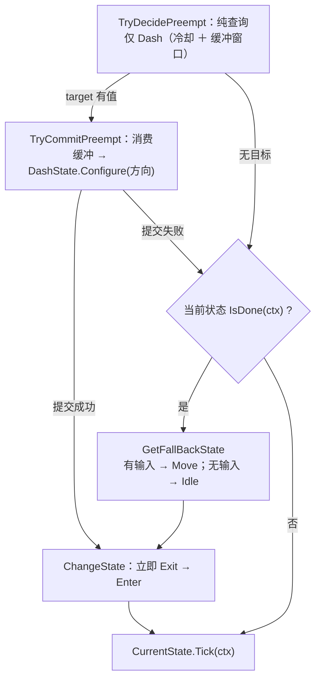

# 逻辑层

纯 C# 决策层：`Assets/Scripts/Logic/**` 内零 `MonoBehaviour`、零 `Update`/`FixedUpdate`、零 `UnityEngine.Time`。只读注入的 SO；唯一主动调 Data 层处是 `SceneService.Load` → `AssetModule.OnSceneSwitch()`。

## 1. 目录与命名空间

| 目录 | 命名空间 | 类型（举要） |
| :-- | :-- | :-- |
| `Logic/Actor/`、`Logic/` | `DeepseaOil.Logic` | `ActorLogic`、`WorldInfo`、`LogicContext`、`ITickable`、`IFixedTickable` |
| `Logic/Movement/`、`…/States/` | `…Movement[.States]` | `IState<T>`、`StateBase<T>`、`TimedStateBase<T>`、`StateMachine<T>`、`IMovementMotor`、`MovementStateTag`、3 个状态类（`Idle` / `Move` / `Dash`） |
| `Logic/Player/` | `…Player` | `PlayerLogic`、`MoveGroup` |
| `Logic/Input/` | `…Input` | `InputBuffer`、`InputType`、`InputSnapshot` |
| `Logic/Bounds/` | `…Bounds` | `BoundsArea`（地图活动区域的**纯数据**矩形：`Min` / `Max` / `IsValid` / `TryClamp`） |
| `Logic/Event/` | `…Events` | `EventBus<T>`、`EventBus`、4 个事件 struct |
| `Logic/Services/` | `…Service` | `IService`、`PauseService`、`SceneService`、`SaveService`、`IGameTime`、`IAudioService` |

目录名与命名空间**三处不一致**（以此表为准）：`Actor/` 无段、`Event/` 复数、`Services/` 单数。`ITickable` 零实现零调用，`IFixedTickable` **从不经接口分发**（`Logic/Tickable.cs:9`、`:17`）。

### 1.1 允许出现的引擎类型

| 允许 | 理由 |
| :-- | :-- |
| `Vector2` / `Vector3` / `Vector4`、`Mathf`、`Color` 这类**纯数学结构** | 它们不依赖 `UnityEngine` 的任何运行时设施，EditMode 下可自由构造。禁掉它们只会逼出一套自造的向量类型，收益为负 |
| `EventBus` 里的 `Debug.LogException` / `LogWarning` | 既有的诊断出口 |

| 禁止 | 为什么 |
| :-- | :-- |
| `MonoBehaviour` / `GameObject` / `Transform` | 逻辑层不能"挂在物体上"，否则单测必须建场景 |
| `UnityEngine.Time` | 时间由 `LogicContext` 逐帧喂入，否则逻辑不可确定性重放 |
| `Collider2D` / `Rigidbody2D` / `Physics2D` / `Bounds` 等**与具体组件或物理模块绑定的类型** | 一旦出现，逻辑层就从"纯 C#"退化成"必须挂物理组件才能测" |

**最后一条曾在本工程被破过**：`BoundsArea` 一度直接持有 `BoxCollider2D`、`WorldInfo` 因此间接依赖物理模块，
与本文开头那句硬约束**直接矛盾**（而旧版本文档用"它不读 `UnityEngine.Time`"来给它背书——那是把两条不同的约束混成一条）。
现在 `BoundsArea` 只存两个 `Vector2`，**`BoxCollider2D` → `min/max` 的折算放回表现层的 `PlayerController.ReadBounds()`**：
这是"逻辑层零引擎类型"的代价，也是它的收益——折算只发生在一处，逻辑层拿到的永远是纯数据。

## 2. 帧驱动

| 通道 | 驱动者 | 被驱动者 | 时间源 |
| :-- | :-- | :-- | :-- |
| 渲染帧 `Update` | `GameRoot`（`Root/GameRoot.cs:65`） | `List<IService>` 逐项 `Tick`（`:69-72`） | `Time.unscaledDeltaTime` |
| 渲染帧 `Update` | `InputProvider`（自驱，`Input/InputProvider.cs:41`） | 采样 `InputSys` 并累积按下沿 | 帧（`WasPressedThisFrame`） |
| 物理帧 `FixedUpdate` | `PlayerController`（`Root/PlayerController.cs:79`） | `PlayerLogic.FixedTick` → `MoveGroup.Tick` → 状态 → `MovementMotor.Move` | `fixedTime` / `fixedDeltaTime` |

内部**没有分发机制**：`PlayerLogic.OnTick` 直接调 `_moveGroup.Tick(in ctx)`，`MoveGroup.Tick` 直接调 `_machine.CurrentState.Tick(ctx)`。暂停时 `timeScale == 0`，`FixedUpdate` 不跑。

## 3. ActorLogic：速度账本与外力的唯一写者

`ActorLogic : IFixedTickable`，成员 `Velocity` / `FrameStartVelocity` / `SubmittedDelta` / `FixedTick` / `OnTick` / `Facing`。

- **速度真值只有引擎一份**：`Motor.Velocity` 帧首读作本帧基准（读到的是**上一物理步结束时**的值），**帧末唯一写出**；**零提交帧不写**，否则会覆盖引擎侧结果。`_delta` 是瞬变累进（格/秒，**不**乘 Δt），入口 `AddImpulse` / `SetVelocity` / `SetVelocityY` / `SetVelocityX`（private）/ `SnapVelocity`；`_accel` 是加速度累进（格/秒²），入口 `AddForce`，本帧贡献 = 值 × Δt。
- **外力唯一一处 `ApplyExtraForce(in ctx, Vector2 force)`**：参数由调用方给出，本类**不持有任何具体力的语义**——重力、浮力、水流、吸附、击退滑行都只是 `force` 的一种取值。强度缩放 `SetExtraForceScale`，`0` 即整段空转。本类**不自动调用**它：施不施加外力是角色自己的决策。**当前没有任何角色调用它**（俯视角玩家刻意不施外力，是设计意图而非未完成）；唯一调用点是测试探针 `移动Tests.LimitProbe`（M16 / M18）。
- **限速与外力是两件事**：`ClampSpeed(maxSpeed)` 按当帧 `Velocity` 整体覆盖，会撤掉待生效的加速度，故同帧两者并用时**先累加外力、后钳制**。

共用操作：`MoveHorizontal` / `BrakeHorizontal` / `ApproachX`（控制律唯一实现点）等 —— 俯视角玩家不用（零惯性），留给需要惯性的敌人。**玩家专属账本**在 `PlayerLogic`：只有 `_lastDashAt`（冲刺冷却）与 `_direction`（最近非零输入方向，供冲刺取向）。Player 的 `Rigidbody2D` 为 `m_GravityScale: 0`：引擎重力整体关掉，速度全部由本层账本给出；平台跳跃时代的重力曲线与跳跃键高截断已删除。

## 4. 状态机

接口 `IState<TStateTag> where TStateTag : struct, Enum`（`Movement/IState.cs`）：`StateTag` / `Enter` / `Exit` / `Tick` / `IsDone`。`ChangeState(tag, in ctx)` 做 `Exit()` → 赋值 → `Enter(ctx)`，**立即、同步、同帧生效**；`AddState` 遇到重复标签静默覆盖；`ChangeState` 遇到未注册标签**或已是当前状态**都返回 `false`、不抛。

| 状态（`MovementStateTag`，`Empty` **永不注册**） | `Enter` / `Tick` | `IsDone` |
| :-- | :-- | :-- |
| `Idle` | `Tick` 里 `StopMove()`（速度当帧归零） | 输入出现（`Move.sqrMagnitude != 0`） |
| `Move` | `Tick` 里 `MoveDirection(Move, moveSpeed)`（**当帧直达**，无加减速） | 输入归零 |
| `Dash` | `Enter` 里 `SnapVelocity(方向 × dashSpeed)`；`Tick` 空 | `dashDuration` 到 |

`Dash` 是唯一由 `TryDecidePreempt` 抢占的状态。**仲裁两段式**：`MoveGroup` 是唯一仲裁者，评估（`TryDecidePreempt`，纯查询）与消费（`TryCommitPreempt`）分开，是为了让 `target == 当前状态` 时不消费、也不遮掉 `IsDone`。冲刺方向在切换前由 `Configure` 喂入：有输入用输入方向，无输入用最近朝向。

## 5. 输入契约

| 契约 | 内容 | 位置 |
| :-- | :-- | :-- |
| 唯一按键沿存储点 | `InputProvider` 唯一采样点，`InputBuffer` 唯一按下沿存储点；宿主**不得**自存"上一帧输入" | `Input/InputBuffer.cs` |
| 调用顺序 | 同一物理帧内 `Push` **必须先于** `PlayerLogic.FixedTick`；倒序会让本帧按下沿落到下一物理帧才可见 | `PlayerController.cs` |
| 缓冲容量 | 容量是**独立参数**（`PlayerConfig.inputBufferTime` 0.12s），各输入各自的响应窗口仍由自己的参数给出（如 `dashBufferTime`）；容量必须 **≥** 所有窗口，否则窗口内的按下会被挤出历史 | `PlayerController.Awake` |
| 窗口是参数不是字段 | `CanConsume(type, now, window)` / `TryConsume(type, now, window)`；窗口是**闭区间**（`now - window <= t <= now`），失效时间用 `float.NaN` | `InputBuffer.cs` |
| 消费与容量 | 不读 Unity Time、必须单调不减；`CanConsume` 纯查询可重复调用，`TryConsume` 成功一次即作废；`Capacity = Max(1, CeilToInt(bufferSeconds × sampleRatePerSecond))`，`EffectiveSeconds = Capacity / SampleRatePerSecond` | `InputBuffer.cs` |
| 入账与清空 | 入账的只有有消费者的按下沿（`DashPressed` / `JumpPressed`）；松开沿曾供可变跳高使用，已随跳跃曲线删除。`Clear()` 清快照、写指针与全部按下时间 | `InputBuffer.cs` |
| 🔴 D25 | 采样率在 `PlayerController.Awake` 固定 → 事后改 Fixed Timestep 会使实际窗口与 `EffectiveSeconds` 不一致 | `PlayerController.cs` |

`InputSnapshot` 字段：`Move`（−1..1，**宿主侧已吸附到 8 向并归一化**，见 §5.1）、`JumpPressed` / `DashPressed`（按下沿）、`GrabHeld`。`JumpPressed` 与 `InputType.Attack` **都没有消费者**：键位（空格）保留在 action map 里，等策划定稿后的新用途。

### 5.1 方向归一化：谁做、在哪做（唯一一处）

| 环节 | 责任 |
| :-- | :-- |
| `InputProvider` | 采样 `InputSys`，`ClampMagnitude(move, 1)` —— 只保证不超 1，**键盘斜向仍是 (1,1)，模长 √2** |
| `PlayerController.SnapMoveToEightDirections` | **归一化与吸附的唯一实现点**，静态纯函数（不吃实例状态、不吃 `Time`），所以 EditMode 测试能直接调它（`移动Tests.M17`） |
| `InputBuffer` | 存的必须是**已归一化**的那份快照：`PlayerController` 用它重建 `InputSnapshot` 再 `Push` |
| `WorldInfo.MoveDirection` | 契约：非零时模长恒为 1 |
| `PlayerLogic._direction` | 再归一化一次（自有兜底，防宿主违约），供冲刺取向与后续技能 |
| `DashState.Configure` | 第三次归一化，把"必须是单位向量"收在入场方向的唯一写入口 |

**为什么同一件事在三处各做一次**：不是冗余，是拒绝"靠调用方守契约"。
任一处漏掉都不报错，只表现为斜向快 √2 倍或冲刺超速——这类缺陷靠注释是守不住的，只能靠"每层自己兜底 + 测试钉住"。
`移动Tests.M2` / `M6` / `M17` 就是那三颗钉子（喂**未归一化**的 (1,1)，而不是喂 (0.7071, 0.7071)）。

## 6. 端口、事件与 Service

| 端口（Logic 定义） | 实现 |
| :-- | :-- |
| `IMovementMotor`（`Movement/IMovementMotor.cs`）：`Velocity` / `Position` / `Facing` / `Move(Vector2)` / `SetPosition(Vector2)` | `MovementMotor`（`Adapters/MovementMotor.cs`） |
| `IGameTime`（`Services/IGameTime.cs`）：`SetTimeScale` / `UnscaledDeltaTime` / `TimeScale` | `GameTime`（`Adapters/GameTime.cs`） |
| `IAudioService`（`Services/IAudioService.cs`）：`Play(audioType)` | **无实现**（零调用点，D14） |

地图活动区域 `BoundsArea` 是**逻辑层类型**（`Logic/Bounds/`），但它是**纯数据**：组合根在表现层把 `BoxCollider2D` 折算成 `min` / `max` 后经 `WorldInfo` 逐帧喂入（见 §1.1）。它不读 `UnityEngine.Time`，只在越界时给出钳位后的坐标；未接线（默认值）时 `IsValid` 为 false、原样返回位置——**不钳位是安全降级**，无条件 `Mathf.Clamp` 会把忘接线的玩家钉死在地图原点。

跨层事实只经 `EventBus<T>`：`RequestPause` / `RequestResume`（`BeginPanel` → `PauseService`）、`GamePaused` / `GameResumed`（`PauseService.SetPaused` → `PlayerController`）、`MovementStateChanged`（`MoveGroup` → `MovementDebugPanel`）、`DebugEvent`（**无人发布**，D13）。

`IService`：`Init()` / `Tick(float unscaledDeltaTime)` / `Dispose()`；三个 Service **不是单例**，由 `GameRoot.Start` 建，顺序 `[Pause, Scene, Save]` 既是 `Init` 序也是 `Tick` 序。`SceneService.Load` 依次 ① 复位 `timeScale` ② `PauseService.SetPaused(false)` ③ `EventBus.ClearAll()` ④ `AssetModule.OnSceneSwitch()` ⑤ `SceneManager.LoadScene`。

🔴 **D8** `SaveService.Save` 不赋值、`Load` 恒返回 `default`；**D9** `SceneService.Load` 全仓库零调用点 → ③④ 从不执行；**D10** `IService.Dispose` 无人调用 → 静态订阅不摘除；**D16** 暂停时 `inputProvider.SetInputEnabled(false)` 内部已 `Clear()`，故 `PauseService.SetPaused` 必须先于 `PlayerController.OnGamePaused` 的其余动作，否则 `_buffer.Clear()` 会被 `Resume` 之后的旧按下沿穿过（见 `PlayerController.OnGamePaused`）。
