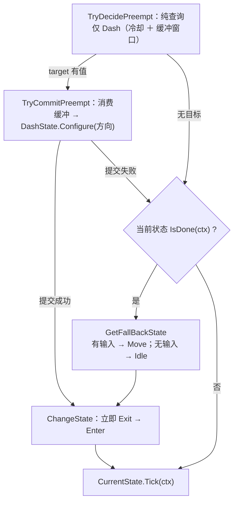
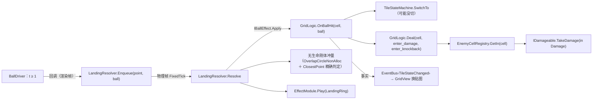

# 逻辑层

纯 C# 决策层：`Assets/Scripts/Logic/**` 内零 `MonoBehaviour`、零 `Update`/`FixedUpdate`、零 `UnityEngine.Time`。只读注入的 SO；唯一主动调 Data 层处是 `SceneService.Load` → `AssetModule.OnSceneSwitch()`。

## 1. 目录与命名空间

| 目录 | 命名空间 | 类型（举要） |
| :-- | :-- | :-- |
| `Logic/Actor/`、`Logic/` | `DeepseaOil.Logic` | `ActorLogic`、`WorldInfo`、`LogicContext`、`ITickable`、`IFixedTickable` |
| `Logic/Movement/`、`…/States/` | `…Movement[.States]` | `IState<T>`、`StateBase<T>`、`TimedStateBase<T>`、`StateMachine<T>`、`IMovementMotor`、`MovementStateTag`、3 个状态类（`Idle` / `Move` / `Dash`） |
| `Logic/Player/` | `…Player` | `PlayerLogic`、`MoveGroup` |
| `Logic/Input/` | `…Input` | `InputBuffer`、`InputType`、`InputSnapshot` |
| `Logic/Bounds/` | `…Bounds` | `BoundsArea`（地图活动区域的**纯数据**矩形：`Min` / `Max` / `IsValid` / `TryClamp`） |
| `Logic/Event/` | `…Events` | `EventBus<T>`、`EventBus`、**10 个事件 struct**（4 旧的 ＋ `TileStateChanged` / `WaterBallCollected` / `WaterBallCountChanged` / `PlayerHealthChanged` / `WaveChanged` / `RequestHudRefresh`） |
| `Logic/Services/` | `…Service` | `IService`、`PauseService`、`SceneService`、`SaveService`、`IGameTime`、`IAudioService` |
| `Logic/Combat/` | `…Combat` | `Damage`（一次结算的全部事实）、`DamageSource`、`IDamageable`（目标端口） |
| `Logic/Grid/`、`…/States/` | `…Grid[.States]` | `GridLogic`、`ITileState`、`TileStateMachine`、`TileTickQueue`、`TileContext`（＋`ITileScheduler` / `IDamageDealer`）、`EnemyCellRegistry`、`GridGeometry`、`TileAim`、`GridQuery`、`MudTileState` |
| `Logic/Projectile/` | `…Projectile` | `BallData`、`IBallEffect` / `IBallEffectContext`、`TileStateBallEffect` / `NullBallEffect` |
| `Logic/Random/` | `…Random` | `IRng`、`Rng`（门面）、`DefaultRng` |
| `Logic/Wave/` | `…Wave` | `WaveLogic`（＋嵌套 `SpawnRequest`） |
| `Logic/Actor/`（续） | `DeepseaOil.Logic` | `EnemyLogic`、`Steering`、`EnemyVisual` —— 与 `ActorLogic` 同命名空间 |

目录名与命名空间**三处不一致**（以此表为准）：`Actor/` 无段、`Event/` 复数、`Services/` 单数。`ITickable` 零实现零调用，`IFixedTickable` **从不经接口分发**（`Logic/Tickable.cs:9`、`:17`）。

### 1.1 允许出现的引擎类型

| 允许 | 理由 |
| :-- | :-- |
| `Vector2` / `Vector3` / `Vector4`、`Mathf`、`Color` 这类**纯数学结构** | 它们不依赖 `UnityEngine` 的任何运行时设施，EditMode 下可自由构造。禁掉它们只会逼出一套自造的向量类型，收益为负 |
| `EventBus` 里的 `Debug.LogException` / `LogWarning` | 既有的诊断出口 |

| 禁止 | 为什么 |
| :-- | :-- |
| `MonoBehaviour` / `GameObject` / `Transform` | 逻辑层不能"挂在物体上"，否则单测必须建场景 |
| `UnityEngine.Time` | 时间由 `LogicContext` 逐帧喂入，否则逻辑不可确定性重放 |
| `Collider2D` / `Rigidbody2D` / `Physics2D` / `Bounds` 等**与具体组件或物理模块绑定的类型** | 一旦出现，逻辑层就从"纯 C#"退化成"必须挂物理组件才能测" |

**最后一条曾在本工程被破过**：`BoundsArea` 一度直接持有 `BoxCollider2D`、`WorldInfo` 因此间接依赖物理模块，
与本文开头那句硬约束**直接矛盾**（而旧版本文档用"它不读 `UnityEngine.Time`"来给它背书——那是把两条不同的约束混成一条）。
现在 `BoundsArea` 只存两个 `Vector2`，**`BoxCollider2D` → `min/max` 的折算放回表现层的 `PlayerController.ReadBounds()`**：
这是"逻辑层零引擎类型"的代价，也是它的收益——折算只发生在一处，逻辑层拿到的永远是纯数据。

## 2. 帧驱动

| 通道 | 驱动者 | 被驱动者 | 时间源 |
| :-- | :-- | :-- | :-- |
| 渲染帧 `Update` | `GameRoot`（`Root/GameRoot.cs`） | `List<IService>` 逐项 `Tick` | `Time.unscaledDeltaTime` |
| 渲染帧 `Update` | `InputProvider`（自驱，`Input/InputProvider.cs`） | 采样 `InputSys` 与指针，累积按下沿 | 帧（`WasPressedThisFrame`） |
| 渲染帧 `Update` | `GameRoot`（第 ④ 步）→ `CombatRoot.Tick(dt)` | `GridLogic.Tick(now, dt)` → `ThrowController.Tick(dt)` → `Fountain.Tick(dt)` | `Time.time` / `Time.deltaTime` |
| 物理帧 `FixedUpdate` | `PlayerController`（`Root/PlayerController.cs`） | `PlayerLogic.FixedTick` → `MoveGroup.Tick` → 状态 → `MovementMotor.Move` | `fixedTime` / `fixedDeltaTime` |
| 物理帧 `FixedUpdate` | `GameRoot.FixedUpdate()` → `CombatRoot.FixedTick(dt)` | `LandingResolver.FixedTick()` → `WaveDirector.FixedTick` → `EnemyActor.FixedTick` → `PlayerHealthController.FixedTick` | `fixedTime` / `fixedDeltaTime` |

内部**没有分发机制**：`PlayerLogic.OnTick` 直接调 `_moveGroup.Tick(in ctx)`，`MoveGroup.Tick` 直接调 `_machine.CurrentState.Tick(ctx)`；`GridLogic.Tick` 直接按队列逐个 `TileStateMachine.Tick(ctx)`。暂停时 `timeScale == 0`：`FixedUpdate` 不跑，而 `dt` 为 0 的那两条渲染帧通道自然冻结。

## 3. ActorLogic：速度账本与外力的唯一写者

`ActorLogic : IFixedTickable`，成员 `Velocity` / `FrameStartVelocity` / `SubmittedDelta` / `FixedTick` / `OnTick` / `Facing`。

- **速度真值只有引擎一份**：`Motor.Velocity` 帧首读作本帧基准（读到的是**上一物理步结束时**的值），**帧末唯一写出**；**零提交帧不写**，否则会覆盖引擎侧结果。`_delta` 是瞬变累进（格/秒，**不**乘 Δt），入口 `AddImpulse` / `SetVelocity` / `SetVelocityY` / `SetVelocityX`（private）/ `SnapVelocity`；`_accel` 是加速度累进（格/秒²），入口 `AddForce`，本帧贡献 = 值 × Δt。
- **外力唯一一处 `ApplyExtraForce(in ctx, Vector2 force)`**：参数由调用方给出，本类**不持有任何具体力的语义**——重力、浮力、水流、吸附、击退滑行都只是 `force` 的一种取值。强度缩放 `SetExtraForceScale`，`0` 即整段空转。本类**不自动调用**它：施不施加外力是角色自己的决策。**当前没有任何角色调用它**（俯视角玩家刻意不施外力，是设计意图而非未完成）；唯一调用点是测试探针 `移动Tests.LimitProbe`（M16 / M18）。
- **限速与外力是两件事**：`ClampSpeed(maxSpeed)` 按当帧 `Velocity` 整体覆盖，会撤掉待生效的加速度，故同帧两者并用时**先累加外力、后钳制**。

共用操作：`MoveHorizontal` / `BrakeHorizontal` / `ApproachX`（控制律唯一实现点）等 —— 俯视角玩家不用（零惯性），留给需要惯性的敌人。**玩家专属账本**在 `PlayerLogic`：只有 `_lastDashAt`（冲刺冷却）与 `_direction`（最近非零输入方向，供冲刺取向）。Player 的 `Rigidbody2D` 为 `m_GravityScale: 0`：引擎重力整体关掉，速度全部由本层账本给出；平台跳跃时代的重力曲线与跳跃键高截断已删除。

### 3.1 第二个消费者：敌人（`EnemyLogic`）

白模迁移把 `ActorLogic` 的第二个子类带进来了，**"每帧只有一个速度写者"这条不变量因此在敌人身上也成立**：

| 主题 | 契约 |
| :-- | :-- |
| 唯一写者 | `EnemyLogic`。击退**不是**去写 `Rigidbody2D`，而是 `ApplyKnockback` 往账本加一次冲量 |
| 目标来源 | `SetTarget(Vector2?)`；`null` 表示"没有目标"（走 `SteerTowards` 的指数衰减 ⇒ 滑停而不是定住） |
| 减速 | `SetSlowMultiplier` 每帧喂一次（由组合根查格子得到），入口处 `Clamp01` ＋ 非数按 1 处理；**减速只做乘法** |
| 受击禁足 | `BeginStun(seconds, stepSeconds)` 折算成**整帧数**，递减在**帧末**（`Tick` 末尾）⇒ `BeginStun(N)` 字面成立 N 帧。禁足期间**零提交**（`SteerTowards(Velocity, Velocity.magnitude, 0, 0)`），不是"提前 return" —— 后者会让冲量那一帧也变成零提交、冲量永远进不了引擎 |
| 冲量挂起 | `_pendingKnockback` 挂到下一次 `OnTick` 才落进账本：`FixedTick` 在帧首清 `_delta`，帧外调 `AddImpulse` 会被静默抹掉（结算与驱动是两个组件，顺序 Unity 不保证） |
| 时间来源 | `Tick(now, deltaTime)` 用零输入快照组装 `LogicContext`（本类不吃输入，但时间必须是驱动方那一份） |
| 视效决策 | `EnemyVisual` 纯函数：身体色**四态查表**（正常 / 减速 / 闪烁 / 减速＋闪烁）、耐久文案（0 写空串）、闪烁相位（`sin`，频率为 0 不除零） |
| 追击决策 | `Steering.Resolve` 纯函数：三个"不动"条件（停止距离内 / 超出追击范围 / 方向为零）各自对应一类真实缺陷；速度恒为正且恒不超过基准 |

## 4. 状态机

接口 `IState<TStateTag> where TStateTag : struct, Enum`（`Movement/IState.cs`）：`StateTag` / `Enter` / `Exit` / `Tick` / `IsDone`。`ChangeState(tag, in ctx)` 做 `Exit()` → 赋值 → `Enter(ctx)`，**立即、同步、同帧生效**；`AddState` 遇到重复标签静默覆盖；`ChangeState` 遇到未注册标签**或已是当前状态**都返回 `false`、不抛。

| 状态（`MovementStateTag`，`Empty` **永不注册**） | `Enter` / `Tick` | `IsDone` |
| :-- | :-- | :-- |
| `Idle` | `Tick` 里 `StopMove()`（速度当帧归零） | 输入出现（`Move.sqrMagnitude != 0`） |
| `Move` | `Tick` 里 `MoveDirection(Move, moveSpeed)`（**当帧直达**，无加减速） | 输入归零 |
| `Dash` | `Enter` 里 `SnapVelocity(方向 × dashSpeed)`；`Tick` 空 | `dashDuration` 到 |

`Dash` 是唯一由 `TryDecidePreempt` 抢占的状态。**仲裁两段式**：`MoveGroup` 是唯一仲裁者，评估（`TryDecidePreempt`，纯查询）与消费（`TryCommitPreempt`）分开，是为了让 `target == 当前状态` 时不消费、也不遮掉 `IsDone`。冲刺方向在切换前由 `Configure` 喂入：有输入用输入方向，无输入用最近朝向。

## 5. 输入契约

| 契约 | 内容 | 位置 |
| :-- | :-- | :-- |
| 唯一按键沿存储点 | `InputProvider` 唯一采样点，`InputBuffer` 唯一按下沿存储点；宿主**不得**自存"上一帧输入" | `Input/InputBuffer.cs` |
| 调用顺序 | 同一物理帧内 `Push` **必须先于** `PlayerLogic.FixedTick`；倒序会让本帧按下沿落到下一物理帧才可见 | `PlayerController.cs` |
| 缓冲容量 | 容量是**独立参数**（`PlayerConfig.inputBufferTime` 0.12s），各输入各自的响应窗口仍由自己的参数给出（如 `dashBufferTime`）；容量必须 **≥** 所有窗口，否则窗口内的按下会被挤出历史 | `PlayerController.Awake` |
| 窗口是参数不是字段 | `CanConsume(type, now, window)` / `TryConsume(type, now, window)`；窗口是**闭区间**（`now - window <= t <= now`），失效时间用 `float.NaN` | `InputBuffer.cs` |
| 消费与容量 | 不读 Unity Time、必须单调不减；`CanConsume` 纯查询可重复调用，`TryConsume` 成功一次即作废；`Capacity = Max(1, CeilToInt(bufferSeconds × sampleRatePerSecond))`，`EffectiveSeconds = Capacity / SampleRatePerSecond` | `InputBuffer.cs` |
| 入账与清空 | 入账的只有有消费者的按下沿（`DashPressed` / `JumpPressed`）；松开沿曾供可变跳高使用，已随跳跃曲线删除。`Clear()` 清快照、写指针与全部按下时间 | `InputBuffer.cs` |
| 🔴 D25 | 采样率在 `PlayerController.Awake` 固定 → 事后改 Fixed Timestep 会使实际窗口与 `EffectiveSeconds` 不一致 | `PlayerController.cs` |

`InputSnapshot` 字段：`Move`（−1..1，**宿主侧已吸附到 8 向并归一化**，见 §5.1）、`JumpPressed` / `DashPressed`（按下沿）、`GrabHeld`。`JumpPressed` 与 `InputType.Attack` **都没有消费者**：键位（空格）保留在 action map 里，等策划定稿后的新用途。

### 5.1 方向归一化：谁做、在哪做（唯一一处）

| 环节 | 责任 |
| :-- | :-- |
| `InputProvider` | 采样 `InputSys`，`ClampMagnitude(move, 1)` —— 只保证不超 1，**键盘斜向仍是 (1,1)，模长 √2** |
| `PlayerController.SnapMoveToEightDirections` | **归一化与吸附的唯一实现点**，静态纯函数（不吃实例状态、不吃 `Time`），所以 EditMode 测试能直接调它（`移动Tests.M17`） |
| `InputBuffer` | 存的必须是**已归一化**的那份快照：`PlayerController` 用它重建 `InputSnapshot` 再 `Push` |
| `WorldInfo.MoveDirection` | 契约：非零时模长恒为 1 |
| `PlayerLogic._direction` | 再归一化一次（自有兜底，防宿主违约），供冲刺取向与后续技能 |
| `DashState.Configure` | 第三次归一化，把"必须是单位向量"收在入场方向的唯一写入口 |

**为什么同一件事在三处各做一次**：不是冗余，是拒绝"靠调用方守契约"。
任一处漏掉都不报错，只表现为斜向快 √2 倍或冲刺超速——这类缺陷靠注释是守不住的，只能靠"每层自己兜底 + 测试钉住"。
`移动Tests.M2` / `M6` / `M17` 就是那三颗钉子（喂**未归一化**的 (1,1)，而不是喂 (0.7071, 0.7071)）。

## 6. 端口、事件与 Service

| 端口（Logic 定义） | 实现 |
| :-- | :-- |
| `IMovementMotor`（`Movement/IMovementMotor.cs`）：`Velocity` / `Position` / `Facing` / `Move(Vector2)` / `SetPosition(Vector2)` | `MovementMotor`（`Adapters/MovementMotor.cs`，玩家）、`EnemyMotor`（`Adapters/EnemyMotor.cs`，敌人） |
| `IDamageable`（`Combat/IDamageable.cs`）：`IsDead` / `Position` / `TakeDamage(in Damage)` | `EnemyActor`（`Presentation/Actor/EnemyActor.cs`） |
| `ITileScheduler` / `IDamageDealer`（`Grid/TileContext.cs`）：状态提交 Tick / 请求状态转换；对格上目标结算 | `GridLogic` 自己实现（两个口都收在门面里） |
| `IBallEffectContext`（`Projectile/IBallEffect.cs`）：`RequestTileState(cell, ball)` | `LandingResolver`（`Presentation/Combat/LandingResolver.cs`） |
| `IGameTime`（`Services/IGameTime.cs`）：`SetTimeScale` / `UnscaledDeltaTime` / `TimeScale` | `GameTime`（`Adapters/GameTime.cs`） |
| `IAudioService`（`Services/IAudioService.cs`）：`Play(audioType)` | **无实现**（零调用点，D14） |

`IDamageable` 为什么带 `Position` 与 `IsDead`：结算方手里只有一个接口引用，而"从落点指向受害者"必须知道受害者在哪（否则只能反过来问表现层每个目标的位置，等于把接线还给调用方）；`IsDead` 是给"已死但还没被销毁"那个窗口用的 —— 遍历该格敌人列表时可能正在进行中，少了它会对尸体重复结算。实现方契约：`TakeDamage` 不抛异常，且 `Damage.Amount == 0` 时不扣血（只做被显式要求的击退）。

地图活动区域 `BoundsArea` 是**逻辑层类型**（`Logic/Bounds/`），但它是**纯数据**：组合根在表现层把 `BoxCollider2D` 折算成 `min` / `max` 后经 `WorldInfo` 逐帧喂入（见 §1.1）。它不读 `UnityEngine.Time`，只在越界时给出钳位后的坐标；未接线（默认值）时 `IsValid` 为 false、原样返回位置——**不钳位是安全降级**，无条件 `Mathf.Clamp` 会把忘接线的玩家钉死在地图原点。

跨层事实只经 `EventBus<T>`：`RequestPause` / `RequestResume`（`BeginPanel` → `PauseService`）、`GamePaused` / `GameResumed`（`PauseService.SetPaused` → `PlayerController` / `ThrowController` / `PlayerHealthController`）、`MovementStateChanged`（`MoveGroup` → `MovementDebugPanel`）、`DebugEvent`（**无人发布**，D13）。

白模迁移新增的六条（详见 §7）：`TileStateChanged`（`GridLogic` → `GridView`）、`PlayerHealthChanged`（`PlayerHealth` → HUD）、`WaterBallCountChanged`（`PlayerResources` → HUD）、`WaveChanged`（`WaveDirector` → HUD）、`WaterBallCollected`（`WaterBall` → `CombatRoot`）、`RequestHudRefresh`（`HudPanel` → `CombatRoot`，意图）。**发布方是数据的持有者**：数据变了由它自己发事实，避免"忘了发 ⇒ HUD 静默不更新"这种缺陷埋在调用点里。

`IService`：`Init()` / `Tick(float unscaledDeltaTime)` / `Dispose()`；三个 Service **不是单例**，由 `GameRoot.Start` 建，顺序 `[Pause, Scene, Save]` 既是 `Init` 序也是 `Tick` 序。`SceneService.Load` 依次 ① 复位 `timeScale` ② `PauseService.SetPaused(false)` ③ `EventBus.ClearAll()` ④ `AssetModule.OnSceneSwitch()` ⑤ `SceneManager.LoadScene`。

🔴 **D8** `SaveService.Save` 不赋值、`Load` 恒返回 `default`；~~**D9** `SceneService.Load` 全仓库零调用点 → ③④ 从不执行~~ → **2026-10-04 复核：不成立**（`Assets/Tests/Scene/TestChangeScene.cs:15` 是真实发布方；但正式关卡还没有触发入口）；**D10** `IService.Dispose` 无人调用 → 静态订阅不摘除；**D16** 暂停时 `inputProvider.SetInputEnabled(false)` 内部已 `Clear()`，故 `PauseService.SetPaused` 必须先于 `PlayerController.OnGamePaused` 的其余动作，否则 `_buffer.Clear()` 会被 `Resume` 之后的旧按下沿穿过（见 `PlayerController.OnGamePaused`）。

## 7. 格子与战斗切片（白模迁移新增）

### 7.1 格子六件套的职责边界

| 类型 | 只负责 | 明确不管 |
| :-- | :-- | :-- |
| `GridLogic`（门面） | 持有"哪些格有状态"、调度 Tick、落地 → 状态转换、对格上目标结算伤害、把"世界 ↔ 格"转发给 `GridGeometry` | 不知道 Tilemap / 物理 / `Time`（时间由 `Tick(now, dt)` 喂入） |
| `ITileState`（状态） | 三个钩子 `OnEnter` / `OnTick` / `OnExit` ＋ `SlowMultiplier` 查询 | 不知道别的格、不知道视觉 |
| `TileStateMachine`（单格状态机） | 切换语义（同状态不重入、`Exit → 造新实例 → Enter`） | 不管 Tick 调度（在队列里） |
| `TileTickQueue`（双缓冲队列） | "哪些格下一帧要 Tick"（同帧去重、一次性消费） | 不管"什么时候"（延迟由状态自己用 `ctx.Now` / `DeltaTime` 管理） |
| `TileContext`（回调环境） | 把 `Cell` / `Now` / `DeltaTime` ＋ 两个端口递给状态 | 不持有可变状态 |
| `EnemyCellRegistry`（归属表） | 敌人 → 格 的单点映射（存 `IDamageable`，一格可多个） | 不结算、不查询状态 |

**两条不变量**：①**每格一份状态实例**（`SwitchTo` 走工厂造新对象）—— 共享实例会让全场格子共用一个计时器；②**常规格零常驻**（落回 `Normal` 时整台状态机从字典里删掉）。

### 7.2 一次落地的完整链路（球不伤害任何人）

- **冲量必须在物理帧施加**（`Rigidbody2D.velocity` / `AddForce` 只在 `FixedUpdate` 与下一次 `Simulate` 之间生效）；落地（渲染帧）只入队，所以队列而不是单字段。
- **结算前对目标列表做快照**：受害方可能在 `TakeDamage` 里死亡并注销自己，直接在原列表上遍历会改到正在遍历的集合。

### 7.3 其余新增逻辑类型的契约

| 类型 | 契约 |
| :-- | :-- |
| `WaveLogic` | 只管"何时刷 / 刷几只 / 刷在哪"（输出 `SpawnRequest` 列表）；**不建物体**，也不认识敌人 —— 场上还有没有活人由驱动方数好喂进来 |
| `PlayerHealth` | 血量 ＋ 无敌帧 ＋ 重置；`CanTakeDamage(now, until)` 是**静态纯函数**（写成 `!(now < until)` 让 `NaN` 落到"可以受伤"一侧）；自己发布 `PlayerHealthChanged` |
| `PlayerResources` | 水球计数；`TryConsume` 不足时**不改动任何状态**；`Announce()` 供 HUD 重播 |
| `AttackCooldown` | 只回答"现在能不能打"（`CanAttack` / `MarkUsed` / `Reset`），不读时间、不做输入缓冲 |
| `Rng` / `IRng` | 逻辑层唯一随机来源；默认 `System.Random` ＋ **固定种子**（每局可复现）；测试可 `SetImpl` 整体替换 |
| `BallData` | 不可变飞行数据；`SampleGround` 是贴地直线（阴影走它）、`SampleVisual` 加弧高；时长按飞行距离缩放 |
| `Damage` | `Point` / `Direction` / `Amount` / `Impulse` / `Source`；`HasDamage` 与 `HasKnockback` **互相独立**（0 伤害 ＋ 有冲量 = 只推不扣） |
| `ThrowSpec` / `BallSpec` | 数据层 DTO：`ThrowSpec` 构造时兜底非法值（`NaN` 会一路乘进落点）；`BallSpec.TileState` 决定"这颗球落地改不改格子" |

### 7.4 可测边界（`战斗框架Tests.cs`，48 条）

**能测的**：几何换算、瞄准吸附、空间查询、队列语义、状态机与伤害节奏、归属表、抛物线、伤害结构、追击决策、**受击禁足帧数与击退位移的数值契约**、视效四态、无敌帧判据、波次时序、随机可复现。

**测不了的（只能人工 Play）**：`MonoBehaviour` 生命周期、`Tilemap`、`Physics2D` 接触、`EffectModule`、`UIMgr`、鼠标设备。

**教训（一条真实红）**：凡"跑固定 N 帧后断言状态恰好翻转"，在 `_timer -= dt` 这种浮点累减的计时上都**不成立**（`1.5f` 连减 30 次 `0.05f` 还剩 `+3.05e-7`）。正确形态是"帧数由配置算出 ＋ 少数几帧的时间窗"，且窗口必须小于相邻事件的间隔，否则"一只一只出"会被容差放过去。
