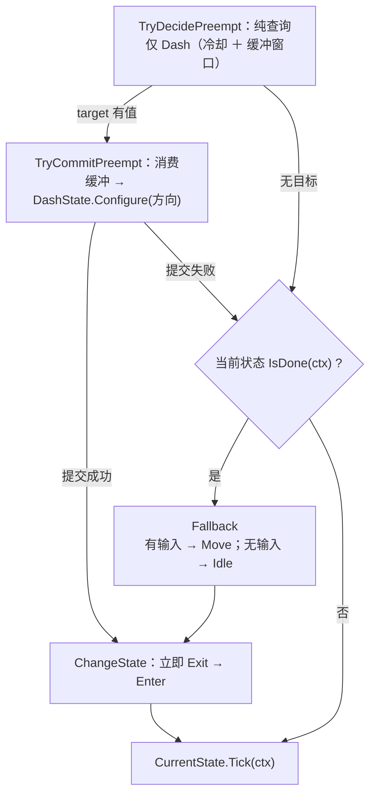
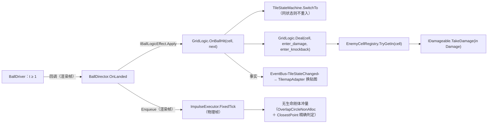
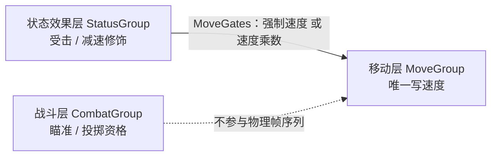

# 逻辑层

纯 C# 决策层：`Assets/Scripts/Logic/**` 内零 `MonoBehaviour`、零 `Update`/`FixedUpdate`、零 `UnityEngine.Time`。只读注入的 SO；唯一主动调 Data 层处是 `SceneService.Load` → `AssetModule.OnSceneSwitch()`。

## 1. 目录与命名空间

| 目录 | 命名空间 | 类型（举要） |
| :-- | :-- | :-- |
| `Logic/`、`Logic/Actor/` | `DeepseaOil.Logic` | `LogicContext`、`ITickable` / `IFixedTickable`、`ActorLogic`、`WorldInfo`、`EnemyLogic`、`EnemyBrain`、`EnemyIntent`、`EnemyMoveGroup`、`Steering`、`EnemyVisual` |
| `Logic/Actor/States/` | `DeepseaOil.Logic` | `EnemyChaseState`（敌人移动只有一个状态） |
| `Logic/Actor/Status/` | `DeepseaOil.Logic` | `StatusGroup`（**状态效果层**）、`StatusStateTag`、`HurtState`、`NormalState` |
| `Logic/Movement/`、`…/States/` | `…Movement[.States]` | `IMovementMotor`、`MoveGates`、`MovementStateTag`、`MovementStateChanged`、3 个状态类（`Idle` / `Move` / `Dash`） |
| `Logic/Player/` | `…Player` | `PlayerLogic`、`MoveGroup`、`CombatGroup`、`PlayerStats`、`PlayerHealth` |
| `Logic/Input/` | `…Input`（`GameState` 例外，见下） | `InputBuffer`、`InputType`、`InputSnapshot`、`UIInputLogic` |
| `Logic/Bounds/` | `…Logic` | `BoundsArea`（地图活动区域的**纯数据**矩形：`Min` / `Max` / `IsValid` / `TryClamp`） |
| `Logic/Event/` | `…Events` | `EventBus<T>`、`EventBus`、**12 个事件 struct**（4 旧的 ＋ `TileStateChanged` / `AimChanged` / `DropCollected` / `WaterBallCountChanged` / `PlayerHealthChanged` / `WaveChanged` / `RequestHudRefresh`；另有第 13 个 `MovementStateChanged` 住在 `Movement/`） |
| `Logic/Services/` | `…Service` | `IService`、`PauseService`、`SceneService`、`SaveService`、`IGameTime` |
| `Logic/Combat/` | `…Combat` | `Damage`（一次结算的全部事实）、`DamageSource`、`IDamageable`（目标端口）、`ContactDamage`（接触判定纯函数）、`IThrowSink`（＋`ThrowIntent`） |
| `Logic/Grid/`、`…/States/` | `…Grid[.States]` | `GridLogic`、`ITileState`、`TileStateMachine`、`TileTickQueue`、`TileContext`（＋`ITileScheduler` / `IDamageDealer` / `ITileSlowApplier` / `ISlowEffectTarget`）、`EnemyCellRegistry`、`GridGeometry`、`TileAim`、`GridQuery`、`MudTileState` |
| `Logic/Projectile/` | `…Projectile` | `BallData`、`IBallLogicEffect` / `IBallLogicEffectContext`、`TileStateLogicEffect` / `NullLogicEffect` |
| `Logic/Drop/` | `…Drop` | `IDropSpawner`、`DropSpawnRequest` |
| `Logic/Wave/` | `…Wave` | `WaveLogic`（＋嵌套 `SpawnRequest`） |
| `Scripts/Foundation/` | `DeepseaOil.Foundation` | 状态机骨架（`IState` / `StateBase` / `StateMachine` / `StateGroup` / `IStateHost`）、`Cooldown`、`Pool`、`Rng`、`YSort`、`Ballistics` —— **不属于任何层**，逻辑层只是它的消费者之一 |

目录名与命名空间**不一致的五处**（以此表为准）：`Actor/`、`Actor/States/`、`Actor/Status/`、`Bounds/` 都落 `DeepseaOil.Logic`（**不是**子命名空间）；`Event/` 是复数 `.Events`；`Services/` 是单数 `.Service`；`Input/GameState.cs` 落 `DeepseaOil.Logic`（同目录其余三件落 `.Input`）。

**状态机骨架已不在这里**：`IState` / `StateBase` / `StateMachine` / `StateGroup` / `IStateHost` 收进了 `Foundation/`（§4）。理由是它有**三个**消费者（移动 / 状态效果 / 敌人移动）而**不认识任何领域概念** —— 它读不到 `ctx.now`（上下文是泛型 `TContext`），也不知道"速度"是什么。

`ITickable` **有实现与调用**：实现者只有 `Logic/Input/UIInputLogic`，由 `GameRoot` 以接口字段持有、在 `Update` 里 `Tick`；`IFixedTickable` 有实现（`ActorLogic`），但仍**从不经接口分发** —— 全部调用都按具体类型走（`Logic/Tickable.cs`）。

### 1.1 允许出现的引擎类型

| 允许 | 理由 |
| :-- | :-- |
| `Vector2` / `Vector3` / `Vector4`、`Mathf`、`Color` 这类**纯数学结构** | 它们不依赖 `UnityEngine` 的任何运行时设施，EditMode 下可自由构造。禁掉它们只会逼出一套自造的向量类型，收益为负 |
| `EventBus` 里的 `Debug.LogException` / `LogWarning` | 既有的诊断出口 |

| 禁止 | 为什么 |
| :-- | :-- |
| `MonoBehaviour` / `GameObject` / `Transform` | 逻辑层不能"挂在物体上"，否则单测必须建场景 |
| `UnityEngine.Time` | 时间由 `LogicContext` 逐帧喂入，否则逻辑不可确定性重放 |
| `Collider2D` / `Rigidbody2D` / `Physics2D` / `Bounds` 等**与具体组件或物理模块绑定的类型** | 一旦出现，逻辑层就从"纯 C#"退化成"必须挂物理组件才能测" |

**最后一条曾在本工程被破过**：`BoundsArea` 一度直接持有 `BoxCollider2D`、`WorldInfo` 因此间接依赖物理模块，
与本文开头那句硬约束**直接矛盾**（而旧版本文档用"它不读 `UnityEngine.Time`"来给它背书——那是把两条不同的约束混成一条）。
现在 `BoundsArea` 只存两个 `Vector2`，**`BoxCollider2D` → `min/max` 的折算放回表现层的 `PlayerController.ReadBounds()`**：
这是"逻辑层零引擎类型"的代价，也是它的收益——折算只发生在一处，逻辑层拿到的永远是纯数据。

## 2. 帧驱动

**驱动入口只有两个，都在 `GameRoot`**（场景对象经 `ISceneRoot` 注册，见《表现层》§2）。收口前 `PlayerController.FixedUpdate` 与 `InputProvider.Update` 是第二、第三个自驱入口，"谁先跑"由 Unity 决定；现在帧内顺序是代码里的一个数字：**`Order` 玩家侧 `-100`、世界侧 `0`，小者先**。

| 通道 | 步 | 被驱动者 | 时间源 |
| :-- | :-- | :-- | :-- |
| 渲染帧 `Update` | ⓐ | `InputProvider.Sample()`（全工程唯一采样点）＋ `UIInputProvider.Sample → ConsumeSnapshot → UIInputLogic.Tick(UILogicContext)` | 帧（`WasPressedThisFrame` 等）／本帧快照＋`GameManager.CurState`（**不吃 `dt`**） |
| 渲染帧 `Update` | ① | `List<IService>` 逐项 `Tick` | `Time.unscaledDeltaTime` |
| 渲染帧 `Update` | ② | `AssetModule.Tick` | `Time.deltaTime` |
| 渲染帧 `Update` | ③ | 场景根 `RenderTick`：`PlayerController`（瞄准 ＋ 开火意图）→ `CombatRoot`（`GridLogic.Tick(Time.time, dt)` → 球 → 掉落物 → 各 `Fountain.Tick`） | `Time.time` / `Time.deltaTime` |
| 渲染帧 `Update` | ④ | `EffectModule.Tick` | `Time.deltaTime` |
| 物理帧 `FixedUpdate` | ① | 场景根 `FixedTick`：`PlayerController`（`ConsumeSnapshot` → 吸附 8 向并归一化 → `InputBuffer.Push` → `WorldInfo`/`LogicContext` → `PlayerLogic.FixedTick` → 边界保险丝）→ `CombatRoot`（落地冲量 → 敌人 → 玩家受击） | `Time.fixedTime` / `Time.fixedDeltaTime` |

- ③④ 与物理帧都吃 `timeScale`：暂停时渲染侧 `dt = 0` 自然冻结、物理侧 Unity 干脆不跑 `FixedUpdate`。
- **ⓐ 必须排在所有消费者之前**：`WasPressedThisFrame` 只在动态更新里有效，晚一步采样就等于丢掉这一帧的按下沿。
- **ⓑ 与 ③ 分开**：UI 输入是"面板操作"，与战斗输入无关，且它不吃 `dt`（同一次按键不该因为帧长不同被消费两次）。
- **物理帧里"玩家先于世界"是硬需求**：`CombatRoot.FixedTick` 的接触判定读的是"玩家这一帧提交后的位置"。

内部**没有分发机制**：`PlayerLogic.OnTick` 直接调 `_moveGroup.Tick(in ctx, gates)`，`MoveGroup.Tick` 直接调 `_machine.CurrentState.Tick(ctx)`；`GridLogic.Tick` 直接按队列逐个 `TileStateMachine.Tick(ctx)`。

## 3. ActorLogic：速度账本与外力的唯一写者

`ActorLogic : IFixedTickable, Foundation.IStateHost`，成员 `Velocity` / `FrameStartVelocity` / `SubmittedDelta` / `FixedTick` / `OnTick` / `Facing` / `SpeedScale` / `SetSpeedScale`。

- **速度真值只有引擎一份**：`Motor.Velocity` 帧首读作本帧基准（读到的是**上一物理步结束时**的值），**帧末唯一写出**；**零提交帧不写**，否则会覆盖引擎侧结果。`_delta` 是瞬变累进（格/秒，**不**乘 Δt），入口 `AddImpulse` / `SetVelocity` / `SetVelocityY` / `SetVelocityX`（private）/ `SnapVelocity`；`_accel` 是加速度累进（格/秒²），入口 `AddForce`，本帧贡献 = 值 × Δt。
- **速度乘数落在"目标速度"上，不落在已提交的速度上**（`SetSpeedScale` → `MoveTowards` 里 `speed * _speedScale`）。帧首复位为 1，所以它是"这一帧的门禁"，跨帧不留残余。⚠️ 改成"每帧乘一遍已提交速度"会与加速度形成拉锯：目标速度被乘小、加速度照旧往原目标推，稳态速度会停在约 `0.23` 而不是 `1.62`——**乘错位置不报错，只让减速变成"几乎定住"**。
- **外力唯一一处 `ApplyExtraForce(in ctx, Vector2 force)`**：参数由调用方给出，本类**不持有任何具体力的语义**——重力、浮力、水流、吸附、击退滑行都只是 `force` 的一种取值。强度缩放 `SetExtraForceScale`，`0` 即整段空转。本类**不自动调用**它：施不施加外力是角色自己的决策。**当前没有任何角色调用它**（俯视角玩家刻意不施外力，是设计意图而非未完成）；唯一调用点是测试探针 `移动Tests.LimitProbe`（M16 / M18）。
- **限速与外力是两件事**：`ClampSpeed(maxSpeed)` 按当帧 `Velocity` 整体覆盖，会撤掉待生效的加速度，故同帧两者并用时**先累加外力、后钳制**。
- **给状态类只开三个口**（`IStateHost`）：`MoveTowards(direction, speed)` / `BrakeTowards()` / `SnapVelocity(velocity)`。状态类因此不必知道账本内部怎么记 `_delta` 与 `_accel`。

**两条控制律，按配置分派**：`MoveTowards` / `BrakeTowards` 是状态类唯一能看到的入场口（`IStateHost`），它们按 `CharacterConfig.moveAcceleration` 分派 —— `≤ 0`（零惯性，玩家）走 `MoveDirection` / `StopMove`（当帧直达、当帧停）；`> 0`（有惯性，敌人：表里 14）走 `SteerTowards`（加速度限幅逼近，反向时改用指数衰减并取两支中较快的一支），衰减率取 `turnDecayRate`。于是"要不要惯性"是一个配置问题，而不是一次代码改动。

**没有生产消费者的旧口**（平台跳跃时代留下的窄口，留着是因为删掉它们并不会让代码更清楚）：`MoveHorizontal` / `BrakeHorizontal` / `StopHorizontal` / `ApproachX` / `SetVelocityY` / `FaceTowards` / `StartMoveLock`（连同 `IsMoveLocked` 这套移动锁） / `SetSpeedLimit`。其中 `ApproachX` 由 `MoveHorizontal` / `BrakeHorizontal` 内部调用、`FaceTowards` 由 `MoveDirection` / `SnapVelocity` 调用 —— 所以它们的"零调用"只指**外部**。测试探针真正用到的是 `ClampSpeed` / `ApplyExtraForce` / `SetExtraForceScale`（`移动Tests` M16 / M18）。**玩家专属账本**在 `PlayerLogic`：只剩 `_direction`（最近非零输入方向，供冲刺取向）与 `_pendingKnockback`（帧外挂起的击退）；冲刺冷却已挪进移动层的 `Cooldown`（§4）。Player 的 `Rigidbody2D` 为 `m_GravityScale: 0`：引擎重力整体关掉，速度全部由本层账本给出。

### 3.1 第二个消费者：敌人（`EnemyLogic`）

`ActorLogic` 的第二个子类，**"每帧只有一个速度写者"这条不变量在敌人身上同样成立**：

| 主题 | 契约 |
| :-- | :-- |
| 唯一写者 | `EnemyLogic`（经账本）。击退**不是**去写 `Rigidbody2D`，而是 `ApplyKnockback(impulse, direction)` 挂起一次冲量 |
| 目标来源 | `SetTarget(Vector2?)`；`null` 表示"没有目标"（走 `SteerTowards` 的指数衰减 ⇒ 滑停而不是定住） |
| 决策 | `EnemyBrain.Decide(in Context)`：纯函数，输入 `(Self, Target, HasTarget)`，输出 `EnemyIntent(Direction, Speed)`。**不认识引擎、不认识格子**，所以追击与停步的边界能在 EditMode 里钉住 |
| 移动 | `EnemyMoveGroup`（`StateGroup<MovementStateTag, LogicContext>`）只有一个状态 `EnemyChaseState`；速度门禁来自状态效果层 |
| 减速 | `StatusGroup.ApplySlow(scale, seconds)`（由 `CombatRoot` 按"谁站在这一格"施加），出口是 `MoveGates.SpeedScale`。**不再有 `SetSlowMultiplier`**：那是"角色每帧去查格子"，现在是"格子推一次修饰"（§7.5） |
| 受击 | `ApplyKnockback` → 挂起 → 下一物理帧由 `StatusGroup` 变成一次"进入受击" → `HurtState` 按 `hurtDecay` 滑停。**`BeginStun` 与 `stun_seconds` 已无消费者**（表列还在，见《技术文档_配表管线》） |
| 时间来源 | `Tick(now, deltaTime)` 用**零输入快照**组装 `LogicContext`（本类不吃输入，但时间必须是驱动方那一份） |
| 视效决策 | `EnemyVisual` 纯函数：身体色**四态查表**（正常 / 减速 / 闪烁 / 减速＋闪烁）、耐久文案（0 写空串）、闪烁相位（`sin`，频率为 0 不除零） |
| 追击决策 | `Steering.Resolve` 纯函数：三个"不动"条件（停止距离内 / 超出追击范围 / 方向为零）各自对应一类真实缺陷；速度恒为正且恒不超过基准 |

## 4. 状态机

骨架在 `Foundation/`，三处共用（移动 / 状态效果 / 敌人移动）：

| 类型 | 职责 |
| :-- | :-- |
| `IStateHost` | 状态类能看到的宿主：`Config` ＋ `MoveTowards` / `BrakeTowards` / `SnapVelocity`。**它是"骨架不认识逻辑层"的接口费** —— 没有它，骨架就得引用 `ActorLogic` |
| `IState<TStateTag, TContext>` | `StateTag` / `Enter` / `Exit` / `Tick` / `IsDone`；`TContext` 由消费者给（三处都传 `LogicContext`） |
| `StateBase<TStateTag, TContext>` | 持 `IStateHost`，把 `Config => Host.Config` 转发出去 |
| `StateMachine<TStateTag, TContext>` | `AddState` / `ChangeState`：`ChangeState(tag, in ctx)` 做 `Exit()` → 赋值 → `Enter(ctx)`，**立即、同步、同帧生效**；遇到重复标签静默覆盖、遇到未注册标签**或已是当前状态**都返回 `false`、不抛 |
| `StateGroup<TStateTag, TContext> where TStateTag : struct, System.Enum` | 仲裁两段式（下）＋ `StateChanged` 事件 ＋ `EmptyTag` / `Fallback` 两个抽象口 |

**仲裁两段式**：评估（`TryDecidePreempt`，纯查询）与消费（`TryCommitPreempt`）分开，是为了让 `target == 当前状态` 时不消费、也不遮掉 `IsDone`。

| 状态（`MovementStateTag`，`Empty` **永不注册**） | `Enter` / `Tick` | `IsDone` |
| :-- | :-- | :-- |
| `Idle` | `Tick` 里 `StopMove()`（速度当帧归零） | 输入出现（`Move.sqrMagnitude != 0`） |
| `Move` | `Tick` 里 `MoveDirection(Move, moveSpeed)`（**当帧直达**，无加减速） | 输入归零 |
| `Dash` | `Enter` 里 `SnapVelocity(方向 × dashSpeed)`；`Tick` 空 | `dashDuration` 到（**计时三行在 `DashState` 自己的字段里**） |

`Dash` 是唯一由 `TryDecidePreempt` 抢占的状态。冲刺方向在切换前由 `Configure` 喂入：有输入用输入方向，无输入用最近朝向。**`TimedStateBase` 已删除**：它只有 `DashState` 一个子类，而"读 `ctx.now` 计时"要么让骨架认识具体上下文、要么给骨架发明一个时间接口——为一个子类付这个价不值，那三行留在 `DashState` 里。

状态效果层是同一个骨架的第二个实例：`StatusStateTag { Empty, Normal, Hurt }`，`Fallback` 恒为 `Normal`，门禁出口是 `StatusGroup.Gates`（§7.5）。

## 5. 输入契约

| 契约 | 内容 | 位置 |
| :-- | :-- | :-- |
| 唯一采样点 | `InputProvider` 采样 `InputSys` 与指针；**它不再自驱** —— `GameRoot` 在 `Update` 的 ⓐ 步调 `Sample()`（`RegisterInputProvider` 注册） | `Presentation/Input/InputProvider.cs` |
| 唯一按键沿存储点 | `InputBuffer`；宿主**不得**自存"上一帧输入" | `Input/InputBuffer.cs` |
| 调用顺序 | 同一物理帧内 `Push` **必须先于** `PlayerLogic.FixedTick`；倒序会让本帧按下沿落到下一物理帧才可见 | `PlayerController.FixedTick` |
| 缓冲容量 | 容量是**独立参数**（`PlayerConfig.inputBufferTime` 0.12s），各输入各自的响应窗口仍由自己的参数给出（如 `dashBufferTime`）；容量必须 **≥** 所有窗口，否则窗口内的按下会被挤出历史 | `PlayerController.Awake` |
| 窗口是参数不是字段 | `CanConsume(type, now, window)` / `TryConsume(type, now, window)`；窗口是**闭区间**（`now - window <= t <= now`），失效时间用 `float.NaN` | `InputBuffer.cs` |
| 消费与容量 | 不读 Unity Time、必须单调不减；`CanConsume` 纯查询可重复调用，`TryConsume` 成功一次即作废；`Capacity = Max(1, CeilToInt(bufferSeconds × sampleRatePerSecond))`，`EffectiveSeconds = Capacity / SampleRatePerSecond` | `InputBuffer.cs` |
| 入账与清空 | 入账的只有有消费者的按下沿（`DashPressed` / `JumpPressed`）；松开沿曾供可变跳高使用，已随跳跃曲线删除。`Clear()` 清快照、写指针与全部按下时间 | `InputBuffer.cs` |
| 🔴 D25 | 采样率在 `PlayerController.Awake` 固定（`RoundToInt(1 / Time.fixedDeltaTime)`）→ 事后改 Fixed Timestep 会使实际窗口与 `EffectiveSeconds` 不一致 | `PlayerController.cs` |

`InputSnapshot` 字段：`Move`（−1..1，**宿主侧已吸附到 8 向并归一化**，见 §5.1）、`JumpPressed` / `DashPressed`（按下沿）、`GrabHeld`。`JumpPressed` 与 `InputType.Attack` **都没有消费者**：键位（空格）保留在 action map 里，等策划定稿后的新用途。

### 5.1 方向归一化：谁做、在哪做（唯一一处）

| 环节 | 责任 |
| :-- | :-- |
| `InputProvider` | 采样 `InputSys`，`ClampMagnitude(move, 1)` —— 只保证不超 1，**键盘斜向仍是 (1,1)，模长 √2** |
| `PlayerController.SnapMoveToEightDirections` | **归一化与吸附的唯一实现点**，静态纯函数（不吃实例状态、不吃 `Time`），所以 EditMode 测试能直接调它（`移动Tests.M17`） |
| `InputBuffer` | 存的必须是**已归一化**的那份快照：`PlayerController` 用它重建 `InputSnapshot` 再 `Push` |
| `WorldInfo.MoveDirection` | 契约：非零时模长恒为 1 |
| `PlayerLogic._direction` | 再归一化一次（自有兜底，防宿主违约），供冲刺取向与后续技能 |
| `DashState.Configure` | 第三次归一化，把"必须是单位向量"收在入场方向的唯一写入口 |

**为什么同一件事在三处各做一次**：不是冗余，是拒绝"靠调用方守契约"。
任一处漏掉都不报错，只表现为斜向快 √2 倍或冲刺超速——这类缺陷靠注释是守不住的，只能靠"每层自己兜底 + 测试钉住"。
`移动Tests.M2` / `M6` / `M17` 就是那三颗钉子（喂**未归一化**的 (1,1)，而不是喂 (0.7071, 0.7071)）。

## 6. 端口、事件与 Service

| 端口（Logic 定义） | 实现 |
| :-- | :-- |
| `IMovementMotor`（`Movement/IMovementMotor.cs`）：`Velocity` / `Position` / `Facing` / `Move(Vector2)` / `SetPosition(Vector2)` | `PlayerMotor` / `EnemyMotor`（`Adapters/`，同一个抽象基类 `ActorMotor`，它的 `Facing` 读写 `localScale.x` 符号） |
| `IDamageable`（`Combat/IDamageable.cs`）：`IsDead` / `Position` / `TakeDamage(in Damage)` | `EnemyActor`（`Presentation/Actor/EnemyActor.cs`） |
| `ISlowEffectTarget`（`Grid/TileContext.cs`）：`ApplySlow(float, float)` | `EnemyActor`：减速修饰的**落点**（`CombatRoot` 按格找到它） |
| `ITileScheduler` / `IDamageDealer`（`Grid/TileContext.cs`）：状态提交 Tick / 请求状态转换；对格上目标结算 | `GridLogic` 自己实现（两个口都收在门面里） |
| `ITileSlowApplier`（`Grid/TileContext.cs`）：`ApplySlow(cell, scale, seconds)` —— 状态只提交"这一格续一次减速" | `CombatRoot`：只有它同时认识"玩家在哪"与"这一格站着哪些敌人" |
| `IBallLogicEffectContext`（`Projectile/IBallLogicEffect.cs`）：`RequestTileState(cell, state)` | `BallDirector`（`Presentation/Ball/`）→ `GridLogic.OnBallHit` |
| `IThrowSink`（`Combat/IThrowSink.cs`）：`RequestThrow(in ThrowIntent)` —— 落点合法性是世界信息 | `CombatRoot`：判据是"那一格有没有地板"（`GridLogic.HasCell`） |
| `IDropSpawner`（`Drop/IDropSpawner.cs`）：`TrySpawn(in DropSpawnRequest)` | `DropDirector`：喷泉不认识掉落物实体，只认识"产出一颗" |
| `IGameTime`（`Services/IGameTime.cs`）：`SetTimeScale` / `UnscaledDeltaTime` / `TimeScale` | `GameTime`（`Adapters/GameTime.cs`） |
| （音频没有 Logic 端口） | 音频服务是表现层的 `AudioManager`（`Presentation/Audio/AudioManager.cs`，实现 `IService`），由 `GameRoot` 装配。**复核更正**：旧文档登记的 `IAudioService` 在当前树中零声明、已删除 |

`IDamageable` 为什么带 `Position` 与 `IsDead`：结算方手里只有一个接口引用，而"从落点指向受害者"必须知道受害者在哪（否则只能反过来问表现层每个目标的位置，等于把接线还给调用方）；`IsDead` 是给"已死但还没被销毁"那个窗口用的 —— 遍历该格敌人列表时可能正在进行中，少了它会对尸体重复结算。实现方契约：`TakeDamage` 不抛异常，且 `Damage.Amount == 0` 时不扣血（只做被显式要求的击退）。

地图活动区域 `BoundsArea` 是**逻辑层类型**（`Logic/Bounds/`），但它是**纯数据**：组合根在表现层把 `BoxCollider2D` 折算成 `min` / `max` 后经 `WorldInfo` 逐帧喂入（见 §1.1）。它不读 `UnityEngine.Time`，只在越界时给出钳位后的坐标；未接线（默认值）时 `IsValid` 为 false、原样返回位置——**不钳位是安全降级**，无条件 `Mathf.Clamp` 会把忘接线的玩家钉死在地图原点。

跨层事实只经 `EventBus<T>`（**12 ＋ 1 个 struct，全部是"事实"或"意图"，没有载荷对象**）：

| 事件 | 发布方 → 订阅方 |
| :-- | :-- |
| `RequestPause` / `RequestResume` | `BeginPanel` / Esc → `PauseService`（**意图**） |
| `GamePaused` / `GameResumed` | `PauseService.SetPaused` → `PlayerController`（关输入、清缓冲） |
| `RequestChangeScene` | `TestChangeScene` 等 → `SceneService.Load` ＋ `GameRoot`（清特效） |
| `RequestHudRefresh` | `HudPanel.ShowMe` → `CombatRoot`（**意图**：面板异步加载，晚一帧才存在） |
| `TileStateChanged` | `GridLogic` → `TilemapAdapter`（换贴图）＋ `EventBusDebugPanel` |
| `AimChanged` | `CombatGroup`（去重后）→ `TileHighlightView`（转成一次特效调用） |
| `DropCollected` | `DropActor` → `CombatRoot`（按种类裁决给玩家什么） |
| `WaterBallCountChanged` / `PlayerHealthChanged` | `PlayerStats` / `PlayerHealth` → `HudPanel` |
| `WaveChanged` | `CombatDirector` → `HudPanel` |
| `MovementStateChanged` | `MoveGroup` → `MovementDebugPanel` |

**发布方是数据的持有者**：数据变了由它自己发事实，避免"忘了发 ⇒ HUD 静默不更新"这种缺陷埋在调用点里。`DebugEvent` 已删除（它从来没有发布方）；`EventBusDebugPanel` 改为订阅 `TileStateChanged`，于是它显示的是真实流量。

`IService`：`Init()` / `Tick(float unscaledDeltaTime)` / `Dispose()`；四个 Service 由 `GameRoot.Assemble()` 建（**不是** `GameRoot.Start` —— `GameRoot` 没有 `Start`）：`Pause` / `Scene` / `Save` 三个是 `new`，`Audio` 是 `new AudioManager(transform)`；顺序 `[Pause, Scene, Save, Audio]` 既是 `Init` 序也是每帧 `Tick` 序、还是拆除序。`SceneService.Load` 依次 ① 复位 `timeScale`（**复核更正**：该行在当前实现里已被注释掉，实际的时间复位并入 ② 的 `PauseService.SetPaused(false)` 内部）② `PauseService.SetPaused(false)` ③ `EventBus.ClearAll()` ④ `AssetModule.OnSceneSwitch()` ⑤ `SceneManager.LoadScene`。

🔴 **D8** `SaveService.Save` 不赋值、`Load` 恒返回 `default`；~~**D9** `SceneService.Load` 全仓库零调用点~~ → **不成立**（`Assets/Tests/Scene/TestChangeScene.cs:15` 是真实发布方；但正式关卡还没有触发入口）；**D10** ~~`IService.Dispose` 无人调用~~ → **不成立**（`GameRoot.OnDestroy` 逐项 `Dispose()`；仍零调用的只有 `PauseService.Reset()`）；**D16** 暂停时 `inputProvider.SetInputEnabled(false)` 内部已 `Clear()`，故它必须先于 `_buffer.Clear()`。

## 7. 格子与战斗切片

### 7.1 格子六件套的职责边界

| 类型 | 只负责 | 明确不管 |
| :-- | :-- | :-- |
| `GridLogic`（门面） | 持有"哪些格有状态"、调度 Tick、落地 → 状态转换、对格上目标结算伤害、把"世界 ↔ 格"转发给 `GridGeometry` | 不知道 Tilemap / 物理 / `Time`（时间由 `Tick(now, dt)` 喂入） |
| `ITileState`（状态） | 三个钩子 `OnEnter` / `OnTick` / `OnExit` | 不知道别的格、不知道视觉、**也不提供"我减速多少"的查询**（效果是推，见 §7.5） |
| `TileStateMachine`（单格状态机） | 切换语义（同状态不重入、`Exit → 造新实例 → Enter`） | 不管 Tick 调度（在队列里） |
| `TileTickQueue`（双缓冲队列） | "哪些格下一帧要 Tick"（同帧去重、一次性消费） | 不管"什么时候"（延迟由状态自己用 `ctx.Now` / `DeltaTime` 管理） |
| `TileContext`（回调环境） | 把 `Cell` / `Now` / `DeltaTime` ＋ 四个端口（`Scheduler` / `Dealer` / `Slow`）递给状态 | 不持有可变状态 |
| `EnemyCellRegistry`（归属表） | 敌人 → 格 的单点映射（存 `IDamageable`，一格可多个） | 不结算、不查询状态 |

**两条不变量**：①**每格一份状态实例**（`SwitchTo` 走工厂造新对象）—— 共享实例会让全场格子共用一个计时器；②**常规格零常驻**（落回 `Normal` 时整台状态机从字典里删掉）。

### 7.2 一次落地的完整链路（球不伤害任何人）

- **冲量必须在物理帧施加**（`Rigidbody2D.velocity` / `AddForce` 只在 `FixedUpdate` 与下一次 `Simulate` 之间生效）；落地（渲染帧）只入队，所以是队列而不是单字段。
- **顺序即语义**：先改格（同帧内就把伤害结算掉，可能把敌人打死并注销自己）、后排冲量 —— "这一格发生了什么"先成立，"无生命刚体被推到哪"随后发生，两者不会互相看见半成品状态。
- **结算前对目标列表做快照**：受害方可能在 `TakeDamage` 里死亡并注销自己，直接在原列表上遍历会改到正在遍历的集合。
- **落地不再播特效**：唯一的落地表现件（落地环）已随它那次"只服务一个调用点"的清理删除，`EffectCatalog` 现在 4 行（HitSpark / MudSplash / EnemyShatter / TileHighlight）。

### 7.3 其余逻辑类型的契约

| 类型 | 契约 |
| :-- | :-- |
| `WaveLogic` | 只管"何时刷 / 刷几只 / 刷在哪"（输出 `SpawnRequest` 列表）；**不建物体**，也不认识敌人 —— 场上还有没有活人由驱动方（`CombatDirector`）数好喂进来 |
| `PlayerHealth` | 血量 ＋ 无敌帧 ＋ 重置；`CanTakeDamage(now, until)` 是**静态纯函数**（写成 `!(now < until)` 让 `NaN` 落到"可以受伤"一侧）；自己发布 `PlayerHealthChanged` |
| `PlayerStats` | 血量（持 `PlayerHealth`）＋ 水球计数；`TryConsumeWater` 不足时**不改动任何状态**；`Announce()` 供 HUD 重播 |
| `CombatGroup` | 战斗层：瞄准格（吸附走 `TileAim`）＋ 投掷资格（`Cooldown`）＋ 弹药扣减；`UpdateAim` 只发布**去重后**的 `AimChanged`，其中 `AimAvailable` ＝ **射程内 ＋ 冷却就绪 ＋ 有水球**（土球是副攻击、不吃弹药，所以不参与这一条）—— 它就是瞄准格高亮"白 / 红"的判据；`RequestThrow` 被世界侧否决时**什么都不发生**（不扣弹药、不进冷却） |
| `MoveGroup` | 移动层：持 `Cooldown`（冲刺）与三个状态；`Tick(ctx, gates)` 里**先**把速度乘数交给账本、再跑状态、最后 `ApplyGates` 写强制速度 —— **全工程唯一"按上层要求改速度"的地方** |
| `Rng` / `IRng` | 随机来源，已收进 `Foundation/`；默认 `System.Random` ＋ **固定种子**（每局可复现）；测试可 `SetImpl` 整体替换。`Fountain` 的落点散布是它唯一的运行时消费者 |
| `BallData` | 不可变飞行数据；`SampleGround` 是贴地直线（阴影走它）、`SampleVisual` 加弧高（弧高算式在 `Foundation/Ballistics.ArcHeight01`，与掉落物共用一份）；时长按飞行距离缩放 |
| `Damage` | `Point` / `Direction` / `Amount` / `Impulse` / `Source`；`HasDamage` 与 `HasKnockback` **互相独立**（0 伤害 ＋ 有冲量 = 只推不扣） |
| `ThrowSpec` / `BallDefinition` | 数据层 DTO：`ThrowSpec` 构造时兜底非法值（`NaN` 会一路乘进落点）；`BallDefinition.TileState` 决定"这颗球落地改不改格子"（`HasLandingEffect`） |
| `DropDefinition` / `DropType` | 掉落物取值：飞行时长 / 弧高 / 追踪速度 / 领取距离 / 数量。`DropCatalog.Water()` 是当前的唯一定义处（**代码内定义，不是表**） |

### 7.4 可测边界（`战斗框架Tests.cs`，65 条；全仓 EditMode 共 132 条）

**能测的**：几何换算、瞄准吸附、空间查询、队列语义、状态机与伤害节奏、归属表、抛物线、伤害结构、追击决策（`EnemyBrain` / `Steering`）、**受击滑停的数值契约与"滑停后还能重新贴上来"**、视效四态、无敌帧判据、波次时序、随机可复现、**减速修饰的净化与"乘在目标速度上"**。

**测不了的（只能人工 Play）**：`MonoBehaviour` 生命周期、`Tilemap`、`Physics2D` 接触、`EffectModule`、`UIMgr`、鼠标设备。

**教训（一条真实红）**：凡"跑固定 N 帧后断言状态恰好翻转"，在 `_timer -= dt` 这种浮点累减的计时上都**不成立**（`1.5f` 连减 30 次 `0.05f` 还剩 `+3.05e-7`）。正确形态是"帧数由配置算出 ＋ 少数几帧的时间窗"，且窗口必须小于相邻事件的间隔，否则"一只一只出"会被容差放过去。

### 7.5 串行门禁：状态效果层 → 战斗层 → 移动层

角色身上的"外部影响"不直接改速度，而是**逐层往下传门禁**，只有最底下的移动层有写速度的权限：

- **门禁有两种，互斥**：`MoveGates.Forced(v)`（受击滑停期间整条接管速度）与 `MoveGates.Scaled(s)`（速度乘数）。受击时不叠乘数 —— 外力滑停不该被地面减速拖短。
- **乘数落在目标速度上**（§3）；**强制速度写在状态之后**（状态会整体接管速度，写在它们前面等于没写——旧实现"挨打了却纹丝不动"的成因之一）。
- **对外的入口是 `SpeedScale` 而不是 `MoveGates`**：世界侧（`CombatRoot` 的减速施加、`EnemyActor` 的视效）只读得到"这一帧乘多少"，看不到门禁的组合方式。

**泥浆减速是"推"而不是"被查询"**（这是 6.2 那批的口径变更）：

| 环节 | 谁做 |
| :-- | :-- |
| 提交 | `MudTileState.OnTick` 每帧（`SlowRefreshSeconds = 0.1f`）调 `ctx.Slow?.ApplySlow(cell, _spec.SlowFactor, 0.1f)` —— 状态**不持有、也不查询**"谁站在这一格" |
| 执行 | `CombatRoot.ApplySlow`：玩家按 `WorldToCell(player.Position)` 直接判（玩家不在归属表里），敌人走 `EnemyCellRegistry` 找到 `ISlowEffectTarget` |
| 落点 | `StatusGroup.ApplySlow`：写 `_slowScale` ＋ `_slowRemaining = seconds`（"续命"），`Tick` 里按 Δt 递减 |
| 出口 | `MoveGates.Scaled(SlowScale)` → `ActorLogic.SetSpeedScale` → 目标速度 |

**"续命"而不是"开关"的好处**：施加方不需要知道什么时候撤销 —— 离开泥浆 ⇒ 不再续命 ⇒ 修饰自然过期（0.1s 内）；暂停 ⇒ 格子不 Tick ⇒ 恢复后立刻续上。
