# 架构图集

**图是主体**：16 张图回答「谁依赖谁、一次调用怎么走、某个功能怎么实现」。论述与契约看 [框架蓝图.md](框架蓝图.md)，逐层细节看 [分层设计/](分层设计/)，本文不重复，只画源码里的事实。

## 0 · 图目录与选型

| # | 图名 | 类型 | 回答什么问题 | 节点 / 消息 | Mermaid 最低版本 |
| :-- | :-- | :-- | :-- | :-- | :-- |
| 1 | 分层与程序集依赖总览 | flowchart LR | 三层、生成物、地基之间允许哪些边 | 8 节点 / 12 边 | ≥ 9.1（subgraph 内 `direction`） |
| 2 | 数据层内部结构 | flowchart TD | `AssetModule` 的六个微块各管什么 | 20 节点 / 23 边 | ≥ 9.1 |
| 3 | 逻辑层内部结构 | flowchart TD | 账本、串行门禁、状态机骨架、服务与端口的分工 | 20 节点 / 27 边 | ≥ 9.1 |
| 4 | 表现层内部结构 | flowchart TD | 三个组合根（本图展开它们的三支）与战斗切片各件的归属 | 20 节点 / 20 边 | ≥ 9.1 |
| 5 | 端口与适配器 | classDiagram | 逻辑层定义的接口由谁实现、怎么注入 | 16 类 / 17 关系 | ≥ 9.0 |
| 6 | 组合根装配出的对象图 | classDiagram | 运行期谁持有谁、谁回指谁 | 18 类 / 21 关系 | ≥ 9.0（泛型用 `~T~`） |
| 7 | 启动装配时序 | sequenceDiagram | 常驻进程根的装配、场景根的注册与推迟装配、两次幂等守卫 | 22 消息 | ≥ 9.0（`autonumber`） |
| 8 | 每帧驱动时序 | sequenceDiagram | 渲染帧与物理帧各自的顺序 | 19 消息 | ≥ 9.0 |
| 9 | 一次物理帧的完整调用链 | flowchart TD | 从 `GameRoot.FixedUpdate` 到 `Rigidbody2D.velocity` | 23 节点 / 23 边 | ≥ 9.1 |
| 10 | 移动仲裁决策 | flowchart TD | 「该不该切状态」的两段式判定 | 12 节点 / 17 边 | ≥ 9.1 |
| 11 | 移动状态机流转 | stateDiagram-v2 | 3 个状态之间所有真实可达的转移 | 3 状态 / 9 转移 | ≥ 9.0 |
| 12 | 事件总线流向与暂停闭环 | flowchart LR | 暂停闭环 4 个事件类型的发布方、订阅方与唯一闭环 | 19 节点 / 19 边 | ≥ 9.1 |
| 13 | 资源异步加载全链路 | sequenceDiagram | `LoadAsync` 未命中 → 入队 → 成功/失败两分支 | 23 消息 | ≥ 9.0（`alt`） |
| 14 | 缓存条目状态机 | stateDiagram-v2 | `CacheEntry` 六字段驱动的全部状态 | 9 状态 / 17 转移 | ≥ 9.0 |
| 15 | UI 面板显示链路 | sequenceDiagram | `ShowPanel` 到面板落进面板自己声明的层 | 14 消息 | ≥ 9.0 |
| 16 | 配置查询链路 | flowchart LR | xlsx → JSON → `ConfigModule` → 调用方 | 18 节点 / 18 边 | ≥ 9.1 |

> 节点 / 边 / 消息数按 mermaid 声明行计数（本轮已用脚本复算，见下方口径），非估算：flowchart 数「节点声明行 / 连线行」，classDiagram 数「`class` 行 / 关系行」，stateDiagram 数状态名与转移行（`[*]` 不计状态），sequenceDiagram 只数消息行（`participant` 与 `Note` 不计）。
> 复算口径（可重跑）：按 `### 图 N` 切块取 ```mermaid 围栏内的正文，剔除 `subgraph` / `end` / `direction` / `classDef` / `linkStyle` 行；flowchart 的节点 = 正文里"标识符 ＋ `[`/`{`/`(` 起始"的**去重**集合，边 = 含 `-->`/`-.->`/`---`/`==>` 的行数；classDiagram 的类 = `class X` 行数（关系里出现的未声明类按 mermaid 的自动声明处理，不计入），关系 = `^\s*\w+\s*` 后跟 `..|>`/`--|>`/`-->`/`*--`/`..>` 的行数；sequenceDiagram 的消息 = `^\s*\w+\s*->>` 或 `-->>` 的行数。

| 记号 | 含义 |
| :-- | :-- |
| 实线箭头 `-->` / `->>` | 源码里真实存在的调用、持有或数据流 |
| 虚线箭头 `-.->` / `..>` | 端口实现、只读访问，或**零调用点**的契约 |
| `*--` / `..|>` / `--|>` | classDiagram 的组合 / 实现 / 继承 |
| `alt` + `else` | sequenceDiagram 的互斥分支 |
| 图题里的 `【事实】` | 逐行读源码可复核 |
| 图题里的 `【推断】` | 由注释、prefab 数据或常量推出，源码没有直接断言 |

## 1 · 依赖关系

### 图 1 · 分层与程序集依赖总览　【事实】跨层只有三类边：数据层被直连查询、逻辑层与表现层之间只走 `EventBus<T>`、组合根直连是唯一例外

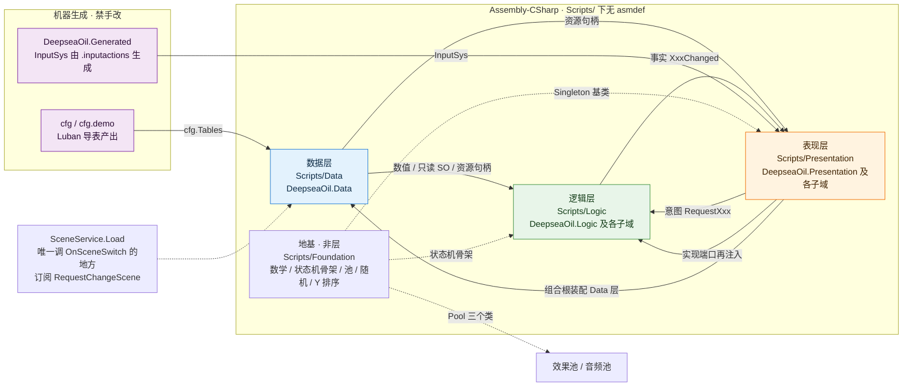

【事实】数据层**刻意不继承** `Singleton<T>`：`ConfigModule` / `AssetModule` / `DataMetrics` 都是 `static class` ＋ 显式 `Init`。
【事实】**复核更正**：`Foundation/Pool.cs` 不再是"零调用方"——`PoolInClass` 被 `AudioManager` 用了两处，`Pool<GameObject>` 被 `ParticleDriver` 与 `EnemyShatterDriver` 各用一处。反过来 `BaseManager<T>` 已经**整个删除**（音频收口后它只剩零个消费者），判据：`收口一致性Tests.反射单例基类已退场`。
【事实】**状态机骨架也在地基**：`IState` / `StateBase` / `StateMachine` / `StateGroup` / `IStateHost` 三个领域（移动 / 状态效果 / 敌人移动）共用，所以它必须是无层件——它不认识 `LogicContext`（上下文是泛型 `TContext`），只认识 `IStateHost` 那三个速度写入口。

### 图 2 · 数据层内部结构　【事实】`AssetModule` 是唯一对外门面，六个微块全部 `internal sealed`，跨层只能看到它

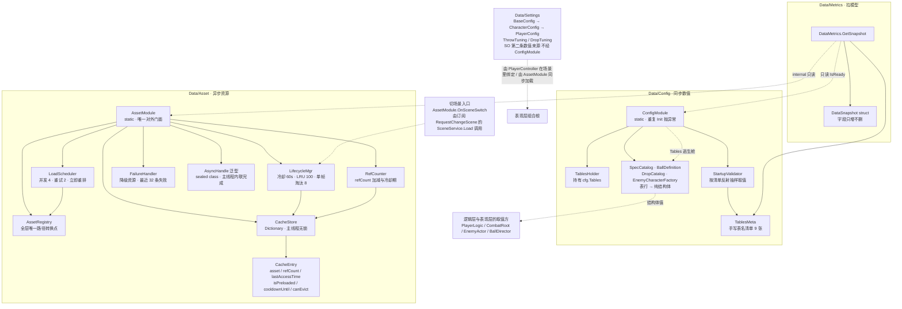

【事实】失败路径**不写缓存**：`onFail` 只 `RecordFailure` ＋ `DispatchPending(fallback)`，没有 `Put`——与 [数据层.md](分层设计/数据层.md) 的状态图有实质分歧，见图 14。
【事实】`SpecCatalog` 是"表行 → 纯结构体"的唯一折算点（`BallDefinition` / `TileStateSpec` / `EnemySpec` / `PlayerSpec` / `WaveSpec` / `TileInitialSpec`）；`DropCatalog` 今天只是把 `DropTuning` 的字段转发成 `DropDefinition`（掉落物还不走表）；`EnemyCharacterFactory` 把 `EnemySpec` 折成一份**不落盘**的 `CharacterConfig`（按种类缓存）。三者都在 `Data/Config/`，与 `Config` / `Asset` 两个模块零类型依赖。

### 图 3 · 逻辑层内部结构　【事实】账本只管速度、门禁只管"该被推成什么样"、状态机只管切换，三者互不知道对方实现

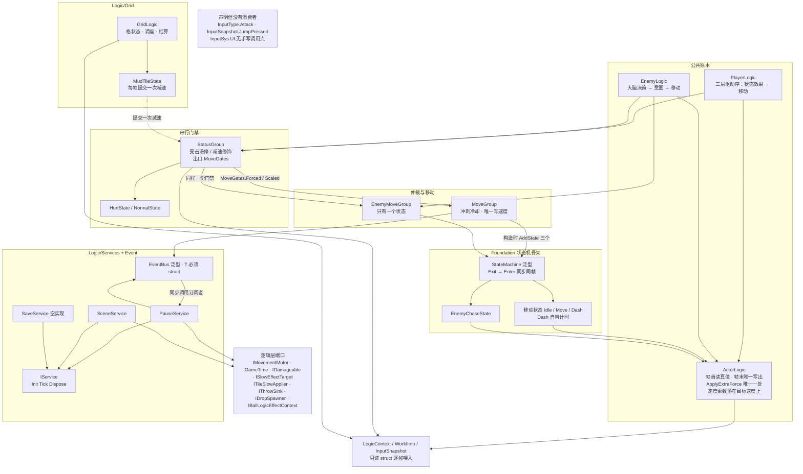

【事实】**复核更正**：`SceneService.Load` 不再是零调用点——它是 `EventBus<RequestChangeScene>` 的订阅者，`Assets/Tests/Scene/TestChangeScene.cs` 是真实发布方，只是正式关卡还没有触发入口（《框架蓝图.md》D9）。`PauseService.Reset` 仍零调用。
`ApplyExtraForce` / `ClampSpeed` 的处理与它们**不同**：生产代码里零调用，但测试探针 `移动Tests.LimitProbe` 真的调了两者（覆盖 M16 / M18）——所以"零调用"这三个字对它们不成立，见图 9 的脚注。
【事实】`MUD → SG` 是虚线：泥浆**不认识**任何角色，它只提交"这一格续一次减速"，由 `CombatRoot`（`ITileSlowApplier`）按"谁站在这一格"落到 `StatusGroup.ApplySlow`。
【事实】**`TimedStateBase` 已删除**：它只有 `DashState` 一个子类，而"读 `ctx.now` 计时"要么让骨架认识具体上下文、要么给骨架发明一个时间接口；那三行计时现在就在 `DashState` 自己的字段里。

### 图 4 · 表现层内部结构　【事实】三个组合根是唯一允许跨层直连的地方（本图展开 `GameRoot` / `PlayerController` / `CombatRoot` 三支），其余一律走 `EventBus<T>` 或只读属性

```mermaid
flowchart TD
  subgraph ROOT["Presentation/Root · 组合根（本图展开三支）"]
    GR["GameRoot<br/>进程级装配 · 两个帧通道"]
    PC["PlayerController<br/>Order -100"]
    CR["CombatRoot<br/>Order 0 · 战斗切片组合根"]
  end
  subgraph ADP["Presentation/Adapters · 端口实现"]
    PM["PlayerMotor / EnemyMotor<br/>同一个抽象基类 ActorMotor<br/>Rigidbody2D ＋ 幂等 Initialize"]
    GT["GameTime 实现 IGameTime<br/>全工程唯一写 timeScale"]
    TA["TilemapAdapter<br/>格子几何 ＋ 换状态贴图"]
  end
  subgraph PIN["Presentation/Input"]
    IP["InputProvider<br/>唯一采样点 · 由 GameRoot 调 Sample"]
  end
  subgraph UIG["Presentation/UI"]
    UM["UIMgr<br/>三件套 prefab ＋ 四层父对象 ＋ panelDic"]
    BP["BasePanel<br/>扫 UIBehaviour 自动绑定"]
    MMR["MonoMgr 继承 Singleton<br/>只作协程宿主"]
  end
  subgraph SLICE["战斗切片（CombatRoot 的子件）"]
    BD["BallDirector / BallActor / ImpulseExecutor"]
    DD["DropDirector / DropActor / WaterBallDrop"]
    FNT["Fountain<br/>产出方 · 只认识 IDropSpawner"]
    CD["CombatDirector / EnemyActor"]
  end
  subgraph DBG["Presentation/Debug"]
    MDP["MovementDebugPanel<br/>OnGUI 读逻辑层"]
    EBP["EventBusDebugPanel<br/>订阅 TileStateChanged"]
  end
  ISY["生成物 InputSys<br/>Player 与 UI 两张动作表"]
  EBS["逻辑层 EventBus 泛型"]
  PL2["逻辑层 PlayerLogic"]
  SVC2["四个 IService：Pause / Scene / Save ＋ AudioManager"]
  GR -->|"Assemble 里 new 并 Init"| UM
  GR -->|"new"| GT
  GR -->|"services.Add 按序 Init"| SVC2
  GR -->|"RegisterSceneRoot 后按 Order 装配并驱动"| PC
  GR -->|"RegisterSceneRoot 后按 Order 装配并驱动"| CR
  GR -->|"ⓐ 步 Sample"| IP
  PC -->|"SerializeField 绑定具体类型"| PM
  PC -->|"new PlayerLogic"| PL2
  PC -.->|"订阅 GamePaused 与 GameResumed"| EBS
  CR -->|"new 并 Attach"| BD
  CR -->|"new 并 Attach"| DD
  CR -->|"Attach 注入 IDropSpawner"| FNT
  CR -->|"AddComponent 并 Initialize"| CD
  CR -->|"Attach / Detach"| TA
  CR -->|"ConfigureAim 注入裁决口"| PL2
  UM -->|"Instantiate 三件套"| BP
  UM -->|"StartCoroutine"| MMR
  IP -->|"只 Enable Player 表 ＋ 直读 Mouse.current"| ISY
  MDP -.->|"订阅 MovementStateChanged"| EBS
  EBP -.->|"订阅 TileStateChanged"| EBS
```

【事实】`MonoMgr` 的三路转发（`AddUpdateListener` 等）零调用；它只被 `UIMgr` 当作 `StartCoroutine` 的宿主，且**全仓唯一保留的 MonoBehaviour 自驱件**（判据：`收口一致性Tests.逐帧回调只出现在白名单里` 的白名单是 `GameRoot` 与 `MonoMgr`）。
【事实】现有 5 个面板（`Assets/Resources/ui/Panel/`）：`BeginPanel` / `HudPanel`（`Layer` 为 `Bottom`）、`PausePanel`（`Middle`）、`SettingPanel` / `ExitConfirmPanel`（`Top`）；`ShowPanel<T>(callBack, isSync)` 签名里**没有**层级参数，面板落在哪一层由实例自己的 `Layer` 属性决定。
【事实】`UIMgr` 不再是 `BaseManager` 子类：`GameRoot.Assemble()` 直接 `new UIMgr()` ＋ `Init()`。战斗切片各件**不是**场景根：它们由 `CombatRoot` 造、持、驱（`Fountain` 是场景里摆的，但由 `CombatRoot` 逐帧 `Tick`）。

### 图 5 · 端口与适配器　【事实】逻辑层定义的端口由表现层实现——依赖方向永远是「端口 ← 实现」，端口住在"需要它"的那个文件里

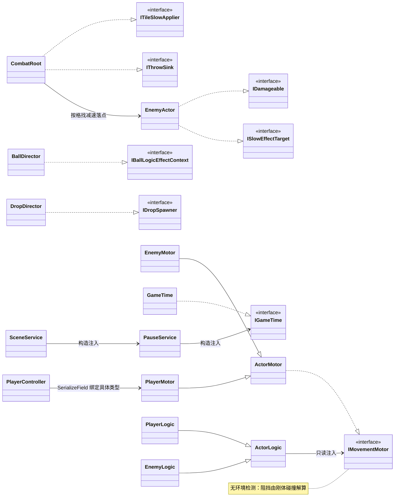

【事实】端口一共 8 个，**住在定义它的文件里**而不是集中在一个 `Ports.cs`：`IMovementMotor`（`Logic/Movement/`）、`IGameTime`（`Logic/Services/`）、`IDamageable`（`Logic/Combat/`）、`IThrowSink`（`Logic/Combat/`）、`ISlowEffectTarget` 与 `ITileSlowApplier`（`Logic/Grid/TileContext.cs`）、`IBallLogicEffectContext`（`Logic/Projectile/`）、`IDropSpawner`（`Logic/Drop/`）。
【事实】`CombatRoot` 一个人实现了**两个**端口（`ITileSlowApplier` ＋ `IThrowSink`）：它同时认识"谁站在这一格"与"这一格有没有地板"，是世界侧唯一的信息齐备点。

### 图 6 · 组合根装配出的对象图　【事实】`GameRoot.Assemble()` 与两个场景根的 `Attach()` 产出的长生命周期对象与持有关系

```mermaid
classDiagram
  direction TB
  class GameRoot {
    -List~IService~ _services
    -List~ISceneRoot~ _sceneRoots
    -IGameTime _gameTime
    -static GameRoot _assembled
  }
  class PlayerController {
    -InputBuffer _buffer
    -WorldInfo _world
  }
  class PlayerLogic
  class StatusGroup
  class MoveGroup
  class StateMachine~MovementStateTag~
  class StateMachine~StatusStateTag~
  class PlayerStats
  class InputBuffer
  class PlayerMotor
  class PlayerConfig
  class PauseService
  class SceneService
  class SaveService
  class GameTime
  class UIMgr
  class AudioManager
  class CombatRoot
  GameRoot *-- PauseService
  GameRoot *-- SceneService
  GameRoot *-- SaveService
  GameRoot *-- AudioManager : new 时传入自己的 transform 作常驻音频根
  GameRoot --> GameTime : new
  GameRoot --> UIMgr : new 并 Init
  GameRoot -.-> CombatRoot : 注册后按 Order 装配与驱动
  PauseService --> GameTime
  SceneService --> PauseService
  PlayerController *-- PlayerLogic
  PlayerController *-- InputBuffer
  PlayerController --> PlayerMotor
  PlayerController --> PlayerConfig
  PlayerLogic --> PlayerMotor
  PlayerLogic --> PlayerConfig
  PlayerLogic --> InputBuffer
  PlayerLogic *-- PlayerStats
  PlayerLogic *-- StatusGroup
  PlayerLogic *-- MoveGroup
  MoveGroup --> PlayerLogic : 回指查冲刺资格
  MoveGroup *-- StateMachine~MovementStateTag~
  StatusGroup *-- StateMachine~StatusStateTag~
  note for SaveService "Save 不赋值，Load 恒返回 default，且全仓零调用"
  note for UIMgr "三件套 DontDestroyOnLoad 常驻，构造不做 IO"
```

【事实】`GameRoot` 是常驻对象（`Singleton<T>` 基类把它 `DontDestroyOnLoad`），`_assembled` 是 `static`：它守的是"场景里那份重复的 `GameRoot` 被销毁时不许把别人正在用的缓存拆掉"。
【事实】`PlayerController` 只持 `InputBuffer` 与 `WorldInfo`（首帧前也不留 `default`）；`PlayerLogic` 自己是状态效果层 / 战斗层 / 移动层三个状态组的持有者。

## 2 · 调用链

### 图 7 · 启动装配时序　【事实】Unity 只保证「所有 `Awake` 先于任何 `Start`」，因此进程级装配放 `Awake`、场景根装配推迟到第一个被驱动的帧

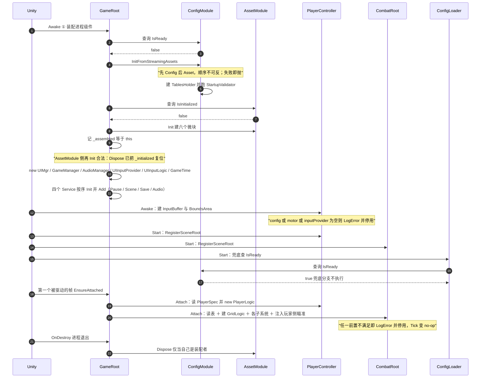

【事实】**装配顺序不再靠 `Start` 的先后**：`PlayerController` 与 `CombatRoot` 在 `Start` 里只做一件事——`GameRoot.Instance.RegisterSceneRoot(this)`；真正的装配由 `GameRoot.EnsureAttached()` 在第一个被驱动的帧按 `Order` 升序调 `Attach()`（玩家侧 `-100` 先）。原因：装配要读配表、玩家侧的 `Logic` 与格子几何，而 Unity **不保证两个 `Start` 的先后**。
【事实】`ConfigLoader.Start` 的兜底查询排在场景根的装配之前或之后都无所谓：它只读 `ConfigModule.IsReady`，而后者在 `GameRoot.Awake` 里已经定妥。

### 图 8 · 每帧驱动时序　【事实】只有两个驱动入口，都在 `GameRoot`：渲染帧 `Update` 走顺序表，物理帧 `FixedUpdate` 按 `Order` 驱动场景根

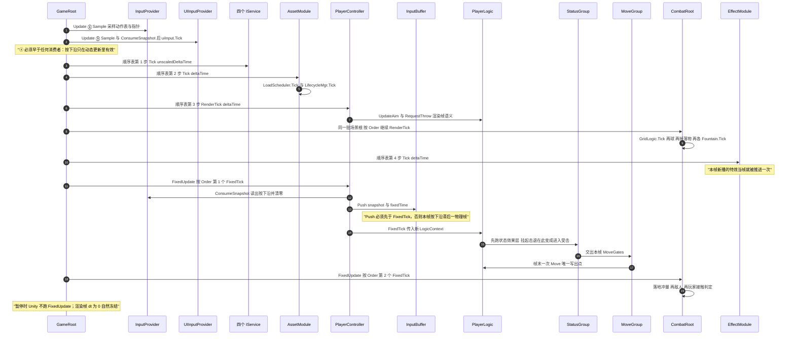

【事实】**收口前这里是四条互不调用的入口**（`InputProvider.Update` 自驱、`PlayerController.FixedUpdate` 自驱，加 `GameRoot` 的两条），谁先跑由 Unity 决定；现在两个通道各自只有 `GameRoot` 一个发起者，帧内顺序由 `ISceneRoot.Order` 写死。
【事实】渲染帧与物理帧之间**没有**先后关系（一帧里 `FixedUpdate` 可能跑 0 次、1 次或多次），所以"玩家这一物理帧的速度已提交"这条依赖只能靠 `Order` 在物理帧内部保证。

### 图 9 · 一次物理帧的完整调用链　【事实】从 `GameRoot.FixedUpdate` 到 `Rigidbody2D.velocity` 的全部跳转；零提交时**不写速度**

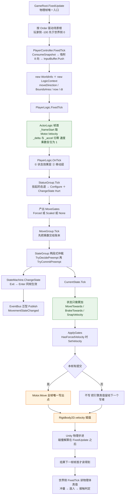

【事实】`_delta` 单位是格/秒（**不**乘 Δt），`_accel` 单位是格/秒²，帧末统一乘一次 `deltaTime`。
【事实】**速度乘数落在目标速度上**（`SetSpeedScale` → `MoveTowards` 里 `speed * _speedScale`）：帧首复位为 1、状态算速度之前交给账本。改成"每帧乘一遍已提交速度"会与加速度拉锯，稳态速度停在约 `0.23` 而不是 `1.62`。
【事实】`OnTick` 里没有外力调用：`ApplyExtraForce` 与 `ClampSpeed` **在生产代码里零调用点**——玩家刻意不施外力（零惯性 ＋ 无重力），这是设计意图不是未完成。唯一调用点是测试探针 `移动Tests.LimitProbe`（M16 验语义、M18 验"先外力后钳制"的顺序）。

## 3 · 功能实现

### 图 10 · 移动仲裁决策　【事实】抢占「先判后消费」：判定是纯查询，目标等于当前状态时既不消费也不遮掉 `IsDone`

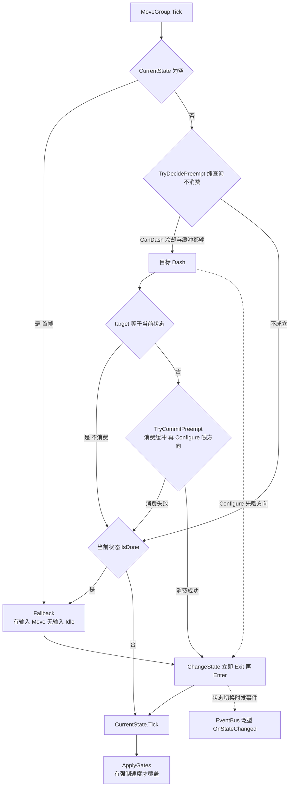

【事实】抢占链**只剩冲刺一条**：平台跳跃时代的 `Jump` / `DoubleJump` 条件已随状态类删除，`TryDecidePreempt` 现在只查 `CanDash`。
【事实】**首帧同样参与抢占**：`CurrentState == null` 不再直接返回基础态，而是先走同一条抢占链，判不中才落 `Fallback`。首帧曾是"无抢占"特权帧，玩家的第一次按冲刺会被吞到第二帧。
【事实】**"判定成功但消费失败"在 `Dash` 上不可达**：`TryDecidePreempt` 查 `CanDash`、`TryCommitPreempt` 查 `TryConsumeDash`，两者用的是同一个 `dashBufferTime` 窗口与同一个 `now`。`Configure` 放在消费之后仍然正确——它保证"状态对象只在提交成功时被改写"。
【事实】门禁在**状态跑完之后**才落到速度上（`ApplyGates`）：状态（`MoveState` / `IdleState`）会整体接管速度，门禁写在它们前面等于没写——这是旧实现"挨打了却纹丝不动"的成因之一。

### 图 11 · 移动状态机流转　【事实】3 个状态之间所有真实可达的转移；`ChangeState` 遇到未注册标签或已是当前状态时返回 `false`

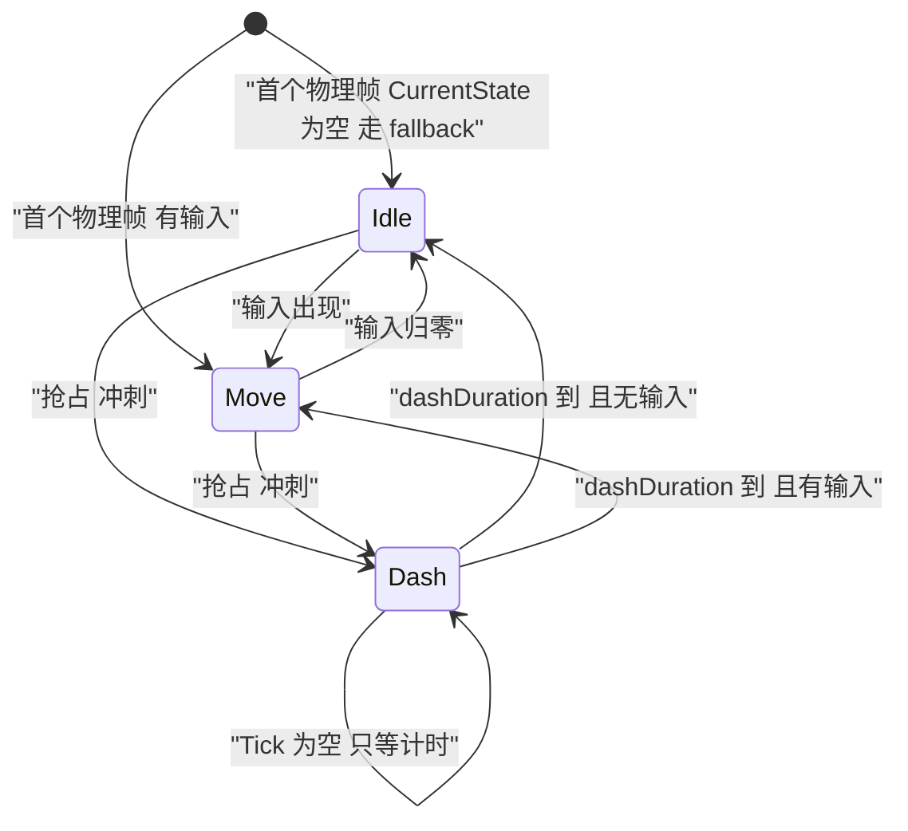

【事实】状态机**首次进入不发** `OnStateChanged`，所以调试面板另用 `PlayerLogic.CurrentState` 补显。
【事实】基础态之间与基础态到 `Dash` 的边都出自 `IsDone` / `Fallback` / `TryDecidePreempt`；`Dash` 只经抢占进入，**没有**空中/落地类边——那些边（`Fall` / `WallSlide` / `Jump` / `DoubleJump`）已随状态类一起删除。
【事实】**同一个骨架还带两台状态机**：状态效果层（`StatusStateTag`：`Empty` / `Normal` / `Hurt`，`Fallback` 恒为 `Normal`，边只有 `Normal ⇄ Hurt`）与敌人移动（`MovementStateTag` 里只有 `EnemyChaseState` 一个状态）。它们与本图共用 `StateMachine` / `StateGroup` 的实现，画在一起只会让三套标签混淆，故只在本图登记。

### 图 12 · 事件总线流向与暂停闭环　【事实】暂停闭环的 4 个事件类型的全部发布方与订阅方，其中只有暂停构成完整闭环

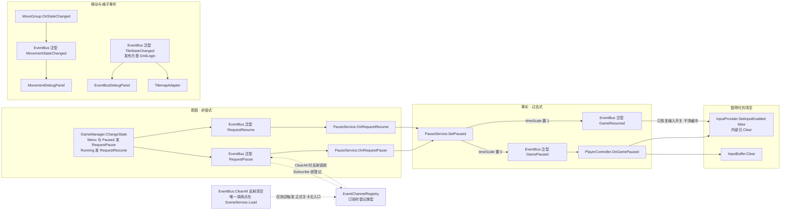

【事实】`GamePaused` 的订阅在 `PlayerController.OnEnable`、退订在 `OnDisable`；`PauseService` 的订阅在 `Init`、退订在 `Dispose`，而后者由 `GameRoot.OnDestroy` 逐项调用。
【事实】`BeginPanel` 的 `"StartBtn"` → `GameManager.ChangeState(GameState.Running)`、`"ExitBtn"` → `GameState.BeforeExit`，按钮不直接发事件；`RequestPause` / `RequestResume` 的发布方是 `GameManager.ChangeState`。
【事实】**`DebugEvent` 已删除**（它从来没有发布方，面板恒空）：`EventBusDebugPanel` 改为订阅 `TileStateChanged`，于是本图里不再有"零发布方"的虚线。
【事实】不在本图范围的事件（各自只有一条边，画进来只会糊图）：`AimChanged`（`CombatGroup` → `TileHighlightView`）、`DropCollected`（`DropActor` → `CombatRoot`，`WaterBallCollected` 已由它取代）、`WaterBallCountChanged` / `PlayerHealthChanged` / `WaveChanged`（三个数据持有者 → `HudPanel`）、`RequestHudRefresh`（`HudPanel.ShowMe` → `CombatRoot`，意图）。完整事件表见《分层设计/逻辑层.md》§6。

### 图 13 · 资源异步加载全链路　【事实】`AssetModule.LoadAsync` 未命中缓存的完整路径；成功分支的三步顺序严格不可换

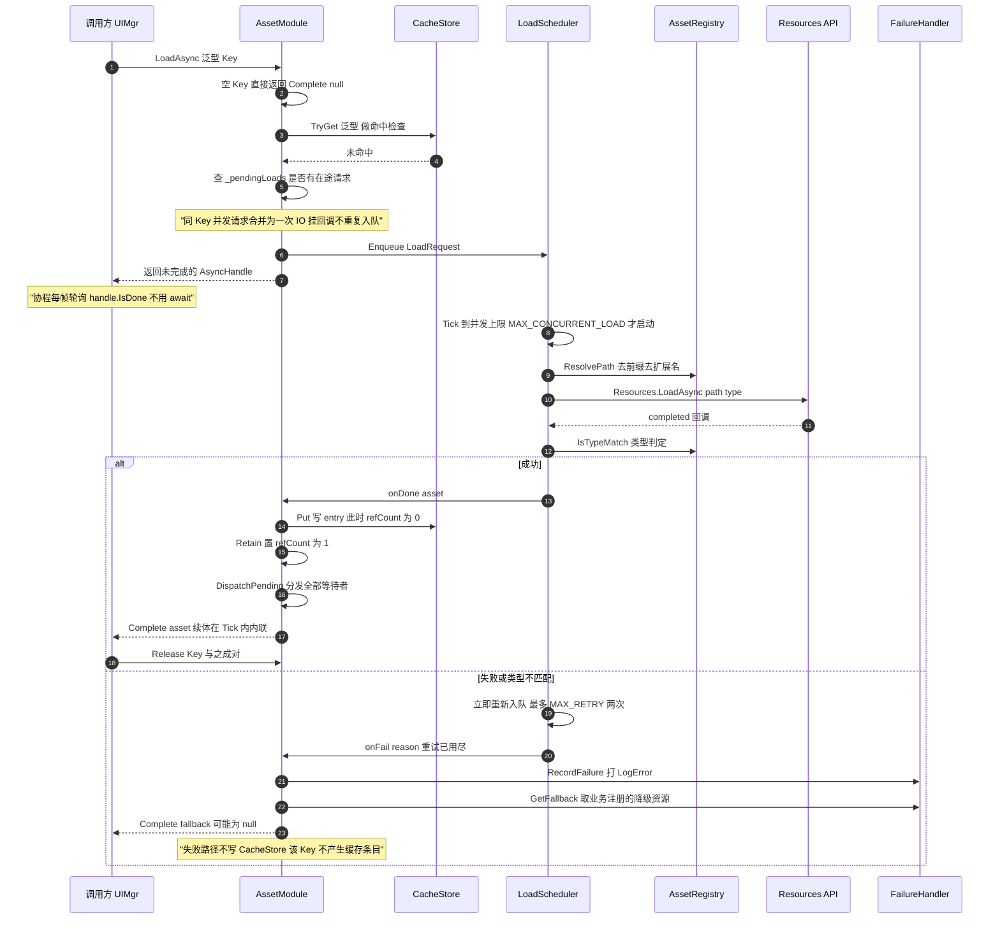

【推断】`LoadScheduler.StartLoad` 的注释把此处标为「切 Addressables 时换成 `Addressables.LoadAssetAsync`」，但 `AssetRegistry.ResolvePath` 才是路径语义的唯一转换点；谁是真正的切换边界，源码没有定论。

### 图 14 · 缓存条目状态机　【事实】`CacheEntry` 六个字段驱动的全部状态；与 [数据层.md](分层设计/数据层.md) 的状态图有一处实质分歧

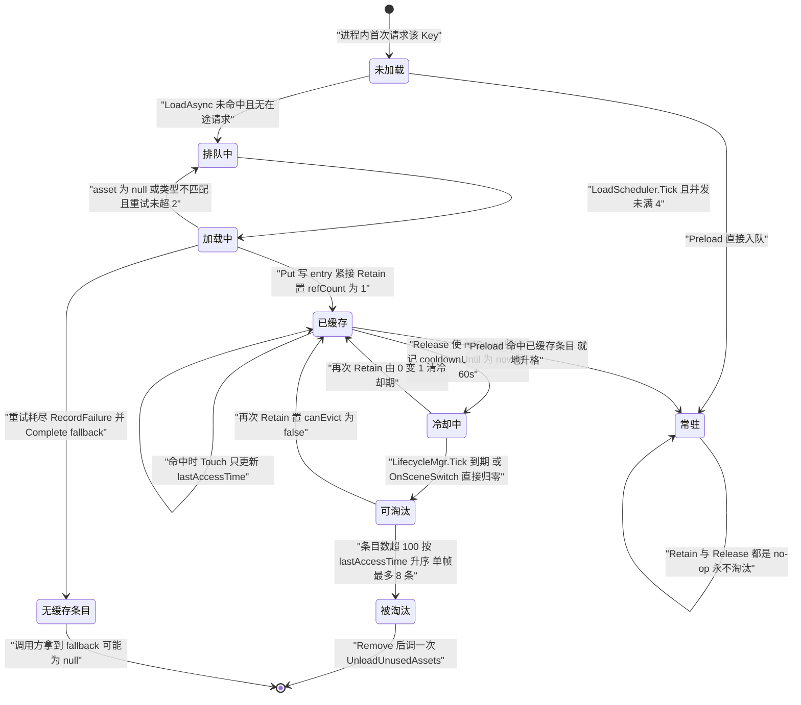

**分歧**：【事实】失败路径没有 `Put`，所以「降级」不是一个缓存状态——[数据层.md](分层设计/数据层.md) 把它画成 `CacheEntry` 的一个状态并给了它一条「LRU 超阈值」出边，源码里这两点都不成立；本图按源码画。

### 图 15 · UI 面板显示链路　【事实】`GameRoot.Assemble()` 里 `new UIMgr()` 触发构造，三件套走同步窄路，面板本体走异步

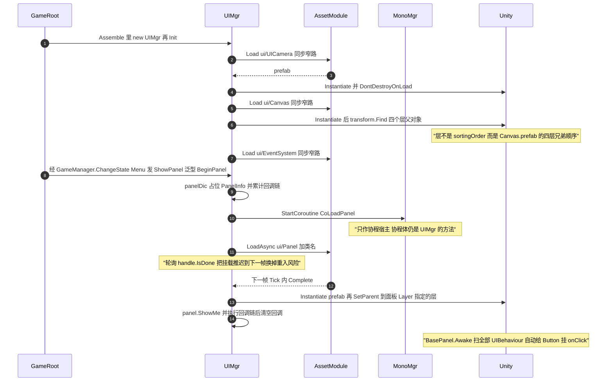

【事实】面板资源 Key 写死为 `ui/Panel/` ＋ `typeof(T).Name`，所以**预制体名必须等于面板类名**；`HidePanel(true)` 才 `Release`，`HidePanel(false)` 只失活不释放。
【事实】**层由面板自己声明**：`ShowPanel` 签名里没有层级参数，`Instantiate(prefab, middleLayer, false)` 先挂在 `Middle`，随后 `panel.transform.parent != GetLayerFather(panel.Layer)` 时再 `SetParent(father, false)`——`BeginPanel` 的 `Layer` 是 `Bottom`（已逐行核对 `UIMgr.CoLoadPanel`）。
【事实】`UIMgr` 不再是单例：唯一入口是 `GameRoot.UI`（`Assemble` 里 `new`）。`MonoMgr` 仍是 `Singleton<T>`，只作协程宿主。

### 图 16 · 配置查询链路　【事实】xlsx 到调用方的完整链路，以及一条存在契约但没有调用点的跨模块衔接

```mermaid
flowchart LR
  X["ConfigWorkspace/Data<br/>weapon / item / fish ＋ 战斗切片 6 张<br/>projectile / enemy / tile_state / player / wave / tile_initial"] -->|"Luban 导表 成功后才镜像"| J["Assets/StreamingAssets/Luban<br/>demo_tbweapon 等 9 份 JSON"]
  X -->|"Luban 导表"| G["Assets/Scripts/Generated/Config<br/>Tables 与 demo/Tb 九个表"]
  V["pathValidator.rootDir 指向 Assets<br/>只校验文件在 Assets 下存在"] -.->|"不校验 Resources 下也有"| X
  GR["GameRoot.Awake"] -->|"InitFromStreamingAssets"| CM["ConfigModule.Init"]
  CM --> TH["TablesHolder<br/>new cfg.Tables 传 Loader"]
  J -->|"File.ReadAllText 仅桌面端"| TH
  G -->|"TbWeapon / TbItem / TbFish"| TH
  TH --> SV["StartupValidator<br/>按 TablesMeta.Names 反射取值"]
  SV -->|"任一表取不到"| EX["抛 ConfigLoadException<br/>带病数据不进运行时"]
  SV -->|"全部可加载"| RD["ConfigModule.IsReady 置 true"]
  RD --> Q["GetWeapon / GetItem / GetFish / GetAllWeapons"]
  RD --> ESC["Tables 逃生舱 只读不跨帧持有"]
  RD --> DM["DataMetrics.TableCount<br/>取自 TablesMeta.Count"]
  RD --> SPEC["SpecCatalog<br/>战斗切片 6 张表的唯一折算点"]
  Q --> C1["ConfigLoader.Start 打 Console 自检"]
  Q -.->|"契约链路 当前零调用点"| ICON["Weapon.Icon 字符串<br/>Assets 相对路径带扩展名"]
  ICON -.->|"必须先过 ResolvePath"| ARP["AssetRegistry.ResolvePath<br/>换成 Resources 相对路径无扩展名"]
  ARP -.->|"再接 LoadAsync"| AM2["AssetModule<br/>真正的资源加载入口"]
  classDef run fill:#e8f5e9,stroke:#388e3c,color:#123b16
  classDef build fill:#f3e5f5,stroke:#7b1fa2,color:#2a0b33
  classDef gap fill:#ffebee,stroke:#c62828,color:#3e0000
  class CM,TH,SV,RD,Q,SPEC run
  class X,J,G build
  class ICON,ARP,AM2 gap
```

【事实】「武器表 → `Icon` → `AssetModule.LoadAsync`」这条跨模块链只有文档契约，运行时代码里没有调用点；唯一的真实消费在 EditMode 测试里。
【事实】战斗切片的 6 张表（`projectile` / `enemy` / `tile_state` / `player` / `wave` / `tile_initial`）**不走** `ConfigModule` 的 getter：`CombatRoot.Attach` 与 `PlayerController.Attach` 读表时由 `Data/Config/SpecCatalog` 折成纯结构体，本图只画 `ConfigModule` 这条链（见《分层设计/表现层.md》§3 与《框架蓝图.md》§5）。

## 4 · 渲染与踩坑说明

mermaid 块由渲染方（GitHub / VS Code / Obsidian / Mermaid Live）解析，**本仓库不再带本地校验脚本**；改完图在任一支持 mermaid 的编辑器里预览一次即可，失败数必须为 0。

> 画的是"代码里的事实"，**不含运行时状态**。相机的 vcam 是否被判为 live、Confiner 有没有把相机钳死，这些只能在 Play 里看。

| # | 坑 | 触发条件 | 规避写法 |
| :-- | :-- | :-- | :-- |
| 1 | 标签里的裸 `(` `)` `;` | 未加引号的节点标签 | 标签一律加双引号；能改写就改写 |
| 2 | `Note over X:` 里的裸 `;` 与 `()` | sequenceDiagram 注释 | 注释文字整体加引号，或改写成不含这两个字符的句子 |
| 3 | 标签里的 `#` | 被当成颜色或编号 | 不要写 `#`，颜色只放在 `classDef` 的值里 |
| 4 | 标签里的 `<` `>` | 被当成 HTML 起始 | 用 `&lt;` `&gt;`，或改用 `≤` `≥` 与中文 |
| 5 | classDiagram 的泛型尖括号 | `EventBus<T>` 直接写会 parse 失败 | 用 `~T~` 写法，或不写泛型参数 |
| 6 | 单张巨型图 | 节点过多、交叉连线成网 | 本图集按「依赖 / 调用链 / 功能实现」拆成 16 张，单张 ≤ 21 节点、≤ 26 边 |

**着色与兼容性**：图 1、图 9、图 16 用了 `classDef` ＋ `class` 给节点上色。收益是一眼分出「生成物 / 运行期 / 契约缺口」三类节点；风险是十六进制颜色在极少数旧渲染器与深色主题下对比度不足，且 `linkStyle` 依赖边的**序号**、插一条边就错位，本图集**刻意不用** `linkStyle`。降级方案：删掉每张图末尾的 `classDef` 与 `class` 行即可，语义不依赖颜色。

**平台差异**：GitHub / GitLab / VS Code 预览支持本图集用到的全部语法。`subgraph` 内的 `direction` 需要 mermaid ≥ 9.1，旧渲染器会**静默忽略**它、退化成默认方向——不影响可读性，只是布局不再按图题声明的那样排列。Obsidian 与 Mermaid Live Editor 可直接粘贴。

## 5 · 维护指引

| 改了什么 | 该动哪张图 | 复核方式 |
| :-- | :-- | :-- |
| 加 / 删跨层调用 | 图 1、图 12 | 核对第 4 节的坑表，并在支持 mermaid 的编辑器里预览 |
| 加一个 `AssetModule` 微块 | 图 2、图 13、图 14 | 图 14 的状态必须与 `CacheEntry` 字段一一对应 |
| 加一个表 / 加一列取值口径 | 图 2、图 16 | `SpecCatalog` 是否仍是唯一折算点 |
| 加一个移动状态 | 图 3、图 10、图 11 | 图 11 的每条转移都要能在 `IsDone` / `Fallback` 找到出处 |
| 加一层领域状态（如新的效果层） | 图 3、图 9、图 11 | 门禁必须单向：上层 → 下层，只有移动层写速度 |
| 加一个面板 | 图 4、图 15 | 消息数超 50 就要把时序拆成两段 |
| 加一个 `IService` | 图 3、图 6、图 7 | `GameRoot.Assemble` 的 `services.Add` 顺序变了就同步图 7 |
| 加一个事件类型 | 图 12 | 无发布方的事件保留虚线「零发布方」标注，不要画成实线 |
| 加一个端口 | 图 5、图 6 | 端口住在"需要它"的文件里，实现类放表现层，箭头方向永远是「端口 ← 实现」 |
| 加一个场景根 | 图 4、图 7、图 8 | 它必须在 `Start` 里注册，并在 `Attach` 里做幂等装配 |
| 换资源后端 | 图 13、图 16 | 先确定 `ResolvePath` 是否仍是唯一转换点（图 13 的推断项） |

- 新增图前先看第 4 节坑表；**图题必须带 `【事实】` 或 `【推断】`**，推断项要在脚注写出依据。
- 本图集只覆盖 `Assets/Scripts/` 下的手写代码；`Generated/**` 只出现在图 1、图 4、图 16 的边界上。
- 源码与图不符时先改图；渲染器只保证语法，**语义靠人复核**。

## 6 · 已知缺口

- **战斗切片只画到"边界"**：图 4 画出 `CombatRoot` 与它的四组子件的归属，图 9 画出物理帧里"玩家侧先于世界侧"这一跳；但 `GridLogic` 的双缓冲 Tick、`BallDirector` 的落地链路、`DropDirector` 的四相位**没有**逐节点的调用链图。它们的职责表在《分层设计/表现层.md》§8 与《分层设计/逻辑层.md》§7，落地链路图在逻辑层 §7.2（不在本图集）。
- 图 6 的对象图仍**没有展开** `GameRoot` 的 `UIInputProvider` / `UIInputLogic` 两个节点，也没有展开 `CombatRoot` 的子树（图 4 承担了后者）。`UIInputProvider` 在本图集里只出现在图 4 的脚注。
- 本图集**固定 16 张图**：等切片接口稳定后再按第 4 节坑表补图，并同步第 0 节的计数。
- 图 8 把渲染帧与物理帧画在同一条时序里，是为了显示"两个通道没有先后关系"；它**不表示**同一帧里渲染帧一定先跑。

### 待核项（只登记，未核实）

- 图 3 / 图 9 脚注关于 `ApplyExtraForce` / `ClampSpeed`「生产代码零调用、唯一调用点是测试探针 `移动Tests.LimitProbe`」的断言，本轮按全仓 grep 复核过调用点数（各 1 处非声明命中，均在测试里），但**未在 Play 里验证**其观感影响。
- 图 3 的 `DEAD` 节点把 `InputSnapshot.JumpPressed` 与 `InputType.Attack` 并列记为「声明但没有消费者」，但两者口径严格说不同（前者有 `InputBuffer.Push` 入账、只是没有 `CanConsume` / `TryConsume` 消费；后者零出现）—— 该口径该怎么算**未核实**。
