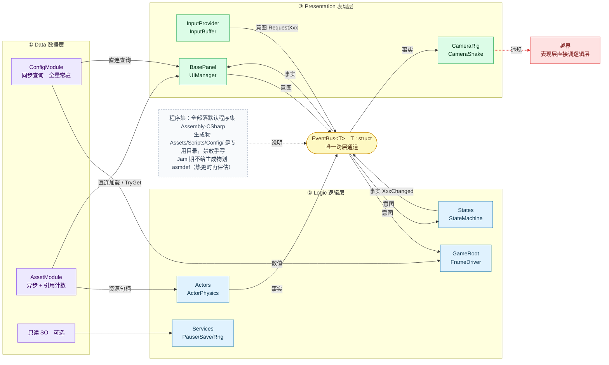
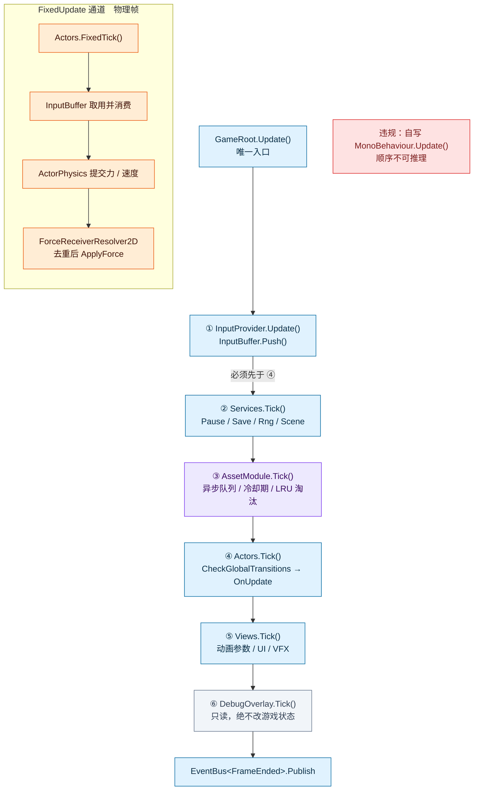
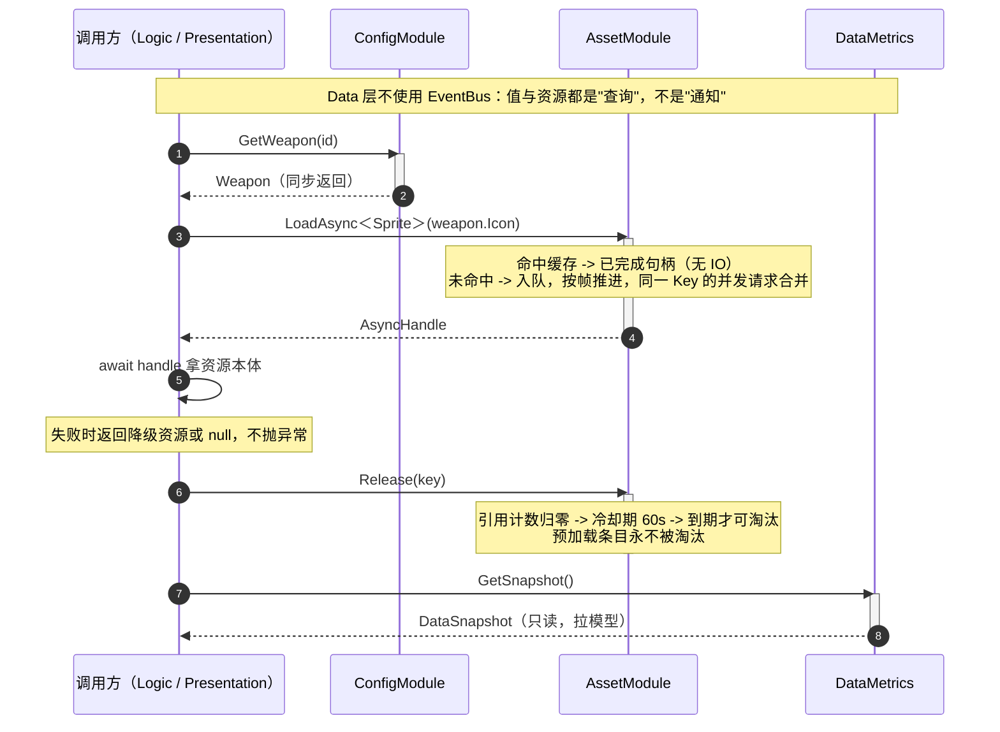
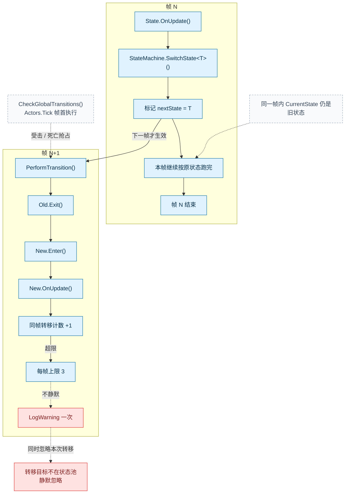
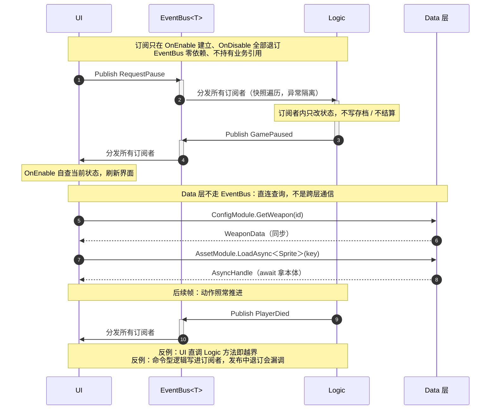
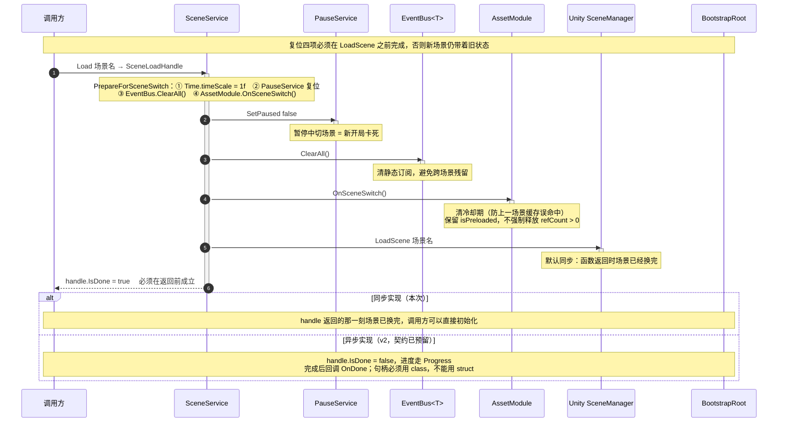
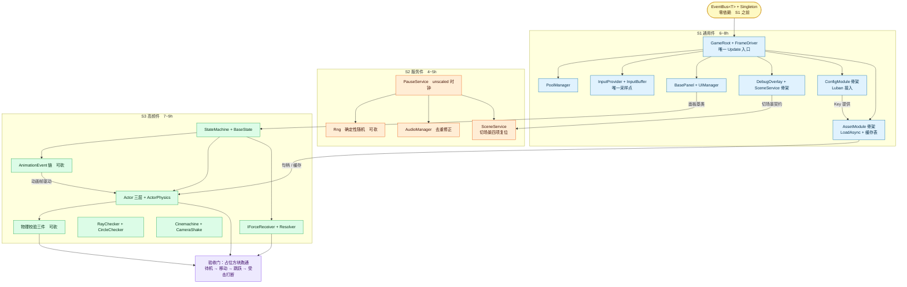
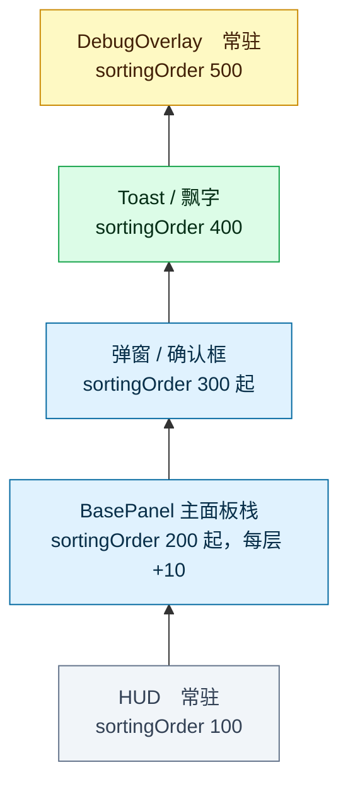

# 框架蓝图

**三条铁律**：

1. **跨层只走 `EventBus<T>`**（只服务 Logic ↔ Presentation 之间的意图/事实通知）：
2. **每帧只由 `GameRoot` 统一顺序表驱动**；
3. **`Assets/Scripts/Config/` 与 `Assets/StreamingAssets/Luban/` 是生成物专用目录，禁止放手写文件**。

> 数据（数值与资源）不走 EventBus——它是**直连查询**，不是通知。详见 §4。

**读法**：本文件是规范性文档，回答"能不能这么做"；落到设计粒度看 [`Data 层设计.md`](Data%20层设计.md)，落到代码看 [`Data 层实现.md`](Data%20层实现.md)。
**图的维护方式**：每张图的 mermaid 代码块与 `sources/*.mmd` **逐字符一致**（`%%` 注释行除外），由 EditMode 测试守护（§10.4）。改图先改源文件，再同步本文件。

---

## 1. 总览：三层 + 一条通道

```
┌────────────────────────────────────────────────────────────┐
│  Data 层　只读内容提供者，被 Logic 与 Presentation 直连      │
│  ┌──────────────────────┐  ┌──────────────────────────┐   │
│  │  ConfigModule        │  │  AssetModule             │   │
│  │  · 同步查询           │  │  · 异步加载               │   │
│  │  · 全量常驻           │  │  · 引用计数 + 冷却期缓存  │   │
│  │  · 无释放             │  │  · 并发控制 + LRU 淘汰    │   │
│  │  · Luban 生成         │  │  · 每帧 Tick              │   │
│  │  · 进程级装配         │  │  · 进程级装配             │   │
│  └──────────────────────┘  └──────────────────────────┘   │
│  ┌──────────────────────┐                                  │
│  │  只读 SO（可选）      │  ← 少量全局配置、资源目录       │
│  └──────────────────────┘                                  │
└────────────────────────────────────────────────────────────┘
              ↑ 直连查询（允许，不需要 EventBus）
              │
┌────────────────────────────────────────────────────────────┐
│  Logic 层                                                   │
│  ┌──────────────────┐  ┌─────────────────────────────┐    │
│  │  GameRoot        │  │  Services                   │    │
│  │  FrameDriver     │  │  Pause / Save / Rng / Scene │    │
│  └──────────────────┘  └─────────────────────────────┘    │
│  ┌──────────────────┐  ┌─────────────────────────────┐    │
│  │  Actors          │  │  States                     │    │
│  │  ActorPhysics    │  │  StateMachine               │    │
│  └──────────────────┘  └─────────────────────────────┘    │
└────────────────────────────────────────────────────────────┘
              ↑ 意图祈使式 / 事实过去式（唯一跨层通道）
              │
┌────────────────────────────────────────────────────────────┐
│  Presentation 层                                            │
│  ┌──────────────────┐  ┌─────────────────────────────┐    │
│  │  InputProvider   │  │  BasePanel / UIManager      │    │
│  │  InputBuffer     │  │                             │    │
│  └──────────────────┘  └─────────────────────────────┘    │
│  ┌──────────────────┐  ┌─────────────────────────────┐    │
│  │  CameraRig       │  │  DebugOverlay               │    │
│  │  CameraShake     │  │  （只读）                    │    │
│  └──────────────────┘  └─────────────────────────────┘    │
└────────────────────────────────────────────────────────────┘
```

**`EventBus<T>`（T : struct）能做什么、不能做什么**：

| 能做 | 不能做 |
| :-- | :-- |
| 承载 Logic ↔ Presentation 之间的意图（`RequestXxx`）与事实（`XxxChanged`） | 不传对象本体（struct 装不下 `UnityEngine.Object`） |
| 编译期查类型、无装箱、发布订阅方不共享堆引用 | 不承担命令-响应语义（那是**直连查询**的领域） |
| 单向广播，订阅方零依赖 | 不服务 Data 层（Data 层不发布、不订阅） |

**`Singleton<T>`**：只服务 Logic / Presentation 层的单例（Services、UIManager 等）。**Data 层不用**——`ConfigModule` / `AssetModule` / `DataMetrics` 都是 `static class` + 显式 `Init`，因为"Config 必须先于 Asset"这种时序，懒加载单例保证不了。

### 1.1 依赖方向速查

| 方向 | 允许 | 说明 |
| :-- | :-- | :-- |
| Data ← Logic | ✅ | Logic 直连读 Data |
| Data ← Presentation | ✅ | Presentation 直连读 Data |
| Presentation → Logic | ❌ | 唯一例外：通过 EventBus |
| Logic → Presentation | ❌ | 唯一例外：通过 EventBus |
| Data → 任何层 | ❌ | Data 层零业务依赖 |

### 1.2 Data 层三条边界

| # | 边界 | 理由 |
| :-- | :-- | :-- |
| 1 | 不继承 `Singleton<T>`，用 `static class` + 显式 `Init` | 需要确定的初始化时序 |
| 2 | 不订阅、不发布 EventBus 事件 | 查询式接口无事件语义；加载完成通过 `AsyncHandle` 传递 |
| 3 | 唯一主动行为是 `AssetModule.Tick`，由 GameRoot 驱动且只处理内部状态 | 队列/冷却期/LRU 需要每帧推进；**这条例外不推广成通用模式** |

---

## 2. 图 1｜分层与通道

> 源文件：`sources/01-layers.mmd`



- 箭头是**依赖方向，不是调用方向**：逻辑层依赖数据层的数值，数据层不认识任何层。
- 表现层与逻辑层**没有直连边**——这是约束，唯一的反例是红框。
- 数据层全部只读：SO、Luban Tables、资源缓存都只被读。
- **表现层到数据层的两条直连边（紫）是本版新增**：UI 取图标、取数值不需要绕 EventBus。绕过它反而更慢、更绕。
- `EventBus<T>` 用 `struct`：编译期查类型、无装箱、发布订阅方不共享堆引用。

---

## 3. 图 2｜单帧执行

> 源文件：`sources/02-frame-order.mmd`



- 六步固定时序：条目顺序 = `tickables[]` 拖入顺序，**初始化序与每帧序同源**。
- **step ③ `AssetModule.Tick()` 是本版新增**（紫色）：异步队列、冷却期、LRU 需要每帧推进。
  - 由 GameRoot 驱动而**不是**由 Services 驱动：保持 Data 层独立，不形成"Logic 驱动 Data 内部状态"的隐性耦合。
  - 只处理 AssetModule 内部状态（句柄/缓存表/队列），不发布事件，不触达其他层。这条例外记录在契约表，不作为通用模式推广。
- `FixedUpdate` 是**独立通道**：一个渲染帧可能对应 0 或 2 个物理帧。

### 3.1 启动装配序

```
Bootstrap
  └─ GameRoot.Awake
       ├─ 按序 Init 全部 IManager（初始化序 = 每帧序）
       │    ├─ ConfigModule.InitFromStreamingAssets()   ① Data 层，同步全量加载，失败抛异常
       │    ├─ AssetModule.Init()                       ② Data 层，建缓存表 / 调度器 / 生命周期
       │    ├─ PoolManager.Init()                       ③
       │    ├─ InputProvider.Init()                     ④
       │    ├─ UIManager.Init()                         ⑤
       │    ├─ SceneService.Init()                      ⑥
       │    └─ DebugOverlay.Init()                      ⑦
       └─ 同序写入 tickables[]
            [InputProvider, Services, AssetModule, Actors, Views, DebugOverlay]
```

**关键约束**：

- **ConfigModule 必须先于 AssetModule**——AssetModule 的预加载队列可能引用 Config 的 Key。
- **初始化序 = 每帧序，不允许两套顺序**。
- `AssetModule` 在 `Services` 之后、`Actors` 之前。

### 3.2 图 7｜启动到每帧的调用链

> 启动一次装配，之后每帧按表驱动：没有第二种时序来源。

```text
Bootstrap
  └─ GameRoot.Awake          按序 Init 全部 IManager
  └─ 同序写入 tickables[]    初始化序 = 每帧序

每帧 Update
  ├─ InputProvider.Update      采样 InputSnapshot，按下沿累积
  ├─ InputBuffer.Push(snap)    唯一硬序：必须先于 Actors.Tick
  ├─ Services.Tick(dt)         Pause / Save / Rng / Scene
  ├─ AssetModule.Tick(dt)      异步队列 / 冷却期 / LRU 淘汰
  ├─ Actors.Tick(dt)           CheckGlobalTransitions → OnUpdate
  │    └─ SwitchState<T>()     仅写 nextState，下帧 PerformTransition
  │         └─ 按需 Publish RequestXxx                       表达意图
  ├─ BasePanel.OnEnable        自查当前状态，兜住事件早于订阅
  ├─ Views.Tick(dt)            动画参数 / UI / VFX
  └─ EventBus<FrameEnded>.Publish
       └─ 订阅方回调 → Publish XxxChanged                    表达事实

每物理帧 FixedUpdate
  └─ Actors.FixedTick(fixedDt)
       ├─ InputBuffer 取用并消费
       ├─ ActorPhysics 提交力 / 速度
       └─ ForceReceiverResolver2D 去重后 ApplyForce

切场景
  └─ SceneService.Load
       └─ PrepareForSceneSwitch          四项复位，全部在 LoadScene 之前
            ├─ Time.timeScale = 1f
            ├─ PauseService.SetPaused(false)
            ├─ EventBus.ClearAll()
            └─ AssetModule.OnSceneSwitch()
       └─ LoadScene 同步装载 → handle.IsDone = true

进程退出
  └─ GameRoot.OnDestroy
       └─ AssetModule.Dispose()           清队列 / 缓存 / 合并列表 / 命中计数
```

---

## 4. 图 8｜数据层接缝

> 源文件：`sources/08-data-flow.mmd`



**Data 层接口形状**（实现见 `Data 层实现.md`）：

| 入口 | 签名要点 |
| :-- | :-- |
| `ConfigModule.Init(string jsonRoot)` / `InitFromStreamingAssets()` | 启动一次；失败抛 `ConfigLoadException` 阻止启动 |
| `ConfigModule.GetWeapon / GetItem / GetFish / GetAllWeapons` | 同步；转发 Luban 的 `TbXxx` |
| `ConfigModule.Tables` | 逃生舱，原始 `cfg.Tables`；不得跨帧持有 |
| `AssetModule.LoadAsync<T>(string key)` | `T : UnityEngine.Object`；命中同步返回已完成句柄 |
| `AssetModule.TryGet<T>(key, out T)` | 观测路径，不触发加载、不改引用计数 |
| `AssetModule.Release(string key)` | 引用计数 −1，归零进冷却期 |
| `AssetModule.Preload(string key)` | 标记常驻，不参与引用计数 |
| `AssetModule.RegisterFallback<T>(T)` | 降级资源由业务注册（Data 层不创建资源） |
| `DataMetrics.GetSnapshot()` | 返回 `DataSnapshot`（struct），未 Init 也安全 |

**资源 Key 契约**（🔴 最容易踩的一条）：

| 语境 | 基准目录 | 扩展名 | 谁保证 |
| :-- | :-- | :-- | :-- |
| 配置表里写的 | `Assets/` | **有**（`.png` / `.asset`） | Luban `#path=unity` + `pathValidator.rootDir = Assets`，**导表期**校验资源真实存在 |
| `Resources.LoadAsync` 要的 | `Assets/Resources/` | **无** | 运行时由 `AssetRegistry.ResolvePath` 转换 |

保留表里完整路径的理由：让"图标文件不存在"在**策划改表时**暴露，而不是运行时黑屏。转换只在一个方法里，量产切 Addressables 时也只改它。

---

## 5. 图 3｜状态机语义

> 源文件：`sources/03-state-machine.mmd`



- 上下两图是**相邻两帧**，不是并列分支；唯一的跨帧边是"标记 → 下帧 `PerformTransition`"。
- 与 Data 层改造正交，本版无变更。

---

## 6. 图 4｜意图事件流程

> 源文件：`sources/04-event-flow.mmd`



- 双向共用同一条通道：不搞"上行直接调用、下行广播"两套规则。
- 意图祈使式（`RequestPause`），事实过去式（`GamePaused` / `PlayerDied`）。
- 写存档、结算、掉落这类命令型逻辑**不进订阅者**。
- **Data 层与调用方之间没有 EventBus 边**（本版新增的边界）：加载完成/失败在 Jam 期**不广播事件**。未来若出现多消费者（Loading 进度条、埋点、DebugOverlay 异步感知），再加 `AssetLoaded` / `AssetLoadFailed` 观测事件——事件只携带 Key、耗时、结果，**不带资源本体**，且不改变"Data 层零订阅"的契约。

---

## 7. 图 5｜切换场景

> 源文件：`sources/05-scene-seq.mmd`



**复位四项**（缺一不可，且全部在 `LoadScene` **之前**）：

| # | 复位项 | 作用 |
| :-- | :-- | :-- |
| 1 | `Time.timeScale = 1f` | 防止暂停状态残留 |
| 2 | `PauseService.SetPaused(false)` | 暂停服务复位（暂停中切场景 = 新开局卡死） |
| 3 | `EventBus.ClearAll()` | 清跨场景残留订阅 |
| 4 | `AssetModule.OnSceneSwitch()` | 清冷却期，保留预加载资源 |

**第 4 项为什么不全清**：预加载资源（`isPreloaded=true`）是为下一场景准备的，全清则预加载白做。清冷却期是为了避免上一场景的高频缓存误命中新场景；被持有（`refCount > 0`）的资源不强制释放。

---

## 8. 图 6｜开发流程建议

> 源文件：`sources/06-dev-order.mmd`



- 箭头是**硬依赖**（前置不做完就做不下去）；标"可砍"的节点在时间不足时按序砍。
- **S1 新增两个骨架**：`ConfigModule`（Luban 接入）+ `AssetModule`（LoadAsync + 缓存表）；工时 5~7h → **6~8h**。
- `S1e → S1f`：ConfigModule 提供 Key，AssetModule 消费 Key（依赖方向）。
- `S1f → S3b`：AssetModule 给 Actor 层提供资源句柄。
- **攻击判定必须由动画帧事件驱动**，不用计时器推断。

---

## 9. 图 9｜面板层级与顺序

> 源文件：`sources/07-panel-order.mmd`。层级与 `sortingOrder` 是 `UIManager` 的 const 常量。



- 常驻层（HUD、DebugOverlay）不进栈、不随面板开关重建。
- `BasePanel` 的 `OnEnable` 要**自查当前状态**，兜住"事件早于订阅"的窗口。
- 面板开关是**高频加载**的典型场景——`AssetModule` 的冷却期就是为它设计的。

---

## 10. 目录与程序集

### 10.1 目录结构（事实 + 目标）

```
deepseaoil/
├── Assets/
│   ├── Scripts/
│   │   ├── Config/                      🔴 Luban 生成（生成物专用目录，禁放手写）
│   │   │   ├── Tables.cs                    命名空间 cfg
│   │   │   ├── vector2/3/4.cs
│   │   │   └── demo/                        命名空间 cfg.demo：Weapon / Item / Fish / Quality / TbXxx
│   │   ├── Framework/                   ← 框架手写代码（当前为空，本蓝图的目标位置）
│   │   │   ├── Data/                        ConfigModule/ + AssetModule/ + DataMetrics/
│   │   │   ├── Logic/                       GameRoot/ Services/ Actors/ States/
│   │   │   ├── Presentation/                Input/ UI/ Camera/ Debug/
│   │   │   └── Common/                      EventBus/ Singleton/
│   │   └── Game/                        ← 业务手写代码
│   │       ├── ConfigLoader.cs              配表管线消费示例
│   │       └── TablesMeta.cs                表清单（手写，非生成物）
│   ├── Luban.Runtime/                   ← Luban 运行库本地拷贝（8 文件，走 git，不走 UPM）
│   ├── Editor/                          ← 导表工具（DeepseaOil.EditorTools）
│   ├── Tests/EditMode/                  ← EditMode 测试
│   ├── StreamingAssets/Luban/           🔴 Luban 生成（生成物专用目录，禁放手写）
│   └── Settings/ Scenes/
├── ConfigWorkspace/                     ← Luban 工作区
│   ├── Data/                            Excel 源表 + __tables__/__beans__/__enums__
│   ├── Defines/                         builtin.xml（vector2/3/4）
│   ├── Tools/Luban/                     工具本体（Git LFS）
│   ├── luban.conf
│   └── output/ logs/                    （gitignore）
└── Docs/框架设计/                       本目录
```

**🔴 生成物目录的规矩**：`Assets/Scripts/Config/` 与 `Assets/StreamingAssets/Luban/` 在每次导表时会**整目录镜像覆盖**（暂存区没有的文件被删除，`.meta` 例外保留）。往这两个目录放手写文件，下次导表必丢。细节见 [`技术文档_配表管线.md`](../表格数据配置/技术文档_配表管线.md)。

### 10.2 程序集（事实描述）

| 程序集 | 内容 | 引用 | 阶段 |
| :-- | :-- | :-- | :-- |
| `Assembly-CSharp` | **其余全部**：`Scripts/Config/` 生成代码、`Scripts/Framework/`、`Scripts/Game/` | 自动引用 `Luban.Runtime` | 默认程序集 |
| `Luban.Runtime.asmdef` | `Assets/Luban.Runtime/`（运行期反序列化） | 无 | 已存在 |
| `DeepseaOil.EditorTools.asmdef` | `Assets/Editor/`（导表工具） | `includePlatforms: Editor` | 已存在 |
| `DeepseaOil.EditorTools.Tests.asmdef` | `Assets/Tests/EditMode/` | 引 `DeepseaOil.EditorTools`，`UNITY_INCLUDE_TESTS` | 已存在 |

**决定**：**Jam 期不给生成物划 asmdef**。

- 生成的 `cfg` 代码与手写框架代码同处默认程序集，直接互相引用，不需要额外配置——这正是 [`ConfigLoader.cs`](../../Assets/Scripts/Game/ConfigLoader.cs) 注释里记的现状。
- 划独立程序集（如把生成物划进 `DeepseaOil.Config`）的收益是**热更隔离**与**编译增量**，两者在 Jam 期都用不上；代价是多一层引用配置、且 Luban 输出目录与 asmdef 必须成对维护。
- **触发条件**：真要做热更时再评估，届时要同时改 Luban 输出目录（`Assets/Scripts/Config/Gen/`）+ 新增 asmdef + 改 `LubanProject.OutputCodeDir`，属独立任务。
- **不要装 Luban 的 UPM 包**：本地拷贝与 UPM 包的 asmdef 都叫 `Luban.Runtime`，撞名会导致**整个工程所有程序集都编译不出来**。

### 10.3 平台假设

| 平台 | 状态 | 说明 |
| :-- | :-- | :-- |
| Windows / macOS / Linux | ✅ 支持 | `ConfigModule.Init` 在 `Awake` 同步读 `StreamingAssets` |
| Android / WebGL | ❌ 不支持 | `StreamingAssets` 在包内，`File.ReadAllText` 读不到，必须改 `UnityWebRequest`（异步）——那会让 Init 变异步，**牵动整条启动链**。要支持时属独立改造：新增"平台分支"一节，`GameRoot.Awake` 的装配改为可等待 |

### 10.4 文档一致性测试

`Assets/Tests/EditMode/框架文档一致性Tests.cs` 断言：

| 断言 | 口径 |
| :-- | :-- |
| 图源与蓝图逐字符一致 | 读 `sources/NN-*.mmd`，跳过 `%%` 注释行与空行，与蓝图对应 ```mermaid 代码块逐行比较 |
| 图源与蓝图配对齐全 | `sources/` 下每个 `.mmd` 都能在蓝图找到配对，反之亦然 |
| 无旧命名残留 | 蓝图与新文档中不得出现 `Jam.Config` / `Jam.Data` / `JamRoot` / "Config 配置层" / "复位三项" / "两级程序集" |
| 交叉引用有效 | 蓝图引用的 `sources/*.mmd` 与两份 Data 层文档都存在 |

---

## 11. 重要契约

| 主题 | 契约 |
| :-- | :-- |
| 输入 | `InputProvider` 唯一采样点；快照累积进 `InputBuffer` |
| 每帧 | 只由 `GameRoot` 顺序表驱动；禁止自写 `Update()` |
| 通信 | Logic ↔ Presentation 只走 `EventBus<T>`；意图祈使式、事实过去式 |
| EventBus 定位 | 只服务跨层事件通知；不承担命令-响应；不传对象本体 |
| Data 层 | 被所有层直连；只读；查询式；进程级常驻；不走 EventBus |
| ConfigModule | 同步；全量常驻；无释放；启动时装配；启动后不变 |
| AssetModule | 异步；引用计数；冷却期缓存；并发控制；LRU 淘汰；每帧 Tick |
| AssetModule.Tick | GameRoot 顺序表 step ③；Data 层唯一被允许的主动行为；只处理内部状态 |
| Config ↔ Asset | 零依赖；通过字符串 Key 衔接；调用方是衔接点 |
| 资源 Key | 表里存「相对 `Assets/` 带扩展名」；`Resources.LoadAsync` 用「相对 `Assets/Resources/` 不带扩展名」；转换点只有 `AssetRegistry.ResolvePath` |
| AsyncHandle | 必须是 `class`；`Complete` 只在主线程调用；不传 `RunContinuationsAsynchronously`；二次完成不抛异常 |
| 配置源 | 数值走 Luban/xlsx；资源引用走表内字符串；Key 为字符串 |
| 物理字段 | 每刚体每项唯一写者：角色由代码从 SO 写，非角色归 Inspector |
| 状态 | `SwitchState` 只标记，同帧读到旧状态，上限 3 次 |
| 切场景 | 复位四项：`Time.timeScale` / `PauseService` / `EventBus.ClearAll` / `AssetModule.OnSceneSwitch` |
| 程序集 | Jam 期不给生成物划 asmdef；全部落 `Assembly-CSharp` |
| 生成物目录 | `Assets/Scripts/Config/` 与 `Assets/StreamingAssets/Luban/` 禁放手写文件，导表时镜像覆盖 |
| 平台 | Jam 期只支持桌面端；Android/WebGL 需要异步启动改造 |
| 观测 | 拉模型：`DataMetrics.GetSnapshot()`；不推送事件、不走 EventBus |
| 面板顺序 | 常驻层与栈层分离；`sortingOrder` 是 `UIManager` 的 const |

---

## 12. 与旧版蓝图的变更清单

相对本文件的前身 `框架草图.md`（已删除，内容见提交 `b1692c2` 的父提交）：

| 位置 | 类型 | 内容 |
| :-- | :-- | :-- |
| 头部铁律 | 🔄 修订 | 第三条由"程序集只两级"改为"生成物目录禁放手写"（原表述与工程实际不符） |
| §1 总览 | 🔄 修订 | "① Config 配置层" → "① Data 数据层"；新增 ConfigModule / AssetModule 节点 |
| §1.1 依赖边 | ➕ 新增 | Presentation → Data 直连边 |
| §1.2 边界 | ➕ 新增 | Data 层三条边界（不继承 Singleton / 不订阅 EventBus / 由 GameRoot 驱动 Tick） |
| §1 EventBus | ➕ 新增 | 能做什么 / 不能做什么 两列对照 |
| §3 图 2 | ➕ 新增 | step ③ `AssetModule.Tick`，原 ③④⑤ 顺移为 ④⑤⑥ |
| §3.1 启动序 | ➕ 新增 | 初始化序（Config → Asset → 其他）与 `tickables[]` 写法 |
| §3.2 图 7 | 🔄 修订 | 调用链补 ③ 与 `Dispose`；切场景补第四项复位 |
| §4 图 8 | ➕ 新增 | 数据层接缝时序图（本版新增整节） |
| §6 图 4 | 🔄 修订 | 补 Data 层直连查询段与"Data 不走 EventBus"边界 |
| §7 图 5 | 🔄 修订 | 复位三项 → **四项**，新增 `AssetModule` 参与者与步骤 |
| §8 图 6 | 🔄 修订 | S1 新增 `ConfigModule` / `AssetModule` 骨架，工时 5~7h → 6~8h |
| §9 图 9 | ➕ 新增 | 面板层级与顺序（原 `sources/06-panel-order.mmd` 文件名叫 panel-order、内容却是开发流程，本版拆正） |
| §10 目录/程序集 | 🔄 修订 | 目录树按仓库事实重写；程序集改为 4 个 asmdef 的事实表 + 不划 asmdef 的决定 |
| §10.3 平台 | ➕ 新增 | 平台支持矩阵与 Android/WebGL 的改造面 |
| §10.4 测试 | ➕ 新增 | 文档一致性测试（图源 ↔ 蓝图逐字符） |
| §11 契约表 | 🔄 修订 | 7 行 → 20 行：新增 EventBus 定位 / Data 层 / ConfigModule / AssetModule / Tick / 衔接 / 资源 Key / AsyncHandle / 配置源 / 生成物目录 / 平台 / 观测 / 面板顺序 |
| §2 图 1 说明 | 🔄 修订 | 补"表现层→数据层直连边"的读法 |

---

## 13. Data 层演进路径

| 阶段 | Data 层形态 | 触发条件 |
| :-- | :-- | :-- |
| **Jam（当前）** | ConfigModule 薄封装 + AssetModule 完整实现；`AssetRegistry` 无映射表；`Resources.LoadAsync`；冷却期 60s / 并发 4 / 缓存 100 条 | — |
| **首次上线** | 增加预加载队列（Loading 界面）；`DebugOverlay` 显示 `DataMetrics` 命中率；`AssetRegistry` 可切 SO 映射表 | 资源总量 > 20MB 或首次加载卡顿可见 |
| **量产** | `AssetModule` 底层切 Addressables；`AssetRegistry.ResolvePath` 返回 Address；引入 `AssetLoaded` 观测事件 | 资源总量 > 200MB 或需要热更 |
| **长线运维** | 分组引用计数；按场景释放；`DataMetrics` 增加内存估算字段 | 多场景资源复用率高，需要精细内存控制 |

**ConfigModule 不参与演进**——Luban 生成的 Tables 从 Jam 到量产形态不变，只增量加表。
**接口形状从 Jam 到量产不变**，变化全部在实现内部。

---

## 14. 待验证项索引

| # | 项 | 归属 | 验证方法 |
| :-- | :-- | :-- | :-- |
| 1 | `Resources.LoadAsync(path, typeof(UnityEngine.Object))` 的类型过滤 | `AssetModule.Preload` | EditMode：造 `Assets/Resources/` 下的 Sprite，Preload 后 `TryGet<Sprite>` |
| 2 | `AsyncHandle.Completed` 的 GC 开销 | `AssetModule.LoadAsync` | Profiler ▸ GC Alloc，命中/未命中各 1000 次 |
| 3 | `Resources.UnloadUnusedAssets` 的帧尖峰 | `LifecycleMgr.EvictLRU` | Profiler ▸ 缓存 100 条时淘汰一帧的耗时 |
| 4 | URP 下占位 Sprite 的构造方式 | 业务侧 `RegisterFallback` | `Sprite.Create` + `Texture2D` 在 URP 2D 下的显示 |
| 5 | Android / WebGL 的 StreamingAssets 异步读取 | `TablesHolder` | 真机 `UnityWebRequest` 路径 |

**开放项**（常量，改一行可调）：冷却期 60s、缓存上限 100 条、并发 4、单帧最多淘汰 8 条、快照刷新频率。完整清单与理由见 [`Data 层设计.md`](Data%20层设计.md) §10。
