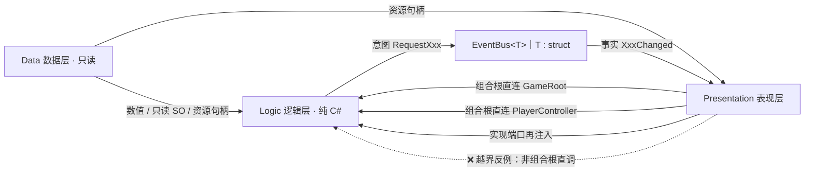
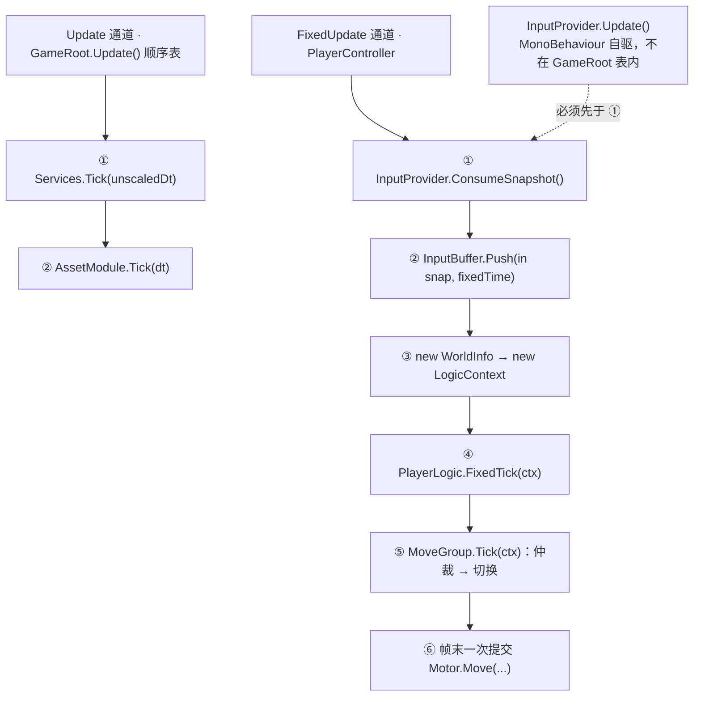
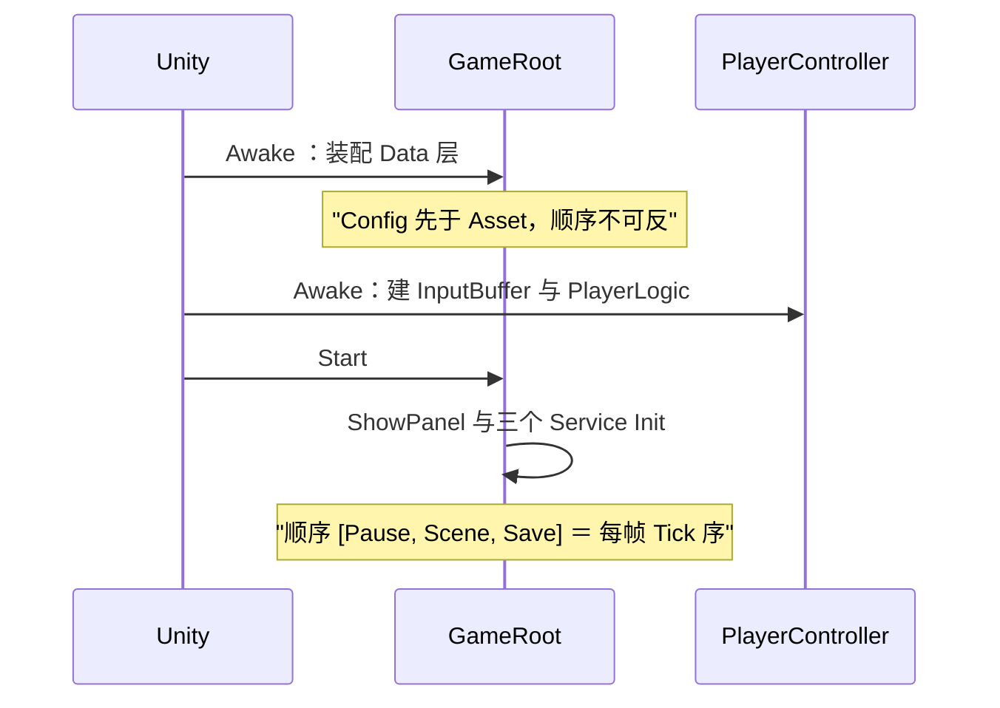

# 框架蓝图

## 1. 注意

| # | 契约 | 例外 |
| :-- | :-- | :-- |
| 1 | 跨层只走 `EventBus<T>` | 组合根/驱动点直连（`GameRoot`、`PlayerController`）；表现层实现逻辑层端口再注入（`MovementMotor : IMovementMotor`、`GameTime : IGameTime`） |
| 2 | 每帧只有三个驱动入口：`GameRoot.Update()`、`PlayerController.FixedUpdate()`、`InputProvider.Update()` | 不在非驱动点自写 `Update`/`FixedUpdate` |
| 3 | 生成物三处禁手写：`Generated/Config/`、`StreamingAssets/Luban/`、`Generated/Input/InputSys.cs` | 生成类是 `partial`，扩展另建文件 |

## 2. 每帧时序

## 3. 判层与程序集

| 命名空间 | 目录 | 层 |
| :-- | :-- | :-- |
| `DeepseaOil.Data` | `Scripts/Data/` | 数据层 |
| `DeepseaOil.Logic` ＋ `.Movement[.States]` / `.Player` / `.Input` / `.Events` / `.Service` | `Scripts/Logic/` | 逻辑层 |
| `DeepseaOil.Presentation` ＋ `.UI` | `Scripts/Presentation/` | 表现层 |
| `cfg` / `cfg.demo` / `DeepseaOil.Generated` | `Scripts/Generated/` | 机器生成 |
| `DeepseaOil.Foundation` | `Scripts/Foundation/` | 非层 |

`Scripts/` 下落 `Assembly-CSharp`；`Assets/Tests/Runtime/Editor/`落 `Assembly-CSharp-Editor` 
**不要装 Luban 的 UPM 包**：与本地拷贝撞名。

## 4. 启动装配序

## 5. 契约

| 主题 | 契约 |
| :-- | :-- |
| 输入 | 新输入系统，动作表 `InputSys.inputactions`，**不要用 `UnityEngine.Input`**（已禁用）；`InputProvider` 唯一采样点、`InputBuffer` 唯一按键沿存储点 |
| 通信 | Logic ↔ Presentation 只走 `EventBus<T>`；意图祈使式、事实过去式 |
| 配置源 | 数值走 Luban/xlsx（经 `ConfigModule`）；角色参数走 SO（`PlayerConfig`，不经它） |
| Data 层 | 只读、进程级常驻、被所有层直连；`ConfigModule` 重复 `Init` 抛异常，与 `AssetModule` 靠字符串 Key 衔接 |
| AssetModule | `LoadAsync<T>` ＋ 同步 `Load<T>`；引用计数；冷却期 60s；并发 4；LRU 上限 100 条；`AsyncHandle` 必须是 `class`、`Complete` 只在主线程 |
| 资源 Key | 表里存「相对 `Assets/` 带扩展名」，`Resources.LoadAsync` 要「相对 `Assets/Resources/` 不带扩展名」，转换点只有 `AssetRegistry.ResolvePath`（D4 盲区） |
| 状态 | 每刚体每项唯一写者；`ChangeState` 立即 `Exit → Enter`；"该不该切"由 `MoveGroup` 两段仲裁，未注册标签返回 false |
| 切场景 / 面板 | 切场景复位四项：`Time.timeScale` / `PauseService` / `EventBus.ClearAll` / `AssetModule.OnSceneSwitch`，全在 `LoadScene` 之前（D9）；面板顺序由 `Canvas.prefab` 四层兄弟顺序决定，**没有** `sortingOrder`（D28） |

## 6. 缺陷登记

| # | 现象 |
| :-- | :-- |
| ~~D2~~ | 已消除：上升期贴墙按跳无效——平台跳跃状态（`Jump` / `DoubleJump` / `Fall` / `WallSlide`）与蹬墙跳已整体删除，俯视角不存在该路径 |
| D3 / ~~D4~~ | ~~`玩家配置.asset` 的 `moveAcceleration: 5` 与代码默认 60 矛盾~~ → **已消除**：该批次把资产重填为 60，且 `moveAcceleration` 对俯视角玩家已无消费者（零惯性），仅留给需要惯性的角色。表里资源路径仍只校验在 `Assets/` 下存在、不校验在 `Resources/` 下（D4 未消除） |
| D7 / D8 | `UIMgr.ShowPanel` 的 `isSync` 从未被读、方法体走异步；`SaveService` 空实现却仍被每帧 Tick |
| D9 / D10 | `SceneService.Load` 无调用点 → 切场景复位从不执行；`IService.Dispose` 与 `PauseService.Reset()` 零调用 |
| D12 / D13 | `BeginPanel` 按钮语义反了（`"StartBtn"` 发 `RequestPause`）；`EventBusDebugPanel` 因 `DebugEvent` 无人 `Publish` 而永空 |
| D14 | `IAudioService` 无实现，`TimeContext`、`InputSnapshot.Empty`、`InputType.Attack`、`InputSys.UI` 均零调用 |
| D16 / D20 | `PlayerController` 暂停时 `Clear()` 调两次；`BaseManager<T>` 只认非公开无参构造 → 取不到时 `Instance` 永久为 null |
| D25 / D28 | `InputBuffer` 采样率在 `Awake` 固定 → 改 Fixed Timestep 后窗口失配；`UIMgr` 无法控制同层面板顺序（全仓库无 `SetSiblingIndex` 系列调用） |
| O10 / O12 | 待办：`ConfigModule` 无重置入口（重复 `Init` 抛且无 `Reset`）；`LifecycleMgr._cooldownSeconds` 赋值未读 |
| O13 | 待办：`Preload` 用 `typeof(UnityEngine.Object)` 加载，`TryGet<Sprite>` 是否命中取决于条目真实类型 |
