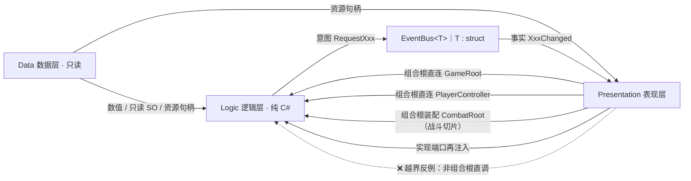
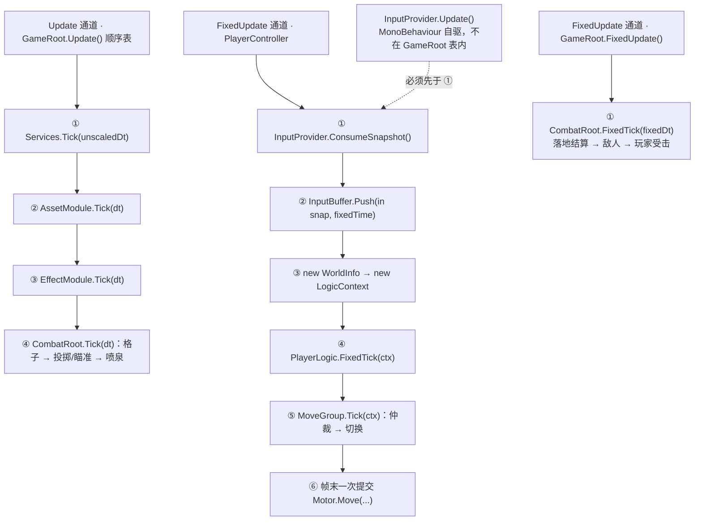
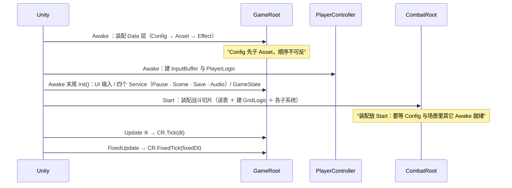

# 框架蓝图

## 1. 注意

| # | 契约 | 例外 |
| :-- | :-- | :-- |
| 1 | 跨层只走 `EventBus<T>` | 组合根/驱动点直连（`GameRoot`、`PlayerController`、`CombatRoot` 被 `GameRoot` 直连）；表现层实现逻辑层端口再注入（`MovementMotor : IMovementMotor`、`GameTime : IGameTime`、`EnemyActor : IDamageable`） |
| 2 | 每帧只有**四个**驱动入口：`GameRoot.Update()`、`GameRoot.FixedUpdate()`、`PlayerController.FixedUpdate()`、`InputProvider.Update()` | 不在非驱动点自写 `Update`/`FixedUpdate`（`CombatRoot`、球、敌人、水球、喷泉全部由组合根逐帧驱动） |
| 3 | 生成物三处禁手写：`Generated/Config/`、`StreamingAssets/Luban/`、`Generated/Input/InputSys.cs` | 生成类是 `partial`，扩展另建文件 |

## 2. 每帧时序

- **Update 通道第 ③ 步与第 ④ 步都用 `Time.deltaTime`**（不是 `unscaledDeltaTime`）：暂停（`timeScale = 0`）时特效与战斗一起冻结。
- **`GameRoot.FixedUpdate()` 是战斗切片唯一的物理帧通道**：落地冲量必须在物理帧施加（`Rigidbody2D.velocity` / `AddForce` 只在 `FixedUpdate` 与下一次 `Simulate` 之间生效），敌人速度也只在物理帧提交一次。顺序固定为"落地结算 → 敌人 → 玩家受击"，因此帧内可复现。
- 暂停时 Unity 不跑 `FixedUpdate`，所以这两条物理帧通道不需要额外挡一层。

## 3. 判层与程序集

| 命名空间 | 目录 | 层 |
| :-- | :-- | :-- |
| `DeepseaOil.Data` | `Scripts/Data/` | 数据层 |
| `DeepseaOil.Logic` ＋ `.Movement[.States]` / `.Player` / `.Input` / `.Events` / `.Service` / `.Combat` / `.Grid[.States]` / `.Projectile` / `.Random` / `.Wave` | `Scripts/Logic/` | 逻辑层 |
| `DeepseaOil.Presentation` ＋ `.UI` / `.Actor` / `.Combat` / `.Grid` / `.Player` / `.Projectile` / `.Visual` / `.World` / `.Effects[.Drivers]` | `Scripts/Presentation/` | 表现层 |
| `cfg` / `cfg.demo` / `DeepseaOil.Generated` | `Scripts/Generated/` | 机器生成 |
| `DeepseaOil.Foundation` | `Scripts/Foundation/` | 非层 |

`Scripts/` 下落 `Assembly-CSharp`；`Assets/Tests/Runtime/Editor/`落 `Assembly-CSharp-Editor` 
**不要装 Luban 的 UPM 包**：与本地拷贝撞名。

⚠️ **目录名与命名空间不一致的四处**（以此表为准）：`Logic/Actor/` 落 `DeepseaOil.Logic`（**不是** `.Actor`）、`Logic/Event/` 是复数 `.Events`、`Logic/Services/` 是单数 `.Service`、`Presentation/Root/`、`Presentation/Adapters/`、`Presentation/Input/`、`Presentation/Debug/` 都落 `DeepseaOil.Presentation`（**不是**子命名空间）。

## 4. 启动装配序

- 三个组合根的分工：`GameRoot` 装配 Data 层与 Service（`Awake`）；`PlayerController` 装配玩家逻辑（`Awake`）；**`CombatRoot` 装配战斗切片**（`Start`）。
- `CombatRoot` 的装配必须晚于 `GameRoot.Awake`（要读 `ConfigModule`）与场景内其它组件的 `Awake`（要用 `PlayerController.Logic`）。Unity 只保证"所有 `Awake` 先于任何 `Start`"，所以它放 `Start`。

## 5. 契约

| 主题 | 契约 |
| :-- | :-- |
| 输入 | 新输入系统，动作表 `InputSys.inputactions`，**不要用 `UnityEngine.Input`**（已禁用）；`InputProvider` 唯一采样点、`InputBuffer` 唯一按键沿存储点 |
| 通信 | Logic ↔ Presentation 只走 `EventBus<T>`；意图祈使式、事实过去式 |
| 配置源 | 数值走 Luban/xlsx（经 `ConfigModule`）；角色参数走 SO（`PlayerConfig`，不经它） |
| Data 层 | 只读、进程级常驻、被所有层直连；`ConfigModule` 重复 `Init` 抛异常，与 `AssetModule` 靠字符串 Key 衔接 |
| AssetModule | `LoadAsync<T>` ＋ 同步 `Load<T>`；引用计数；冷却期 60s；并发 4；LRU 上限 100 条；`AsyncHandle` 必须是 `class`、`Complete` 只在主线程 |
| 资源 Key | 表里存「相对 `Assets/` 带扩展名」，`Resources.LoadAsync` 要「相对 `Assets/Resources/` 不带扩展名」，转换点只有 `AssetRegistry.ResolvePath`（D4 盲区） |
| 状态 | 每刚体每项唯一写者；`ChangeState` 立即 `Exit → Enter`；"该不该切"由 `MoveGroup` 两段仲裁，未注册标签返回 false |
| 战斗·伤害来源 | **球只改格子，伤害全部来源于格子**：`GridLogic.OnBallHit(cell, BallSpec)` 把落点格切到该球种配置的状态，伤害/击退由 `GridLogic.Deal` 对"站在该格上的目标"逐个结算（方向按"格心 → 受害者"逐个算）。球不直接伤害任何目标 |
| 战斗·状态转换即伤害 | **每次落地都结算一次该状态的冲击**（伤害 / 击退取自 `tile_state` 行的 `enter_damage` / `enter_knockback`），而状态机**同状态不重入**（泥浆计时不被刷新）。开局加载（`LoadInitialStates`）**只切状态、不结算** —— 伤害的语义是"发生了转换" |
| 战斗·格子 Tick | 双缓冲队列：**本帧提交的请求下一帧才处理**（同帧去重、一次性消费）；状态转换进待处理表，**在本帧 Tick 循环跑完之后统一结算** ⇒ 同帧递归不可能发生。常规格不保留状态机（零常驻） |
| 战斗·敌人归属 | 敌人每物理帧把**脚底中心**上报给 `EnemyCellRegistry`（单点判定）；表里存 `IDamageable` 引用，一格可多个；注销是强制的，结算前先看 `IsDead` |
| 战斗·端口 | `IDamageable`（`IsDead` / `Position` / `TakeDamage(in Damage)`）由表现层实现（`EnemyActor`）；`Damage` 是"一次结算的全部事实"，`Impulse == 0` 即不击退（扣血与击退是两件独立的事） |
| 战斗·HUD | `HudPanel` **零轮询**：订阅事实事件（`PlayerHealthChanged` / `WaterBallCountChanged` / `WaveChanged`），并在 `ShowMe` 里发一条意图 `RequestHudRefresh` 让持有数据的系统重播当前值（面板是异步加载的，晚一帧才存在）。面板放在 `E_UILayer.Bottom` + `CanBeHideByKey = false`，这样它永远排在暂停面板之后被 `TryCloseTopmostPanel` 检查，不挡 Esc |
| 战斗·调参分界 | **策划数值走 Luban**：6 张新表 `projectile` / `enemy` / `tile_state` / `player` / `wave` / `tile_initial`（经 `SpecCatalog` 折成纯结构体）；**程序观感走 SO**：`Assets/Resources/tuning/ThrowTuning.asset`（走 `AssetModule.Load`，缺失时退化为代码默认值 ＋ 一条 Warning） |
| 输入·指针通道 | `InputProvider` 是**唯一采样点**：除 `InputSys` 动作表外，它还在 `Update` 里直读 `Mouse.current` 产出 `AimScreen` / `AttackPressedThisFrame` / `AltAttackPressedThisFrame` 三个**渲染帧**字段（动作表里没有攻击与瞄准动作）。迁移三步见 `InputProvider.SamplePointer` 注释 |
| 切场景 / 面板 | 切场景复位四项：`Time.timeScale`（**复核更正**：`SceneService.Load` 里独立的那行复位当前是注释，时间复位并入 `PauseService.SetPaused(false)` 内部）/ `PauseService` / `EventBus.ClearAll` / `AssetModule.OnSceneSwitch`，全在 `LoadScene` 之前（D9）；面板顺序由 `Canvas.prefab` 四层兄弟顺序决定，**没有** `sortingOrder`（D28） |

## 6. 缺陷登记

| # | 现象 |
| :-- | :-- |
| ~~D2~~ | 已消除：上升期贴墙按跳无效——平台跳跃状态（`Jump` / `DoubleJump` / `Fall` / `WallSlide`）与蹬墙跳已整体删除，俯视角不存在该路径 |
| D3 / ~~D4~~ | ~~`玩家配置.asset` 的 `moveAcceleration: 5` 与代码默认 60 矛盾~~ → **已消除**：该批次把资产重填为 60，且 `moveAcceleration` 对俯视角玩家已无消费者（零惯性），仅留给需要惯性的角色。表里资源路径仍只校验在 `Assets/` 下存在、不校验在 `Resources/` 下（D4 未消除） |
| D7 / D8 | `UIMgr.ShowPanel` 的 `isSync` 从未被读、方法体走异步；`SaveService` 空实现却仍被每帧 Tick |
| ~~D9~~ / D10 | ~~`SceneService.Load` 无调用点 → 切场景复位从不执行~~ → **2026-10-04 复核：不成立**。`Assets/Tests/Scene/TestChangeScene.cs:15` 是真实发布方（`EventBus<RequestChangeScene>.Publish`），复位链是活的；但**正式关卡目前没有触发入口**（只有测试场景组件）。**复核更正**：`IService.Dispose` 已被调用——`GameRoot.OnDestroy` 对 `List<IService>` **逐项** `Dispose()`（`PauseService.Dispose`、`SceneService.Dispose` 的静态订阅因此会摘除）；仍零调用的只有 `PauseService.Reset()`（D10） |
| ~~D12~~ / D13 | ~~`BeginPanel` 按钮语义反了（`"StartBtn"` 发 `RequestPause`）~~ → **2026-10-04 复核：不成立**。`Presentation/UI/Panel/BeginPanel.cs` 里 `"StartBtn"` → `GameManager.ChangeState(GameState.Running)`、`"ExitBtn"` → `BeforeExit`，语义正确。`EventBusDebugPanel` 因 `DebugEvent` 无人 `Publish` 而永空（D13 仍在） |
| D14 | `InputSnapshot.Empty` **已有消费者**（`Logic/Actor/EnemyLogic.cs`：敌人不吃输入，用空快照组装 `LogicContext`；白模迁移引入）；`InputType.Attack`（枚举成员存在、零消费）与 `InputSys.UI`（全仓无手写调用点）仍**零调用**。**复核更正**：本条原先登记的 `IAudioService`、`TimeContext` 在当前树中零声明，已从本条删除 |
| D16 / D20 | `PlayerController` 暂停时 `Clear()` 调两次；`BaseManager<T>` 只认非公开无参构造 → 取不到时 `Instance` 永久为 null |
| D25 / D28 | `InputBuffer` 采样率在 `Awake` 固定 → 改 Fixed Timestep 后窗口失配；`UIMgr` 无法控制同层面板顺序（全仓库无 `SetSiblingIndex` 系列调用） |
| O10 / O12 | 待办：`ConfigModule` 无重置入口（重复 `Init` 抛且无 `Reset`）；`LifecycleMgr._cooldownSeconds` 赋值未读 |
| O13 | 待办：`Preload` 用 `typeof(UnityEngine.Object)` 加载，`TryGet<Sprite>` 是否命中取决于条目真实类型 |
| **N1** | 战斗输入（攻击 / 瞄准）**直读 `Mouse.current`**：`InputSys.inputactions` 的 Player map 没有对应动作 ⇒ 无法重绑、没有手柄支持。契约"`InputProvider` 是唯一采样点"仍然成立。迁移三步与触发条件见 `InputProvider.SamplePointer` 注释 |
| **N2** | **第四个驱动入口**：`GameRoot.FixedUpdate()` 是战斗切片唯一的物理帧通道（落地冲量必须在物理帧施加）。它同时是"驱动入口从三个变四个"这条契约变更的落地处 —— 是否收敛由后续裁决 |
| **N3** | `UIMgr` 的 EventSystem 去重**只在构造那一刻做一次**：之后才加载的场景若自带 `EventSystem`，Unity 的每帧警告会回来（届时在场景加载回调里再调一次同一个 helper） |
| **N4** | `Assets/Fonts/SIMSUN SDF.asset` 是**动态图集**：Play 时按需把新字形写回资产 ⇒ 每次 Play 都可能让这个 33 MB 文件变脏（想干净就改 `Static` 并预烘字符） |
| **N5** | `tile_initial` 表**0 行数据**、没有"关卡"维度：`GridLogic.LoadInitialStates` 已实现且有测试（初始状态不产生伤害），但当前没有关卡系统喂它。加 `level` 列即可扩展 |
