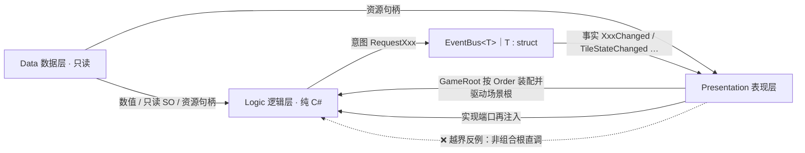
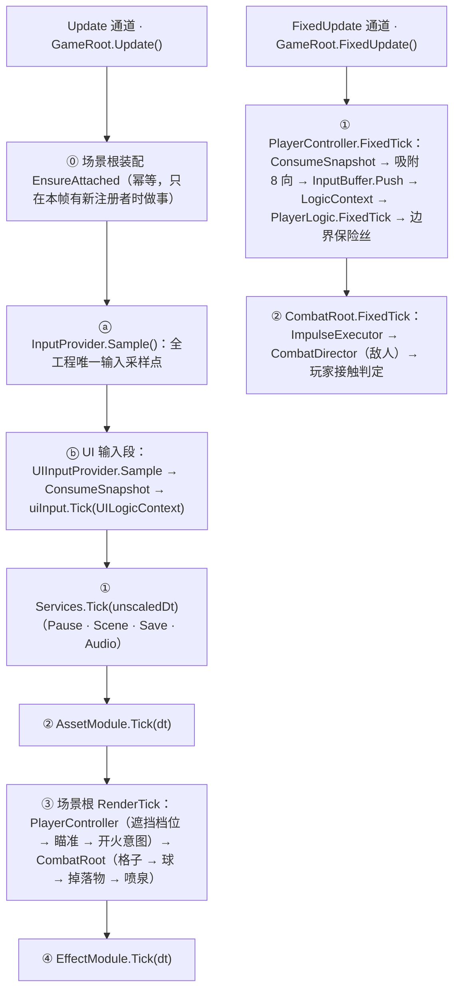
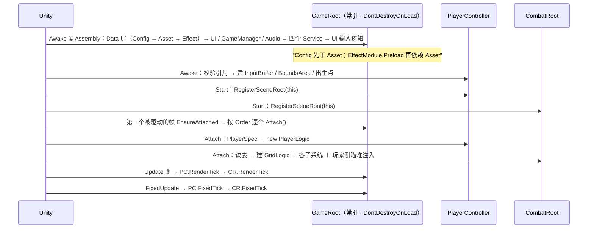

# 框架蓝图

## 1. 注意

| # | 契约 | 例外 / 机器判据 |
| :-- | :-- | :-- |
| 1 | 跨层只走 `EventBus<T>` | 组合根直连（`GameRoot` 驱动场景根；场景对象经 `ISceneRoot` 报到）；表现层实现逻辑层端口再注入（`PlayerMotor : IMovementMotor`、`GameTime : IGameTime`、`EnemyActor : IDamageable` / `ISlowEffectTarget`、`CombatRoot : IThrowSink` / `ITileSlowApplier`、`BallDirector : IBallLogicEffectContext`、`DropDirector : IDropSpawner`） |
| 2 | 每帧只有**两个**驱动入口：`GameRoot.Update()`（渲染帧）与 `GameRoot.FixedUpdate()`（物理帧） | 唯一例外是 `MonoMgr`（协程宿主 ＋ 三个转发，不参与帧内顺序）。`InputProvider`、`PlayerController`、`CombatRoot`、球、敌人、掉落物、喷泉**全部**由组合根逐帧驱动，无一自驱。判据：`收口一致性Tests.逐帧回调只出现在白名单里` |
| 3 | 生成物三处禁手写：`Generated/Config/`、`StreamingAssets/Luban/`、`Generated/Input/InputSys.cs` | 生成类是 `partial`，扩展另建文件 |
| 4 | 进程级件（UI / 音频 / 游戏状态 / Data 层）只由 `GameRoot` `new` 并持有；真单例只有它 | `MonoMgr` 是"临时例外、保持现状"（审查已裁定）；判据：`收口一致性Tests.Instance出口只剩GameRoot与MonoMgr` / `单例泛型只服务GameRoot与MonoMgr` |

## 2. 每帧时序

**只有两个入口，都在 `GameRoot`**；场景对象经 `ISceneRoot` 注册，按 `Order` 升序被装配与驱动（玩家侧 `-100`、世界侧 `0`）。

- **ⓐ 必须在所有消费者之前**：`WasPressedThisFrame` 只在动态更新里有效，晚一步采样就是丢掉这一帧的按下沿。`InputProvider` **不再自驱**（收口前它有 `Update`，与 `GameRoot.Update` 谁先跑由 Unity 决定）。
- **ⓑ 不并入 ①②③④ 编号**：它是"面板操作"，与战斗输入无关，且不吃 `dt`。`GameRoot.cs` 的内部注释与本文其余各处都按「① `Services.Tick` → ④ `EffectModule.Tick`」编号。
- **③ 与 ④ 都用 `Time.deltaTime`**（不是 `unscaledDeltaTime`）：暂停（`timeScale = 0`）时场景根与特效一起冻结。
- **两个物理帧通道其实只有一个入口**：`GameRoot.FixedUpdate` 按 `Order` 先驱动玩家侧（提交速度、消费输入）、再驱动世界侧（落地冲量 → 敌人 → 玩家受击）。顺序固定 ⇒ 帧内可复现：`CombatRoot` 的接触判定读的正是"玩家这一帧提交后的位置"。
- 暂停时 Unity 不跑 `FixedUpdate`，所以物理帧不需要额外挡一层；渲染帧的 `dt = 0` 让格子、球、掉落物、喷泉自然冻结。

## 3. 判层与程序集

| 命名空间 | 目录 | 层 |
| :-- | :-- | :-- |
| `DeepseaOil.Data` | `Scripts/Data/` | 数据层 |
| `DeepseaOil.Logic` ＋ `.Movement[.States]` / `.Player` / `.Input` / `.Events` / `.Service` / `.Combat` / `.Grid[.States]` / `.Projectile` / `.Drop` / `.Wave` | `Scripts/Logic/` | 逻辑层 |
| `DeepseaOil.Presentation` ＋ `.UI` / `.Actor` / `.Ball` / `.Drop` / `.Grid` / `.Projectile` / `.World` / `.Effects[.Drivers]` | `Scripts/Presentation/` | 表现层 |
| `cfg` / `cfg.demo` / `DeepseaOil.Generated` | `Scripts/Generated/` | 机器生成 |
| `DeepseaOil.Foundation` | `Scripts/Foundation/` | 非层（地基：数学 / 状态机骨架 / 池 / 随机 / Y 排序） |

`Scripts/` 下落 `Assembly-CSharp`；`Assets/Tests/Runtime/Editor/` 落 `Assembly-CSharp-Editor`（末级 `Editor` 是 Unity 硬要求）；`Assets/Tests/Tools/` 落 `DeepseaOil.EditorTools.Tests`；`Assets/Tests/Scene/` 随运行时程序集。
**不要装 Luban 的 UPM 包**：与本地拷贝撞名。

⚠️ **目录名与命名空间不一致的几处**（以此表为准）：`Logic/Actor/`（含 `States/`、`Status/`）、`Logic/Bounds/`、`Logic/Input/GameState.cs`、`Presentation/Root/`、`Presentation/Adapters/`、`Presentation/Input/`、`Presentation/Debug/`、`Presentation/Visual/`、`Presentation/白模用/`、`Presentation/UI/MonoMgr.cs`、`Presentation/UI/Panel/ExitConfirmPanel.cs` 都落**上层或基命名空间**（`DeepseaOil.Logic` / `DeepseaOil.Presentation`），不是子命名空间；`Logic/Event/` 是复数 `.Events`；`Logic/Services/` 是单数 `.Service`。

## 4. 启动装配序

- 分工：`GameRoot` 装配**进程级件**（Data 层 ＋ UI ＋ 音频 ＋ 服务表，放 `Awake`，失败即抛）；`PlayerController` 与 `CombatRoot` 是**场景根**，各自只报到，装配由 `GameRoot` 在第一个被驱动的帧按 `Order` 调 `Attach()`。
- **为什么装配不放 `Awake` / `Start`**：它要读配表（等 `GameRoot.Awake`）、玩家侧的 `Logic`（等 `PlayerController` 自己装配）、格子几何（等 `TilemapAdapter.Awake`）。Unity 只保证"所有 `Awake` 先于任何 `Start`"，**不保证两个 `Start` 的先后** —— 交给组合根按 `Order` 逐个调，且 `Attach` 必须幂等（`FixedUpdate` 可能先于第一个 `Update` 跑）。
- `GameRoot` 是**常驻对象**：若它每场景重建，新的那份会重新 `new` 一遍 UI / 音频池 / 游戏状态，而旧的那份还在 `DontDestroyOnLoad` 里活着。所以场景里放不放 `GameRoot` 都行，放了的那份若不是第一个，`Singleton<T>.Awake` 会销毁它（它连装配都不做）。

## 5. 契约

| 主题 | 契约 |
| :-- | :-- |
| 输入 | 新输入系统，动作表 `InputSys.inputactions`，**不要用 `UnityEngine.Input`**（已禁用）；`InputProvider` 唯一采样点（由 `GameRoot` 调 `Sample()`）、`InputBuffer` 唯一按键沿存储点 |
| 通信 | Logic ↔ Presentation 只走 `EventBus<T>`；意图祈使式、事实过去式；**发布方是数据的持有者** |
| 配置源 | 数值走 Luban/xlsx（经 `ConfigModule` ＋ `SpecCatalog`）；角色参数走 SO（`PlayerConfig`，不经它）；程序观感走 `Resources/tuning/*.asset` |
| Data 层 | 只读、进程级常驻、被所有层直连；`ConfigModule` 重复 `Init` 抛异常，与 `AssetModule` 靠字符串 Key 衔接 |
| AssetModule | `LoadAsync<T>` ＋ 同步 `Load<T>`；引用计数；冷却期 60s；并发 4；LRU 上限 100 条；`AsyncHandle` 必须是 `class`、`Complete` 只在主线程 |
| 资源 Key | 表里存「相对 `Assets/` 带扩展名」，`Resources.LoadAsync` 要「相对 `Assets/Resources/` 不带扩展名」，转换点只有 `AssetRegistry.ResolvePath`（D4 盲区） |
| 状态机 | 骨架在 `Foundation/`（`IState<Tag,Ctx>` / `StateBase` / `StateMachine` / `StateGroup` / `IStateHost`），三处共用；`ChangeState` 立即 `Exit → Enter`；"该不该切"由 `StateGroup` 两段仲裁，未注册标签返回 false |
| 角色·串行门禁 | **状态效果层 → 战斗层 → 移动层**，每层只向下层输出门禁；**只有移动层写速度**。门禁两种且互斥：`MoveGates.Forced`（受击滑停整条接管）与 `MoveGates.Scaled`（速度乘数，落在**目标速度**上） |
| 战斗·伤害来源 | **球只改格子，伤害全部来源于格子**：`GridLogic.OnBallHit(cell, TileStateType next)` 把落点格切到该球种配置的状态，伤害/击退由 `GridLogic.Deal` 对"站在该格上的目标"逐个结算（方向按"格心 → 受害者"逐个算）。球不直接伤害任何目标 |
| 战斗·状态转换即伤害 | **每次落地都结算一次该状态的冲击**（伤害 / 击退取自 `tile_state` 行的 `enter_damage` / `enter_knockback`），而状态机**同状态不重入**（同一格连投两颗泥浆不刷新计时、不重复结算）。开局加载（`LoadInitialStates`）**只切状态、不结算** —— 伤害的语义是"发生了转换" |
| 战斗·格子 Tick | 双缓冲队列：**本帧提交的请求下一帧才处理**（同帧去重、一次性消费）；状态转换进待处理表，**在本帧 Tick 循环跑完之后统一结算** ⇒ 同帧递归不可能发生。常规格不保留状态机（零常驻） |
| 战斗·效果是"推"不是"查" | 状态**不提供**"我减速多少"的查询口：`MudTileState.OnTick` 每帧提交一句 `ctx.Slow?.ApplySlow(cell, factor, 0.1f)`，由 `CombatRoot`（`ITileSlowApplier`）按"谁站在这一格"落到 `StatusGroup.ApplySlow`（续命式修饰）；出口是 `MoveGates.SpeedScale`。离格 ⇒ 不续命 ⇒ 自然过期 |
| 战斗·敌人归属 | 敌人每物理帧把**脚底中心**上报给 `EnemyCellRegistry`（单点判定）；表里存 `IDamageable` 引用，一格可多个；注销是强制的，结算前先看 `IsDead`。**玩家不在归属表里**：它那一格由 `CombatRoot` 直接判（只此一处，不构成第二个真源） |
| 战斗·端口 | `IDamageable`（`IsDead` / `Position` / `TakeDamage(in Damage)`）由 `EnemyActor` 实现；`IThrowSink` 由 `CombatRoot` 实现（落点合法性是世界信息）；`IDropSpawner` 由 `DropDirector` 实现（喷泉只认识"产出一颗"）；`ISlowEffectTarget` 由 `EnemyActor` 实现 |
| 战斗·帧相位 | 球的**飞行与改格在渲染帧**，**冲量在物理帧**（`ImpulseExecutor` 的短队列）；敌人移动与接触判定在物理帧；瞄准与开火意图在渲染帧（非物理逻辑，且"屏幕 → 世界"只有表现层做得了） |
| 战斗·HUD | `HudPanel` **零轮询**：订阅事实事件（`PlayerHealthChanged` / `WaterBallCountChanged` / `WaveChanged`），并在 `ShowMe` 里发一条意图 `RequestHudRefresh` 让持有数据的系统重播当前值（面板是异步加载的，晚一帧才存在）。面板放在 `E_UILayer.Bottom` + `CanBeHideByKey = false`，这样它永远排在暂停面板之后被 `TryCloseTopmostPanel` 检查，不挡 Esc |
| 战斗·调参分界 | **策划数值走 Luban**：9 张表（其中战斗切片 6 张：`projectile` / `enemy` / `tile_state` / `player` / `wave` / `tile_initial`，经 `SpecCatalog` 折成纯结构体）；**程序观感走 SO**：`Resources/tuning/ThrowTuning.asset` 与 `DropTuning.asset`（走 `AssetModule.Load`，**随仓库发布**；缺失时退化为代码默认值 ＋ 一条 Error ＋ 一条 Warning） |
| 输入·指针通道 | `InputProvider` 是**唯一采样点**：除 `InputSys` 动作表外，它还在 `Sample()` 里直读 `Mouse.current` 产出 `AimScreen` / `AttackPressedThisFrame` / `AltAttackPressedThisFrame` 三个**渲染帧**字段（动作表里没有攻击与瞄准动作）。迁移三步见 `InputProvider.SamplePointer` 注释 |
| 切场景 / 面板 | 切场景复位四项：`Time.timeScale`（**复核更正**：`SceneService.Load` 里那行复位当前是注释，时间复位并入 `PauseService.SetPaused(false)` 内部）/ `PauseService` / `EventBus.ClearAll` / `AssetModule.OnSceneSwitch`，全在 `LoadScene` 之前；面板顺序由 `Canvas.prefab` 四层兄弟顺序决定，**没有** `sortingOrder`（D28） |

## 6. 缺陷登记

| # | 现象 |
| :-- | :-- |
| ~~D2~~ | 已消除：上升期贴墙按跳无效——平台跳跃状态（`Jump` / `DoubleJump` / `Fall` / `WallSlide`）与蹬墙跳已整体删除，俯视角不存在该路径 |
| D3 / ~~D4~~ | ~~`玩家配置.asset` 的 `moveAcceleration: 5` 与代码默认 60 矛盾~~ → **已消除**：该批次把资产重填为 60，且 `moveAcceleration` 对俯视角玩家已无消费者（零惯性），仅留给需要惯性的角色。表里资源路径仍只校验在 `Assets/` 下存在、不校验在 `Resources/` 下（D4 未消除） |
| D7 / D8 | `UIMgr.ShowPanel` 的 `isSync` 从未被读、方法体走异步；`SaveService.Save` 不赋值、`Load` 恒返回 `default`，且**全仓无 `.Save(` 调用点**（服务仍被每帧 Tick） |
| ~~D9~~ / D10 | ~~`SceneService.Load` 无调用点 → 切场景复位从不执行~~ → **复核：不成立**。`Assets/Tests/Scene/TestChangeScene.cs:15` 是真实发布方（`EventBus<RequestChangeScene>.Publish`），复位链是活的；但**正式关卡目前没有触发入口**（只有测试场景组件）。`IService.Dispose` 已被调用（`GameRoot.OnDestroy` 逐项 `Dispose()`）；仍零调用的只有 `PauseService.Reset()`（D10） |
| ~~D12~~ / D13 | ~~`BeginPanel` 按钮语义反了~~ → **复核：不成立**（`"StartBtn"` → `GameState.Running`、`"ExitBtn"` → `BeforeExit`）。**D13 已消除**：`DebugEvent` 结构体与它的空面板一起删除，`EventBusDebugPanel` 改为订阅 `TileStateChanged` |
| D14 | `InputSnapshot.Empty` **已有消费者**（`Logic/Actor/EnemyLogic.cs`：敌人不吃输入，用空快照组装 `LogicContext`）；`InputType.Attack`（枚举成员存在、零消费）与 `InputSys.UI`（全仓无手写调用点）仍**零调用**。~~`IAudioService` / `TimeContext`~~ 在当前树中零声明，已从本条删除 |
| ~~D16~~ / D20 | ~~`PlayerController` 暂停时 `Clear()` 调两次~~ → **已消除**（`SetInputEnabled(false)` 内部已 `Clear()`，另一处是 `_buffer.Clear()`，两个对象各清一次）；~~`BaseManager<T>` 只认非公开无参构造 → `Instance` 永久为 null~~ → **已退场**：`BaseManager.cs` 已删除（音频收口后它只剩零个消费者），判据 `收口一致性Tests.反射单例基类已退场` |
| D25 / D28 | `InputBuffer` 采样率在 `Awake` 固定（`RoundToInt(1 / Time.fixedDeltaTime)`）→ 改 Fixed Timestep 后窗口失配；`UIMgr` 无法控制同层面板顺序（全仓库无 `SetSiblingIndex` 系列调用） |
| O10 / O12 | 待办：`ConfigModule` 无重置入口（重复 `Init` 抛且无 `Reset`）；`LifecycleMgr._cooldownSeconds` 赋值未读（`RefCounter` 的同名字段是读的） |
| O13 | 待办：`AssetModule.Preload` 用 `typeof(UnityEngine.Object)` 加载，`TryGet<Sprite>` 是否命中取决于条目真实类型 |
| **O14** | 待办：`enemy` 表的 `stun_seconds`（`EnemySpec.StunSeconds`）**零消费者** —— 受击禁足已改为 `hurt_decay` 滑停，列还留在表里（要么删列，要么给它一个新用途） |
| **O15** | 待办：三个"有实现、无调用点"的收尾口 —— `GridLogic.Clear()`（回合重置刻意不清泥浆）、`ContactDamage.ScannedCells`（常量，只作文档）、`EnemyCharacterFactory.ClearCache()`（测试期缓存清理） |
| **N1** | 战斗输入（攻击 / 瞄准）**直读 `Mouse.current`**：`InputSys.inputactions` 的 Player map 没有对应动作 ⇒ 无法重绑、没有手柄支持。契约"`InputProvider` 是唯一采样点"仍然成立。迁移三步与触发条件见 `InputProvider.SamplePointer` 注释 |
| ~~N2~~ | **已消除**：~~第四个驱动入口~~。驱动入口从"四个"收敛到**两个**（`GameRoot.Update` / `GameRoot.FixedUpdate`），`PlayerController.FixedUpdate` 与 `InputProvider.Update` 两个自驱入口已改为被驱动，顺序由 `ISceneRoot.Order` 写死 |
| **N3** | `UIMgr` 的 EventSystem 去重**只在构造那一刻做一次**：之后才加载的场景若自带 `EventSystem`，Unity 的每帧警告会回来（届时在场景加载回调里再调一次同一个 helper） |
| **N4** | `Assets/Fonts/SIMSUN SDF.asset` 是**动态图集**：Play 时按需把新字形写回资产 ⇒ 每次 Play 都可能让这个 33 MB 文件变脏（想干净就改 `Static` 并预烘字符） |
| **N5** | `tile_initial` 表**0 行数据**、没有"关卡"维度：`GridLogic.LoadInitialStates` 已实现且有测试（初始状态不产生伤害），但当前没有关卡系统喂它。加 `level` 列即可扩展 |
| **N6** | `Assets/Scenes/TextTile.unity` 是白模期的遗留场景：脚本 GUID 已孤立、`radiuView` 拼写错误、引用了一个已删的水球预制体、缺 `aimCamera`。**建议整体删除**（唯一活场景是 `EmptyTest`） |
| **N7** | 【推断·待目视确认】三个场景**都没有 `Light2D`**，而场景里手工摆的 `SpriteRenderer` / `TilemapRenderer` 用的是 `Sprite-Lit-Default`（受光材质）；`Render2DLightingPass` 在本层零光源时把 `_ShapeLightTexture0` 绑成 `blackTexture` ⇒ **玩家方块与地板很可能渲染成黑色**，而运行期 `AddComponent` 建出来的件（敌人 / 球 / 碎片 / 高亮）用 Unity 默认的 `Sprites-Default`（不受光）所以正常。修法：加一盏 Global Light 2D（2D 模板自带）。详见 [新场景接线.md](新场景接线.md) §2 |
| **N8** | `EmptyTest` 的 Main Camera 下有个孤儿 `cm`（只有 `CinemachinePipeline`，**没有 vcam 也没有 Brain**）：当前场景里**没有任何可用的 Cinemachine**，相机是静止的（玩家走出画面就没有跟随）。要么删掉它重配，要么按 [新场景接线.md](新场景接线.md) §4 配一套 |
