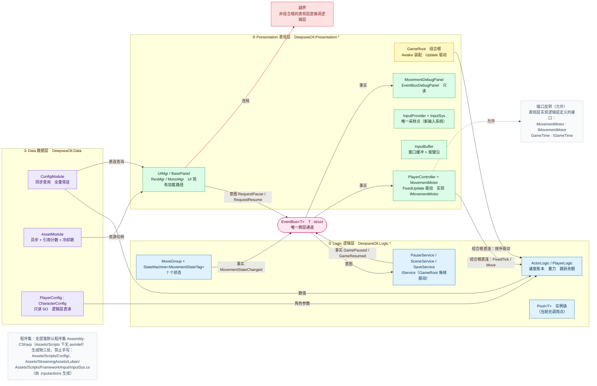
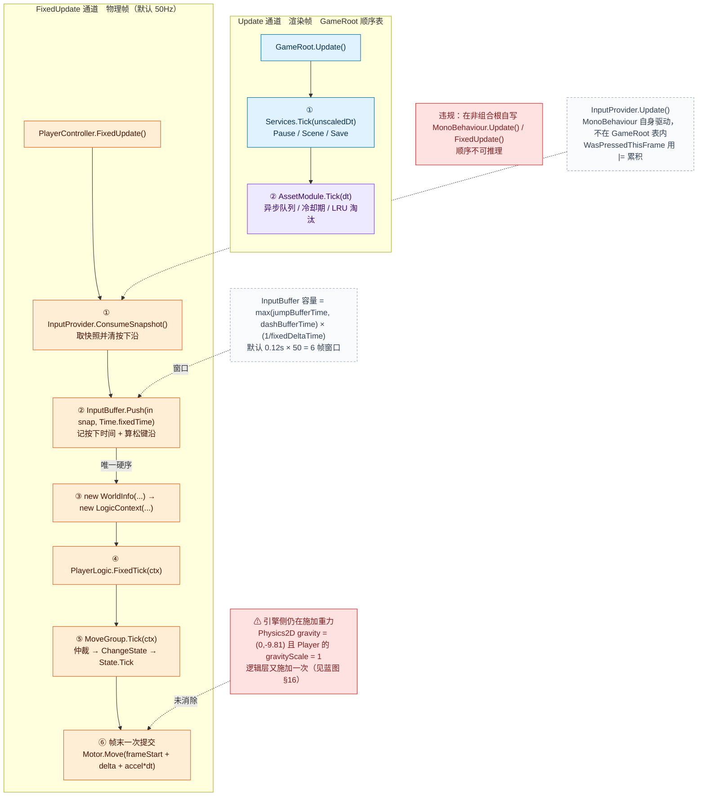
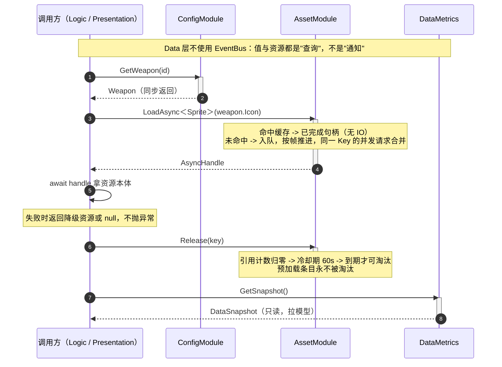
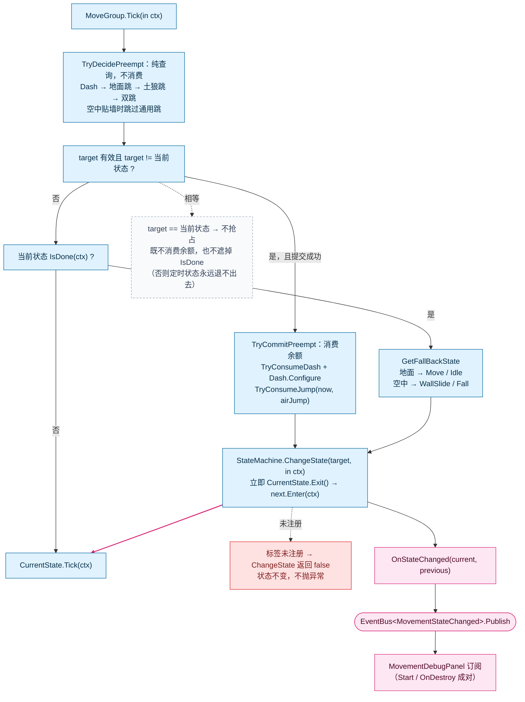
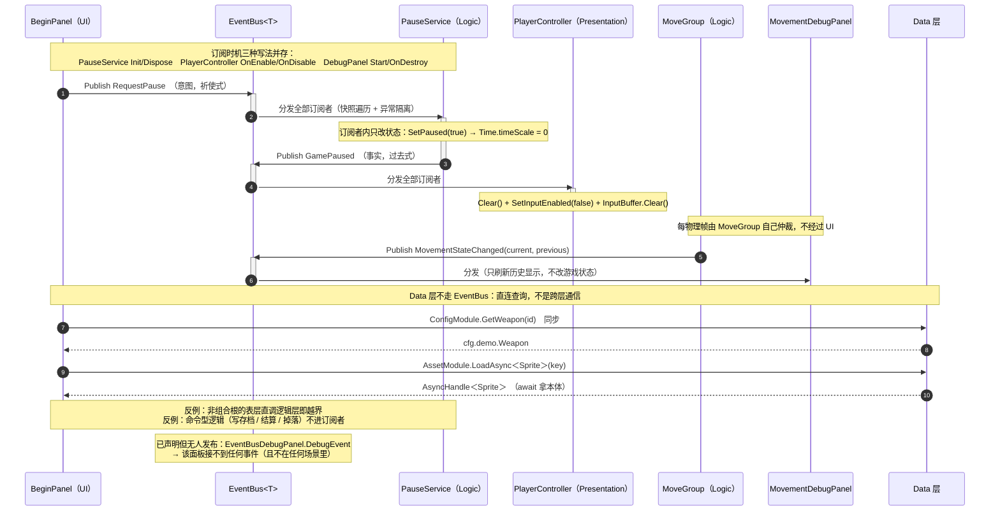
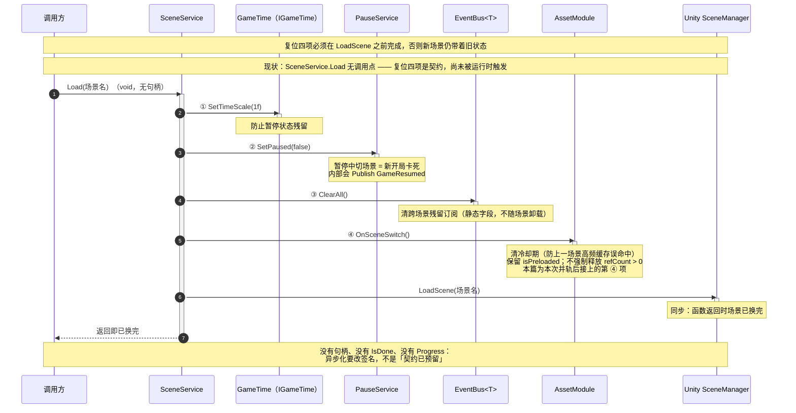
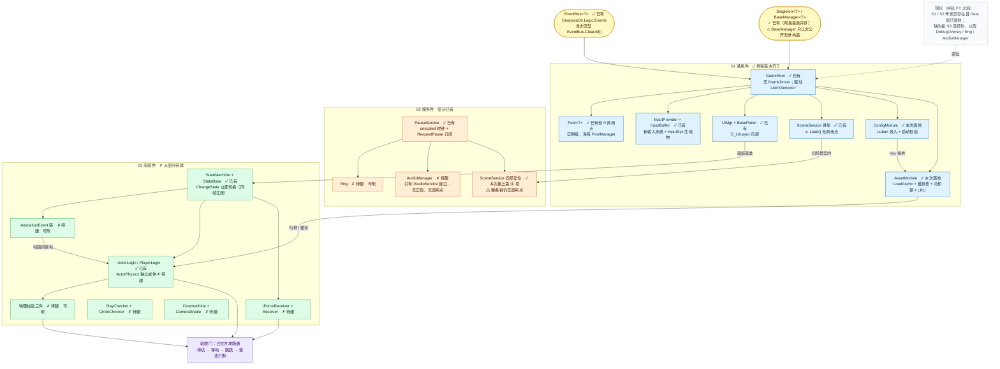
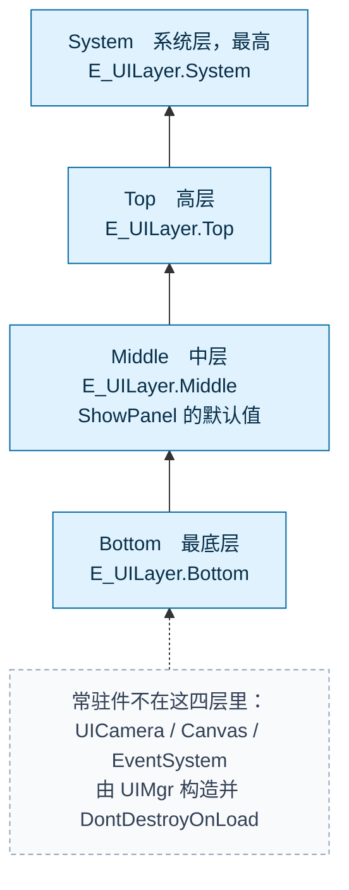

# 框架蓝图

**三条铁律**（例外见 §1.1；与仓库现状的差距见 §15、§16）：

1. **跨层只走 `EventBus<T>`**（只服务 Logic ↔ Presentation 之间的意图/事实通知）。
   两条例外：**组合根/驱动点允许直连**（`GameRoot` → 逻辑层、`PlayerController` → `PlayerLogic`）；
   **表现层可以实现逻辑层定义的端口再注入**（`MovementMotor : IMovementMotor`、`GameTime : IGameTime`）。
2. **每帧只有三个驱动入口**：`GameRoot.Update()` 驱动 `List<IService>`（渲染帧，组合根），
   `PlayerController.FixedUpdate()` 驱动 `PlayerLogic`（物理帧，组合根），
   `InputProvider.Update()` 采样输入（第三处）。渲染帧与物理帧之间**没有**先后关系：
   一个渲染帧可能对应 0 或 2 个物理帧。
   `InputProvider` 是**被输入后端强制的例外**——`WasPressedThisFrame()` 只在动态更新有效，
   而按下沿必须由物理帧侧的 `ConsumeSnapshot()` 消费（`InputProvider.cs:9` 的原注释已说明）。
   除此之外**不在非驱动点自写 `Update()` / `FixedUpdate()`**——顺序会不可推理。
3. **生成物专用位置有三处，禁止放手写文件**：
   `Assets/Scripts/Config/`（Luban 生成代码）、`Assets/StreamingAssets/Luban/`（Luban 生成 JSON）、
   `Assets/Scripts/Framework/Input/InputSys.cs`（由 `InputSys.inputactions` 自动生成，手改会被丢弃）。

> 数据（数值与资源）不走 EventBus——它是**直连查询**，不是通知。详见 §4。

**读法**：本文件是规范性文档，回答"能不能这么做"；落到设计粒度看 [`Data 层设计.md`](Data%20层设计.md)，落到代码看 [`Data 层实现.md`](Data%20层实现.md)。
**图的维护方式**：每张图的 mermaid 代码块与 `sources/` 下的源文件（文件名见各图上方）**逐字符一致**（`%%` 注释行除外），由 EditMode 测试守护（§10.4）。改图先改源文件，再同步本文件。

---

## 1. 总览：三层 + 一条通道

```
┌────────────────────────────────────────────────────────────────────┐
│  Data 层　DeepseaOil.Data　只读内容提供者，被 Logic / 表现层直连     │
│  ┌───────────────────────┐  ┌─────────────────────────────────┐   │
│  │  ConfigModule         │  │  AssetModule                    │   │
│  │  · 同步查询            │  │  · 异步加载                      │   │
│  │  · 全量常驻            │  │  · 引用计数 + 冷却期缓存 60s      │   │
│  │  · 无释放              │  │  · 并发 4 + LRU 淘汰（上限 100）  │   │
│  │  · Luban 生成          │  │  · 每帧 Tick（唯一主动行为）      │   │
│  ├───────────────────────┤  ├─────────────────────────────────┤   │
│  │  DataMetrics 拉模型    │  │  FailureHandler 降级资源注册      │   │
│  └───────────────────────┘  └─────────────────────────────────┘   │
│  ┌────────────────────────────────────────────────────────────┐   │
│  │  PlayerConfig : CharacterConfig : BaseConfig（ScriptableObject）│
│  │  ← 角色数值，逻辑层直读（这就是"Data ← Logic 直连"的真实例子）│   │
│  └────────────────────────────────────────────────────────────┘   │
└────────────────────────────────────────────────────────────────────┘
                  ↑ 直连查询（允许，不需要 EventBus）
                  │
┌────────────────────────────────────────────────────────────────────┐
│  Logic 层　DeepseaOil.Logic.*　不读 Unity Time、不继承 MonoBehaviour│
│  ┌─────────────────────────┐  ┌──────────────────────────────┐    │
│  │  ActorLogic             │  │  PauseService                │    │
│  │  PlayerLogic            │  │  SceneService  SaveService   │    │
│  │  速度账本 / 重力 / 余额  │  │  IService（由 GameRoot 驱动） │    │
│  └─────────────────────────┘  └──────────────────────────────┘    │
│  ┌─────────────────────────┐  ┌──────────────────────────────┐    │
│  │  MoveGroup              │  │  Pool<T>                     │    │
│  │  StateMachine<TStateTag>│  │  （实例级，当前 0 调用点）     │    │
│  │  ＋ 7 个状态             │  │                              │    │
│  └─────────────────────────┘  └──────────────────────────────┘    │
│  ┌────────────────────────────────────────────────────────────┐   │
│  │  端口（由表现层实现）：IMovementMotor　IGameTime             │   │
│  └────────────────────────────────────────────────────────────┘   │
└────────────────────────────────────────────────────────────────────┘
                  ↑ 意图祈使式 / 事实过去式
                  │ EventBus<T>　T : struct
                  │ （在 DeepseaOil.Logic.Events，唯一跨层通道）
┌────────────────────────────────────────────────────────────────────┐
│  Presentation 层　DeepseaOil.Presentation.*                        │
│  ┌─────────────────────────┐  ┌──────────────────────────────┐    │
│  │  GameRoot　组合根        │  │  UIMgr / BasePanel           │    │
│  │  PlayerController       │  │  ResMgr / MonoMgr            │    │
│  │  MovementMotor          │  │  （UI 现有加载路径）          │    │
│  └─────────────────────────┘  └──────────────────────────────┘    │
│  ┌─────────────────────────┐  ┌──────────────────────────────┐    │
│  │  InputProvider          │  │  MovementDebugPanel          │    │
│  │  InputBuffer / GameTime │  │  EventBusDebugPanel（只读）   │    │
│  │  InputSys（生成物）      │  │                              │    │
│  └─────────────────────────┘  └──────────────────────────────┘    │
└────────────────────────────────────────────────────────────────────┘
```

**`EventBus<T>`（T : struct）能做什么、不能做什么**：

| 能做 | 不能做 |
| :-- | :-- |
| 承载 Logic ↔ Presentation 之间的意图（`RequestXxx`）与事实（`XxxChanged`） | 不传对象本体（struct 装不下 `UnityEngine.Object`） |
| 编译期查类型、无装箱、发布订阅方不共享堆引用 | 不承担命令-响应语义（那是**直连查询**的领域） |
| 单向广播，订阅方零依赖 | 不服务 Data 层（Data 层不发布、不订阅） |
| 订阅/退订幂等；发布用快照遍历，订阅者内增删不影响本次 | 发布**每次分配一个快照数组**（`new Action<T>[count]`）——热路径上要留意 |

**实现现状（`Assets/Scripts/Framework/Event/EventBus.cs`）**：
- 泛型 `EventBus<T>` + 非泛型门面 `EventBus.ClearAll()`；`ClearAll` 靠 `EventChannelRegistry` 反射调用各封闭类型的 `Clear()`。
- ⚠️ `EventChannelRegistry` 存了 `Action` 却只用 `Keys` 遍历，存的委托从不被调用（无害，属冗余分配）。
- ⚠️ `ClearAll` 目前唯一的调用点是 `SceneService.Load`，而后者**没有调用点**，所以清静态订阅这条链在运行时还没跑过。
- ⚠️ `EventBusDebugPanel.DebugEvent` 有订阅、**无人发布**，且该组件不在任何场景里。

**单例有两条基类**（都在 `Assets/Scripts/Framework/Singleton/`），**Data 层两条都不用**：

| 基类 | 形态 | 用于 | 已知坑 |
| :-- | :-- | :-- | :-- |
| `Singleton<T> : MonoBehaviour` | 找不到就 `new GameObject` + `AddComponent`，并 `DontDestroyOnLoad` | `ResMgr`、`MonoMgr` | 反射式创建会顺带触发 `Awake`，顺序依赖要多想一步 |
| `BaseManager<T>` | 纯 C# 单例，反射取**非公开**无参构造 | `UIMgr`、`ConfigController` | 子类若只有公开构造函数，`info == null` → 只记 Error，`Instance` **永久为 null**（不重试、不抛） |

`PauseService` / `SceneService` / `SaveService` **不是单例**：由 `GameRoot.Start()` `new` 出来放进 `List<IService>`。
`ConfigModule` / `AssetModule` / `DataMetrics` 是 `static class` + 显式 `Init`——因为"Config 必须先于 Asset"这种时序，懒加载单例保证不了。

### 1.1 依赖方向速查

| 方向 | 允许 | 说明 |
| :-- | :-- | :-- |
| Data ← Logic | ✅ | 逻辑层直连读数值（含只读 SO）与资源句柄 |
| Data ← Presentation | ✅ | 表现层直连读，不需要绕 EventBus |
| Presentation → Logic | ⚠️ **仅组合根/驱动点** | 其它一律走 EventBus。`GameRoot` 驱动 `IService`、`PlayerController` 驱动 `PlayerLogic` 属于此列 |
| Presentation ─实现─> Logic 的接口 | ✅ | 依赖反转：`MovementMotor : IMovementMotor`、`GameTime : IGameTime`，实例由组合根注入逻辑层 |
| Logic → Presentation | ❌ | 唯一例外：通过 EventBus |
| Data → 任何层 | ❌ | Data 层零业务依赖 |

### 1.2 Data 层三条边界

| # | 边界 | 理由 |
| :-- | :-- | :-- |
| 1 | 不继承 `Singleton<T>`，用 `static class` + 显式 `Init` | 需要确定的初始化时序 |
| 2 | 不订阅、不发布 EventBus 事件 | 查询式接口无事件语义；加载完成通过 `AsyncHandle` 传递 |
| 3 | 唯一主动行为是 `AssetModule.Tick`，由 GameRoot 驱动且只处理内部状态 | 队列/冷却期/LRU 需要每帧推进；**这条例外不推广成通用模式** |

---

## 2. 图 1｜分层与通道

> 源文件：`sources/01-layers.mmd`



- 箭头是**依赖方向，不是调用方向**：逻辑层依赖数据层的数值，数据层不认识任何层。
- 表现层与逻辑层之间**只有两条组合根直连边**（`Root → Logic`、`Player → Logic`）和一条端口反转边（`Player → Ports`）；
  其余跨层一律走 `EventBus<T>`。红框是唯一的越界反例：**非组合根**的表现层直接调逻辑层。
- 数据层全部只读：SO、Luban Tables、资源缓存都只被读。
- 表现层到数据层的两条直连边是**本版新增**：UI 取图标、取数值不需要绕 EventBus。绕过它反而更慢、更绕。
- `EventBus<T>` 用 `struct`：编译期查类型、无装箱、发布订阅方不共享堆引用。
- ⚠️ 图里的 `UI` 节点**含 `ResMgr / MonoMgr`**：UI 当前的资源加载走的是 `ResMgr`（表现层自有实现），
  **不是** `AssetModule`。切不切过去是独立决策，本版不动（见 §15）。

---

## 3. 图 2｜单帧执行

> 源文件：`sources/02-frame-order.mmd`



- 两条通道**互不嵌套**：`GameRoot.Update` 只管渲染帧的两步；物理帧全部由 `PlayerController.FixedUpdate` 驱动。
  二者之间没有先后关系：一个渲染帧可能对应 **0 或 2 个**物理帧（默认 Fixed Timestep 0.02s = 50Hz）。
  暂停时 `Time.timeScale = 0`，`FixedUpdate` 不再触发，所以暂停期间不会有 `Push`。
- **step ② `AssetModule.Tick(dt)` 是本版新增**：异步队列、冷却期、LRU 需要每帧推进。
  - 由 `GameRoot` 驱动而**不是**由 `Services` 驱动：保持 Data 层独立，不形成"Logic 驱动 Data 内部状态"的隐性耦合。
  - 只处理 AssetModule 内部状态（句柄/缓存表/队列），不发布事件，不触达其他层。这条例外记在契约表，不作为通用模式推广。
- **物理帧的"唯一硬序"是 `InputBuffer.Push` 必须先于 `PlayerLogic.FixedTick`**——由 `PlayerController.FixedUpdate`
  里的调用顺序保证，**类型系统不保证**（`Push` 与 `Tick` 之间没有编译期约束）。
- `InputProvider.Update()` **不在 `GameRoot` 的表里**：它是 MonoBehaviour，由 Unity 自己驱动。它靠 `|=` 累积按下沿，
  所以"渲染帧采样 → 物理帧消费"这层跨帧关系就是它的全部职责。
- ⚠️ 图里"引擎侧仍在施加重力"是实测缺陷（`Physics2D.gravity = (0,-9.81)` + `gravityScale = 1`，逻辑层又施加一次），详见 §16。
- ❌ 图上原有的 `Views` / `DebugOverlay` / `Actors.Tick` / `EventBus<FrameEnded>` **在上游都不存在**，本版已删。见 §16。

### 3.1 启动装配序（两阶段）

装配分两段，因为两组东西的时序要求不同：

```
GameRoot.Awake           ← 阶段 1：Data 层。Unity 只保证「所有 Awake 先于任何 Start」
  ├─ ConfigModule.InitFromStreamingAssets()   同步全量加载；失败抛 ConfigLoadException（带病数据不进运行时）
  └─ AssetModule.Init()                        建缓存表 / 调度器 / 引用计数 / 生命周期

GameRoot.Start           ← 阶段 2：表现层与逻辑层
  ├─ UIMgr.Instance.ShowPanel<BeginPanel>()    构造 UICamera / Canvas / EventSystem（DontDestroyOnLoad）
  ├─ new GameTime()                            IGameTime 的表现层实现
  ├─ new PauseService(gameTime)   ┐
  ├─ new SceneService(gameTime, pauseService)  │ 三者都不是单例
  ├─ new SaveService()            ┘
  ├─ pauseService.Init() / sceneService.Init() / saveService.Init()
  └─ services.Add(...)             顺序 = [Pause, Scene, Save] = 每帧 Tick 顺序
```

**关键约束**：

- **ConfigModule 必须先于 AssetModule**——AssetModule 的 Key 来自 Config。
- **Data 层装配放在 `Awake` 而不是 `Start`**：`Start` 的顺序在多个 MonoBehaviour 之间是不确定的，
  放在 `Start` 会与别的脚本的 `Start`（例如 `ConfigLoader`）抢顺序。放 `Awake` 才有确定性。
- **阶段 2 内部：初始化序 = 每帧序**（`services` 列表既是 Init 序也是 Tick 序），不允许两套顺序。
- **跨阶段不要求"初始化序 = 每帧序"**：`AssetModule` 在阶段 1 装配，却在每帧最后 Tick。这是有意的——它是依赖，不是 tickable。
- ⚠️ 阶段 2 里**没有** `PoolManager.Init()` / `InputProvider.Init()` / `UIManager.Init()` / `DebugOverlay.Init()`：
  上游不存在这些类型/方法（`Pool<T>` 是实例级、`InputProvider` 无 `Init()`、UI 管理器叫 `UIMgr` 且无 `Init()`、没有 `DebugOverlay`）。见 §16。

### 3.2 图 7｜启动到每帧的调用链

> 启动一次装配，之后每帧按两条通道驱动：没有第三种时序来源。

```text
GameRoot.Awake                    阶段 1：Data 层
  ├─ ConfigModule.InitFromStreamingAssets()
  └─ AssetModule.Init()

GameRoot.Start                    阶段 2：表现层 + 逻辑层
  ├─ UIMgr.Instance.ShowPanel<BeginPanel>()
  ├─ new GameTime() → new PauseService / SceneService / SaveService
  └─ services = [Pause, Scene, Save]        初始化序 = 每帧序

每渲染帧 Update（GameRoot）
  ├─ foreach (var s in services) s.Tick(Time.unscaledDeltaTime)
  │    └─ Pause / Scene / Save（Scene 与 Save 的 Tick 目前是空实现）
  └─ AssetModule.Tick(Time.deltaTime)        异步队列 / 冷却期 / LRU 淘汰

每条渲染帧 Update（InputProvider，它自己的 MonoBehaviour）
  └─ 采样 InputSys：Move 钳到 1；Jump/Grab 取 IsPressed；Jump/Dash 按下沿用 |= 累积

每物理帧 FixedUpdate（PlayerController）    ← 组合根直连逻辑层
  ├─ inputProvider.ConsumeSnapshot()             取快照并清按下沿
  ├─ _buffer.Push(in snapshot, Time.fixedTime)   记按下时间 + 算松键沿
  ├─ new WorldInfo(...) + new LogicContext(Time.fixedTime, Time.fixedDeltaTime, ...)
  └─ Logic.FixedTick(ctx)
       ├─ ActorLogic.FixedTick：帧首读 Motor.Velocity → 清零 delta / accel
       ├─ PlayerLogic.OnTick
       │    ├─ ApplyGravity（松键截断 → 重力选择 → 上下限钳制）
       │    ├─ 落地记账（清空中余额、记 _lastGroundedAt）
       │    └─ MoveGroup.Tick(ctx)
       │         ├─ CheckTransitions：抢占判定（纯查询）→ 抢占提交（消费余额）
       │         │                     否则 IsDone ? 基础态 : 当前态
       │         ├─ StateMachine.ChangeState：立即 Exit → Enter
       │         └─ CurrentState.Tick(ctx)
       └─ 帧末一次提交：Motor.Move(frameStart + delta + accel * dt)
                        （零提交帧不写速度）

切场景（SceneService.Load）          四项复位全部在 LoadScene 之前
  ├─ ① gameTime.SetTimeScale(1f)
  ├─ ② pauseService.SetPaused(false)           会 Publish GameResumed
  ├─ ③ EventBus.ClearAll()
  ├─ ④ AssetModule.OnSceneSwitch()
  └─ SceneManager.LoadScene(sceneName)         同步；方法返回 void，无句柄
  ⚠ SceneService.Load 目前没有任何调用点 → 这条链在运行时还没跑过

进程退出（GameRoot.OnDestroy）
  └─ AssetModule.Dispose()                     清队列 / 缓存 / 合并列表 / 命中计数
  ⚠ IService.Dispose() 无人调用 → PauseService 的静态订阅不会被摘掉
```

---

## 4. 图 8｜数据层接缝

> 源文件：`sources/08-data-flow.mmd`



**Data 层接口形状**（实现见 `Data 层实现.md`）：

| 入口 | 签名要点 |
| :-- | :-- |
| `ConfigModule.Init(string jsonRoot)` / `InitFromStreamingAssets()` | 启动一次（**重复调用抛 `InvalidOperationException`**）；失败抛 `ConfigLoadException` 阻止启动 |
| `ConfigModule.GetWeapon / GetItem / GetFish / GetAllWeapons` | 同步；转发 Luban 的 `TbXxx`；未 Init 就查会抛 |
| `ConfigModule.Tables` | 逃生舱，原始 `cfg.Tables`；不得跨帧持有 |
| `AssetModule.Init()` / `Tick(dt)` / `OnSceneSwitch()` / `Dispose()` | 生命周期四件套：`GameRoot.Awake` / `GameRoot.Update` / `SceneService.Load` 第 ④ 步 / `GameRoot.OnDestroy` |
| `AssetModule.LoadAsync<T>(string key)` | `T : UnityEngine.Object`；命中同步返回已完成句柄；未命中入队 |
| `AssetModule.TryGet<T>(key, out T)` | 观测路径，不触发加载、不改引用计数 |
| `AssetModule.Release(string key)` | 引用计数 −1，归零进冷却期；未知/重复释放记警告不抛 |
| `AssetModule.Preload(string key)` | 标记常驻，不参与引用计数，永不淘汰 |
| `AssetModule.RegisterFallback<T>(T)` | 降级资源由业务注册（Data 层不创建资源）；未 Init 调用会抛 |
| `DataMetrics.GetSnapshot()` | 返回 `DataSnapshot`（struct），未 Init 也安全 |

**资源 Key 契约**（🔴 最容易踩的一条）：

| 语境 | 基准目录 | 扩展名 | 谁保证 |
| :-- | :-- | :-- | :-- |
| 配置表里写的 | `Assets/` | **有**（`.png` / `.asset`） | Luban `#path=unity` + `pathValidator.rootDir = Assets`，**导表期**校验资源**存在** |
| `Resources.LoadAsync` 要的 | `Assets/Resources/` | **无** | 运行时由 `AssetRegistry.ResolvePath` 转换 |

保留表里完整路径的理由：让"图标文件不存在"在**策划改表时**暴露，而不是运行时黑屏。转换只在一个方法里，量产切 Addressables 时也只改它。

⚠️ **这条契约有个已实测的盲区**（详见 §16 D4）：`#path=unity` 只校验「文件在 `Assets/` 下**存在**」，
**不校验「在 `Assets/Resources/` 下」**——而 `Resources.LoadAsync` 只能加载 `Assets/Resources/` 里的东西。

- 现状：demo 表的 `icon` 全部填 `"Settings/Renderer2D.asset"`。该文件真实存在（导表期校验因此通过），
  但既不在 `Resources/` 下、也不是 Sprite。转换结果是 `"Settings/Renderer2D"`，加载必然失败。
- 外部 harness 实测结果：`LoadAsync<Sprite>("Settings/Renderer2D.asset")` → 尝试 3 次 → 降级为 fallback / null。
- 结论：**表里的资源路径必须同时满足"存在"与"在 `Assets/Resources/` 下"两个条件**，第二个条件目前没有自动校验。
  修法二选一（本版都不做，登记在 §16）：① 加一条导表期校验（检查 `Assets/Resources/` 前缀）；② 把表值改成 Resources 形态。

---

## 5. 图 3｜状态机语义

> 源文件：`sources/03-state-machine.mmd`



- **切换是同步的**：`ChangeState` 立即 `Exit()` → `Enter()`，同一帧内紧接着就用新状态跑一次 `Tick`（粉色边）。
  没有"标记 `nextState`、下帧才 `PerformTransition`"这回事——那是旧版蓝图的写法，与代码不符。
- **决策权不在状态机**：`StateMachine<TStateTag>` 只做"叫我切谁就切谁"；"该不该切、按什么顺序"全在 `MoveGroup`。
- **仲裁分两段**：先 `TryDecidePreempt`（**纯查询**，不消费任何余额），再 `TryCommitPreempt`（消费余额并喂入场参数）。
  判定与提交分开是为了让"目标 == 当前状态"时**不消费**——否则定时状态永远退不出去。
- **优先级链**：Dash → 地面跳 → 空中（且未贴墙时）土狼跳 → 双跳。
  空中贴墙时**跳过**这一整支通用跳：蹬墙跳由 `WallSlideState` 自己处理，否则二段跳会先抢走这次按下。
- **基础态**由 `GetFallBackState` 给出：地面 → `Move`（有水平输入）/ `Idle`；空中 → `WallSlide`（贴墙）/ `Fall`。
- **标签未注册**时 `ChangeState` 返回 `false`，状态不变，不抛异常。
- **事实广播**：`OnStateChanged(current, previous)` 是 C# `event`，`MoveGroup` 把它转成 `EventBus<MovementStateChanged>`；
  **首次进入不发**（那是"进入"而不是"变化"）。
- `IState<TStateTag>` 的成员是 `Enter / Exit / Tick / IsDone`——方法叫 `Tick`，**不叫** `OnUpdate`。
- ⚠️ 已知缺陷：`Jump` / `DoubleJump` 只在 `Velocity.y <= 0` 时 `IsDone`，而空中贴墙时通用跳被跳过，
  于是**上升期贴墙按跳无效**——要等下降进入 `WallSlide` 才可能触发蹬墙跳。见 §16 D2。

---

## 6. 图 4｜意图事件流程

> 源文件：`sources/04-event-flow.mmd`



- 双向共用同一条通道：不搞"上行直接调用、下行广播"两套规则。
- 意图祈使式（`RequestPause` / `RequestResume`），事实过去式（`GamePaused` / `GameResumed` / `MovementStateChanged`）。
- 写存档、结算、掉落这类命令型逻辑**不进订阅者**。
- **订阅时机在工程里是三种写法并存的**，不是统一约定：`PauseService` 用 `Init/Dispose`、
  `PlayerController` 用 `OnEnable/OnDisable`、`MovementDebugPanel` 用 `Start/OnDestroy`。
  统一到 `OnEnable/OnDisable` 是待办（§16 D18）。
- **Data 层与调用方之间没有 EventBus 边**：加载完成/失败在 Jam 期**不广播事件**，
  走 `AsyncHandle` 与 `DataMetrics` 拉模型。未来若出现多消费者（Loading 进度条、埋点、异步感知），
  再加 `AssetLoaded` / `AssetLoadFailed` 观测事件——事件只携带 Key、耗时、结果，**不带资源本体**，
  且不改变"Data 层零订阅"的契约。
- ❌ 图上原有的 `PlayerDied` 在仓库里不存在，本版已删。

---

## 7. 图 5｜切换场景

> 源文件：`sources/05-scene-seq.mmd`



**复位四项**（缺一不可，且全部在 `LoadScene` **之前**）：

| # | 复位项 | 作用 |
| :-- | :-- | :-- |
| 1 | `Time.timeScale = 1f` | 防止暂停状态残留 |
| 2 | `PauseService.SetPaused(false)` | 暂停服务复位（暂停中切场景 = 新开局卡死） |
| 3 | `EventBus.ClearAll()` | 清跨场景残留订阅 |
| 4 | `AssetModule.OnSceneSwitch()` | 清冷却期，保留预加载资源 |

**第 4 项为什么不全清**：预加载资源（`isPreloaded=true`）是为下一场景准备的，全清则预加载白做。清冷却期是为了避免上一场景的高频缓存误命中新场景；被持有（`refCount > 0`）的资源不强制释放。

**第 4 项是本次并轨后接上的**：`SceneService.Load` 原本只有 ①②③ 三项，第 ④ 项由本次 Data 层落地时补入。

⚠️ **两个必须知道的前提**：

1. `SceneService.Load(string)` **目前没有任何调用点**（全仓库只有定义，没有调用）。复位四项是**契约**，
   但这条链在运行时还从未被触发过。要让它生效，得先有"开始游戏 / 切关卡"的入口去调它。
2. `Load` 返回 `void`——**没有句柄、没有 `IsDone`、没有 `Progress`**。旧版蓝图写的"异步实现（v2，契约已预留）"
   不成立：异步化要改签名，不是"预留"。另外 `SceneService` 位于**全局命名空间**（见 §16 D17）。

---

## 8. 图 6｜开发流程与现状对照

> 源文件：`sources/06-dev-order.mmd`



- 箭头是**硬依赖**（前置不做完就做不下去）；标"可砍"的节点在时间不足时按序砍。
- **✓ / ✗ 是仓库实测状态**（并轨 FY 之后）：S1 / S2 的骨架、`StateMachine`、`ActorLogic` 都已在工程里；
  `ConfigModule` / `AssetModule` 由本次落地。真正待建的是 **S3 高频件**，以及 `DebugOverlay` / `Rng` / `AudioManager`。
- **S1 的两个 Data 层骨架（`ConfigModule` + `AssetModule`）本次已落地**——原估工时 6~8h 已消耗。
- `S1e → S1f`：ConfigModule 提供 Key，AssetModule 消费 Key（依赖方向）。
- `S1f → S3b`：AssetModule 给角色层提供资源句柄。
- **攻击判定必须由动画帧事件驱动**，不用计时器推断（尚未实现：`AnimationEvent 链` 待建）。
- ❌ 旧版图里的 `FrameDriver` / `PoolManager` / `UIManager` / `DebugOverlay` / `CameraRig` / `CameraShake` /
  `ActorPhysics` / `IForceReceiver` / `Resolver` / `RayChecker` / `CircleChecker` 都是**目标件**，上游没有同名类型。

---

## 9. 图 9｜面板层级与顺序

> 源文件：`sources/07-panel-order.mmd`。层级由 `ui/Canvas.prefab` 四个子节点的**兄弟顺序**决定，
> `UIMgr` 里**没有** `sortingOrder` 常量（旧版蓝图写错了）。



- **层不是 `sortingOrder`，是兄弟顺序**：`UIMgr` 构造时把 `ui/Canvas.prefab` 实例化，
  再 `transform.Find("Bottom"/"Middle"/"Top"/"System")` 取四个层父对象。谁在 Canvas 下的兄弟下标大，谁后渲染（更靠前）。
- `UIMgr.ShowPanel<T>(E_UILayer layer = E_UILayer.Middle, UnityAction<T> callBack = null, bool isSync = true)`
  ——`layer` 默认 `Middle`；`isSync` 参数**从未被使用**（方法体永远走 `ResMgr.Instance.LoadAsync`，见 §16 D7）。
- **面板预设体名必须等于面板类名**：加载路径写死为 `"ui/Panel/" + typeof(T).Name`，
  进 `ResMgr` 后拼成 `ui/Panel/<类名>_GameObject` 作为缓存键。改名要同时改预设体文件名。
- 常驻件（`UICamera` / `Canvas` / `EventSystem`）由 `UIMgr` 自己构造并 `DontDestroyOnLoad`，不进这四层。
- `BasePanel.Awake` 会遍历所有 `UIBehaviour` 子节点建"名字 → 组件"字典，命中 `Button` 的自动挂 `OnButtonClicked(名字)`、
  命中 `TMP_Text` 的调 `OnTextChange(名字)`，**其余类型每个都会 `LogWarning`**；`_ignoreName` 白名单里的常见默认名会被跳过。
- **UI 的资源加载当前走 `ResMgr`（表现层），不是 `AssetModule`**。`AssetModule` 的冷却期设计目标里包含"面板开关"，
  但真正切过去是独立决策（见 §15）。

---

## 10. 目录与程序集

### 10.1 目录结构（事实 + 目标）

```
deepseaoil/
├── Assets/
│   ├── Scripts/                         ← 没有 asmdef，全部落 Assembly-CSharp
│   │   ├── Config/                      🔴 Luban 生成代码（生成物专用目录，禁放手写）
│   │   │   ├── Tables.cs                    命名空间 cfg
│   │   │   ├── vector2/3/4.cs
│   │   │   └── demo/                        命名空间 cfg.demo：Weapon / Item / Fish / Quality / TbXxx
│   │   ├── Framework/                   ← 框架手写代码（上游 FY 已有内容；不再是"空目录"）
│   │   │   ├── Data/                        ★本次新增：ConfigModule/ AssetModule/ DataMetrics/（14 文件）
│   │   │   ├── Event/                       EventBus.cs（泛型 + 非泛型门面）/ Events.cs / EventBusDebugPanel.cs
│   │   │   ├── Input/                       InputBuffer.cs / InputSnapshot.cs
│   │   │   │                                🔴 InputSys.cs（由 InputSys.inputactions 生成，手改会被丢弃）
│   │   │   ├── Logic/                       Tickable.cs / Pool.cs / IMovementMotor.cs / IAudioService.cs
│   │   │   │   └── Services/                PauseService.cs（顺带声明 IService）/ SceneService.cs / SaveService.cs
│   │   │   ├── Singleton/                   Singleton.cs / BaseManager.cs（⚠ 这两个文件是 GBK，非 UTF-8）
│   │   │   ├── Context/                     LogicContext.cs（含 TimeContext）
│   │   │   ├── Config/                      BaseConfig.cs（ScriptableObject 基类）
│   │   │   ├── Character/                   ActorLogic.cs / WorldInfo.cs
│   │   │   │   └── Player/                  PlayerLogic / StateMachine / IState / TimedStateBase / MoveGroup
│   │   │   │                                ＋ 7 个状态 + MovementStateTag/Changed + MovementDebugPanel
│   │   │   ├── GameRoot.cs                  组合根（命名空间 DeepseaOil.Presentation）★本次接入 Data 层
│   │   │   └── ConfigController.cs          ⚠ 遗留 CSV 配置路径：无人调用（见 §16 D11）
│   │   └── Game/                        ← 业务与适配手写代码
│   │       ├── ConfigLoader.cs              配表链路消费示例（★本次改为走 ConfigModule）
│   │       ├── TablesMeta.cs                ★本次新增：手写表清单（非生成物）
│   │       ├── GameTime.cs / InputProvider.cs / MovementMotor.cs / PlayerController.cs
│   │       ├── Config/                      CharacterConfig.cs / PlayerConfig.cs（SO 类型定义）
│   │       └── UI/                          UIMgr.cs / BasePanel.cs / ResMgr.cs / MonoMgr.cs / Panel/BeginPanel.cs
│   ├── Config/                          ← SO 资产实例（玩家配置.asset 等）
│   ├── Resources/                       ← 已存在：ui/{Canvas,EventSystem,UICamera}.prefab、ui/Panel/BeginPanel.prefab
│   ├── Luban.Runtime/                   ← Luban 运行库本地拷贝（7 个 .cs，走 git，不走 UPM）
│   │   └── SimpleJSON/                      SimpleJSON*.cs（SimpleJSONUnity.cs 整体在 #if UNITY_5_3_OR_NEWER 内）
│   ├── Editor/                          ← 导表工具（DeepseaOil.EditorTools.asmdef）
│   ├── Tests/EditMode/                  ← EditMode 测试（DeepseaOil.EditorTools.Tests.asmdef）
│   ├── StreamingAssets/Luban/           🔴 Luban 生成 JSON（生成物专用目录，禁放手写）
│   ├── Scenes/                          SampleScene.unity（可玩）/ TestConfig.unity（只挂 ConfigLoader）
│   └── Settings/                         URP 配置（Renderer2D.asset / UniversalRP.asset）
├── ConfigWorkspace/                     ← Luban 工作区
│   ├── Data/                            Excel 源表 + __tables__/__beans__/__enums__
│   ├── Defines/                         builtin.xml（vector2/3/4）
│   ├── Tools/Luban/                     工具本体（Git LFS）
│   ├── luban.conf
│   └── output/ logs/                    （gitignore）
└── Docs/框架设计/                       本目录
```

**🔴 生成物位置的规矩**：`Assets/Scripts/Config/` 与 `Assets/StreamingAssets/Luban/` 在每次导表时会**整目录镜像覆盖**（暂存区没有的文件被删除，`.meta` 例外保留）。往这两个目录放手写文件，下次导表必丢。

第三处是 `Assets/Scripts/Framework/Input/InputSys.cs`：它由 Input System 包从 `InputSys.inputactions` 生成，文件头明确写着"manual edits will be discarded"。
它不在导表链路里，而在 **`.inputactions` 资产被重新导入/修改**时被覆盖。后果一样：手改必丢。
细节见 [`技术文档_配表管线.md`](../表格数据配置/技术文档_配表管线.md)。

### 10.2 程序集（事实描述）

| 程序集 | 内容 | 引用 | 阶段 |
| :-- | :-- | :-- | :-- |
| `Assembly-CSharp` | **其余全部**：`Scripts/Config/` 生成代码、`Scripts/Framework/`（含本次新增的 `Data/`）、`Scripts/Game/` | 自动引用 `Luban.Runtime` | 默认程序集 |
| `Luban.Runtime.asmdef` | `Assets/Luban.Runtime/`（运行期反序列化） | 无；**`allowUnsafeCode: true`**（`ByteBuf` 需要） | 已存在 |
| `DeepseaOil.EditorTools.asmdef` | `Assets/Editor/`（导表工具） | `includePlatforms: Editor`，`autoReferenced: true` | 已存在 |
| `DeepseaOil.EditorTools.Tests.asmdef` | `Assets/Tests/EditMode/` | 只引 `DeepseaOil.EditorTools`；`autoReferenced: false`；`UNITY_INCLUDE_TESTS` | 已存在 |

**⚠️ 测试可达性（容易踩）**：asmdef 程序集**无法**引用预定义程序集 `Assembly-CSharp`。
所以放在 `Assets/Tests/EditMode/`（被 `DeepseaOil.EditorTools.Tests.asmdef` 覆盖）的测试**看不到 `DeepseaOil.Data`**。
要测 `Assembly-CSharp` 里的代码，必须放进 **Editor 预定义程序集**——即某个 `Editor/` 目录下的、**没有** asmdef 覆盖的文件夹
（本次用的是新建的 `Assets/Tests/Editor/`，它落在 `Assembly-CSharp-Editor`，能引用 `Assembly-CSharp`，且由 Test Framework 自动引用 NUnit）。

**决定**：**Jam 期不给生成物划 asmdef**。

- 生成的 `cfg` 代码与手写框架代码同处默认程序集，直接互相引用，不需要额外配置——这正是 [`ConfigLoader.cs`](../../Assets/Scripts/Game/ConfigLoader.cs) 注释里记的现状。
- 划独立程序集（如把生成物划进 `DeepseaOil.Config`）的收益是**热更隔离**与**编译增量**，两者在 Jam 期都用不上；代价是多一层引用配置、且 Luban 输出目录与 asmdef 必须成对维护。
- **触发条件**：真要做热更时再评估，届时要同时改 Luban 输出目录（`Assets/Scripts/Config/Gen/`）+ 新增 asmdef + 改 `LubanProject.OutputCodeDir`，属独立任务。
- **不要装 Luban 的 UPM 包**：本地拷贝与 UPM 包的 asmdef 都叫 `Luban.Runtime`，撞名会导致**整个工程所有程序集都编译不出来**。

### 10.3 平台假设

| 平台 | 状态 | 说明 |
| :-- | :-- | :-- |
| Windows / macOS / Linux | ✅ 支持 | `ConfigModule.Init` 在 `Awake` 同步读 `StreamingAssets` |
| Android / WebGL | ❌ 不支持 | `StreamingAssets` 在包内，`File.ReadAllText` 读不到，必须改 `UnityWebRequest`（异步）——那会让 Init 变异步，**牵动整条启动链**。要支持时属独立改造：新增"平台分支"一节，`GameRoot.Awake` 的装配改为可等待 |

### 10.4 测试

**`Assets/Tests/EditMode/框架文档一致性Tests.cs`**（在 `DeepseaOil.EditorTools.Tests` 程序集里，够不到 `Assembly-CSharp`）：

| # | 断言 | 口径 |
| :-- | :-- | :-- |
| T1 | 图源与蓝图逐字符一致 | 读 `sources/NN-*.mmd`，跳过 `%%` 注释行，与蓝图对应 ```mermaid 代码块逐行比较（只裁掉尾部空行） |
| T2 | 图源与蓝图配对齐全 | `sources/` 下每个 `.mmd` 都能在蓝图找到配对，反之亦然 |
| T3 | 无旧命名残留 | 三份框架设计文档里不得出现已废弃的表述（`Jam.*` 命名空间、Newtonsoft 系、`Config 配置层`、`复位三项`、`两级程序集`）。白名单：H2 标题含「草案」或「相对旧版」的整节、行内含「草案」「→」「被否决」的对照行 |
| T4 | 交叉引用有效 | 蓝图引用的图源与两份 Data 层文档都存在 |
| T5 | 契约表齐全 | §11 表格行数 ≥ 20，且含「复位四项」（切场景复位项的旧称与改名记录见 §12.1） |
| T6 | 生成物目录无手写文件 | `Assets/Scripts/Config/` 下只允许基线清单里的 11 个 `.cs`（加表时同步） |
| T7 | Data 层文件与文档同源 | 解析 `Data 层实现.md` §1 文件树里所有以 `.cs` 结尾的行，逐个断言文件在磁盘上存在 |
| T8 | 切场景第 ④ 项已接线 | `Assets/Scripts/Framework/Logic/Services/SceneService.cs` 含 `AssetModule.OnSceneSwitch` |

**`Assets/Tests/Editor/Data层Tests.cs`**（本次新增；放 `Assets/Tests/Editor/` 是为了落 Editor 预定义程序集，见 §10.2 的测试可达性）：

| # | 断言 | 口径 |
| :-- | :-- | :-- |
| D1 | `ResolvePath` 的 Key 转换 | 前缀 + 扩展名 / 只去扩展名 / 无扩展名 / 大小写变体 四例 |
| D2 | `AsyncHandle` 二次完成 | 不抛异常、保留首次结果 |
| D3 | `CacheStore` + `LifecycleMgr` | 冷却期内不淘汰、到期后可淘汰、LRU 淘汰最久未访问、`isPreloaded` 永不淘汰 |
| D4 | 真实配置 | `ConfigModule.InitFromStreamingAssets()` 后 `GetWeapon(1).Name == "木剑"`、`GetFish(1002)` 非空、`TablesMeta.Count == 3`、`DataSnapshot.TableCount == 3` |
| D5 | 真实资源端到端 | 用 `Assets/Resources/ui/Panel/BeginPanel.prefab` 走一次 `AssetModule.LoadAsync<GameObject>` → await 非空 → `Release` |

> ⚠️ D4 依赖 **Domain Reload 已开启**（进 Play 会重置静态字段）：`ConfigModule.Init` 重复调用会抛，而它**没有重置入口**，
> 所以同一个域里只能 Init 一次。见 §14 开放项 O10。

> **T3 的口径边界**：它的白名单是**行级**的——只要一行里出现「草案」「→」「被否决」，整行豁免。
> 所以 T3 真正守住的是**正文**，不是变更记录/对照表那些行（那些行本来就要写出旧称）。
> 代价：正文里若某行碰巧含「→」，也会被一起豁免。这条已知，暂不改（改成分节白名单会让变更记录更难写）。

---

## 11. 重要契约

| 主题 | 契约 |
| :-- | :-- |
| 输入后端 | 新输入系统（`com.unity.inputsystem` 1.14.2，`activeInputHandler: 1`）；动作表是 `InputSys.inputactions`；**不要用 `UnityEngine.Input`**——工程设置已禁用它，调用会抛 |
| 输入 | `InputProvider` 是唯一**采样**点；`InputBuffer` 是唯一**按键沿存储**点；同一物理帧内 `Push` 必须先于 `PlayerLogic.FixedTick` |
| 每帧 | 驱动入口共**三处**：`GameRoot.Update`（`List<IService>` ＋ `AssetModule.Tick`，组合根）、`PlayerController.FixedUpdate`（`PlayerLogic`，组合根）、`InputProvider.Update`（采样 `InputSys`，被输入后端强制）；`MonoMgr` 的三个转发是基础设施、不算入口；除此之外不在别处自写 `Update`/`FixedUpdate` |
| 通信 | Logic ↔ Presentation 只走 `EventBus<T>`；意图祈使式、事实过去式 |
| 跨层直连 | 只允许组合根/驱动点直连（`GameRoot`、`PlayerController`），以及表现层实现逻辑层端口（`IMovementMotor`/`IGameTime`） |
| EventBus 定位 | 只服务跨层事件通知；不承担命令-响应；不传对象本体；发布每次分配一个快照数组 |
| 单例 | 两条基类：`Singleton<T> : MonoBehaviour`（`ResMgr`/`MonoMgr`）与 `BaseManager<T>`（反射非公开构造，`UIMgr`/`ConfigController`）；三个 Service 不是单例 |
| Data 层 | 被所有层直连；只读；查询式；进程级常驻；不走 EventBus |
| ConfigModule | 同步；全量常驻；无释放；启动时装配；**重复 `Init` 抛异常** |
| AssetModule | 异步；引用计数；冷却期缓存 60s；并发 4；LRU 淘汰上限 100 条；每帧 Tick |
| AssetModule.Tick | `GameRoot.Update` 顺序表第 ② 步；Data 层唯一被允许的主动行为；只处理内部状态 |
| Config ↔ Asset | 零依赖；通过字符串 Key 衔接；调用方是衔接点 |
| 资源 Key | 表里存「相对 `Assets/` 带扩展名」；`Resources.LoadAsync` 用「相对 `Assets/Resources/` 不带扩展名」；转换点只有 `AssetRegistry.ResolvePath`；⚠️ 表值还**必须落在 `Assets/Resources/` 下**才可加载 |
| AsyncHandle | 必须是 `class`；`Complete` 只在主线程调用；不传 `RunContinuationsAsynchronously`；二次完成不抛异常 |
| 配置源 | 数值走 Luban/xlsx；资源引用走表内字符串；Key 为字符串。⚠️ `ConfigController`/`ConfigData` 是遗留 CSV 路径，无人调用 |
| 物理字段 | 每刚体每项唯一写者：角色由代码从 SO 写，非角色归 Inspector。⚠️ 重力当前**有两个写者**（见 §16 D1） |
| 状态 | `ChangeState` **立即** `Exit → Enter`，同帧生效；"该不该切"由 `MoveGroup` 两段仲裁；未注册标签返回 false |
| 切场景 | 复位四项：`Time.timeScale` / `PauseService` / `EventBus.ClearAll` / `AssetModule.OnSceneSwitch`，全部在 `LoadScene` 之前。⚠️ `SceneService.Load` 目前无调用点 |
| 程序集 | Jam 期不给生成物划 asmdef；`Assets/Scripts/**` 全部落 `Assembly-CSharp` |
| 生成物位置 | 三处禁放手写：`Assets/Scripts/Config/`、`Assets/StreamingAssets/Luban/`（导表镜像覆盖）、`Assets/Scripts/Framework/Input/InputSys.cs`（`.inputactions` 重新生成时丢弃手改） |
| 测试程序集 | asmdef **无法**引用 `Assembly-CSharp`；要测 `DeepseaOil.Data` 必须放 Editor 预定义程序集（`Assets/Tests/Editor/`） |
| 平台 | Jam 期只支持桌面端；Android/WebGL 需要异步启动改造 |
| 观测 | 拉模型：`DataMetrics.GetSnapshot()`；不推送事件、不走 EventBus |
| 面板顺序 | 由 `ui/Canvas.prefab` 四个子节点（`Bottom`/`Middle`/`Top`/`System`）的兄弟顺序决定；**没有** `sortingOrder`；`UIMgr.ShowPanel` 默认 `Middle` |

---

## 12. 与旧版蓝图的变更清单

相对本文件的前身 `框架草图.md`（已删除，内容见提交 `b1692c2` 的父提交）：

| 位置 | 类型 | 内容 |
| :-- | :-- | :-- |
| 头部铁律 | 🔄 修订 | 第三条由"程序集只两级"改为"生成物目录禁放手写"（原表述与工程实际不符） |
| §1 总览 | 🔄 修订 | "① Config 配置层" → "① Data 数据层"；新增 ConfigModule / AssetModule 节点 |
| §1.1 依赖边 | ➕ 新增 | Presentation → Data 直连边 |
| §1.2 边界 | ➕ 新增 | Data 层三条边界（不继承 Singleton / 不订阅 EventBus / 由 GameRoot 驱动 Tick） |
| §1 EventBus | ➕ 新增 | 能做什么 / 不能做什么 两列对照 |
| §3 图 2 | ➕ 新增 | step ③ `AssetModule.Tick`，原 ③④⑤ 顺移为 ④⑤⑥ |
| §3.1 启动序 | ➕ 新增 | 初始化序（Config → Asset → 其他）与 `tickables[]` 写法 |
| §3.2 图 7 | 🔄 修订 | 调用链补 ③ 与 `Dispose`；切场景补第四项复位 |
| §4 图 8 | ➕ 新增 | 数据层接缝时序图（本版新增整节） |
| §6 图 4 | 🔄 修订 | 补 Data 层直连查询段与"Data 不走 EventBus"边界 |
| §7 图 5 | 🔄 修订 | 复位三项 → **四项**，新增 `AssetModule` 参与者与步骤 |
| §8 图 6 | 🔄 修订 | S1 新增 `ConfigModule` / `AssetModule` 骨架，工时 5~7h → 6~8h |
| §9 图 9 | ➕ 新增 | 面板层级与顺序（原 sources 里那张图文件名叫 panel、内容却是开发流程，本版拆成两张） |
| §10 目录/程序集 | 🔄 修订 | 目录树按仓库事实重写；程序集改为 4 个 asmdef 的事实表 + 不划 asmdef 的决定 |
| §10.3 平台 | ➕ 新增 | 平台支持矩阵与 Android/WebGL 的改造面 |
| §10.4 测试 | ➕ 新增 | 文档一致性测试（图源 ↔ 蓝图逐字符） |
| §11 契约表 | 🔄 修订 | 7 行 → 20 行：新增 EventBus 定位 / Data 层 / ConfigModule / AssetModule / Tick / 衔接 / 资源 Key / AsyncHandle / 配置源 / 生成物目录 / 平台 / 观测 / 面板顺序 |
| §2 图 1 说明 | 🔄 修订 | 补"表现层→数据层直连边"的读法 |

### 12.1 并轨上游 FY 之后的变更（本次）

在蓝图已并入 Data 层的基础上，本次把**上游 FY 分支**（合并后 `932bac5`）的真实逻辑层写进文档，并落地 Data 层代码。逐条可回溯：

| 位置 | 类型 | 内容 |
| :-- | :-- | :-- |
| 头部铁律 | 🔄 修订 | 第 1、2 条补例外（组合根直连 / 端口反转）；第 3 条由两个生成物位置扩到**三处**（多了 `InputSys.cs`） |
| §1 总览 | 🔄 修订 | 层归属改按**命名空间**判定：`GameRoot` 从逻辑层移到表现层（它是组合根）；节点名换成真实类型；补 `ResMgr`/`MonoMgr`、端口、SO 链 |
| §1 EventBus | ➕ 新增 | 实现现状三条（`ClearAll` 注册表冗余 / 唯一调用点自身无上游 / `DebugEvent` 无人发布） |
| §1 单例 | 🔄 修订 | 由"一条 `Singleton<T>`"改为**两条基类的事实表** ＋ 各自已知坑 |
| §1.1 依赖边 | ➕ 新增 | "组合根直连"与"表现层实现逻辑层端口"两行 |
| §2 图 1 | 🔄 重画 | 节点全部换真实类型；越界线由 `Camera→Violate` 改为 `UI→Violate`；`linkStyle` 下标由 13 重新实测确认 |
| §3 图 2 | 🔄 重画 | 拆成 Update / FixedUpdate 两条通道；删掉不存在的 `Views` / `DebugOverlay` / `Actors.Tick` / `FrameEnded` |
| §3.1 启动序 | 🔄 重画 | 改为**两阶段**（`Awake` 装 Data 层 / `Start` 装表现层与逻辑层）；删掉不存在的 `PoolManager.Init` 等 |
| §3.2 图 7 | 🔄 重画 | 按真实的 `PlayerController.FixedUpdate → Logic.FixedTick → MoveGroup` 链写 |
| §4 接口形状 | ➕ 新增 | 补 `AssetModule` 生命周期四件套；Key 契约补**已实测的盲区** |
| §5 图 3 | 🔄 重画 | 核心语义纠错：`ChangeState` **立即切换**、`MoveGroup` 两段仲裁、`IsDone` 回基础态；删掉"下帧 `PerformTransition` / 每帧上限 3 / `CheckGlobalTransitions` / `OnUpdate`" |
| §6 图 4 | 🔄 重画 | 参与者换真实链；补 `MovementStateChanged` 段；删掉不存在的 `PlayerDied` |
| §7 图 5 | 🔄 修订 | 删 `BootstrapRoot`、补 `GameTime`；明确 `Load` 是 **void 无句柄**（推翻旧版"契约已预留"）；标注 `Load` 无调用点 |
| §8 图 6 | 🔄 重画 | 每个节点标 ✓ 已有 / ✗ 待建 |
| §9 图 9 | 🔄 重画 | 由杜撰的 `sortingOrder 100/200/300/400/500` 改为真实的 `E_UILayer` 四层 + `UIMgr` 真实 API |
| §10.1 目录 | 🔄 重写 | 按仓库事实写全（`Framework/` 不再是空目录；补 `Game/UI`、`Game/Config`、`Assets/{Config,Resources}`） |
| §10.2 程序集 | ➕ 新增 | 测试可达性：asmdef 无法引用 `Assembly-CSharp` |
| §10.4 测试 | ➕ 新增 | T7 / T8 与 Data 层测试清单 |
| §11 契约表 | 🔄 修订 | 20 行 → 25 行；修正「输入 / 每帧 / 状态 / 面板顺序 / 生成物」五行 |
| §15 | ➕ 新增 | 上游逻辑层现状（整节新增） |
| §16 | ➕ 新增 | 上游现存缺陷登记（整节新增） |

### 12.2 分歧裁定：旧蓝图设想 vs 上游实现

§12 与 §12.1 只记录"改了什么"。本节补上此前**缺失的判定环节**：当旧蓝图与上游不一致时，究竟哪个更好。

**先厘清一件事**：这些分歧里的"旧设计"**多数从未实现过**。用 `git log --all -S<符号> -- "*.cs"` 在**全部提交**上核对：

| 旧蓝图里的符号 | 在 `.cs` 里出现过的提交数 |
| :-- | :-- |
| `SwitchState` / `PerformTransition` / `CheckGlobalTransitions` / `tickables` / `UIManager` | **0** |
| `sortingOrder` | **0**（只在 `.prefab`/`.unity` 里作为 Unity 自带默认字段 `m_SortingOrder: 0` 与 TMP 的 `m_geometrySortingOrder` 出现） |

也就是说，那些不是"被上游改掉的实现"，而是**一份没落地的设想 ＋ 一个写错的类名**（真正的类是 `UIMgr`，真正的 API 是 `ChangeState`）。
这不代表改写一定对——只是把"设想 vs 实现"的对比还原成它本来的样子。

**裁定原则**（本次补记；此前是隐含的，因而不可审计）：

1. **原理 / 契约**（"应该是什么"）以蓝图为准。代码违反时**保留原则并登记缺陷**，不改原则去迁就代码。
2. **机制 / API**（"实际怎么做的"）以代码为准，文档改成事实描述。
3. 分歧若落在**机制层面、而旧蓝图给出了一个可比的设计**，**必须给出优劣裁定与依据**，不允许默认"代码赢"。
4. 动手改文档前先查该设计**是否在任一提交里实现过**（`git log -S`）。"设想"与"被删的实现"处理方式完全不同。

**逐项裁定**：

| # | 分歧点 | 旧蓝图（设想） | 上游（实现） | 裁定 |
| :-- | :-- | :-- | :-- | :-- |
| J1 | 状态机切换时机 | `SwitchState` 只标记，本帧仍按旧状态跑完，下帧 `PerformTransition` 才 `Exit → Enter` | `ChangeState` **立即** `Exit → Enter`，返回 `bool` | **✅ 实现更好**。立即切换省掉 1 个物理帧（50Hz 下 20ms）输入延迟；而旧方案要防的"状态在自己 `OnUpdate` 里回调引发重入"，在上游架构里**不存在**——`ChangeState` 全仓库只有 `MoveGroup.cs:55` 一个调用点。旧方案是给一个不存在的危险买保险 |
| J2 | 转移的"判定／提交"分离 | 无此概念 | `TryDecidePreempt`（纯查询、不消费）→ `TryCommitPreempt`（消费余额与缓冲） | **✅ 实现更好，且是旧蓝图完全没有的好设计**。它从结构上消除了"跳被否、但输入缓冲已被吃掉"这类经典 bug；`MoveGroup.cs:64` 还额外处理了"目标等于当前状态时不得遮掉 `IsDone`"这个更细的坑 |
| J3 | 单帧转移次数上限 | 每帧上限 3 次，超限 `LogWarning` 一次并**静默忽略** | 无上限机制 | **✅ 实现更好（因为不需要）**。上游每个 `Tick` 只调一次 `ChangeState`，单帧转移数**结构性 ≤ 1**，无从级联。旧方案的上限＋告警＋静默忽略，是在为自己引入的级联可能性做补偿 |
| J4 | 外部抢占通道 | 帧首 `CheckGlobalTransitions()`，可被受击／死亡抢占 | 无外部抢占通道，`MoveGroup` 是唯一仲裁者 | **⚖️ 各有所长**。旧蓝图点出的"非移动语义无法抢占移动状态"是真实缺口，但当前没有受击／死亡状态，且 `MoveGroup` 自述"因查询玩家资格而属玩家专属"——把非移动语义塞进移动状态机未必对。**记为演进需求，本次不动，也不登记为缺陷** |
| J5 | 面板层级机制 | `sortingOrder` 常量：HUD 100 / 面板栈 200 起每层 +10 / 弹窗 300 / Toast 400 / Overlay 500 | `E_UILayer { Bottom, Middle, Top, System }` 四层，靠 `ui/Canvas.prefab` 子节点**兄弟顺序** | **✅ 实现更好**。`Canvas.sortingOrder` 要生效需每个面板挂**嵌套 `Canvas` ＋ `overrideSorting = true`**，等于为每个面板付一次 Canvas 重建／合批开销；四个固定层用兄弟顺序是零成本。另外旧蓝图把它写成"`UIManager` 的 const"，而 `UIManager` 这个类从未存在 |
| J6 | **层内**深度控制 | 有概念（面板栈 200 起每层 +10） | ⚠️ **无**。`UIMgr` 全文没有任何 `SetSiblingIndex` / `SetAsLastSibling` → 同层面板顺序 ＝ **实例化历史** | **⚠️ 旧蓝图的概念是对的，上游缺这个能力**。这是本次唯一一处"旧蓝图比上游多了个东西"。但**不要**照搬 `sortingOrder`（代价见 J5），在 `ShowPanel` 里补一行 `SetAsLastSibling()` 即可得到"最近显示的在上"语义 → 已登记 **D28** |
| J7 | 每帧驱动入口 | "只由 `GameRoot` 顺序表驱动；禁止自写 `Update()`" | 实际 **3 处**：`GameRoot.Update` / `PlayerController.FixedUpdate` / `InputProvider.Update` | **✅ 实现对，旧蓝图过于绝对**（物理必须走 `FixedUpdate`；输入采样必须走动态更新）。但 ⚠️ **改写时数错了，曾写成"两个"**，已修正头部铁律 2 与 §11 |
| J8 | 物理字段唯一写者 | 每刚体每项唯一写者：角色由代码从 SO 写，非角色归 Inspector | 重力**有两个写者**（`Physics2D.gravity` ＋ `gravityScale: 1` ＋ `ActorLogic.ApplyGravity`） | **✅ 蓝图对，代码错** → **D1**。处理姿势正确：**保留原则 ＋ 挂缺陷**，没有把原则改成"重力可以写两次" |
| J9 | 程序集划分 | Jam 期不给生成物划 asmdef | `Assets/Luban.Runtime/Luban.Runtime.asmdef` 存在，但 `Assets/Scripts/Config/`（真正的生成物）无 asmdef | **✅ 蓝图对，无需改**。`Luban.Runtime/` 是手工 vendor 的 Luban 运行时库（`BeanBase`/`ByteBuf`/`SimpleJSON`），不是生成物；生成物确实落在 `Assembly-CSharp`。⚠️ 但 `Luban.Runtime.asmdef` 的存在容易让人误判为矛盾，§11 该行已点名 |
| J10 | Data 层形态 | `static class` ＋ 显式 `Init`，不继承 `Singleton<T>` | 无对应物——**该层是本次从零新建的** | **不适用裁定**。提醒：并非所有分歧都是"蓝图 vs 上游"，有的整层根本没有上游可对齐，蓝图在这里就是标准 |

---

## 13. Data 层演进路径

| 阶段 | Data 层形态 | 触发条件 |
| :-- | :-- | :-- |
| **Jam（当前）** | ConfigModule 薄封装 + AssetModule 完整实现；`AssetRegistry` 无映射表；`Resources.LoadAsync`；冷却期 60s / 并发 4 / 缓存 100 条 | — |
| **首次上线** | 增加预加载队列（Loading 界面）；`DebugOverlay` 显示 `DataMetrics` 命中率；`AssetRegistry` 可切 SO 映射表 | 资源总量 > 20MB 或首次加载卡顿可见 |
| **量产** | `AssetModule` 底层切 Addressables；`AssetRegistry.ResolvePath` 返回 Address；引入 `AssetLoaded` 观测事件 | 资源总量 > 200MB 或需要热更 |
| **长线运维** | 分组引用计数；按场景释放；`DataMetrics` 增加内存估算字段 | 多场景资源复用率高，需要精细内存控制 |

**ConfigModule 不参与演进**——Luban 生成的 Tables 从 Jam 到量产形态不变，只增量加表。
**接口形状从 Jam 到量产不变**，变化全部在实现内部。

---

## 14. 待验证项索引

| # | 项 | 归属 | 验证方法 |
| :-- | :-- | :-- | :-- |
| 1 | `Resources.LoadAsync(path, typeof(UnityEngine.Object))` 的类型过滤 | `AssetModule.Preload` | EditMode：`Preload` 后 `TryGet<GameObject>`。**外部 harness 已间接验证**路径转换正确（`ui/Panel/BeginPanel`） |
| 2 | `AsyncHandle.Completed` 的 GC 开销 | `AssetModule.LoadAsync` | Profiler ▸ GC Alloc，命中/未命中各 1000 次 |
| 3 | `Resources.UnloadUnusedAssets` 的帧尖峰 | `LifecycleMgr.EvictLRU` | Profiler ▸ 缓存 100 条时淘汰一帧的耗时 |
| 4 | URP 下占位 Sprite 的构造方式 | 业务侧 `RegisterFallback` | `Sprite.Create` + `Texture2D` 在 URP 2D 下的显示 |
| 5 | Android / WebGL 的 StreamingAssets 异步读取 | `TablesHolder` | 真机 `UnityWebRequest` 路径 |
| 6 | EditMode 下 `Resources.LoadAsync` 的完成回调是否触发 | `Data层Tests.A5` | ✅ **已在 Unity 里验证：会触发**。`Editor.log` 有 `UnityEngine.AsyncOperation:InvokeCompletionEvent` → `LoadScheduler.OnLoadCompleted`，且 A5 完整走完了「解析失败 → 重试耗尽 → `FailureHandler.RecordFailure`」这条链 |
| 7 | Unity Test Runner 内的实际计数 | 全部测试 | ✅ **已确认**。Test Runner 报 **39 项 / 1 项错误**，而三个 fixture 的 `[Test]`/`[UnityTest]` 计数正好是 `8 + 25 + 6 = 39`（文档一致性 8 ＋ LubanWorkflowTests 25 ＋ Data层Tests 6）→ **算术吻合，说明 T1~T8 确实在 Unity 里跑了并通过**。唯一的错误是 `A5`，根因是**测试**漏了 `LogAssert.Expect`（不是产品缺陷，见 §16 D27），已修，待复跑确认 39/0 |
| 8 | 表里资源路径是否落在 `Assets/Resources/` 下 | 导表期校验 | 加一条校验或人工核对；现状全部不合格（见 §4 与 §16 D4） |
| 9 | `Assets/Tests/Editor/Data层Tests.cs` 是否会被 Test Runner 发现 | 测试可达性 | ✅ **已在 Unity 里验证：会被发现**。`Data层Tests` 出现在 `Library/ScriptAssemblies/Assembly-CSharp-Editor.dll` 里，且 `Editor.log` 显示它真的执行了 —— 说明「无 asmdef 的 `Assets/Tests/Editor/` → `Assembly-CSharp-Editor` → 能引用 `Assembly-CSharp` → Test Framework 自动引用 NUnit 并纳入发现」这条链成立 |
| 10 | `Assets/Tests/EditMode/Data层Tests.cs` 与 Data 层 `internal` 类型 | 测试粒度 | 目前只能用 public API 测（`AssetRegistry`/`CacheStore`/`LifecycleMgr`/`RefCounter` 都是 `internal`）。要直测它们得加 `InternalsVisibleTo` 或改可见性 —— 两条都要先动设计 |

**开放项**（常量，改一行可调）：冷却期 60s、缓存上限 100 条、并发 4、单帧最多淘汰 8 条、快照刷新频率。完整清单与理由见 [`Data 层设计.md`](Data%20层设计.md) §10。本次新增：

- **O10** `ConfigModule` 没有重置 / `Shutdown` 入口——测试与"回主菜单重开"都需要它，而 `Init` 重复调用会抛（测试只能靠 Domain Reload）。
- **O11** `LoadScheduler.Tick(float dt)` 的 `dt` 未被使用（将来做超时或延时重试才用得上）。
- **O12** `LifecycleMgr._cooldownSeconds` 被赋值但从未读取（冷却期实际读的是 `CacheEntry.cooldownUntil`）。
- **O13** `AssetModule.Preload` 用 `typeof(UnityEngine.Object)` 做类型，`TryGet<Sprite>` 是否命中取决于条目里的真实类型，不取决于请求类型。

---

## 15. 上游逻辑层现状（并入 FY 后）

> 本节是**事实描述**，不是目标设计。凡是"应该怎样"的话都在 §1~§11；这里只说"现在是什么"。
> 上游内容来自 FY 分支（合并后 `932bac5`），35 个 `.cs`，全部落 `Assembly-CSharp`。

### 15.1 层归属与命名空间（事实）

| 命名空间 | 位置 | 代表类型 | 层 |
| :-- | :-- | :-- | :-- |
| **全局（无 namespace）** | `Framework/Singleton/`、`Logic/Services/SceneService.cs`、`Framework/ConfigController.cs` | `Singleton<T>`、`BaseManager<T>`、`SceneService`、`ConfigData`、`ConfigController` | 跨层 / 未归类（共 5 个类型） |
| `DeepseaOil.Data` | `Framework/Data/` | `ConfigModule`、`AssetModule`、`DataMetrics` ＋ 11 个微块 | **Data**（本次新增） |
| `DeepseaOil.Logic` | `Character/ActorLogic.cs`、`Character/WorldInfo.cs`、`Logic/Tickable.cs` | `ActorLogic`、`WorldInfo`、`ITickable`/`IFixedTickable` | Logic |
| `DeepseaOil.Logic.Player` | `Character/Player/` | `PlayerLogic`、`MoveGroup` | Logic |
| `DeepseaOil.Logic.State` | `Character/Player/` | `StateMachine<T>`、`IState<T>`、`StateBase<T>`、`TimedStateBase<T>` | Logic |
| `DeepseaOil.Logic.Movement[.States]` | `Character/Player/` | `MovementStateTag`、`MovementStateChanged`、7 个状态类 | Logic |
| `DeepseaOil.Logic.Input` | `Framework/Input/` | `InputSnapshot`、`InputBuffer`、`InputSys`（🔴 生成物） | Logic 命名空间，但 `InputSys` 依赖 `UnityEngine.InputSystem` |
| `DeepseaOil.Logic.Events` | `Framework/Event/` | `EventBus<T>`、`RequestPause`、`GamePaused`… | **通道**（不是层） |
| `DeepseaOil.Logic.Service` | `Framework/Logic/` | `IService`（**声明在 `PauseService.cs` 里**）、`IGameTime`、`IAudioService`、`PauseService`、`SaveService` | Logic |
| `DeepseaOil.Logic.Pool` | `Framework/Logic/Pool.cs` | `Pool<T>`、`PoolInClass<T>`、`PoolInMono<T>` | Logic |
| `DeepseaOil.Config` | `Framework/Config/`、`Game/Config/`、`Game/ConfigLoader.cs`、`Game/TablesMeta.cs` | `BaseConfig`、`CharacterConfig`、`PlayerConfig`、`ConfigLoader`、`TablesMeta` | 配置定义（SO）＋ 消费示例 |
| `DeepseaOil.Presentation[.UI/.Res]` | `Framework/GameRoot.cs`、`Character/Player/MovementDebugPanel.cs`、`Event/EventBusDebugPanel.cs`、`Game/` | `GameRoot`、`PlayerController`、`MovementMotor`、`InputProvider`、`GameTime`、`UIMgr`、`BasePanel`、`ResMgr`、`MonoMgr` | Presentation |

**要点：目录与层不是一一对应。** `Framework/` 下同时装着 Logic 与 Presentation；
`Framework/Character/Player/` 里还放着 `MovementDebugPanel`（Presentation）。
**判定层的依据是命名空间，不是目录**——旧版蓝图按目录画层，所以把 `GameRoot` 错画进了逻辑层。

### 15.2 四条 Tick 通道（事实）

| 通道 | 驱动者 | 被驱动者 | 时间源 |
| :-- | :-- | :-- | :-- |
| 渲染帧 `Update` | `GameRoot` | `List<IService>`：`PauseService` / `SceneService` / `SaveService` | `Time.unscaledDeltaTime` |
| 渲染帧 `Update` | `InputProvider`（**它自己的** MonoBehaviour） | 采样 `InputSys`，用 `\|=` 累积按下沿 | 帧（`WasPressedThisFrame`） |
| 渲染帧 `Update` | `GameRoot` → `AssetModule.Tick` | `LoadScheduler` / `LifecycleMgr` | `Time.deltaTime`；冷却期读 `Time.realtimeSinceStartup` |
| 物理帧 `FixedUpdate` | `PlayerController`（组合根） | `PlayerLogic.FixedTick` → `MoveGroup.Tick` → 具体状态 → `MovementMotor.Move` | `Time.fixedTime` / `Time.fixedDeltaTime`（**受 `timeScale` 影响**） |

**两套 Tick 抽象并存，且都不是分发机制**：

- `IService.Tick(float unscaledDeltaTime)` —— 真的被 `GameRoot` 遍历调用。
- `ITickable.Tick(LogicContext)` / `IFixedTickable.FixedTick(LogicContext)` —— 带**默认接口实现**（空 body）。
  `ITickable` **零实现、零调用**；`IFixedTickable` 只被 `ActorLogic` 与 `PlayerController` 列在基接口里，
  **从不经接口分发**（`PlayerController` 直接调具体类型 `PlayerLogic.FixedTick`，而 `ActorLogic.FixedTick` 非虚）。
  换言之 `PlayerController` 靠 C# 9 的默认接口实现来"满足" `IFixedTickable`，它自己并没有实现那个方法。

### 15.3 状态机（事实）

- `StateMachine<TStateTag>`：内部 `Dictionary<TStateTag, IState<TStateTag>>`；`AddState` 以 `state.StateTag` 为键
  （**重复标签静默覆盖**）；`ChangeState(tag, in LogicContext)` **立即** `Exit → Enter`，返回 `bool`。
- `IState<TStateTag>` 的成员是 `StateTag / Enter(ctx) / Exit() / Tick(ctx) / IsDone(ctx)`。
  `StateBase<TStateTag>` 持有 `ActorLogic Logic` + `CharacterConfig Config`；
  `TimedStateBase<TStateTag>` 用 `_enteredAt` + 抽象 `GetDuration(ctx)` 实现 `IsDone`。
- **唯一的仲裁者是 `MoveGroup.CheckTransitions`**；状态注册也只发生在 `MoveGroup` 的构造函数里
  （7 个状态 + 1 个 `DashState` 字段，后者为的是切换前能 `Configure(direction)`）。
- 事实广播：`OnStateChanged(current, previous)`（**首次进入不发**）→ `EventBus<MovementStateChanged>`。
- 标签：`MovementStateTag { Empty = 0, Idle, Move, Jump, DoubleJump, Fall, Dash, WallSlide }`，`Empty` 是永不注册的哨兵。

### 15.4 输入链（事实）

- **后端是新输入系统**：`com.unity.inputsystem` 1.14.2；`ProjectSettings.asset` `activeInputHandler: 1`
  → 旧 Input Manager 已**禁用**，再写 `UnityEngine.Input.GetKey` 会在运行时抛。全仓库**零**处旧 API 调用。
- 动作表：`Assets/Scripts/Framework/Input/InputSys.inputactions` → 生成 `InputSys`（1957 行，`DeepseaOil.Logic.Input`）。
  - `Player`：6 个动作 / 26 条绑定 —— `Move`（WASD / 方向键 / 左摇杆 / dpad）、`Interaction`（手柄 south / Enter）、
    `Pause`（Esc）、`Jump`（Space）、`Dash`（左 Shift）、`Grab`（E）。
  - `UI`：13 个动作 / 69 条绑定（`Submit`/`Cancel`/`Navigate`/`Point`/`Click`/…/`ChangePanel`）——
    **全部无人使用**，但约 52KB 的内嵌 JSON 仍会编进程序集。
  - 动作表有**两个真相来源**：`.inputactions` 资产 与 `InputSys.cs` 内嵌的 JSON 字面量（当前语义一致；运行时只读字面量）。
- 链路：`InputProvider.Awake` 造 `InputSys` → `OnEnable` 只 `Enable()` `Player` 映射 →
  `Update()` 采样（`Move` 用 `ClampMagnitude(..., 1)`；`Jump`/`Grab` 用 `IsPressed()`；`Jump`/`Dash` 用 `WasPressedThisFrame()` 且 `|=` 累积）→
  `PlayerController.FixedUpdate` 里 `ConsumeSnapshot()`（取快照并清沿）→ `_buffer.Push(in snap, Time.fixedTime)` →
  `PlayerLogic` 用 `CanConsume` / `TryConsume` 查询与消费。
- `InputBuffer`：环形缓冲 ＋ 按下时间窗。**窗口是每次调用传入的参数，不是字段**；
  `Capacity = Max(1, CeilToInt(bufferSeconds × sampleRatePerSecond))`，默认 `0.12s × 50Hz = 6 帧`；
  消费用 `NaN` 哨兵标记（`NaN` 让所有比较为假）。
- 暂停链：`BeginPanel` 按钮 → `RequestPause`/`RequestResume` → `PauseService` 设 `Time.timeScale` 0/1 并发布
  `GamePaused`/`GameResumed` → `PlayerController` 清输入并 `SetInputEnabled(false)`。
  暂停期间 `timeScale == 0`，`FixedUpdate` 不跑，所以没有 `Push`。
- ⚠️ Esc 绑定（`Player.Pause`）**无人读取**：键盘暂停当前不可用，暂停只能靠 UI 按钮。

### 15.5 组合根与端口（事实）

| 组合根 | 组装什么 | 每帧做什么 |
| :-- | :-- | :-- |
| `GameRoot` | `GameTime` ＋ 三个 Service；本次新增 Data 层两件套 | `Awake` 装配 Data 层；`Update` 遍历 `services`；`OnDestroy` 释放 |
| `PlayerController` | `PlayerLogic`（注入 `MovementMotor` + `PlayerConfig` + `InputBuffer`） | `FixedUpdate` 组 `WorldInfo`/`LogicContext` 并 `Logic.FixedTick` |

**依赖反转的两处实例**：`IMovementMotor`（`DeepseaOil.Logic.Movement`）← `MovementMotor`（表现层）；
`IGameTime`（`DeepseaOil.Logic.Service`）← `GameTime`（表现层）。

⚠️ `MovementMotor.WallSide` **不在** `IMovementMotor` 上，但 `PlayerController` 直接用具体类型读它——组合根可以这么做，别处不行。

### 15.6 只读 SO 链（事实）

`BaseConfig : ScriptableObject` → `CharacterConfig`（共用运动参数）→ `PlayerConfig`（`[CreateAssetMenu("玩家配置", "角色/玩家")]`）。
资产实例在 `Assets/Config/玩家配置.asset`，经 `PlayerController` 的 `[SerializeField] PlayerConfig config` 注入 `PlayerLogic`。

这就是 §1.1 "Data ← Logic 直连"的**现实例证**，而且它**不经过 `ConfigModule`**：
SO 走 Unity 资产系统，Luban 只管 xlsx 数值。两条数值来源并存，各自服务不同的东西。

### 15.7 被代码引用、但仓库里不存在的文档

| 路径 | 引用处数 | 引用者 |
| :-- | :-- | :-- |
| `Docs/M1微规划.md` | 5 | `ActorLogic.cs`、`MoveGroup.cs`、`MovementStateTag.cs`、`InputBuffer.cs`、`PlayerController.cs` |
| `Docs/架构约束.md` | 3 | `EventBusDebugPanel.cs`、`InputBuffer.cs`、`MovementMotor.cs` |
| `Docs/速度设计.md` | 2 | `ActorLogic.cs`（两处） |

这三份文件**从未在任何提交里存在过**（`git log --all` 无记录）。
也就是说逻辑层的几条关键约束（`Push` 先于 `Tick`、速度真值只有引擎一份、重力只由逻辑层施加）
**只写在代码注释里**，没有独立文档可查。本次把它们的事实版本收进 §15.2 / §15.4，缺陷版本收进 §16。

---

## 16. 上游现存缺陷登记

> 本节原本**只登记、不修复**。**例外：D26 已在本次修掉**（连续两次实测都在报同一处刷屏日志，属"代码没有表达出它的意图"，不是设计选择）。其余仍是只登记。
> 修与不修是独立决策，需要时按 D 编号单独开工。每条都给了 `file:line` 便于复验。
> 凡标 ⚠️ 的是"机制已证实、运行后果未实测"。

### 16.1 会影响运行结果的

| # | 缺陷 | 证据 | 影响 |
| :-- | :-- | :-- | :-- |
| **D1** | **重力施加了两次** | `ProjectSettings/Physics2DSettings.asset` 的 `m_Gravity = (0, -9.81)`；`SampleScene.unity:285` 上 Player 的 Rigidbody2D `m_GravityScale: 1`；而 `ActorLogic.ApplyGravity`（`ActorLogic.cs:196-197`）又按 `riseGravity`=40 / `fallGravity`=70 累加。`MovementMotor` 从不读写 `gravityScale`，尽管它自己的注释（`MovementMotor.cs:10`）写着"重力由逻辑层施加，本类永不设 `gravityScale`" | 实际下落加速度 ≈ 逻辑值 + 9.81。"每刚体每项唯一写者"这条契约被打破，角色手感与配置表不符 |
| **D2** | **上升期贴墙按跳无效** | `MoveGroup.cs:93` 空中且贴墙时跳过整支通用跳；唯一蹬墙跳触发点在 `WallSlideState.cs:33`，而 `WallSlide` 只能经 `GetFallBackState`（`MoveGroup.cs:143`）进入；`JumpState.cs:33` / `DoubleJumpState.cs:34` 只在 `Velocity.y <= 0` 时 `IsDone` | 上升期按跳什么都不发生，要等下降进入 `WallSlide`。`jumpBufferTime` 默认 0.12s，而默认参数下上升耗时 0.35s → 缓冲必过期 |
| **D3** | **`Assets/Config/玩家配置.asset` 的实测值与代码默认/意图矛盾** | `moveAcceleration: 1`（`CharacterConfig.cs:16` 默认 60）→ `ActorLogic.ApproachX`（`ActorLogic.cs:136`）每帧最多变 ±0.02；`jumpSpeed: 5` 却 `< doubleJumpSpeed: 12`，与 `DoubleJumpState.cs:7` 注释"比起跳更小的上升初速"相反 | 水平加速要约 10 秒才到 `moveSpeed`；二段跳比起跳跳得更高。像是调试时改过没改回来 |
| **D4** | 表里的资源路径**只校验存在，不校验在 `Resources/` 下** | `demo_tbweapon.json` / `demo_tbfish.json` 的 `icon` 全部是 `"Settings/Renderer2D.asset"`；该文件存在（`Assets/Settings/Renderer2D.asset`）但不在 `Assets/Resources/` 下，也不是 Sprite。外部 harness 实测：`ResolvePath` → `"Settings/Renderer2D"` → `Resources.LoadAsync` 拿不到 → 尝试 3 次 → 降级 | §4 声称"让图标不存在在策划改表时暴露"只兑现了一半：**存在但不可加载**要到运行时才暴露 |
| **D28** | **`UIMgr` 无法控制同一层内的面板顺序** | 全 `Assets/Scripts/**` 内**没有任何** `SetSiblingIndex` / `SetAsLastSibling` / `SetAsFirstSibling` 调用（已实测为空）；`ShowPanel`（`UIMgr.cs:131-199`）对已加载面板只做 `SetActive(true)` ＋ `ShowMe()`（`:153-157`），**不调整兄弟顺序**；而层内渲染顺序完全由 `Canvas` 子节点兄弟顺序决定 | 同一 `E_UILayer` 下两个面板谁在上，取决于**实例化历史**（加载／销毁／重建的先后），代码里无处表达意图。⚠️ 机制已证实，运行后果需 ≥2 个同层面板才显现——当前只有 `BeginPanel` 一个面板，故**未实测**。修法建议：`ShowPanel` 里补 `panelObj.transform.SetAsLastSibling()`（给出"最近显示的在上"语义），代价一行，且不需要嵌套 `Canvas`（为何不采用 `sortingOrder` 见 §12.2 J5／J6） |

### 16.2 死代码与无人调用（不影响当前运行，但会误导）

| # | 缺陷 | 证据 |
| :-- | :-- | :-- |
| **D5** | `ResMgr.LoadAsync<T>` 末尾**无条件**再启一次协程 | `ResMgr.cs:133` 存了句柄，`:150` 又无条件 `StartCoroutine(ReallyLoadAsync<T>(path))` 且句柄被丢弃；`StopCoroutine`（`:90/277/312`）只能停住第一个 |
| **D6** | `ResMgr.UnloadAsset` 对 prefab 用 `Resources.UnloadAsset` | `ResMgr.cs:273/308`。Unity 不支持卸载 `GameObject`/`Component` 类资源，会报错；应走 `UnloadUnusedAssets` |
| **D7** | `UIMgr.ShowPanel` 的 `isSync` 参数从未使用 | `UIMgr.cs:131` 声明；方法体永远走 `ResMgr.Instance.LoadAsync`（`:167`） |
| **D8** | `SaveService` 是空实现 | `SaveService.cs:28-31` 的 `Save(GameData)` 从不给 `_data`（`:14`）赋值，`Load()`（`:33-36`）永远返回 `default`；而它仍被 `GameRoot` 当活服务每帧 Tick |
| **D9** | `SceneService.Load` **没有调用点** | 全仓库只有定义。于是 `EventBus.ClearAll()`（`SceneService.cs:35`）与复位四项从不在运行时执行 |
| **D10** | `IService.Dispose` 无人调用 | 全 `Assets` 没有 `.Dispose()` 调用点 → `PauseService.Dispose`（`PauseService.cs:87`）不跑，`Init` 里注册的两个静态订阅（`:38-39`）不会被摘掉。`PauseService.Reset()`（`:81`）同样零调用 |
| **D11** | `ConfigController` / `ConfigData` 是无人调用的 CSV 配置路径 | `Framework/ConfigController.cs`：全局命名空间 ＋ `BaseManager<T>` 反射单例 ＋ `Resources.Load<TextAsset>($"config/{fileName}")`。全仓库零调用、不在任何场景/prefab。且 `Assets/Resources/config/` **不存在**，`:131-132` 又没 null 检查 → 一旦被调用必 NRE |
| **D12** | `BeginPanel` 按钮语义反了 ＋ 死协程 | `BeginPanel.cs:26` 的 `"StartBtn"` 发 `RequestPause`（"开始"= `timeScale = 0`）；`:29` 的 `"ContinueBtn"` 发 `RequestResume`。`ShowTip()`（`:37`）是 `IEnumerator` 但**没有任何 `StartCoroutine`**，`tip` 永远不会被它开关 |
| **D13** | `EventBusDebugPanel` 永久为空 | `DebugEvent` 只有声明 ＋ 订阅/退订，**全仓库无人 `Publish`**；`:59` 的 `if (_logLines.Length == 0) return;` 对 `new string[32]`（`:34`）永远为假；该组件也不在任何场景里 |
| **D14** | 零调用点清单 | `Pool<T>`/`PoolInClass<T>`/`PoolInMono<T>`、`IAudioService` ＋ `audioType`、`TimeContext`、`InputSnapshot.Empty`、`EventBus<T>.HandlerCount`、`InputBuffer.GetMove()`/`Capacity`/`RequestedSeconds`/`SampleRatePerSecond`/`EffectiveSeconds`、`InputType.Attack`、`IGameTime.UnscaledDeltaTime`/`TimeScale`、`InputSys` 的整个 `UI` 映射与 `Dispose()` |
| **D15** | `EventBus` 注册表存了委托却从不调用 | `EventBus.cs:199` `ClearActions.Add(type, () => ClearByType(type))`，但 `ClearAll`（`:206-210`）只遍历 `Keys` 并直接调 `ClearByType` → 那些闭包是纯冗余分配。另外 `:156` 注释称"ClearAll 无调用方"已过时（`SceneService.cs:34` 在调） |
| **D16** | `PlayerController` 暂停时重复 `Clear()` | `PlayerController.cs:49` 调 `inputProvider.Clear()`，`:50` 的 `SetInputEnabled(false)` 内部又调一次（`InputProvider.cs:91-92`） |

### 16.3 结构 / 规范问题

| # | 问题 | 证据 |
| :-- | :-- | :-- |
| **D17** | **5 个类型在全局命名空间** | `SceneService`（`SceneService.cs:5`）、`Singleton<T>`、`BaseManager<T>`、`ConfigData`、`ConfigController`。`SceneService.cs` 前两行 `using` 还带着缩进，像是原本有 `namespace` 块被删掉了 |
| **D18** | 订阅/退订时机三种写法并存 | `PauseService` 用 `Init`/`Dispose`；`PlayerController` 用 `OnEnable`/`OnDisable`；`MovementDebugPanel`（`:29`/`:36`）用 `Start`/`OnDestroy`——**失活（不销毁）会留下静态订阅** |
| **D19** | 两个文件是 **GBK** 编码（非 UTF-8、无 BOM） | `Framework/Singleton/Singleton.cs`、`Framework/Singleton/BaseManager.cs`。其余 `Assets/Scripts/**` 都是 UTF-8（多数带 BOM）。任何按 UTF-8 读的工具都会看到乱码 |
| **D20** | `BaseManager<T>` 只认**非公开**无参构造 | `BaseManager.cs:38-45` 用 `BindingFlags.Instance \| BindingFlags.NonPublic`；子类若只有公开构造函数，`info == null` → 只 `LogError`，`Instance` **永久为 null**（不重试、不抛） |
| **D21** | `EventBus.cs` 两处 XML 文档闭合标签写坏 | `:120` `订阅事件，幂等m/summary>`、`:134` `发布事件，异常隔离/summary>`——缺 `<` |
| **D22** | `Dasuus.Presentation` 残留 | `EventBusDebugPanel.cs:10` 与 `IMovementMotor.cs:8` 都写着实现位于 `Dasuus.Presentation`，实际是 `DeepseaOil.Presentation`。本次只修了 `IMovementMotor.cs` |
| **D23** | 10 处引用 3 份不存在的文档 | 见 §15.7 |
| **D24** | `Framework/` 下几乎每个文件都带未使用的 `using` | 例如 `Tickable.cs:1-3`、`Pool.cs:1-4`。无害，但会掩盖真正需要的引用 |
| **D25** | `PlayerController` 的 `InputBuffer` 采样率在 `Awake` 固定 | `PlayerController.cs:71-74` 用当时的 `Time.fixedDeltaTime` 把时间窗换成帧数；之后改工程的 Fixed Timestep（`TimeManager.asset` = 0.02）会让 `EffectiveSeconds` 与实际窗口不一致 |
| **D26** | ✅ **已修（本次）** `BasePanel` 的组件白名单用**精确名字**匹配，漏掉 Unity 自动加序号的重名子物体 → 每次实例化面板刷一屏警告 | **原因**：`BasePanel.cs:14-20` 的 `_ignoreName` 是精确集合（含 `"Image"`、`"Text (TMP)"`），而 `Assets/Resources/ui/Panel/BeginPanel.prefab` 的子物体名是 `Image (1)` / `Image (2)` / `Image (3)` / `Text (TMP) (1)`——**带序号，全都不在白名单里**；`:85` 的 `else` 分支对每个未命中白名单且非 `Button`/`TMP_Text` 的 `UIBehaviour` 都打警告，而面板上**每个 `Image` 都会走到那里**——含面板根节点的底图、层级父对象 `Bottom`/`Top`、以及**按钮自己身上的那张底图**（按钮走 `Button` 分支绑定了点击，同一物体上的 `Image` 仍会再进一次循环）。Play 实测：实例化一次 `BeginPanel` 刷 **11 条**。**修法**：在 `TMP_Text` 之后加一个 `else if (component is Graphic)` 静默分支——**只改日志，不改 `components` 字典的注册行为**（所以风险最小）；`Toggle`/`Slider`/`Dropdown`/`InputField`/`ScrollRect` 都不是 `Graphic`，仍会落到 `else` 告警 |
| **D27** | 测试没声明「预期错误日志」，被 UTF 判为失败 | `Data层Tests.A5_失败路径不抛异常`：Data 层按设计在重试耗尽后 `Debug.LogError`（`FailureHandler.cs:68`），而 Unity Test Framework 默认把测试期间的 `LogType.Error` 判为 `Unhandled log message` 并使**测试**失败（Warning 不触发）。这是**测试**的缺陷，不是产品的。已在 §5.4 修 |
