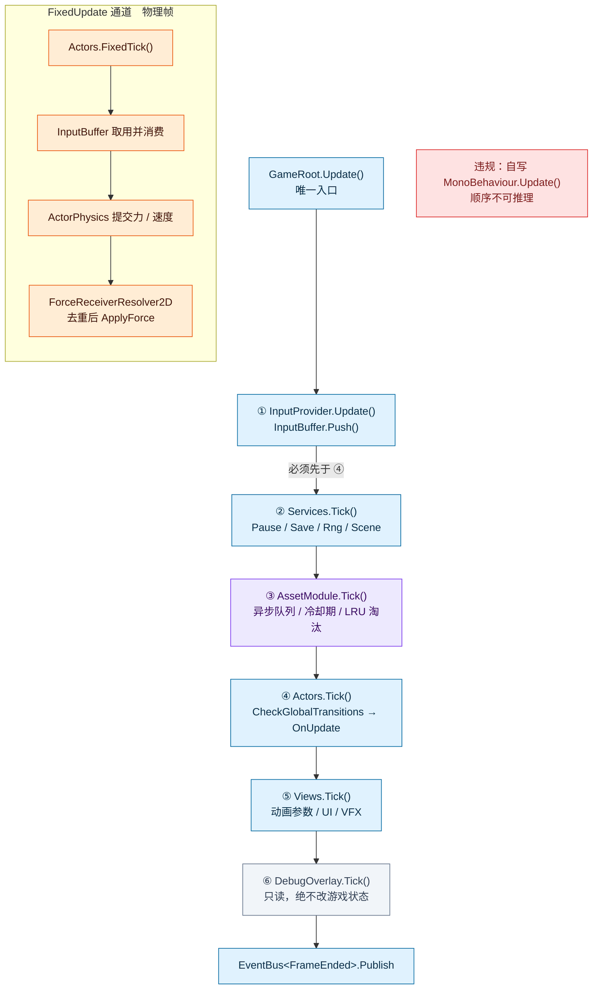
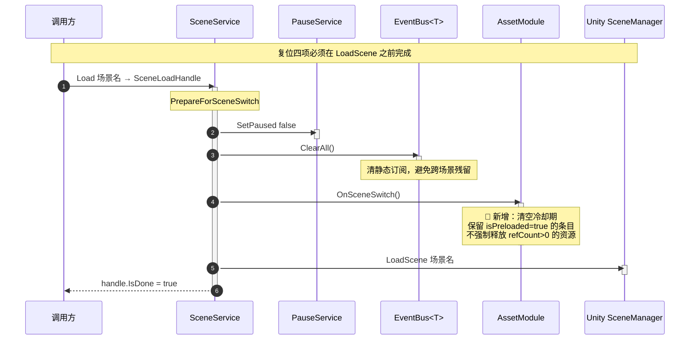
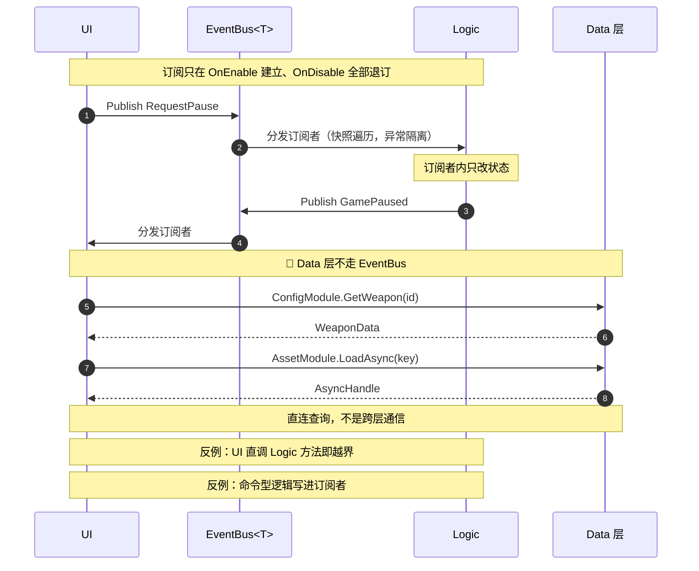
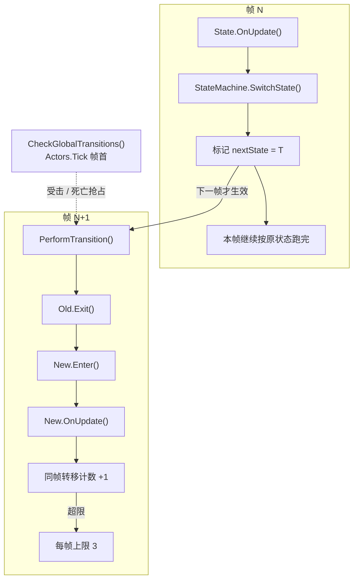
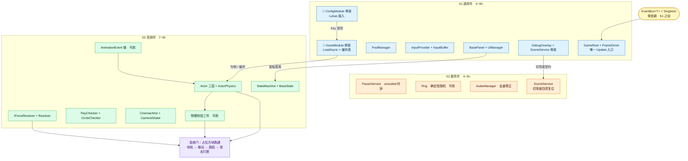

# Unity2D 框架蓝图 · 定稿版 v2

以下蓝图整合了原草案与本次讨论的全部决策。**变更处以 🔄 标注**，新增处以 ➕ 标注，保持不变处不标注。

---

## 一、总览：三层 + 一条通道

```
┌────────────────────────────────────────────────────────────┐
│  Data 层（只读内容提供者，被 Logic 与 Presentation 直连）    │
│  ┌──────────────────────┐  ┌──────────────────────────┐   │
│  │  ConfigModule        │  │  AssetModule             │   │
│  │  · 同步查询           │  │  · 异步加载               │   │
│  │  · 全量常驻           │  │  · 引用计数 + 冷却期缓存  │   │
│  │  · 无释放             │  │  · 并发控制 + LRU 淘汰    │   │
│  │  · Luban 生成         │  │  · 每帧 Tick              │   │
│  │  · 进程级装配         │  │  · 进程级装配             │   │
│  └──────────────────────┘  └──────────────────────────┘   │
│  ┌──────────────────────┐                                  │
│  │  只读 SO（可选）      │  ← 少量全局配置、资源目录       │
│  └──────────────────────┘                                  │
└────────────────────────────────────────────────────────────┘
              ↑ 直连查询（允许）
              │
┌────────────────────────────────────────────────────────────┐
│  Logic 层                                                   │
│  ┌──────────────────┐  ┌─────────────────────────────┐    │
│  │  GameRoot        │  │  Services                   │    │
│  │  FrameDriver     │  │  Pause / Save / Rng / Scene │    │
│  └──────────────────┘  └─────────────────────────────┘    │
│  ┌──────────────────┐  ┌─────────────────────────────┐    │
│  │  Actors          │  │  States                     │    │
│  │  ActorPhysics    │  │  StateMachine               │    │
│  └──────────────────┘  └─────────────────────────────┘    │
└────────────────────────────────────────────────────────────┘
              ↑ 意图祈使式 / 事实过去式（唯一通道）
              │
┌────────────────────────────────────────────────────────────┐
│  Presentation 层                                            │
│  ┌──────────────────┐  ┌─────────────────────────────┐    │
│  │  InputProvider   │  │  BasePanel / UIManager      │    │
│  │  InputBuffer     │  │                             │    │
│  └──────────────────┘  └─────────────────────────────┘    │
│  ┌──────────────────┐  ┌─────────────────────────────┐    │
│  │  CameraRig       │  │  DebugOverlay               │    │
│  │  CameraShake     │  │  （只读）                    │    │
│  └──────────────────┘  └─────────────────────────────┘    │
└────────────────────────────────────────────────────────────┘

唯一跨层通道：EventBus<T>，T : struct
  · 只服务 Logic ↔ Presentation 之间的意图/事实通知
  · 不传对象本体（struct 装不下 UnityEngine.Object）
  · 不承担命令-响应语义（那是直连查询的领域）
  · Data 层不走 EventBus
```

**依赖方向速查**：

| 方向                 | 允许 | 说明                     |
| -------------------- | ---- | ------------------------ |
| Data ← Logic         | ✅    | Logic 直连读 Data        |
| Data ← Presentation  | ✅    | Presentation 直连读 Data |
| Presentation → Logic | ❌    | 唯一例外：通过 EventBus  |
| Logic → Presentation | ❌    | 唯一例外：通过 EventBus  |
| Data → 任何层        | ❌    | Data 层零依赖            |

---

## 二、Data 层内部结构

### 2.1 ConfigModule

| 维度         | 内容                                    |
| ------------ | --------------------------------------- |
| **输入**     | 表名 + 主键（如 `GetWeapon(1001)`）     |
| **输出**     | 强类型值（`WeaponData` struct / class） |
| **加载**     | 启动时全量加载，同步，一次完成          |
| **生命周期** | 进程级常驻，永不释放                    |
| **失败模式** | 启动时报错，运行时不会失败              |
| **依赖**     | 无（Jam.Config 程序集纯净）             |
| **数据源**   | Luban 生成的 JSON + Tables 类           |

**调用示例**：

```
var weapon = ConfigModule.GetWeapon(weaponId);
float atkSpeed = weapon.AtkSpeed;              // 同步返回
```

### 2.2 AssetModule

| 维度         | 内容                                                        |
| ------------ | ----------------------------------------------------------- |
| **输入**     | 资源 Key（路径字符串或 ID）                                 |
| **输出**     | 异步句柄 `AsyncHandle<T>`，await 后拿到本体                 |
| **加载**     | 异步，首次访问触发 IO                                       |
| **缓存**     | 已加载资源按引用计数常驻，归零后冷却期保留                  |
| **释放**     | 引用计数归零 → 冷却期（默认 60s） → LRU 淘汰 → 真正卸载     |
| **生命周期** | Module 进程级；资源按引用计数                               |
| **失败模式** | 运行时按需报错，有限重试后降级到占位资源                    |
| **依赖**     | 无（不依赖 Jam.Config，通过字符串 Key 衔接）                |
| **底层**     | Jam 阶段：`Resources.LoadAsync` 封装；量产：切 Addressables |

**调用示例**：

```
// 主路径：await 拿本体
var handle = AssetModule.LoadAsync<Sprite>("weapon.wood");
var sprite = await handle;
// 使用完毕后
AssetModule.Release("weapon.wood");

// 观测路径：TryGet 查缓存（不触发加载）
if (AssetModule.TryGet<Sprite>("weapon.wood", out var cached)) {
    iconImage.sprite = cached;
}
```

### 2.3 两 Module 的协作

```
┌──────────────────────────────────────────┐
│  调用方（Logic 或 Presentation）           │
│                                          │
│  1. var data = ConfigModule.GetXxx(id)   │
│  2. var key = data.IconKey               │
│  3. var handle = AssetModule.LoadAsync(key) │
│  4. var asset = await handle             │
└──────────────────────────────────────────┘

关键：ConfigModule 与 AssetModule 零依赖
     通过字符串 Key 衔接
     调用方是衔接点，不是任何 Module
```

---

## 三、单帧执行（修订版）



**🔄 变更说明**：

| 变更                                                    | 理由                                                         |
| ------------------------------------------------------- | ------------------------------------------------------------ |
| 新增 step ③ `AssetModule.Tick()`                        | 异步队列、冷却期、LRU 需要每帧推进                           |
| 原 step ③④⑤ 顺移为 ④⑤⑥                                  | —                                                            |
| `AssetModule.Tick` 由 GameRoot 驱动，不由 Services 驱动 | 保持 Data 层独立，不形成“Logic 驱动 Data 内部状态”的隐性耦合 |
| 初始化序与每帧序同源                                    | 新增 step 遵循原框架核心约束                                 |

**AssetModule.Tick 的定位**：

- 它是 **Data 层唯一被允许的主动行为**
- 它只处理 AssetModule 内部状态（异步句柄、缓存表、队列）
- 它不触达任何其他层，不发布事件，不调用 Logic/Presentation
- 这条例外记录在契约表里，不作为“通用模式”推广

---

## 四、启动与初始化序

```
Bootstrap
  └─ GameRoot.Awake
       ├─ 按序 Init 全部 IManager（初始化序 = 每帧序）
       │    ├─ ConfigModule.Init()        ① Data 层，同步，全量加载
       │    ├─ AssetModule.Init()         ② Data 层，建缓存表、信号量
       │    ├─ PoolManager.Init()         ③
       │    ├─ InputProvider.Init()       ④
       │    ├─ UIManager.Init()           ⑤
       │    ├─ SceneService.Init()        ⑥
       │    └─ DebugOverlay.Init()        ⑦
       └─ 同序写入 tickables[]
            [InputProvider, Services, AssetModule, Actors, Views, DebugOverlay]
```

**关键约束**：

- ConfigModule 必须先于 AssetModule——AssetModule 的预加载队列可能引用 Config 的 Key
- 初始化序 = 每帧序，**不允许两套顺序**
- AssetModule 在 Services 之后、Actors 之前

---

## 五、切场景（修订版）



**🔄 复位四项**（原三项 + AssetModule）：

| #    | 复位项                          | 作用                     |
| ---- | ------------------------------- | ------------------------ |
| 1    | `Time.timeScale = 1f`           | 防止暂停状态残留         |
| 2    | `PauseService.SetPaused(false)` | 暂停服务复位             |
| 3    | `EventBus.ClearAll()`           | 清跨场景残留订阅         |
| 4    | `AssetModule.OnSceneSwitch()`   | 清冷却期，保留预加载资源 |

**为什么第 4 项不全清**：预加载资源（`isPreloaded=true`）是为下一场景准备的，如果全清，预加载白做。冷却期清空是为了避免上一场景的高频缓存误命中新场景。

---

## 六、意图事件流程（不变，但补充 Data 层边界）



**关键补充**：

- Data 层与调用方之间**没有 EventBus 边**——这是本次定稿的重要边界
- 加载完成/失败**不广播事件**（Jam 阶段）
- 未来若出现多消费者（Loading 进度条、埋点、DebugOverlay 异步感知），再增加 `AssetLoaded` / `AssetLoadFailed` 观测事件，事件只携带 Key、耗时、结果，不携带资源本体

---

## 七、状态机语义（不变）



**本次无变更**。状态机语义与 Data 层改造正交。

---

## 八、开发流程建议（修订版）



**🔄 变更点**：

| 变更            | 内容                                                         |
| --------------- | ------------------------------------------------------------ |
| S1 新增两个骨架 | ConfigModule（Luban 接入）+ AssetModule（LoadAsync + 缓存表） |
| S1 工时调整     | 从 5~7h 增至 6~8h（多两个 Module 的骨架）                    |
| S1e → S1f 边    | ConfigModule 提供 Key，AssetModule 消费 Key（依赖方向）      |
| S1f → S3b 边    | AssetModule 给 Actor 层提供资源句柄                          |

---

## 九、完整契约表

| 主题             | 契约                                                         | 状态   |
| ---------------- | ------------------------------------------------------------ | ------ |
| 输入             | `InputProvider` 唯一采样点；快照累积进 `InputBuffer`         | 不变   |
| 每帧             | 只由 `GameRoot` 顺序表驱动；禁止自写 `Update()`              | 不变   |
| 通信             | Logic ↔ Presentation 只走 `EventBus<T>`；意图祈使式、事实过去式 | 不变   |
| EventBus 定位    | 只服务跨层事件通知；不承担命令-响应；不传对象本体            | 🔄 新增 |
| Data 层          | 被所有层直连；只读；查询式；进程级常驻；不走 EventBus        | 🔄 新增 |
| ConfigModule     | 同步；全量常驻；无释放；启动时装配；启动后不变               | 🔄 新增 |
| AssetModule      | 异步；引用计数；冷却期缓存；并发控制；LRU 淘汰；每帧 Tick    | 🔄 新增 |
| AssetModule.Tick | GameRoot 顺序表 step ③；Data 层唯一被允许的主动行为；只处理内部状态 | 🔄 新增 |
| Config ↔ Asset   | 零依赖；通过字符串 Key 衔接；调用方是衔接点                  | 🔄 新增 |
| 配置源           | 数值走 Luban/xlsx；资源引用走 SO/AssetCatalog；Key 为字符串  | 🔄 修订 |
| 物理字段         | 每刚体每项唯一写者：角色由代码写，非角色归 Inspector         | 不变   |
| 状态             | `SwitchState` 只标记，同帧读到旧状态，上限 3 次              | 不变   |
| 切场景           | 复位四项：Time.timeScale / Pause / EventBus / AssetModule.OnSceneSwitch | 🔄 修订 |
| 程序集           | 两级：Jam.Config 纯净；AssetModule 落 Assembly-CSharp        | 不变   |

---

## 十、程序集与目录结构

```
YourJamProject/
├── Assets/
│   ├── Scripts/
│   │   ├── Data/                          ← Data 层
│   │   │   ├── ConfigModule/              ← ConfigModule 封装（薄）
│   │   │   └── AssetModule/               ← AssetModule 实现
│   │   ├── Logic/                         ← Logic 层
│   │   │   ├── GameRoot/
│   │   │   ├── Services/
│   │   │   ├── Actors/
│   │   │   └── States/
│   │   ├── Presentation/                  ← Presentation 层
│   │   │   ├── Input/
│   │   │   ├── UI/
│   │   │   ├── Camera/
│   │   │   └── Debug/
│   │   ├── Common/                        ← 跨层通用件
│   │   │   ├── EventBus/
│   │   │   └── Singleton/
│   │   └── Config/                        ← Luban 生成的 C# 代码
│   │       └── (由 Luban 生成，归 Jam.Config 程序集)
│   ├── StreamingAssets/
│   │   └── Luban/                         ← Luban 生成的 JSON
│   ├── Luban.Runtime/                     ← Luban 运行库
│   └── Editor/
│       └── LubanMenu.cs                   ← 导表触发脚本
├── ConfigWorkspace/                        ← Luban 工作区
│   ├── Data/                              ← Excel 源文件
│   ├── Defines/
│   ├── Tools/Luban/
│   ├── luban.conf
│   ├── output/
│   └── logs/
└── ProjectSettings/
```

**程序集定义**：

| 程序集              | 内容                                                         | 引用       |
| ------------------- | ------------------------------------------------------------ | ---------- |
| `Jam.Config.asmdef` | `Scripts/Config/` 下所有 Luban 生成代码                      | 无（纯净） |
| `Assembly-CSharp`   | 其余全部（Data / Logic / Presentation / Common / Luban.Runtime） | Jam.Config |

**约束**：

- `AssetModule` 落 `Assembly-CSharp`，**不引用 Jam.Config**
- `ConfigModule` 封装类落 `Assembly-CSharp`，**引用 Jam.Config** 里的 Tables
- 两者通过**字符串 Key** 衔接，无类型引用

---

## 十一、演进路径

| 阶段            | Data 层形态                                                  | 触发条件                             |
| --------------- | ------------------------------------------------------------ | ------------------------------------ |
| **Jam（当前）** | ConfigModule + AssetModule；AssetModule 底层 `Resources.LoadAsync`，冷却期 60s，并发 4，LRU 100 条 / 64MB | —                                    |
| **首次上线**    | 增加预加载队列（Loading 界面）；DebugOverlay 显示缓存命中率  | 资源总量 > 20MB 或首次加载卡顿可见   |
| **量产**        | AssetModule 底层切 Addressables；接口形状不变；引入 `AssetLoaded` 观测事件 | 资源总量 > 200MB 或需要热更          |
| **长线运维**    | AssetModule 引入分组引用计数；支持按场景释放                 | 多场景资源复用率高，需要精细内存控制 |

**ConfigModule 不参与演进**——Luban 生成的 Tables 从 Jam 到量产形态不变，只增量加表。

---

## 十二、本蓝图与原草案的变更清单

| 位置          | 变更类型 | 内容                                                         |
| ------------- | -------- | ------------------------------------------------------------ |
| 图 1 分层     | 🔄 修订   | Config 层 → Data 层；新增 ConfigModule + AssetModule 节点    |
| 图 1 依赖边   | ➕ 新增   | Presentation → Data 直连边                                   |
| 图 2 单帧     | ➕ 新增   | step ③ AssetModule.Tick                                      |
| 图 5 切场景   | 🔄 修订   | 复位三项 → 四项                                              |
| 图 6 开发流程 | 🔄 修订   | S1 新增 ConfigModule / AssetModule 骨架                      |
| 契约表        | 🔄 修订   | 新增 7 行（EventBus 定位 / Data 层 / ConfigModule / AssetModule / Tick / 衔接 / 配置源） |
| 程序集        | 不变     | 两级结构保持                                                 |
| 目录结构      | ➕ 新增   | Data 层目录                                                  |

