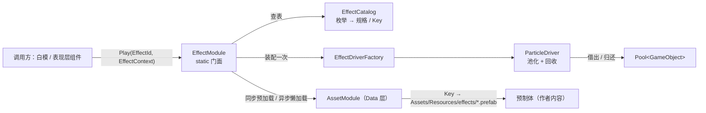
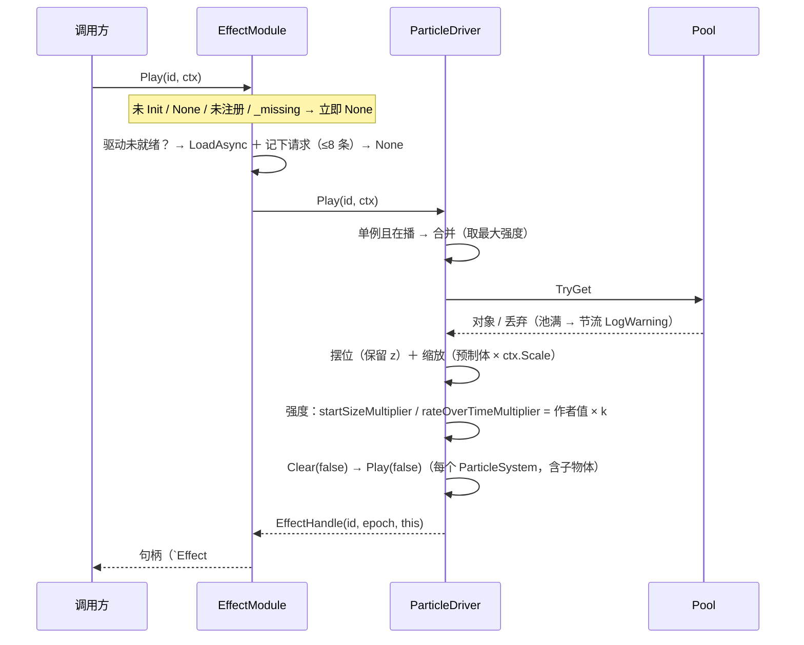
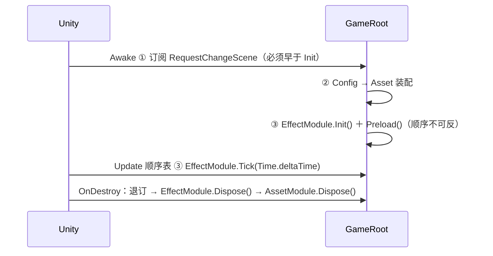

# 粒子特效系统 · 设计与契约

表现层的**纯工具**：把"播一次特效"收敛成一次 `EffectModule.Play(EffectId, EffectContext)`，其余（资源在哪、池多大、何时回收、失败怎么办）调用方都不需要知道。它不认识 `EventBus`、不认识 `Logic`、不认识白模；白模**单向**使用它。所有失败一律**不抛异常**——返回 `EffectHandle.None` 并留一条日志。新增一个特效只动**三处**：枚举 + 装配表 + 一个同名预制体。

## 1. 目录与类型

| 文件（相对 `Assets/Scripts/`） | 类型 | 命名空间 | 行 |
| :-- | :-- | :-- | --: |
| `Presentation/Effects/EffectId.cs` | `enum`（6 项，`None = 0` 哨兵） | `…Presentation.Effects` | 37 |
| `Presentation/Effects/EffectContext.cs` | `struct`（位置 / 方向 / 缩放 / 强度 / 跟随） | 同上 | 101 |
| `Presentation/Effects/EffectHandle.cs` | `readonly struct : IEquatable` | 同上 | 62 |
| `Presentation/Effects/EffectStats.cs` | `readonly struct`（拉模型快照） | 同上 | 30 |
| `Presentation/Effects/IEffectDriver.cs` | `interface`（11 个成员） | 同上 | 76 |
| `Presentation/Effects/EffectCatalog.cs` | `static` 装配表 ＋ `EffectSpec` | 同上 | 101 |
| `Presentation/Effects/EffectModule.cs` | `static` 门面（唯一入口） | 同上 | 476 |
| `Presentation/Effects/Drivers/EffectDriverFactory.cs` | `static`：`EffectSpec → IEffectDriver` | `…Effects.Drivers` | 20 |
| `Presentation/Effects/Drivers/ParticleDriver.cs` | `sealed class : IEffectDriver` | `…Effects.Drivers` | 525 |
| `Presentation/Debug/EffectDebugPanel.cs` | `MonoBehaviour`（`OnGUI` 验收面板） | `…Presentation` | 99 |
| `Foundation/Pool.cs` | 改造：策略 / 上限 / 统计 / `IDisposable` | `DeepseaOil.Foundation` | 328 |
| `Tests/Runtime/Editor/粒子特效Tests.cs` | EditMode 用例 21 条（P/T/M/D 四组） | `DeepseaOil.Tests` | 558 |

- `EffectModule` 只有一个 `Transform Root` 是 `internal`（`EffectModule.cs:86`），其余对外成员全 `public`：`IEffectDriver` / `ParticleDriver` / `Register` 也**故意公开**——用户要按自己的需求写新驱动，且 `Tests/Runtime/Editor/` 落 `Assembly-CSharp-Editor`、工程没有 `InternalsVisibleTo`，测试只能用公开 API。
- `EffectDebugPanel` 与 `MovementDebugPanel` / `EventBusDebugPanel` 同命名空间、同目录惯例（`Presentation/Debug/`）。

## 2. 依赖与边界

| 规则 | 现状 | 证据 |
| :-- | :-- | :-- |
| 只依赖 Data 层，且只用它的字符串 Key | 同步 `Load<GameObject>` / 异步 `LoadAsync<GameObject>` | `Effects/EffectModule.cs:358,390` |
| 不引用 `Logic`、不引用白模、不订阅任何 `EventBus` | `Effects/` 下项目内 `using` 只有 `DeepseaOil.Foundation` 与 `DeepseaOil.Data`（其余是 `UnityEngine` / BCL） | `Effects/**/*.cs` 头部 |
| **`Logic` 层零改动** | 切场景清理由 `GameRoot` 订阅 `RequestChangeScene` 完成，**不写进** `SceneService.Load` | `Root/GameRoot.cs:42,69-72` |
| 唯一入口 | `Init` / `Preload` / `Play` / `Stop` / `CleanAll` / `Tick` / `Dispose` / `GetStats` / `Register` / `IsInitialized` | `Effects/EffectModule.cs:83-311` |
| 白模单向使用 | `ThrowSpawner` 水球落地播 `MudSplash`；`EnemyActor.TakeDamage` 播 `HitSpark` | `Prototype/ThrowSpawner.cs:293-296`、`Prototype/EnemyActor.cs:135` |
| 仅主线程 | 与 `AssetModule` 一致，无锁、无 `async` | — |

`SceneService.Load` 内的复位清单仍是四项（`Time.timeScale` / `PauseService` / `EventBus.ClearAll` / `AssetModule.OnSceneSwitch`），第五项 `EffectModule.CleanAll()` **改挂在组合根**：`EventBus<T>` 的发布是"快照 ＋ 按订阅顺序调用"，`GameRoot.Awake` 在 `Init()` **之前**订阅，于是 `CleanAll` 稳定地发生在 `LoadScene` 之前（`Root/GameRoot.cs:37-42,69-72`）。

## 3. 契约

| 主题 | 契约 |
| :-- | :-- |
| 资源 Key | `"effects/" + 枚举名`（`EffectCatalog.cs:69`）→ `Assets/Resources/effects/<枚举名>.prefab`，**零 Inspector 接线**；解析只经 `AssetRegistry.ResolvePath`（切 Addressables 的唯一改动点） |
| 播放失败 | 一律返回 `EffectHandle.None`，**不抛**。原因看 Console：未 `Init` / 未注册 / 资源缺失 / 池满 / 加载中各有独立文案 |
| `EffectId.None` | 静默返回 `None`：不报错、不查表。调用方写 `None` 表示"这次不播"（`EffectId.cs:7-8`） |
| 资源缺失 | 打 Error 后把该 `EffectId` 记进 `_missing`，**后续 `Play` 直接 `None`**——不重试、不阻塞启动（`EffectModule.cs:264,359-364`） |
| 加载中 | 本次返回 `None`，但**把请求记下来**（每特效最多 8 条，`EffectModule.cs:52`），资源到位后自动补播（`:430-457`） |
| 未就绪的 `AssetModule` | 懒加载/预加载前检查 `AssetModule.IsInitialized`，未 Init 打 Error 并标记不可用（`:350-356,383-388`） |
| 重复注册 | 未 `Init` / `id == None` / `driver == null` → LogError 并忽略；已存在 → LogError"后覆盖前"后覆盖（`:311-337`） |
| 强度 `Intensity` | `[0,1]`，**由 Driver 解释**，`EffectModule` 只传递。`EffectContext` 的三个工厂（`At` / `At(dir)` / `OnTarget`）都给 **1 = 与预制体逐位一致** |
| 强度←→粒子 | `ParticleDriver`：`乘数 = 作者值 × Lerp(0.4, 1, Intensity)`（`ParticleDriver.cs:369-394`）。**只做相对缩放，绝不覆盖作者值** |
| 单例 | 由 Driver 声明（`IsSingleton`）。重复 `Play` 合并到当前实例：取最大强度、**不重置计时**；多实例型每次新建 |
| 回收 | 三道闸：估算时长 → 到期问一次 `IsAlive(false)` → `+5s` 强制回收并警告一次（`ParticleDriver.cs:400,439,45`） |
| 句柄失效 | `CleanAll` 走 `_epoch++`，旧句柄的 `Generation` 对不上即自动成为 no-op——不需要遍历失效调用方手里的句柄。`ToString()` 形如 `Effect#3g1` / `None`（`EffectHandle.cs:55-56`） |
| Tick 位置 | `GameRoot.Update` 顺序表第 ③ 步，用 `Time.deltaTime`（**不是** `unscaledDeltaTime`）：暂停（`timeScale = 0`）时特效整体冻结（`Root/GameRoot.cs:105-108`） |
| Dispose 顺序 | `EffectModule.Dispose()` **必须早于** `AssetModule.Dispose()`——释放资源要经 `AssetModule.Release` 归还引用计数（`Root/GameRoot.cs:133-135`） |

## 4. 一次 `Play` 的完整路径

- 复合预制体（父物体 ＋ 子粒子系统）**整体驱动**：`GetComponentsInChildren<ParticleSystem>(true)`；一个都没有时打一次 Error 并把对象**还回池**。
- 摆位只写位置与缩放：**保留**预制体自带的 `z`（2D 排序看 Sorting Layer，抹成 0 是隐性坑），缩放 = `预制体缩放 × ctx.Scale`。
- **不**按 `ctx.Direction` 旋转：粒子是不是有向的由作者决定，强加旋转会把径向火花也转歪。需要时在 `ApplyPlacement`（`ParticleDriver.cs:339`）加一行。

## 5. 池化与回收

`Pool<T>` 改成**单池 ＋ 策略**（弃"双池"方案），构造即定上限与策略；旧签名 `PoolInClass<T>` / `PoolInMono<T>` 原样保留为子类（`Foundation/Pool.cs:308,319`），全仓库唯一旧调用方 `AudioManager` **零改动**（只用 `Get` / `Release`，不碰 `Prewarm` / `Clear`）。

| 策略 | 池空时 | 用在哪 |
| :-- | :-- | :-- |
| `CreateAndWarn`（默认，旧语义） | 现场创建 ＋ LogWarning，**不看 MaxSize** | `AudioManager`（行为不变） |
| **`CreateOrDrop`** | 未到 `maxSize` 就创建；到了就丢弃 ＋ 计数 | **特效驱动** |
| `DropSilently` | 直接丢弃 | 备用 |
| `Throw` | 抛 `InvalidOperationException` | 备用 |

- 弃 `DropSilently` 的理由：**没有预热时它会把第一次 `Play` 也丢掉**——一个永远播不出来的特效最难查。
- `maxSize` 是"**累计创建上限**"（`CreateOrDrop` 下不会随用随涨）；`Release` 时空闲区已满则调 `onDestroy` 销毁，池只涨不收的问题由此兜住。
- `Prewarm(count)` **不再触发 `onRelease`**：预热是"造对象"，不是"归还对象"。
- 特效池 `onDestroy` 传 `null`：实例都是 `[Effects]` 根的子物体，**销毁根即回收**，不做逐对象 `Object.Destroy`（编辑模式下会打警告，也和根销毁重复）。
- 回收三道闸（`ParticleDriver.cs:400,439,45`）：估算时长（`duration + startLifetime`，按 `MinMaxCurve.mode` 分支取峰值）→ 到点后问一次 `IsAlive(false)`（还活就继续留）→ 超过 `+5s` 强制回收 ＋ 一次警告。不每帧问 `IsAlive`：它遍历粒子，是文档点名过的性能坑。

## 6. 装配与生命周期

| 时机 | 行为 | 位置 |
| :-- | :-- | :-- |
| `Awake` ① | `EventBus<RequestChangeScene>.Subscribe(OnRequestChangeScene)` | `Root/GameRoot.cs:42` |
| `Awake` ② | `if (!ConfigModule.IsReady) Init…`；`if (!AssetModule.IsInitialized) { Init(); _dataLayerOwner = this; }` | `:44-51` |
| `Awake` ③ | `if (!EffectModule.IsInitialized) { Init(); Preload(); }` | `:53-58` |
| `Update` | 顺序表 ① Services ② `AssetModule.Tick` ③ **`EffectModule.Tick`** | `:99-108` |
| 切场景 | `RequestChangeScene` → `EffectModule.CleanAll()` | `:69-72` |
| `OnDestroy` | 先退订，再 `if (_dataLayerOwner != this) return;`，最后 `EffectModule.Dispose()` → `AssetModule.Dispose()` | `:124-137` |

- `Init()`（`EffectModule.cs:99-135`）：重复调用只 LogError 并返回（**不重置已有驱动**）；清空全部表 → **先置 `_initialized`** 再注册（内部 `Register` 不该被自己的守卫拦下）→ 建 `[Effects]` 根（仅播放模式 `DontDestroyOnLoad`）→ 按 `EffectCatalog.All` 注册，`None` 行打 Error 跳过。
- `Preload()`（`:144-165`）与 `Init` **拆开**：`Init` 是纯状态、`Preload` 才是 IO。理由：EditMode 测试要能 `Init` 而不依赖任何资源（否则测试必须准备预制体）。
- `CleanAll()`（`:175-185`）：逐个驱动清实例 ＋ 清排队请求；**在途懒加载不取消**——强行丢弃句柄会让 `AssetModule` 的引用计数对不上，资源引用统一由 `Dispose` 归还。
- `Dispose()`（`:207-234`）：驱动 `Dispose` → 清表 → 销毁根 → 经 `AssetModule.Release` 归还 `_retainedKeys`（前置 `AssetModule.IsInitialized` 守卫）→ `_initialized = false`。
- ⚠️ `GameRoot` 是**场景对象**（没有 `DontDestroyOnLoad`）。效果根 `[Effects]` 相反：播放模式下常驻。白模场景 `TestThrow.unity` **没有 `GameRoot`**，在里面直接 `Play` 会打"`Play` 在 `Init` 之前被调用"，见《接入与验收》。

## 7. 扩展点

**加一个粒子特效（三处，顺序固定）**

| # | 改哪 | 内容 |
| --: | :-- | :-- |
| ① | `Effects/EffectId.cs` | 加一枚枚举值（`None = 0` 不许动） |
| ② | `Effects/EffectCatalog.cs:71-81` | 加一行 `new EffectSpec(EffectId.X, maxSize: …, prewarm: …)` |
| ③ | 美术内容 | `Assets/Resources/effects/X.prefab`（**文件名 ＝ 枚举名**） |
| ④（可选） | `EffectModule.cs:45-49` | 加进 `PreloadList` → 开局零延迟；不加则首次 `Play` 走懒加载 |

只做 ① 不做 ② 的可见形态就是一条 LogError ＋ `None`（"未注册：EffectCatalog 里没有这一行"）。

**接一个非粒子特效（震屏 / 闪白 / 位移抖动）**：实现 `IEffectDriver`（`IEffectDriver.cs:32-74`）→ 在 `EffectDriverFactory.Create` 的 `switch` 加一行 → 取消 `EffectCatalog.cs:78-80` 对应那行的注释。**`EffectModule` 一行都不用改**。

| 已占位、尚未接线的 `EffectId` | 需要什么驱动 |
| :-- | :-- |
| `EnemyFlashWhite` | 材质 / 颜色动画（`SpriteRenderer.color` 或材质属性） |
| `ObjectShake` | 位移震动（改 `Transform.localPosition`，单例型） |
| `ScreenShake` | 相机震动（单例型，合并策略写"取最大强度 ＋ 重置计时"） |

## 8. 可观测性

`EffectModule.GetStats()`（`EffectModule.cs:286-301`）拉模型返回 `EffectStats(ActiveInstances, DriverCount, PooledObjects)`：活跃实例数 / 驱动数 / 池内待用数，**不走 `EventBus`**（与 `DataMetrics` 一致）。未 `Init` 时全 0。

`EffectDebugPanel`（`Debug/EffectDebugPanel.cs`）挂在场景任意物体上即可（建议与 `MovementDebugPanel` 同物体；默认原点 `(8, 210)`、尺寸 `440×170`，撞车就改 `Panel Origin`）：

| 元素 | 用途 |
| :-- | :-- |
| `特效: 活跃 N / 驱动 N / 池内待用 N` | 一行统计（`EffectDebugPanel.cs:43`） |
| `播放 <EffectId>` ＋ 右侧 `多实例 上限 N 预热 N` | 不依赖白模就能单独播（`:46-59`） |
| `最近一次播放: HitSpark → Effect#3g1` / `→ None` | 播放结果**即时回执**（`:44,54`） |
| `全部清空 (CleanAll)` | 验"回收 ＋ 归零"（`:63-67`） |
| `未注册探针 (ScreenShake)` | 故意播未注册项，验"只报错不崩"（`:70-74`） |

面板 `EffectModule` 未 `Init` 时显示 `EffectDebugPanel: EffectModule 未 Init（GameRoot 没跑起来？）`（`:35-40`）——这是"场景缺 `GameRoot`"的第一现场。

## 9. 修订登记（与前身的差异）

前身＝`Docs/粒子特效系统/参考代码/`（已删除，见 §11）。**E1–E6 是不改就一定会出错的缺陷；E7 起是有意不同的决策。**

| # | 前身做法 | 后果 | 现状 |
| :-- | :-- | :-- | :-- |
| **E1** | 池空策略 `DropSilently` ＋ 不预热 | **第一次 `Play` 必被丢弃**，特效永远播不出来 | 新增 `CreateOrDrop`（`Foundation/Pool.cs:175-184`），驱动建池时选它（`Drivers/ParticleDriver.cs:322-333`） |
| **E2** | `EffectContext` 裸字段 | `new EffectContext { Intensity = 0.5f }` 把 `Scale` 留成 0 → 特效缩到 **1%** | 属性在**读取处**归一化：`Scale ≤ 0 → 1`、零向量 → `up`、`Intensity` `Clamp01`（`EffectContext.cs:31-53`） |
| **E3** | 只取根物体上的 `ParticleSystem` | "父物体 ＋ 子粒子系统"的复合预制体直接报"没有 ParticleSystem" | 驱动实例**全部**子系统（含未激活子物体） |
| **E4** | 用 `startLifetime.constantMax` 估时长 | 只在 `Constant` / `TwoConstants` 模式有效，Curve 模式取不到峰值 → 提前掐断 | 按 `MinMaxCurve.mode` 分支 ＋ 到期一次 `IsAlive` ＋ `+5s` 硬超时（`ParticleDriver.cs:400,439`） |
| **E5** | 在 `SceneService.Load` 里调 `EffectModule.CleanAll` | `Logic → Presentation` **反向依赖** | 改挂组合根：`GameRoot` 先订阅 `RequestChangeScene`（`Root/GameRoot.cs:42,71`） |
| **E6** | `startSizeMultiplier = k`（绝对写） | 作者在 Curve / Random Between Two Curves 模式填的 "Multiplier" 被**抹成 1** → "预制体里 Start Size 设好了，进游戏却是默认大小" | 从预制体抓一次作者值，每次播放写 `作者值 × k`（`ParticleDriver.cs:369-394`）；**`startSize.curveMultiplier` 刻意不碰**（两者相乘，都乘 k 会变 k²） |
| **E7** | `IEffectDriver` / `ParticleDriver` / `Register` 为 `internal` | 用户无法写自己的驱动，测试也无法断言 | 三者 `public`（本工程 `Tests/Runtime/Editor/` 落 `Assembly-CSharp-Editor`，没有 `InternalsVisibleTo`） |
| **E8** | `Preload` 混在 `Init` 里 | 测试一 `Init` 就要准备资源 | `Init`（纯状态）与 `Preload`（IO）拆成两步，测试只调 `Init` |
| **E9** | 资源由 Inspector 接线 | 每个特效都要拖引用 | Key 约定 `effects/<枚举名>`，**零接线**；接入 Addressables 只改 `AssetRegistry.ResolvePath` |
| **E10** | 双池（`Pool` ＋ `BoundedPool`） | 两套语义、两处维护 | 单池 ＋ `overflowPolicy`，旧 API 保留 |
| **E11** | `Clear` / `Dispose` 逐对象销毁 | 编辑模式警告 ＋ 与根销毁重复 | `onDestroy` 传 `null`，实例挂 `[Effects]` 根，**销毁根即回收** |
| **E12** | 按 `ctx.Direction` 旋转实例 | 径向火花被转歪 | 不旋转，留给作者/扩展（`ParticleDriver.cs:339` 是唯一改动点） |
| **E13** | `Release(null)` 抛异常 | 池在帧循环里，抛异常连带炸掉整帧 | 只 LogWarning 并返回（`Foundation/Pool.cs:212-216`） |
| **E14** | `Generation` 由池/实例各自发 | 句柄失效判定分散 | `Generation` ＝ 驱动的 `_epoch`，`CleanAll` 一自增，全体旧句柄自动 no-op |

## 10. 已知限制与待办

| # | 限制 / 待办 | 影响 | 归属 |
| --: | :-- | :-- | :-- |
| 1 | 懒加载的**首次** `Play` 返回 `None`（补播跟上） | 首次触发那一下看不到特效，第二次起正常 | 设计如此；`PreloadList` 可消除 |
| 2 | 池满丢弃 | 极端情况下不播，只有节流 LogWarning（1 秒） | 调 `EffectCatalog` 的 `maxSize` |
| 3 | 不做池的自动缩容 | 峰值容量一直保留 | 后续 |
| 4 | 不做特效优先级/排队 | 不合并（单例除外）、不按距离裁剪、不做 LOD | 本阶段不做 |
| 5 | 强度映射是**乘数** | 作者没在乘数上写东西时，`Intensity = 0` 也只会缩到 0.4×（不是"更小的一档"） | 可用 `ctx.Scale` 做更强的缩小 |
| 6 | 不支持"同一 `EffectId` 多驱动并存" | 重复注册是覆盖 ＋ LogError | 设计如此 |

## 11. 与其它文档的衔接（本次未执行，待指挥）

按"只写粒子特效系统的文档"的要求，以下三处**没有动**，列在这里以免漏记：

| 目标 | 建议改动 |
| :-- | :-- |
| `Docs/框架设计/框架蓝图.md` §5 契约 | 加一行：特效｜`EffectModule` 单入口 `Play`，失败不抛只返回 `None`；资源 Key `effects/<枚举名>`；切场景清理由 `GameRoot` 订阅 `RequestChangeScene` 完成（**不在** `SceneService.Load`） |
| `Docs/目录说明.md` | `Presentation/` 下加 `Effects/`（＋ `Effects/Drivers/`）、`Presentation/Debug/` 加 `EffectDebugPanel`；`Tests/Runtime/Editor/` 记 `粒子特效Tests.cs` |
| `Docs/框架设计/架构图集.md` 图 4 | 加 `EffectModule` 节点（可选） |

另记两条**旧记载已过时**，等一并修订时改：

| 位置 | 记载 | 现状 |
| :-- | :-- | :-- |
| `框架蓝图.md` §6 `D9 / D10` | "`SceneService.Load` 无调用点 → 切场景复位从不执行" | **已过时**：`Assets/Tests/Scene/TestChangeScene.cs` 是真实发布方（`OnTriggerEnter2D` 发 `RequestChangeScene`），复位链因此是活的 |
| `框架蓝图.md` §6 `D25 / D28` | 同上条目下的两个缺陷 | 与本次无关，未复核 |

**原目录文件的处置**：`粒子特效系统 · 需求分析.md`、`粒子特效系统 · 施工作业清单.md`、`参考代码/`（2 份）**已删除**。理由：需求分析里的实现前待拍板项（P1/P2/P3）与"双池"倾向已被 E10 取代，施工作业清单的阶段划分已完成，而参考代码里 E1–E6 六处缺陷仍在，留在目录里会被再次当成规范（`git` 可随时取回）。其中仍然有效的内容已并入本文：需求 → §1–§3，施工阶段 → §6 ＋《接入与验收》的验收清单，缺陷 → §9。
