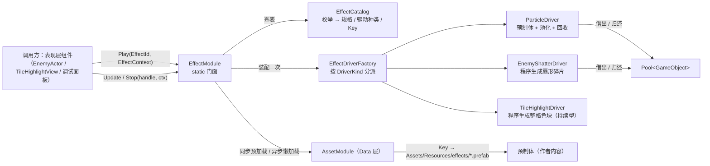
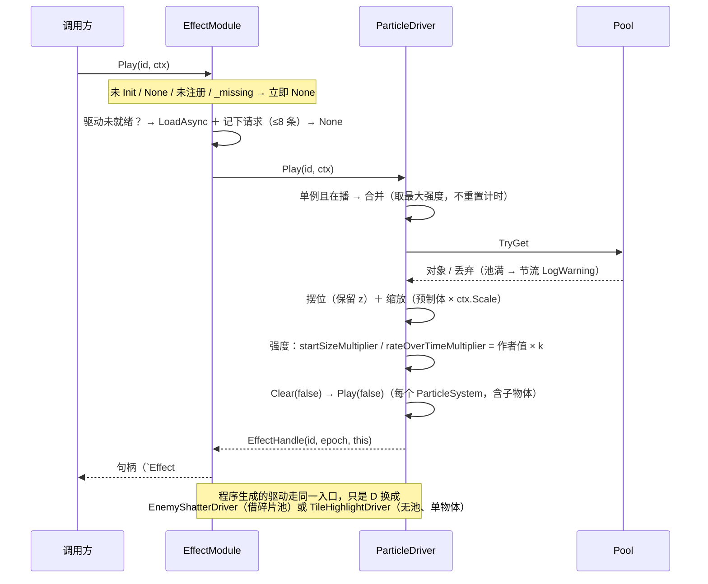
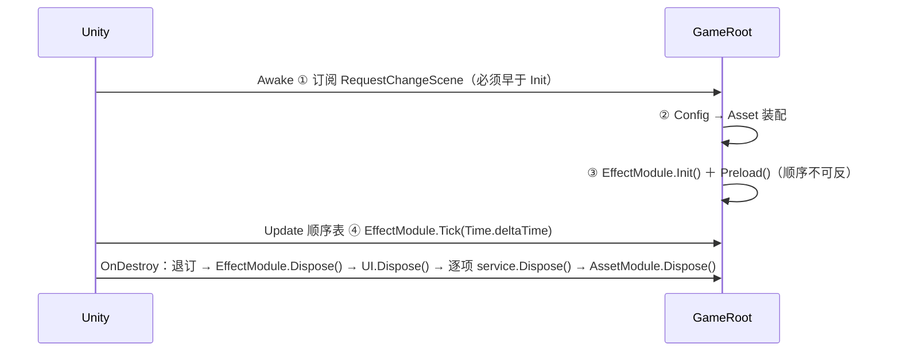

# 粒子特效系统 · 设计与契约

表现层的**纯工具**：把"播一次特效"收敛成一次 `EffectModule.Play(EffectId, EffectContext)`，其余（资源在哪、池多大、何时回收、失败怎么办）调用方都不需要知道。它不认识 `EventBus`、不认识 `Logic`、不认识白模；白模**单向**使用它。所有失败一律**不抛异常**——返回 `EffectHandle.None` 并留一条日志。新增一个特效只动**三处**：枚举 + 装配表 + 一个同名预制体。

## 1. 目录与类型

| 文件（相对 `Assets/Scripts/`） | 类型 | 命名空间 |
| :-- | :-- | :-- |
| `Presentation/Effects/EffectId.cs` | `enum`（**8 项 ＝ `None` 哨兵 ＋ 7 个真特效**：4 个已接线 `HitSpark` / `MudSplash` / `EnemyShatter` / `TileHighlight`，3 个占位未接线 `EnemyFlashWhite` / `ObjectShake` / `ScreenShake`） | `…Presentation.Effects` |
| `Presentation/Effects/EffectContext.cs` | `struct`（位置 / 方向 / 缩放 / 强度 / **着色 / 半径 / 时长** / 跟随） | 同上 |
| `Presentation/Effects/EffectHandle.cs` | `readonly struct : IEquatable` | 同上 |
| `Presentation/Effects/EffectStats.cs` | `readonly struct`（拉模型快照） | 同上 |
| `Presentation/Effects/IEffectDriver.cs` | `interface`（12 个成员：11 个抽象 ＋ `UpdateInstance` 带默认空实现） | 同上 |
| `Presentation/Effects/EffectCatalog.cs` | `internal`：**`EffectDriverKind`** ＋ `EffectSpec` ＋ 装配表（生效 4 行） | 同上 |
| `Presentation/Effects/EffectModule.cs` | `static` 门面（唯一入口） | 同上 |
| `Presentation/Effects/Drivers/EffectDriverFactory.cs` | `internal static`：`EffectSpec → IEffectDriver`（**按 `DriverKind` 分派**） | `…Effects.Drivers` |
| `Presentation/Effects/Drivers/ParticleDriver.cs` | `sealed class : IEffectDriver` | `…Effects.Drivers` |
| `Presentation/Effects/Drivers/EnemyShatterDriver.cs` | `sealed class : IEffectDriver`（**程序生成，无预制体**） | `…Effects.Drivers` |
| `Presentation/Effects/Drivers/TileHighlightDriver.cs` | `sealed class : IEffectDriver`（**程序生成 ＋ 持续型，无池**，无预制体） | `…Effects.Drivers` |
| `Presentation/Debug/EffectDebugPanel.cs` | `MonoBehaviour`（`OnGUI` 验收面板） | `…Presentation` |
| `Foundation/Pool.cs` | 改造：策略 / 上限 / 统计 / `IDisposable` | `DeepseaOil.Foundation` |
| `Tests/Runtime/Editor/粒子特效Tests.cs` | EditMode 用例 **21** 条（P/T/M/D 四组：P1–P6、T1–T2、M1–M7、D1–D6） | `DeepseaOil.Tests` |

> 表格**不再记行号**：行号每轮整理都会漂（本轮 `EffectModule` 394 → 500 行、新增 `TileHighlightDriver`），而类名与方法名不会。下文一律用类名 ＋ 成员名定位。

- `EffectModule` 只有一个 `Transform Root` 是 `internal`（`EffectModule.Root`），其余对外成员全 `public`：`IEffectDriver` / `ParticleDriver` / `EnemyShatterDriver` / `TileHighlightDriver` / `Register` 也**故意公开**——用户要按自己的需求写新驱动，且 `Tests/Runtime/Editor/` 落 `Assembly-CSharp-Editor`（该目录无 asmdef）、工程没有 `InternalsVisibleTo`，测试只能用公开 API。
- 反过来，**装配参数不外露**：`EffectCatalog` / `EffectSpec` / `EffectDriverKind` / `EffectDriverFactory` 全是 `internal`，公开它们等于把"装配参数"变成对外 API（`EnemyShatterDriver` / `TileHighlightDriver` 因此各有一个公开的 `(Transform root, int maxSize)` 重载供手工构造）。
- `EffectDebugPanel` 与 `MovementDebugPanel` / `EventBusDebugPanel` 同命名空间、同目录惯例（`Presentation/Debug/`）。

## 2. 依赖与边界

| 规则 | 现状 | 证据 |
| :-- | :-- | :-- |
| 只依赖 Data 层，且只用它的字符串 Key | 同步 `Load<GameObject>` / 异步 `LoadAsync<GameObject>` | `Effects/EffectModule.cs` |
| 不引用 `Logic`、不订阅任何 `EventBus` | `Effects/` 下项目内 `using` 只有 `DeepseaOil.Foundation` 与 `DeepseaOil.Data`（其余是 `UnityEngine` / BCL） | `Effects/**/*.cs` 头部 |
| **`Logic` 层零改动** | 切场景清理由 `GameRoot` 订阅 `RequestChangeScene` 完成，**不写进** `SceneService.Load` | `Root/GameRoot.cs` |
| 唯一入口 | `Init` / `Preload` / `Play` / `Update` / `Stop` / `CleanAll` / `Tick` / `Dispose` / `GetStats` / `Register` / `IsInitialized` | `Effects/EffectModule.cs` |
| 调用方（现状） | `EnemyActor.Die` 播 `EnemyShatter`；`TileHighlightView` 播 `TileHighlight` 并每帧 `Update`、不瞄了 `Stop`；`EffectDebugPanel` 可单独播任意一行。**`HitSpark` / `MudSplash` 目前没有自动调用点**——两行都是"已装配、只能从面板播" | `Presentation/Actor/EnemyActor.cs`、`Presentation/Grid/TileHighlightView.cs` |
| 仅主线程 | 与 `AssetModule` 一致，无锁、无 `async` | — |

`SceneService.Load` 内的复位清单仍是四项（`Time.timeScale` / `PauseService` / `EventBus.ClearAll` / `AssetModule.OnSceneSwitch`）——**复核更正**：`Time.timeScale` 那一条的独立复位行在当前实现里是注释（`//gameTime.SetTimeScale(1f);`），时间复位并入 `PauseService.SetPaused(false)` 内部，与《框架蓝图.md》§5、《分层设计/逻辑层.md》§6 的写法一致；第五项 `EffectModule.CleanAll()` **改挂在组合根**：`EventBus<T>` 的发布是"快照 ＋ 按订阅顺序调用"，`GameRoot.Awake` 在 `Init()` **之前**订阅，于是 `CleanAll` 稳定地发生在 `LoadScene` 之前。

## 3. 契约

| 主题 | 契约 |
| :-- | :-- |
| 资源 Key | `"effects/" + 枚举名`（`EffectSpec` 构造函数：`EffectCatalog.KeyPrefix + id`）→ `Assets/Resources/effects/<枚举名>.prefab`，**零 Inspector 接线**；解析只经 `AssetRegistry.ResolvePath`（切 Addressables 的唯一改动点） |
| 播放失败 | 一律返回 `EffectHandle.None`，**不抛**。原因看 Console：未 `Init` / 未注册 / 资源缺失 / 池满 / 加载中各有独立文案 |
| `EffectId.None` | 静默返回 `None`：不报错、不查表。调用方写 `None` 表示"这次不播"（`EffectId` 的类注释与 `Play` 的第二道守卫） |
| 资源缺失 | 打 Error 后把该 `EffectId` 记进 `_missing`，**后续 `Play` 直接 `None`**——不重试、不阻塞启动（`EffectModule.Play` 的 `_missing` 守卫 ＋ `LoadAssetSync` 的缺失分支） |
| 加载中 | 本次返回 `None`，但**把请求记下来**（每特效最多 8 条，`EffectModule.MaxQueuedPlaysPerEffect`；超了丢最老的），资源到位后由 `ReplayPendingPlays` 自动补播（`PollPendingLoads` 内） |
| 未就绪的 `AssetModule` | 懒加载 / 预加载前检查 `AssetModule.IsInitialized`，未 Init 打 Error 并标记不可用（`LoadAssetSync` 与 `RequestAssetAsync` 各有这一道） |
| 重复注册 | 未 `Init` / `id == None` / `driver == null` → LogError 并忽略；已存在 → LogError"后覆盖前"后覆盖（`EffectModule.Register`） |
| 强度 `Intensity` | `[0,1]`，**由 Driver 解释**，`EffectModule` 只传递。`EffectContext` 的三个工厂（`At` / `At(dir)` / `OnTarget`）都给 **1 = 与预制体逐位一致** |
| 强度←→粒子 | `ParticleDriver`：`乘数 = 作者值 × Lerp(0.4, 1, Intensity)`（`ParticleDriver.MinIntensityScale` ＋ `ApplyIntensity`）。**只做相对缩放，绝不覆盖作者值** |
| 着色 `Tint` | `Color`；**alpha 为 0 读取为白色**（与 `Scale` / `Direction` 同一条"读取处归一化"的纪律：`default(EffectContext)` 与部分对象初始化器都不会留下"透明 = 什么都看不见"）。只有"把它当参数"的驱动才读：`EnemyShatter`（身体色，`EnemyActor.Die` 传 `EnemyVisual.BodyColorNormal`）与 `TileHighlight`（可用白 / 阻挡红，`TileHighlightView` 传） |
| 半径 `Radius` | `float`（世界单位）；`<= 0` 读取为 1。给"半径即语义"的驱动用：整格高亮画出来的方块边长就是 `Radius × 2`，所以它必须是参数而不是常量（`TileHighlightDriver.Apply`） |
| 时长 `Duration` | `float`（秒）；**不归一化** —— `<= 0` 表示"用驱动自己的默认时长"（`EnemyShatter` 默认 0.35 s，把 0 归一成一个通用值会掩盖"调用方没传"）。驱动另有自己的**上限**挡住离谱值（`EnemyShatterDriver` 钳到 5 s） |
| 持续型特效 | `EffectModule.Update(handle, ctx)` → `IEffectDriver.UpdateInstance`：**创建一次、之后只更新**位置 / 颜色 / 半径，不瞄了 `Stop`。返回值只代表"句柄有效"（`false` 时调用方重新 `Play`）；接口的默认实现是空的，不支持的驱动是 no-op。当前唯一实现是 `TileHighlightDriver`（`TileHighlightView` 是唯一调用点） |
| 程序生成的驱动（**不需要预制体**） | `DriverKind = EnemyShatter / TileHighlight`：工厂按种类造，驱动的 `AssetKey` 返回**空串** ⇒ `EffectModule` 既不预加载也不懒加载、`IsAssetReady` 恒为 true（`LoadAssetSync` / `RequestAssetAsync` 对空 Key 都提前返回）。因此它们**不会被"没有同名预制体"判为缺失**，也**不进 `PreloadList`** |
| 单例 | 由 Driver 声明（`IsSingleton`）。`ParticleDriver` 重复 `Play` 合并到当前实例：取最大强度、**不重置计时**；`TileHighlightDriver` 复用同一个物体、只递增编号。多实例型每次新建 |
| 回收 | 三道闸：估算时长 → 到期问一次 `IsAlive(false)` → `+5s` 强制回收并警告一次（`ParticleDriver.EstimateDuration` / `IsFinished` / `MaxLifeOverrun`） |
| 句柄失效 | `CleanAll` 走 `_epoch++`（三个驱动各自持有 `_epoch`），旧句柄的 `Generation` 对不上即自动成为 no-op——不需要遍历失效调用方手里的句柄。`ToString()` 形如 `Effect#3g1` / `None`（`EffectHandle.ToString`） |
| Tick 位置 | `GameRoot.Update` 顺序表第 ④ 步（在场景根 `RenderTick` **之后**——本帧新播的特效当帧就被推进一次），用 `Time.deltaTime`（**不是** `unscaledDeltaTime`）：暂停（`timeScale = 0`）时特效整体冻结（`Root/GameRoot.cs`） |
| Dispose 顺序 | `EffectModule.Dispose()` **必须早于** `AssetModule.Dispose()`——释放资源要经 `AssetModule.Release` 归还引用计数（`Root/GameRoot.cs`） |

## 4. 一次 `Play` 的完整路径

- 复合预制体（父物体 ＋ 子粒子系统）**整体驱动**：`GetComponentsInChildren<ParticleSystem>(true)`；一个都没有时打一次 Error（`_warnedNoParticleSystem`）并把对象**还回池**。
- 摆位只写位置与缩放：**保留**预制体自带的 `z`（2D 排序看 Sorting Layer，抹成 0 是隐性坑），缩放 = `预制体缩放 × ctx.Scale`。
- **不**按 `ctx.Direction` 旋转：粒子是不是有向的由作者决定，强加旋转会把径向火花也转歪。需要时在 `ParticleDriver.ApplyPlacement` 加一行 `Quaternion.FromToRotation`。
- 程序生成的驱动里，`TileHighlightDriver` **完全不读** `ctx.Direction`；`EnemyShatterDriver` 读它但只取角度（`Atan2` ⇒ 三块碎片均匀铺在 `[−70°, +70°]` 上，**确定性、不读随机数**）。

## 5. 池化与回收

`Pool<T>` 改成**单池 ＋ 策略**（弃"双池"方案），构造即定上限与策略；旧签名 `PoolInClass<T>` / `PoolInMono<T>` 原样保留为子类（`Foundation/Pool.cs` 末尾两个类），全仓库唯一旧调用方 `AudioManager` **零改动**（`Presentation/Audio/AudioManager.cs` 里两处 `new PoolInClass<…>` 走旧三参签名，其余只用 `TryGet` / `Release`，不碰 `Prewarm` / `Clear` / `GetStats`）。

> 三个驱动里**只有两个建池**：`ParticleDriver`（预制体实例池）与 `EnemyShatterDriver`（碎片池，上限 = `maxSize × 3`）。`TileHighlightDriver` 不建池——它是持续型，自己持有一个 `GameObject`，`PooledObjectCount` 的语义是"那个已建好但当前没显示的物体"。

| 策略 | 池空时 | 用在哪 |
| :-- | :-- | :-- |
| `CreateAndWarn`（默认，旧语义） | 现场创建 ＋ LogWarning，**不看 MaxSize** | `AudioManager`（行为不变） |
| **`CreateOrDrop`** | 未到 `maxSize` 就创建；到了就丢弃 ＋ 计数 | **两个带池的特效驱动**（`ParticleDriver` / `EnemyShatterDriver`） |
| `DropSilently` | 直接丢弃 | 备用 |
| `Throw` | 抛 `InvalidOperationException` | 备用 |

- 弃 `DropSilently` 的理由：**没有预热时它会把第一次 `Play` 也丢掉**——一个永远播不出来的特效最难查。
- `maxSize` 是"**累计创建上限**"（`CreateOrDrop` 下不会随用随涨）；`Release` 时空闲区已满则调 `onDestroy` 销毁，池只涨不收的问题由此兜住。
- `Prewarm(count)` **不再触发 `onRelease`**：预热是"造对象"，不是"归还对象"。
- 特效池 `onDestroy` 传 `null`：实例都是 `[Effects]` 根的子物体，**销毁根即回收**，不做逐对象 `Object.Destroy`（编辑模式下会打警告，也和根销毁重复）。
- 回收三道闸（`ParticleDriver.EstimateDuration` / `IsFinished` / `MaxLifeOverrun`）：估算时长（`duration + startLifetime`，按 `MinMaxCurve.mode` 分支取峰值；任一系统 `looping` 直接返回 +∞）→ 到点后问一次 `IsAlive(false)`（还活就继续留）→ 超过 `+5s` 强制回收 ＋ 一次警告。不每帧问 `IsAlive`：它遍历粒子，是文档点名过的性能坑。
- 池满警告**按驱动节流 1 秒**（`ParticleDriver.DropWarnInterval` ＋ `Time.unscaledTime`），文案里带累计丢弃次数；`EnemyShatterDriver` 的碎片池满则降级为"本次少飞 N 块"，**不吞掉整次播放**。

## 6. 装配与生命周期

| 时机 | 行为 | 位置 |
| :-- | :-- | :-- |
| `Awake` ① | `base.Awake()`（单例守卫）→ 判 `Instance != this` → `EventBus<RequestChangeScene>.Subscribe(OnRequestChangeScene)`（必须早于 `Init`） | `Root/GameRoot.cs` |
| `Awake` ② | `if (!ConfigModule.IsReady) ConfigModule.InitFromStreamingAssets();`；`if (!AssetModule.IsInitialized) { Init(); _assembled = this; }` | 同上 |
| `Awake` ③ | `if (!EffectModule.IsInitialized) { Init(); Preload(); }` | 同上 |
| `Update` | ⓐ `_input.Sample()` → ⓑ UI 输入段（`UIInputProvider.Sample` → `ConsumeSnapshot` → `uiInput.Tick(UILogicContext)`，在 ① **之前**）→ 顺序表 ① Services（`unscaledDeltaTime`）② `AssetModule.Tick` ③ 场景根 `RenderTick`（玩家侧 → 世界侧）④ **`EffectModule.Tick`** | 同上 |
| 切场景 | `RequestChangeScene` → `EffectModule.CleanAll()`（订阅**早于** `SceneService.Init`，所以稳定发生在 `LoadScene` 之前） | 同上 |
| `OnDestroy` | 先退订，再 `if (!ReferenceEquals(_assembled, this)) return;`，然后 `EffectModule.Dispose()` → `UI.Dispose()` → 逐项 `service.Dispose()` → `AssetModule.Dispose()`（**最后**：别人要经它归还引用计数） | 同上 |

- `Init()`（`EffectModule`）：重复调用只 LogError 并返回（**不重置已有驱动**）；清空全部表 → **先置 `_initialized`** 再注册（内部 `Register` 不该被自己的守卫拦下）→ 建 `[Effects]` 根（仅播放模式 `DontDestroyOnLoad`）→ 按 `EffectCatalog.All` 注册，`None` 行打 Error 跳过。
- `Preload()` 与 `Init` **拆开**：`Init` 是纯状态、`Preload` 才是 IO。理由：EditMode 测试要能 `Init` 而不依赖任何资源（否则测试必须准备预制体）。
- `CleanAll()`：逐个驱动清实例 ＋ 清排队请求；**在途懒加载不取消**——强行丢弃句柄会让 `AssetModule` 的引用计数对不上，资源引用统一由 `Dispose` 归还。
- `Dispose()`：驱动 `Dispose` → 清表 → 销毁根 → 经 `AssetModule.Release` 归还 `_retainedKeys`（前置 `AssetModule.IsInitialized` 守卫）→ `_initialized = false`。
- ⚠️ `GameRoot` 自己是**常驻对象**（`Singleton<T>` ＋ `DontDestroyOnLoad`），场景里放不放都行；但**场景里没有它、也没人装配过它时，直接 `Play` 会打"`Play` 在 `Init` 之前被调用"并返回 `None`** —— 判断一个场景能不能播特效，看它有没有 `GameRoot`（战斗切片场景 `EmptyTest` 有；`SampleScene` 只有一台相机，没有），见《接入与验收》。效果根 `[Effects]` 同样在播放模式下常驻。

## 7. 扩展点

**加一个粒子特效（三处，顺序固定）**

| # | 改哪 | 内容 |
| --: | :-- | :-- |
| ① | `Effects/EffectId.cs` | 加一枚枚举值（`None = 0` 不许动） |
| ② | `Effects/EffectCatalog.cs` 的 `Specs` | 加一行 `new EffectSpec(EffectId.X, maxSize: …, prewarm: …)`（`DriverKind` 默认 `Particle`，`maxSize` 必须 > 0，`prewarm` 会被截断到 `maxSize`） |
| ③ | 美术内容 | `Assets/Resources/effects/X.prefab`（**文件名 ＝ 枚举名**） |
| ④（可选） | `EffectModule.PreloadList` | 加进 `PreloadList` → 开局零延迟；不加则首次 `Play` 走懒加载（当前表里是 `HitSpark` / `MudSplash` 两项） |

只做 ① 不做 ② 的可见形态就是一条 LogError ＋ `None`（"未注册：EffectCatalog 里没有这一行"）。

**接一个非粒子特效（震屏 / 闪白 / 位移抖动 / 程序生成的形状）——四步**

| # | 改哪 | 内容 |
| --: | :-- | :-- |
| ① | `Effects/EffectId.cs` | 加一枚枚举值 |
| ② | `Effects/EffectCatalog.cs` 的 `EffectDriverKind` | 加一种驱动种类 |
| ③ | `Effects/EffectCatalog.cs` 的 `Specs` | 加一行并写上新的 `DriverKind` |
| ④ | `Effects/Drivers/` | 写一个 `public sealed class X : IEffectDriver`，并在 `EffectDriverFactory.Create` 的**分派**里加一个 `case` |

⚠️ **修正历史文案**：这里原先写的是"在 `EffectDriverFactory.Create` 的 `switch` 加一行" —— **那个 `switch` 原本并不存在**（`Create` 曾是无条件 `new ParticleDriver(spec, root)`）。白模迁移时才引入按 `DriverKind` 分派，所以真正要改的是三处：枚举 ＋ 种类 ＋ 分派 ＋ 驱动类（四步）。`EffectModule` 仍然一行都不用改。

⚠️ **持续型特效多一处（可选）**：想要"创建一次、之后每帧只更新"（瞄准高亮、引导线、范围指示），实现类覆写接口的 `UpdateInstance`（默认实现是空的），调用方一次 `Play` ＋ 每帧 `EffectModule.Update(handle, ctx)`。**不要再走"每帧 Play 一次"**：那等于每帧新建一个实例。

**程序生成的驱动不需要预制体**：`AssetKey` 返回**空串** + `IsAssetReady` 恒 `true` ⇒ `EffectModule` 完全不碰 `AssetModule`（`LoadAssetSync` / `RequestAssetAsync` 对空 Key 都提前返回）。代价是 `EffectSpec.Key` 永远非空（catalog 会拼出 `effects/<枚举名>`），所以这类驱动的构造函数必须**忽略 `spec.Key`**。敌人碎裂与瞄准格高亮就是这么做的：形状逐像素算出来（扇形碎片 / 整格色块），导入美术反而多一份资产。

**为什么碎片件要独立排序层（`RenderOrder.ShatterPiece = 1200`）**：碎片是"这一帧发生了什么"的**最高优先级读数**，比 Y 排序频带（`500..559`）与头顶读数（`ActorOverlay = 560`）都高——它必须盖住站在同一格上的人，否则"打碎了"这条信息会被自己的身体挡住。反过来，`TileHighlightDriver` 用的是**地面标记**档（`RenderOrder.Aim = 320`）：它贴地，压着格效果层（`TileEffect = 300`）但被站在那一格上的人盖住。两条都是"读数该在哪一层"的判断，与具体驱动解耦。

| 已占位、尚未接线的 `EffectId` | 需要什么驱动 |
| :-- | :-- |
| `EnemyFlashWhite` | 材质 / 颜色动画（`SpriteRenderer.color` 或材质属性） |
| `ObjectShake` | 位移震动（改 `Transform.localPosition`，单例型） |
| `ScreenShake` | 相机震动（单例型，合并策略写"取最大强度 ＋ 重置计时"） |

（三条在 `EffectCatalog.Specs` 里各留了一行注释掉的装配示例，加行即接入。）

## 8. 可观测性

`EffectModule.GetStats()` 拉模型返回 `EffectStats(ActiveInstances, DriverCount, PooledObjects)`：活跃实例数 / 驱动数 / 池内待用数，**不走 `EventBus`**（与 `DataMetrics` 一致）。未 `Init` 时全 0（驱动表为空）。

`EffectDebugPanel`（`Debug/EffectDebugPanel.cs`）挂在场景任意物体上即可（建议与 `MovementDebugPanel` 同物体；默认原点 `(8, 210)`、尺寸 `440×170`，撞车就改 `Panel Origin`）。⚠️ 该组件**当前不在任何场景里**（`EmptyTest` / `SampleScene` / `TextTile` 都没有挂），要用得自己 Add Component：

| 元素 | 用途 |
| :-- | :-- |
| `特效: 活跃 N / 驱动 N / 池内待用 N` | 一行统计（`GUILayout.Label` ← `EffectModule.GetStats()`） |
| `播放 <EffectId>` ＋ 右侧 `单例/多实例 上限 N 预热 N` | **按钮由 `EffectCatalog.All` 逐行生成**（当前 4 个），不依赖白模就能单独播 |
| `最近一次播放: HitSpark → Effect#3g1` / `→ None` | 播放结果**即时回执**（`_lastResult`，格式 `$"{spec.Id} → {handle}"`） |
| `全部清空 (CleanAll)` | 验"回收 ＋ 归零"（顺带 `_epoch++`，旧句柄自动失效） |
| `未注册探针 (ScreenShake)` | 故意播未注册项，验"只报错不崩" |

面板 `EffectModule` 未 `Init` 时显示 `EffectDebugPanel: EffectModule 未 Init（GameRoot 没跑起来？）`——这是"场景缺 `GameRoot`"的第一现场。

## 9. 修订登记（与前身的差异）

前身＝`Docs/粒子特效系统/参考代码/`（已删除，见 §11）。**E1–E6 是不改就一定会出错的缺陷；E7 起是有意不同的决策。**

| # | 前身做法 | 后果 | 现状 |
| :-- | :-- | :-- | :-- |
| **E1** | 池空策略 `DropSilently` ＋ 不预热 | **第一次 `Play` 必被丢弃**，特效永远播不出来 | 新增 `CreateOrDrop`（`Foundation/Pool.cs` 的 `PoolOverflowPolicy` 与 `Pool.TryGet`），驱动建池时选它（`ParticleDriver.BuildPool`、`EnemyShatterDriver` 构造函数） |
| **E2** | `EffectContext` 裸字段 | `new EffectContext { Intensity = 0.5f }` 把 `Scale` 留成 0 → 特效缩到 **1%** | 属性在**读取处**归一化：`Scale ≤ 0 → 1`、零向量 → `up`、`Intensity` `Clamp01`（`EffectContext` 的 `Direction` / `Scale` / `Intensity` 属性） |
| **E3** | 只取根物体上的 `ParticleSystem` | "父物体 ＋ 子粒子系统"的复合预制体直接报"没有 ParticleSystem" | 驱动实例**全部**子系统（含未激活子物体） |
| **E4** | 用 `startLifetime.constantMax` 估时长 | 只在 `Constant` / `TwoConstants` 模式有效，Curve 模式取不到峰值 → 提前掐断 | 按 `MinMaxCurve.mode` 分支 ＋ 到期一次 `IsAlive` ＋ `+5s` 硬超时（`ParticleDriver.EstimateDuration` / `IsFinished`） |
| **E5** | 在 `SceneService.Load` 里调 `EffectModule.CleanAll` | `Logic → Presentation` **反向依赖** | 改挂组合根：`GameRoot.Awake` 先订阅 `RequestChangeScene`（`GameRoot.OnRequestChangeScene`） |
| **E6** | `startSizeMultiplier = k`（绝对写） | 作者在 Curve / Random Between Two Curves 模式填的 "Multiplier" 被**抹成 1** → "预制体里 Start Size 设好了，进游戏却是默认大小" | 从预制体抓一次作者值，每次播放写 `作者值 × k`（`ParticleDriver.BuildPool` 抓值 ＋ `ApplyIntensity` 写回）；**`startSize.curveMultiplier` 刻意不碰**（两者相乘，都乘 k 会变 k²） |
| **E7** | `IEffectDriver` / `ParticleDriver` / `Register` 为 `internal` | 用户无法写自己的驱动，测试也无法断言 | 三者 `public`（本工程 `Tests/Runtime/Editor/` 落 `Assembly-CSharp-Editor`，没有 `InternalsVisibleTo`） |
| **E8** | `Preload` 混在 `Init` 里 | 测试一 `Init` 就要准备资源 | `Init`（纯状态）与 `Preload`（IO）拆成两步，测试只调 `Init` |
| **E9** | 资源由 Inspector 接线 | 每个特效都要拖引用 | Key 约定 `effects/<枚举名>`，**零接线**；接入 Addressables 只改 `AssetRegistry.ResolvePath` |
| **E10** | 双池（`Pool` ＋ `BoundedPool`） | 两套语义、两处维护 | 单池 ＋ `overflowPolicy`，旧 API 保留 |
| **E11** | `Clear` / `Dispose` 逐对象销毁 | 编辑模式警告 ＋ 与根销毁重复 | `onDestroy` 传 `null`，实例挂 `[Effects]` 根，**销毁根即回收** |
| **E12** | 按 `ctx.Direction` 旋转实例 | 径向火花被转歪 | 不旋转，留给作者/扩展（`ParticleDriver.ApplyPlacement` 是唯一改动点） |
| **E13** | `Release(null)` 抛异常 | 池在帧循环里，抛异常连带炸掉整帧 | 只 LogWarning 并返回（`Pool<T>.Release` 的空值分支） |
| **E14** | `Generation` 由池/实例各自发 | 句柄失效判定分散 | `Generation` ＝ 驱动的 `_epoch`（三个驱动各自持有），`CleanAll` 一自增，全体旧句柄自动 no-op |

## 10. 已知限制与待办

| # | 限制 / 待办 | 影响 | 归属 |
| --: | :-- | :-- | :-- |
| 1 | 懒加载的**首次** `Play` 返回 `None`（补播跟上） | 首次触发那一下看不到特效，第二次起正常 | 设计如此；`PreloadList` 可消除 |
| 2 | 池满丢弃 | 极端情况下不播，只有节流 LogWarning（1 秒） | 调 `EffectCatalog` 的 `maxSize` |
| 3 | 不做池的自动缩容 | 峰值容量一直保留 | 后续 |
| 4 | 不做特效优先级/排队 | 不合并（单例除外）、不按距离裁剪、不做 LOD | 本阶段不做 |
| 5 | 强度映射是**乘数** | 作者没在乘数上写东西时，`Intensity = 0` 也只会缩到 0.4×（不是"更小的一档"） | 可用 `ctx.Scale` 做更强的缩小 |
| 6 | 不支持"同一 `EffectId` 多驱动并存" | 重复注册是覆盖 ＋ LogError | 设计如此 |
| 7 | 程序生成的驱动（`EnemyShatter` / `TileHighlight`）**没有资源可预载** | 它们不进 `PreloadList`，首次 `Play` 即可用（`IsAssetReady` 恒 true） | 设计如此 |
| 8 | 程序生成驱动的实例是 `GameObject` ＋ `SpriteRenderer` | `EnemyShatter` 的碎片池上限 = `maxSize × 3`（当前 16 × 3 = 48），超出则"本次少飞 N 块" ＋ 不节流的 LogWarning；`TileHighlight` 只有一个物体、没有池 | 调 catalog 的 `maxSize` |
| 9 | `HitSpark` / `MudSplash` **目前没有自动调用点** | 两行已装配、能预加载，但只有调试面板能播出来（落地/命中要播得先写调用点） | 待接线 |
| 10 | 调试面板不在任何场景里 | 要看统计 / 单播按钮得先给某个物体 Add Component | 手动接线 |

## 11. 与其它文档的衔接

| 目标 | 状态 |
| :-- | :-- |
| `Docs/框架设计/框架蓝图.md` §5 契约 | **已加**（特效｜单入口 `Play`、失败不抛只返回 `None`、资源 Key `effects/<枚举名>`、切场景清理由 `GameRoot` 订阅完成、程序生成驱动不需要预制体） |
| `Docs/目录说明.md` | **已加**（`Presentation/Effects/` ＋ `Effects/Drivers/`、`EffectDebugPanel`、`Tests/Runtime/Editor/粒子特效Tests.cs`；该文件的目录树由 `Assets/Tests/Tools/仓库一致性Tests.cs` 机器校验，已与本轮整理同步） |
| `Docs/框架设计/架构图集.md` 图 4 加 `EffectModule` 节点 | **仍未做**：本轮《架构图集》重写后，图 4 仍只画到 `CombatRoot` 与它四组子件的归属；`EffectModule` 只出现在《框架蓝图.md》§2 的顺序表与本文。要加它就得连带加 `TileHighlightView`（它才是 `EffectModule.Update` 的唯一调用方），否则那张图的边会指向空气 |

**旧记载已复核**（本轮逐条对代码复核，起点 `be6db0c` 阶段一 → `715e585` 阶段九）：

| 位置 | 原记载 | 复核结论 |
| :-- | :-- | :-- |
| `框架蓝图.md` §6 `D9 / D10` | "`SceneService.Load` 无调用点 → 切场景复位从不执行" | **确实过时，已更正**：`Assets/Tests/Scene/TestChangeScene.cs` 是真实发布方，复位链是活的（但正式关卡还没有触发入口） |
| `框架蓝图.md` §6 `D25 / D28` | 同上条目下的两个缺陷 | 与特效无关，保留原状 |
| `框架蓝图.md` 顺序表编号 | 该文曾写"③ `EffectModule.Tick`" | **已修正**：同一轮文档整理已把《框架蓝图.md》§2 与《分层设计/表现层.md》§2 改成"③ 场景根 `RenderTick` → ④ `EffectModule.Tick`"，与 `GameRoot.Update` 的实际顺序一致 |
| `框架蓝图.md` / `分层设计/*` 里的 `LandingRing` | 曾多处写 `EffectId.LandingRing` / `LandingResolver` | **已修正**：枚举项、`LandingRingDriver.cs`、`EffectDriverKind.LandingRing`、`ThrowTuning.landingRingDuration` 均已不存在；同一轮文档整理已把那几份文档里的 `LandingRing` / `LandingResolver` / `ThrowController` / `GridView` 等旧名一并清掉，只剩"已删除"语境下的历史说明 |

**原目录文件的处置**：`粒子特效系统 · 需求分析.md`、`粒子特效系统 · 施工作业清单.md`、`参考代码/`（2 份）**已删除**。理由：需求分析里的实现前待拍板项（P1/P2/P3）与"双池"倾向已被 E10 取代，施工作业清单的阶段划分已完成，而参考代码里 E1–E6 六处缺陷仍在，留在目录里会被再次当成规范（`git` 可随时取回）。其中仍然有效的内容已并入本文：需求 → §1–§3，施工阶段 → §6 ＋《接入与验收》的验收清单，缺陷 → §9。

## 12. 白模迁移带来的扩展（2026-10-04；本轮整理后已复核）

白模战斗切片落地时对特效系统做了四处扩展，**`EffectModule` 与 `IEffectDriver` 一行未改**：

| # | 变化 | 说明 |
| --: | :-- | :-- |
| 1 | `EffectId` ＋2（迁移时）：`EnemyShatter`、`TileHighlight` | 前者＝敌人碎裂（耐久归零时飞出的碎片），后者＝瞄准格高亮（持续型，跟着逻辑层的 `AimChanged` 走）。**同批加进来的 `LandingRing` 已在阶段九删除**（见下表） |
| 2 | 装配链引入 `EffectDriverKind` | `EffectSpec` 新增 `DriverKind` 字段，`EffectDriverFactory.Create` 由"无条件造 `ParticleDriver`"改为**按种类分派**（`Particle = 0` / `EnemyShatter = 1` / `TileHighlight = 2`）。加新特效因此是"枚举 ＋ 种类 ＋ 装配行 ＋ 驱动类"四步 |
| 3 | `EffectContext` ＋3 字段：`Tint` / `Radius` / `Duration` | 归一化规则见 §3 契约。`ParticleDriver` **刻意忽略**这三个字段（颜色在预制体里，两处都能定色会让人分不清哪处生效） |
| 4 | 两个**程序生成**的驱动（无预制体） | 形状逐像素算出来：碎片用正圆（`PrimitiveSprites.Circle`）＋ 确定性扇形（不读随机数），高亮用整格方块（`PrimitiveSprites.Square`，边长 = `ctx.Radius × 2`）。**只有碎裂带 `Pool<GameObject>`**（上限 `maxSize × 3`）；高亮是持续型，自己持一个物体、不走池 |
| 5 | 新增"持续效果"口 | `IEffectDriver.UpdateInstance`（默认空实现）＋ `EffectModule.Update(handle, ctx)`：创建一次、之后每帧只更新。第一个也是目前唯一的消费者是 `TileHighlightDriver` / `TileHighlightView` |

**阶段九（`715e585`）删掉了落地环**——这是本轮文档修订里最大的一处删除：

| 已删的东西 | 证据 |
| :-- | :-- |
| 枚举项 `EffectId.LandingRing` | `Effects/EffectId.cs`：现为 `None` ＋ 7 项（`HitSpark` / `EnemyFlashWhite` / `ObjectShake` / `ScreenShake` / `MudSplash` / `EnemyShatter` / `TileHighlight`） |
| `Presentation/Effects/Drivers/LandingRingDriver.cs`（连同 `.meta`，317 行） | `git show --stat 715e585`；`Test-Path` 该路径为 false |
| 驱动种类 `EffectDriverKind.LandingRing` | `Effects/EffectCatalog.cs` 的枚举现在重新编号为 `Particle = 0` / `EnemyShatter = 1` / `TileHighlight = 2` |
| `ThrowTuning.landingRingDuration` 字段与 `.asset` 里的对应行 | `Assets/Scripts/Data/Settings/ThrowTuning.cs`、`Assets/Resources/tuning/ThrowTuning.asset` |
| 调用方 `LandingResolver`（整个类）与落地播环那一路 | 全仓库 `Get-ChildItem -Filter '*Landing*'` 无结果 |
| 调试面板的 `播放 LandingRing` 按钮 | 面板按钮由 `EffectCatalog.All` 逐行生成，表里没有这一行就没有按钮 |
| 地面环用的排序常量 | `Presentation/Visual/RenderOrder.cs` 现在只有 Y 排序带（`YSortBandStart = 500` / `YSortBandEnd = 559`）＋ `ActorOrder(y)` / `BallOrder(groundY)`；`GroundShadow = 310` / `Aim = 320` / `ActorOverlay = 560` / `ShatterPiece = 1200` 均保留 |

**验收数字随之变化**：`EffectCatalog` 生效行 4 行（`HitSpark` 32/8、`MudSplash` 16/4、`EnemyShatter` 16/0、`TileHighlight` 1/0）⇒ 启动预热出来的池内待用 **12 个**（8 ＋ 4，两个程序生成的驱动预热都是 0）。**注意口径**：`EffectStats.PooledObjects` 是"所有驱动的 `PooledObjectCount` 之和"，而 `TileHighlightDriver.PooledObjectCount` 在它建好那个物体之后（即第一次 `Play` 之后、或 `Stop` 之后）会**再 +1**，所以面板上那一格可能是 12 或 13 —— **本轮未复跑 Play 面板**，以实际面板为准。
